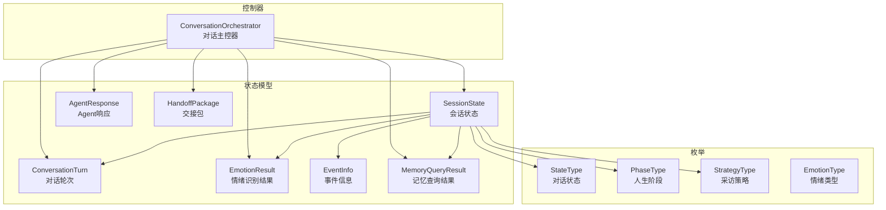
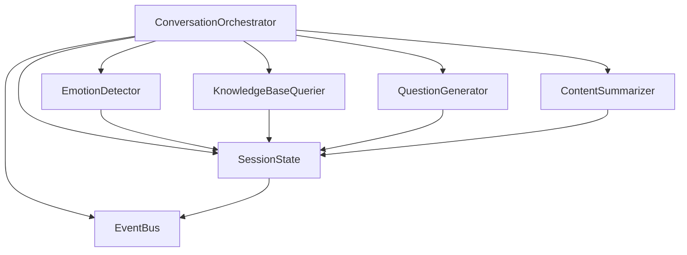
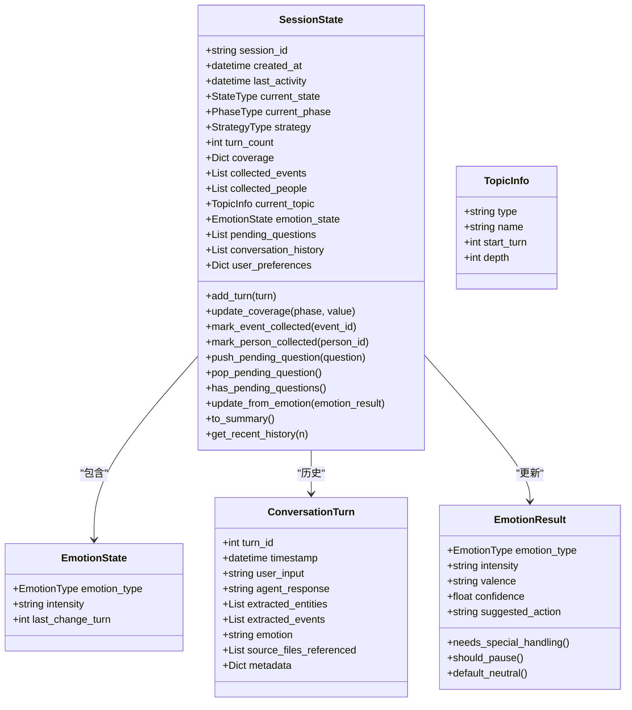
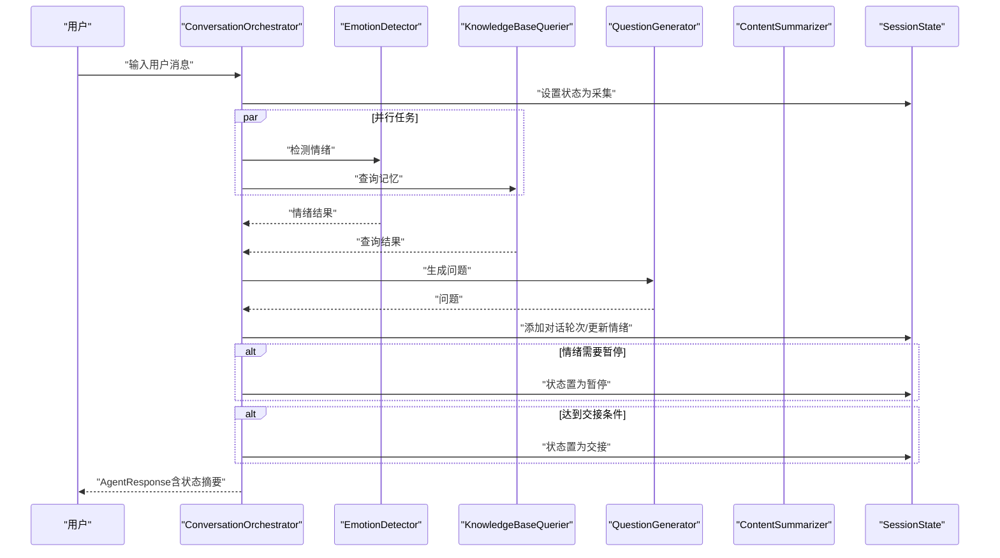
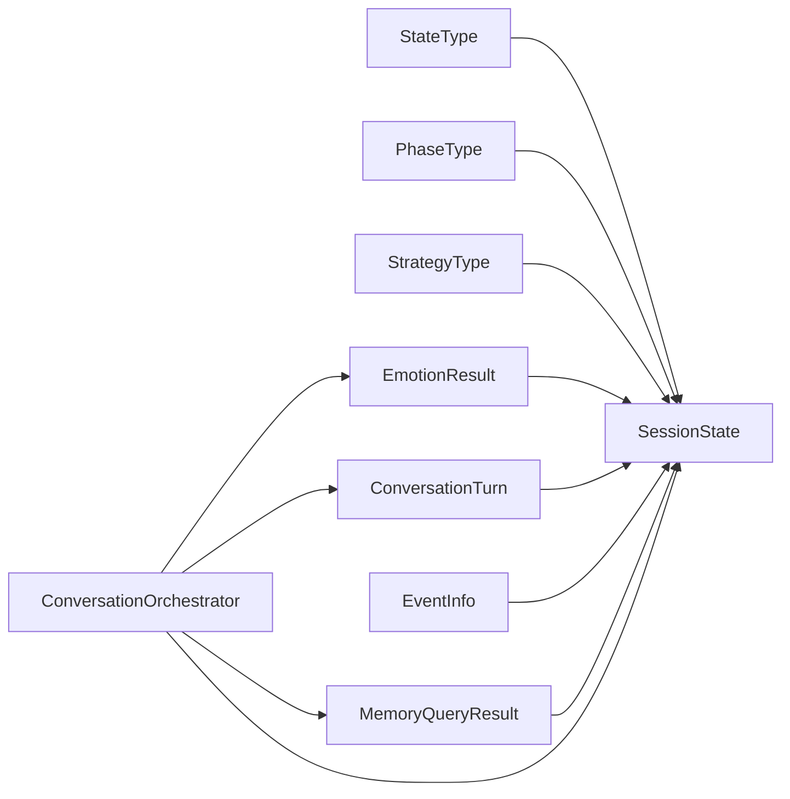

# 状态管理系统

<cite>
**本文引用的文件**
- [src/models/session_state.py](file://src/models/session_state.py)
- [src/enums/state_type.py](file://src/enums/state_type.py)
- [src/enums/phase_type.py](file://src/enums/phase_type.py)
- [src/enums/strategy_type.py](file://src/enums/strategy_type.py)
- [src/enums/emotion_type.py](file://src/enums/emotion_type.py)
- [src/models/conversation_turn.py](file://src/models/conversation_turn.py)
- [src/models/emotion_result.py](file://src/models/emotion_result.py)
- [src/core/conversation_orchestrator.py](file://src/core/conversation_orchestrator.py)
- [src/models/memory_query_result.py](file://src/models/memory_query_result.py)
- [src/models/event_info.py](file://src/models/event_info.py)
- [src/models/agent_response.py](file://src/models/agent_response.py)
- [src/models/handoff_package.py](file://src/models/handoff_package.py)
- [tests/test_session_state.py](file://tests/test_session_state.py)
</cite>

## 目录
1. [简介](#简介)
2. [项目结构](#项目结构)
3. [核心组件](#核心组件)
4. [架构总览](#架构总览)
5. [详细组件分析](#详细组件分析)
6. [依赖分析](#依赖分析)
7. [性能考虑](#性能考虑)
8. [故障排查指南](#故障排查指南)
9. [结论](#结论)
10. [附录](#附录)

## 简介
本文件面向“状态管理系统”的技术文档，聚焦于会话状态模型 SessionState 的设计与实现，涵盖状态类型 StateType、人生阶段 PhaseType、策略类型 StrategyType 的定义与用途；阐明状态变更的触发条件与处理逻辑（手动与自动）；说明阶段管理机制与覆盖率统计；介绍状态查询与监控方法（状态快照、状态历史、状态统计）；并给出最佳实践与常见问题的解决方案。文档以代码为依据，配合可视化图示帮助读者快速理解系统行为。

## 项目结构
围绕状态管理的关键模块与文件如下：
- 数据模型与枚举：SessionState、ConversationTurn、EmotionResult、EventInfo、MemoryQueryResult、AgentResponse、HandoffPackage
- 枚举类型：StateType（对话状态）、PhaseType（人生阶段）、StrategyType（采访策略）、EmotionType（情绪类型）
- 控制器：ConversationOrchestrator（协调对话、状态流转、事件触发）

图表来源
- [src/models/session_state.py:24-139](file://src/models/session_state.py#L24-L139)
- [src/models/conversation_turn.py:14-52](file://src/models/conversation_turn.py#L14-L52)
- [src/models/emotion_result.py:6-57](file://src/models/emotion_result.py#L6-L57)
- [src/models/event_info.py:5-69](file://src/models/event_info.py#L5-L69)
- [src/models/memory_query_result.py:23-81](file://src/models/memory_query_result.py#L23-L81)
- [src/models/agent_response.py:5-22](file://src/models/agent_response.py#L5-L22)
- [src/models/handoff_package.py:32-66](file://src/models/handoff_package.py#L32-L66)
- [src/enums/state_type.py:4-12](file://src/enums/state_type.py#L4-L12)
- [src/enums/phase_type.py:4-10](file://src/enums/phase_type.py#L4-L10)
- [src/enums/strategy_type.py:4-8](file://src/enums/strategy_type.py#L4-L8)
- [src/enums/emotion_type.py:4-50](file://src/enums/emotion_type.py#L4-L50)
- [src/core/conversation_orchestrator.py:138-658](file://src/core/conversation_orchestrator.py#L138-L658)

章节来源
- [src/models/session_state.py:1-139](file://src/models/session_state.py#L1-L139)
- [src/core/conversation_orchestrator.py:1-658](file://src/core/conversation_orchestrator.py#L1-L658)

## 核心组件
- SessionState：贯穿会话生命周期的核心数据对象，负责记录状态、进度、覆盖率、采集内容、当前话题、情绪状态、待追问问题、对话历史、用户偏好等，并提供状态摘要、最近历史查询等能力。
- ConversationOrchestrator：协调各子服务（情绪检测、知识检索、问题生成、内容归纳），驱动状态流转（如从采集到暂停、交接），并发布事件。
- 枚举体系：StateType 定义对话状态；PhaseType 定义人生阶段；StrategyType 定义采访策略；EmotionType 定义情绪类型及强度、极性、建议动作等。

章节来源
- [src/models/session_state.py:24-139](file://src/models/session_state.py#L24-L139)
- [src/core/conversation_orchestrator.py:138-420](file://src/core/conversation_orchestrator.py#L138-L420)
- [src/enums/state_type.py:4-12](file://src/enums/state_type.py#L4-L12)
- [src/enums/phase_type.py:4-10](file://src/enums/phase_type.py#L4-L10)
- [src/enums/strategy_type.py:4-8](file://src/enums/strategy_type.py#L4-L8)
- [src/enums/emotion_type.py:4-50](file://src/enums/emotion_type.py#L4-L50)

## 架构总览
下图展示状态管理在系统中的位置与交互关系：主控器持有并更新 SessionState，各服务读取状态进行决策，事件总线对外发布状态变化事件。

图表来源
- [src/core/conversation_orchestrator.py:138-420](file://src/core/conversation_orchestrator.py#L138-L420)
- [src/models/session_state.py:24-139](file://src/models/session_state.py#L24-L139)

## 详细组件分析

### SessionState 设计与实现
- 职责与作用域
  - 记录会话唯一标识、创建与最后活动时间
  - 维护当前对话状态、当前人生阶段、当前采访策略
  - 统计对话轮数与各阶段覆盖率
  - 跟踪已采集事件与人物、当前话题、情绪状态、待追问问题
  - 维护对话历史与用户偏好
- 关键方法
  - 添加对话轮次、更新覆盖率、标记采集、待追问问题队列操作、从情绪结果更新状态、生成摘要、获取最近历史
- 数据结构复杂度
  - 覆盖率字典按阶段维护 O(1) 访问
  - 对话历史列表 append/pop 为摊还 O(1)，获取最近 n 轮为 O(n)
  - 待追问问题队列为列表，pop(0) 为 O(n)，存在潜在性能风险（见“性能考虑”）

图表来源
- [src/models/session_state.py:9-139](file://src/models/session_state.py#L9-L139)
- [src/models/conversation_turn.py:14-52](file://src/models/conversation_turn.py#L14-L52)
- [src/models/emotion_result.py:6-57](file://src/models/emotion_result.py#L6-L57)

章节来源
- [src/models/session_state.py:24-139](file://src/models/session_state.py#L24-L139)
- [tests/test_session_state.py:7-143](file://tests/test_session_state.py#L7-L143)

### 状态类型 StateType 的含义与用途
- INIT：初始化状态，会话刚建立但尚未开始采集
- WARMUP：破冰阶段，用于建立信任与氛围
- COLLECT：采集阶段，常规采集用户记忆与事件
- DEEPEN：深挖模式，针对特定主题或情感进行深入挖掘
- REDIRECT：重定向模式，当话题偏离或需要切换方向时使用
- PAUSE：暂停阶段，由情绪检测或时间限制触发
- HANDOFF：交接阶段，达到轮数阈值或覆盖率阈值后触发

章节来源
- [src/enums/state_type.py:4-12](file://src/enums/state_type.py#L4-L12)
- [src/core/conversation_orchestrator.py:345-351](file://src/core/conversation_orchestrator.py#L345-L351)

### 人生阶段 PhaseType 的管理机制
- CHILDHOOD：童年（0-12岁）
- YOUTH：少年（13-18岁）
- YOUNG_ADULT：青年（19-35岁）
- MIDDLE_AGE：中年（36-60岁）
- ELDERLY：老年（60岁+）
- 管理要点
  - SessionState 维护每个阶段的覆盖率（0~1），用于判断采集进度
  - 主控器在会话结束引导时根据当前阶段提示下一步主题
  - 交接条件之一是所有阶段覆盖率均达到阈值

章节来源
- [src/enums/phase_type.py:4-10](file://src/enums/phase_type.py#L4-L10)
- [src/models/session_state.py:51-60](file://src/models/session_state.py#L51-L60)
- [src/core/conversation_orchestrator.py:642-658](file://src/core/conversation_orchestrator.py#L642-L658)

### 策略类型 StrategyType 的作用与场景
- SPARKLE_FIRST：闪光点优先，优先挖掘积极高光时刻
- TIMELINE_CLASSIC：时间线经典，按时间顺序推进
- THEMATIC_DIVERGENT：主题式发散，围绕主题多角度展开
- 应用场景
  - 会话初始化时选择策略
  - 问题生成与内容归纳阶段结合策略进行上下文组织

章节来源
- [src/enums/strategy_type.py:4-8](file://src/enums/strategy_type.py#L4-L8)
- [src/core/conversation_orchestrator.py:201-225](file://src/core/conversation_orchestrator.py#L201-L225)

### 状态变更的触发条件与处理逻辑
- 自动状态变更
  - 情绪检测：当情绪结果需要特殊处理（高强度负面或疲劳、抗拒、困惑）时，自动将状态置为暂停
  - 会话时长：达到设定时长阈值时，触发结束引导并置为交接
  - 交接条件：对话轮数达到阈值，且所有阶段覆盖率均达到阈值
- 手动状态变更
  - 主控器可主动将状态置为暂停或恢复
  - 会话终止时统一置为交接
- 处理流程
  - 每轮对话开始，主控器将状态设为采集
  - 异步执行情绪检测与知识检索，生成问题并更新状态与历史
  - 根据条件更新状态并发布事件

图表来源
- [src/core/conversation_orchestrator.py:236-344](file://src/core/conversation_orchestrator.py#L236-L344)
- [src/models/session_state.py:87-124](file://src/models/session_state.py#L87-L124)

章节来源
- [src/core/conversation_orchestrator.py:236-351](file://src/core/conversation_orchestrator.py#L236-L351)
- [src/models/session_state.py:87-124](file://src/models/session_state.py#L87-L124)

### 阶段管理与覆盖率统计
- 覆盖率初始化：各阶段初始为 0.0
- 更新策略：限制在 0.0~1.0 之间
- 交接判定：任一阶段覆盖率低于阈值则不触发交接
- 下一阶段提示：根据当前阶段顺序推导下一次继续的主题方向

章节来源
- [src/models/session_state.py:51-60](file://src/models/session_state.py#L51-L60)
- [src/core/conversation_orchestrator.py:345-351](file://src/core/conversation_orchestrator.py#L345-L351)
- [src/core/conversation_orchestrator.py:642-658](file://src/core/conversation_orchestrator.py#L642-L658)

### 状态查询与监控方法
- 状态快照：to_summary 输出会话关键指标（会话ID、当前状态、当前阶段、轮数、覆盖率、采集数量）
- 状态历史：get_recent_history 返回最近 n 轮对话
- 状态统计：覆盖率字典、采集事件/人物数量、轮数
- 事件监控：主控器通过事件总线发布会话开始、轮完成、时间警告、交接就绪、会话终止等事件

章节来源
- [src/models/session_state.py:125-139](file://src/models/session_state.py#L125-L139)
- [src/core/conversation_orchestrator.py:227-233](file://src/core/conversation_orchestrator.py#L227-L233)
- [src/core/conversation_orchestrator.py:332-335](file://src/core/conversation_orchestrator.py#L332-L335)
- [src/core/conversation_orchestrator.py:250-253](file://src/core/conversation_orchestrator.py#L250-L253)
- [src/core/conversation_orchestrator.py:387-388](file://src/core/conversation_orchestrator.py#L387-L388)
- [src/core/conversation_orchestrator.py:395-397](file://src/core/conversation_orchestrator.py#L395-L397)

### 事件与实体模型支撑状态管理
- ConversationTurn：封装每轮对话的输入、回复、抽取实体与事件、情绪、来源文件与元数据
- MemoryQueryResult：封装记忆查询结果，支持事件与人物过滤、Top-N 排序
- EventInfo：结构化事件信息，支持写入记忆库
- AgentResponse：封装 Agent 的回复消息、状态更新摘要、是否暂停、是否触发交接
- HandoffPackage：封装交接数据，包含会话摘要、采集进度、采集数据、原始对话路径与待处理问题

章节来源
- [src/models/conversation_turn.py:14-52](file://src/models/conversation_turn.py#L14-L52)
- [src/models/memory_query_result.py:23-81](file://src/models/memory_query_result.py#L23-L81)
- [src/models/event_info.py:5-69](file://src/models/event_info.py#L5-L69)
- [src/models/agent_response.py:5-22](file://src/models/agent_response.py#L5-L22)
- [src/models/handoff_package.py:32-66](file://src/models/handoff_package.py#L32-L66)

## 依赖分析
- SessionState 依赖枚举类型（StateType、PhaseType、StrategyType）与模型（ConversationTurn、EmotionResult、EventInfo、MemoryQueryResult）
- ConversationOrchestrator 依赖 SessionState，并协调多个服务（情绪检测、知识检索、问题生成、内容归纳），同时通过事件总线发布状态事件
- 枚举类型彼此独立，为状态管理提供强类型约束

图表来源
- [src/models/session_state.py:4-7](file://src/models/session_state.py#L4-L7)
- [src/enums/state_type.py:4-12](file://src/enums/state_type.py#L4-L12)
- [src/enums/phase_type.py:4-10](file://src/enums/phase_type.py#L4-L10)
- [src/enums/strategy_type.py:4-8](file://src/enums/strategy_type.py#L4-L8)
- [src/core/conversation_orchestrator.py:18-25](file://src/core/conversation_orchestrator.py#L18-L25)

章节来源
- [src/models/session_state.py:1-139](file://src/models/session_state.py#L1-L139)
- [src/core/conversation_orchestrator.py:1-658](file://src/core/conversation_orchestrator.py#L1-L658)

## 性能考虑
- 待追问问题队列采用列表实现，pop(0) 为 O(n)，在高并发或大量问题时可能成为瓶颈。建议替换为双端队列（collections.deque）以降低出队复杂度至 O(1)
- 对话历史 append 为 O(1)，但获取最近 n 轮需切片，若 n 较大或历史很长，应考虑分页或滚动窗口策略
- 情绪检测与知识检索为异步并行任务，带超时保护，避免阻塞主流程

章节来源
- [src/models/session_state.py:107-117](file://src/models/session_state.py#L107-L117)
- [src/core/conversation_orchestrator.py:269-302](file://src/core/conversation_orchestrator.py#L269-L302)

## 故障排查指南
- 状态未按预期变更
  - 检查情绪检测结果是否被判定为需要特殊处理，这会导致状态自动置为暂停
  - 核对会话时长配置与计时器逻辑，确保时间警告与结束引导正确触发
  - 确认交接条件：轮数阈值与覆盖率阈值是否满足
- 覆盖率异常
  - 确保 update_coverage 的输入值在 0.0~1.0 范围内
  - 检查覆盖率计算与汇总逻辑是否一致
- 对话历史缺失
  - 确认每轮对话调用 add_turn 并更新 turn_count
  - 检查事件总线是否正常发布 TURN_COMPLETED 事件
- 测试验证
  - 使用单元测试覆盖状态创建、添加轮次、覆盖率更新、采集标记、待追问问题队列、摘要生成与最近历史查询等场景

章节来源
- [tests/test_session_state.py:7-143](file://tests/test_session_state.py#L7-L143)
- [src/core/conversation_orchestrator.py:245-259](file://src/core/conversation_orchestrator.py#L245-L259)
- [src/core/conversation_orchestrator.py:345-351](file://src/core/conversation_orchestrator.py#L345-L351)
- [src/models/session_state.py:93-117](file://src/models/session_state.py#L93-L117)

## 结论
SessionState 作为状态管理的核心载体，与 ConversationOrchestrator 协同实现了从采集、深挖、重定向到暂停与交接的完整闭环。通过明确的状态类型、阶段管理与策略类型，系统能够在不同情境下灵活调整对话节奏与内容组织方式。建议在后续迭代中优化待追问问题队列的底层数据结构，并完善会话恢复与持久化机制，以进一步提升稳定性与可运维性。

## 附录
- 状态类型对照
  - INIT/WARMUP/COLLECT/DEEPEN/REDIRECT/PAUSE/HANDOFF
- 人生阶段对照
  - CHILDHOOD/YOUTH/YOUNG_ADULT/MIDDLE_AGE/ELDERLY
- 策略类型对照
  - SPARKLE_FIRST/TIMELINE_CLASSIC/THEMATIC_DIVERGENT
- 情绪类型与强度、极性、建议动作
  - 正向/中性/负向/特殊；强度 LOW/MEDIUM/HIGH；极性 POSITIVE/NEUTRAL/NEGATIVE；建议 CONTINUE/PAUSE/COMFORT/REDIRECT

章节来源
- [src/enums/state_type.py:4-12](file://src/enums/state_type.py#L4-L12)
- [src/enums/phase_type.py:4-10](file://src/enums/phase_type.py#L4-L10)
- [src/enums/strategy_type.py:4-8](file://src/enums/strategy_type.py#L4-L8)
- [src/enums/emotion_type.py:4-50](file://src/enums/emotion_type.py#L4-L50)