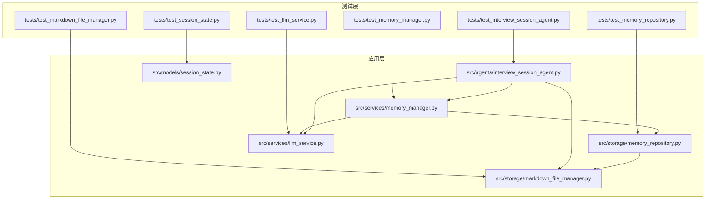
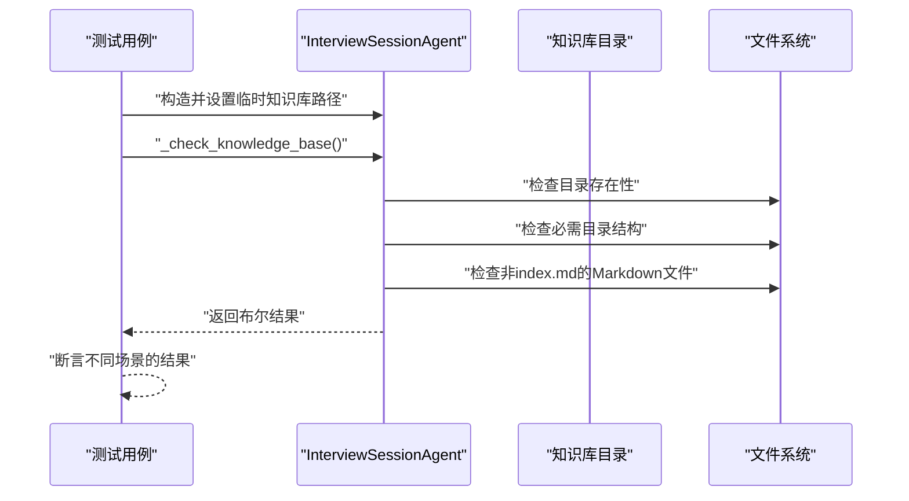
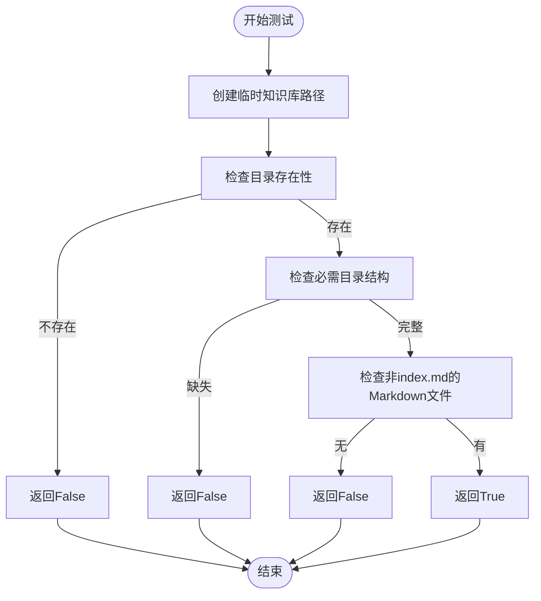
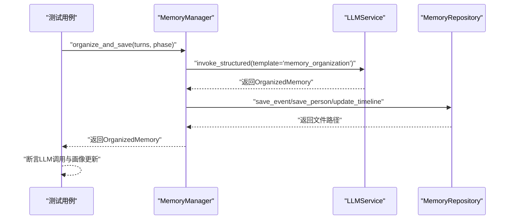
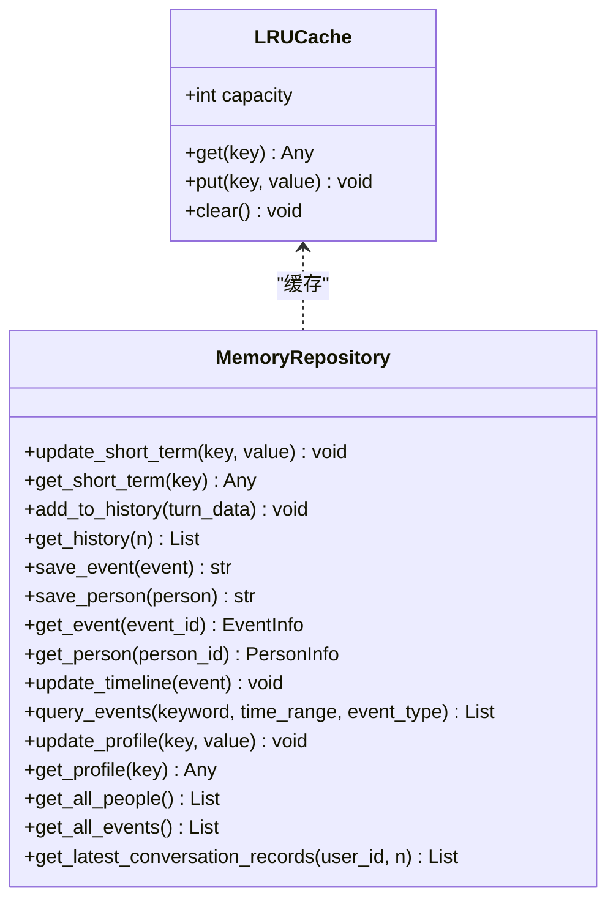
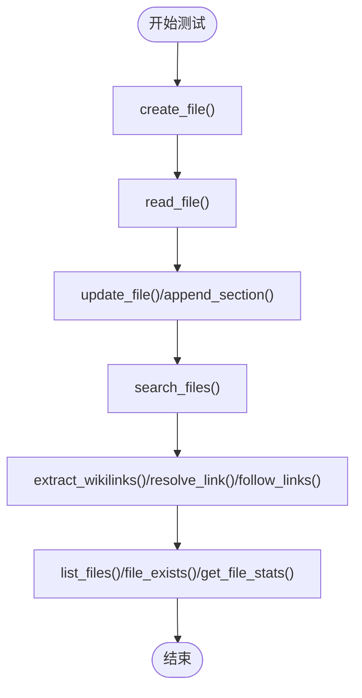
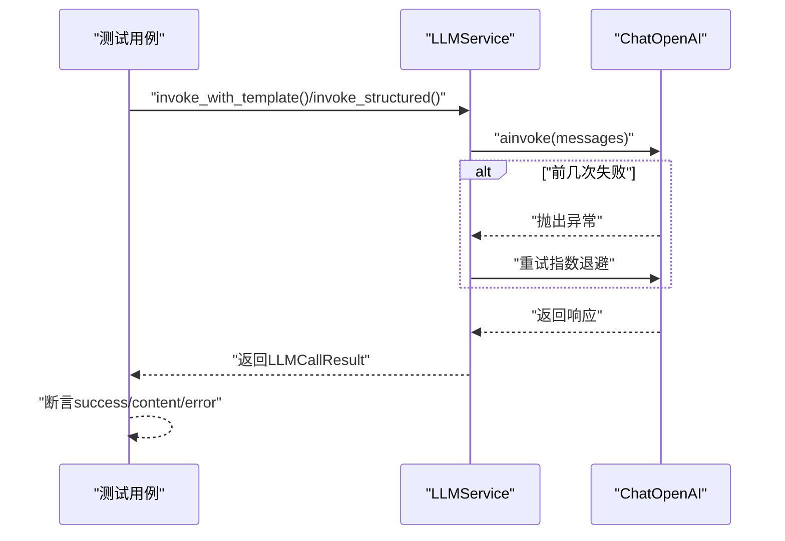
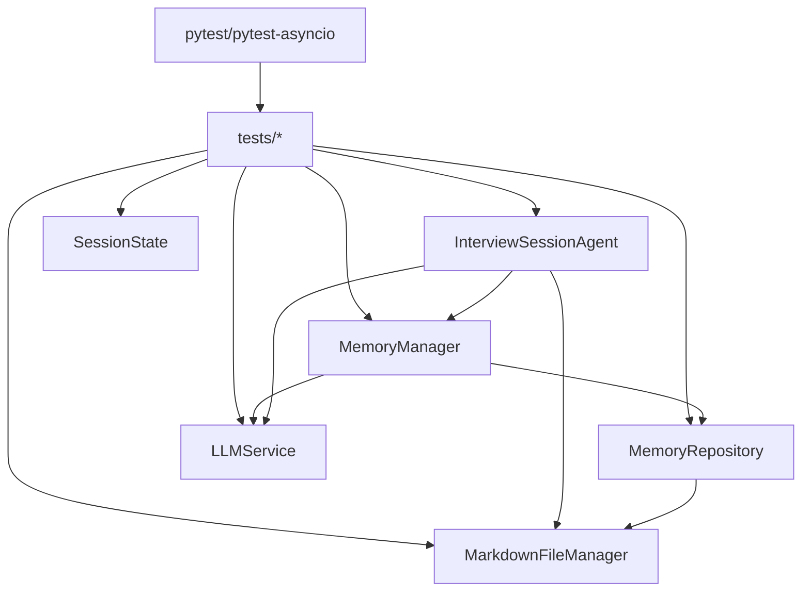

# 单元测试

<cite>
**本文引用的文件**
- [tests/test_interview_session_agent.py](file://tests/test_interview_session_agent.py)
- [tests/test_memory_manager.py](file://tests/test_memory_manager.py)
- [tests/test_memory_repository.py](file://tests/test_memory_repository.py)
- [tests/test_markdown_file_manager.py](file://tests/test_markdown_file_manager.py)
- [tests/test_llm_service.py](file://tests/test_llm_service.py)
- [tests/test_session_state.py](file://tests/test_session_state.py)
- [src/agents/interview_session_agent.py](file://src/agents/interview_session_agent.py)
- [src/services/memory_manager.py](file://src/services/memory_manager.py)
- [src/storage/memory_repository.py](file://src/storage/memory_repository.py)
- [src/storage/markdown_file_manager.py](file://src/storage/markdown_file_manager.py)
- [src/services/llm_service.py](file://src/services/llm_service.py)
- [src/models/session_state.py](file://src/models/session_state.py)
- [requirements-dev.txt](file://requirements-dev.txt)
</cite>

## 目录
1. [简介](#简介)
2. [项目结构](#项目结构)
3. [核心组件](#核心组件)
4. [架构总览](#架构总览)
5. [详细组件分析](#详细组件分析)
6. [依赖分析](#依赖分析)
7. [性能考虑](#性能考虑)
8. [故障排查指南](#故障排查指南)
9. [结论](#结论)
10. [附录](#附录)

## 简介
本文件面向单元测试的编写与维护，系统梳理本项目的测试设计原则、实现方法与最佳实践。重点覆盖以下核心模块的单元测试：
- InterviewSessionAgent：会话生命周期与知识库检查
- MemoryManager：记忆组织与保存、查询、画像更新
- MemoryRepository：三层记忆（短期/长期/画像）存储与缓存
- MarkdownFileManager：Markdown文件读写、全文搜索、Wiki链接追踪
- LLMService：大模型调用、模板渲染、结构化输出与重试机制
- SessionState：会话状态与覆盖率、情绪状态、待追问队列等

测试覆盖范围包括：
- 单个组件的功能测试
- 边界条件测试（空数据、容量限制、路径解析）
- 异常处理测试（文件不存在、解析失败、重试失败）
- Mock对象使用与断言策略
- 测试隔离机制与测试环境配置

## 项目结构
本项目采用“按职责分层”的组织方式，测试位于 tests/ 目录，源码位于 src/ 目录。测试文件与被测模块一一对应，便于定位与维护。

图表来源
- [tests/test_interview_session_agent.py:1-77](file://tests/test_interview_session_agent.py#L1-L77)
- [tests/test_memory_manager.py:1-249](file://tests/test_memory_manager.py#L1-L249)
- [tests/test_memory_repository.py:1-325](file://tests/test_memory_repository.py#L1-L325)
- [tests/test_markdown_file_manager.py:1-207](file://tests/test_markdown_file_manager.py#L1-L207)
- [tests/test_llm_service.py:1-187](file://tests/test_llm_service.py#L1-L187)
- [tests/test_session_state.py:1-143](file://tests/test_session_state.py#L1-L143)
- [src/agents/interview_session_agent.py:1-482](file://src/agents/interview_session_agent.py#L1-L482)
- [src/services/memory_manager.py:1-470](file://src/services/memory_manager.py#L1-L470)
- [src/storage/memory_repository.py:1-359](file://src/storage/memory_repository.py#L1-L359)
- [src/storage/markdown_file_manager.py:1-546](file://src/storage/markdown_file_manager.py#L1-L546)
- [src/services/llm_service.py:1-481](file://src/services/llm_service.py#L1-L481)
- [src/models/session_state.py:1-139](file://src/models/session_state.py#L1-L139)

章节来源
- [tests/test_interview_session_agent.py:1-77](file://tests/test_interview_session_agent.py#L1-L77)
- [tests/test_memory_manager.py:1-249](file://tests/test_memory_manager.py#L1-L249)
- [tests/test_memory_repository.py:1-325](file://tests/test_memory_repository.py#L1-L325)
- [tests/test_markdown_file_manager.py:1-207](file://tests/test_markdown_file_manager.py#L1-L207)
- [tests/test_llm_service.py:1-187](file://tests/test_llm_service.py#L1-L187)
- [tests/test_session_state.py:1-143](file://tests/test_session_state.py#L1-L143)

## 核心组件
- InterviewSessionAgent：负责会话生命周期管理、知识库检查、初始化与采访流程调度、时间控制与归档。
- MemoryManager：对外提供统一的记忆管理接口，协调LLMService与MemoryRepository，完成结构化记忆的组织与保存。
- MemoryRepository：三层记忆的底层存储，包含短期记忆（内存）、长期记忆（文件系统）、画像记忆（结构化索引），并提供LRU缓存。
- MarkdownFileManager：提供Markdown文件的创建、读取、更新、搜索、Wiki链接解析与追踪。
- LLMService：封装大模型调用，支持模板加载、结构化输出、重试与统计。
- SessionState：会话状态数据模型，记录对话进度、覆盖率、采集事件/人物、情绪状态与待追问队列。

章节来源
- [src/agents/interview_session_agent.py:33-110](file://src/agents/interview_session_agent.py#L33-L110)
- [src/services/memory_manager.py:27-61](file://src/services/memory_manager.py#L27-L61)
- [src/storage/memory_repository.py:40-88](file://src/storage/memory_repository.py#L40-L88)
- [src/storage/markdown_file_manager.py:31-46](file://src/storage/markdown_file_manager.py#L31-L46)
- [src/services/llm_service.py:32-89](file://src/services/llm_service.py#L32-L89)
- [src/models/session_state.py:24-83](file://src/models/session_state.py#L24-L83)

## 架构总览
单元测试围绕“被测模块”与“依赖注入/Mock”两条主线展开：
- 使用pytest与pytest-asyncio驱动异步测试
- 使用unittest.mock.patch与AsyncMock隔离外部依赖（如LLM、文件系统）
- 使用pytest.fixture在测试间共享临时资源（如临时目录）

图表来源
- [tests/test_interview_session_agent.py:15-77](file://tests/test_interview_session_agent.py#L15-L77)
- [src/agents/interview_session_agent.py:131-177](file://src/agents/interview_session_agent.py#L131-L177)

## 详细组件分析

### InterviewSessionAgent 单元测试
- 测试目标
  - 知识库存在性检查：目录不存在、结构不完整、仅有index.md、包含其他Markdown文件等场景
  - 异常场景：非法路径
- 测试方法
  - 使用临时目录作为知识库根路径，逐级构建目录与文件
  - 断言 _check_knowledge_base() 的返回值
- 边界与异常
  - 目录结构缺失、仅index.md、无其他Markdown文件均应返回False
  - 非法路径返回False
- 测试隔离
  - 使用pytest fixture创建临时目录并在测试结束后自动清理

图表来源
- [tests/test_interview_session_agent.py:15-77](file://tests/test_interview_session_agent.py#L15-L77)
- [src/agents/interview_session_agent.py:131-177](file://src/agents/interview_session_agent.py#L131-L177)

章节来源
- [tests/test_interview_session_agent.py:9-77](file://tests/test_interview_session_agent.py#L9-L77)
- [src/agents/interview_session_agent.py:131-177](file://src/agents/interview_session_agent.py#L131-L177)

### MemoryManager 单元测试
- 测试目标
  - organize_and_save：结构化整理与保存，断言LLM调用与画像更新
  - apply_summary：应用归纳结果，断言事件/人物保存与时间线更新
  - 短期记忆与对话历史：更新、获取、容量限制
  - 查询与获取：query_events、get_event
  - 会话清理：clear_session
- 测试方法
  - 使用patch('src.services.llm_service.get_llm_service')注入AsyncMock的LLMService
  - 使用AsyncMock模拟MemoryRepository方法
  - 构造模型数据（ConversationTurn、OrganizedMemory、EventInfo、PersonInfo等）
- 断言策略
  - 断言返回值、方法调用次数与参数
  - 断言画像记忆更新（如birth_year）

图表来源
- [tests/test_memory_manager.py:32-96](file://tests/test_memory_manager.py#L32-L96)
- [src/services/memory_manager.py:111-157](file://src/services/memory_manager.py#L111-L157)

章节来源
- [tests/test_memory_manager.py:18-249](file://tests/test_memory_manager.py#L18-L249)
- [src/services/memory_manager.py:111-157](file://src/services/memory_manager.py#L111-L157)

### MemoryRepository 单元测试
- 测试目标
  - LRUCache：容量、更新、清除
  - 事件与人物保存：路径生成、索引更新、缓存命中
  - 获取事件/人物：缓存优先、索引回退
  - 时间线更新：按事件写入life-events.md
  - 短期记忆与历史：容量限制、最近N条记录
  - 查询事件：关键词/类型过滤
  - 画像记忆：键值更新与获取
  - 对话记录：从最新JSON文件读取
- 测试方法
  - 使用临时目录初始化MarkdownFileManager与MemoryRepository
  - 使用AsyncMock模拟文件系统行为
- 断言策略
  - 断言路径组件、索引更新、缓存命中、文件内容

图表来源
- [tests/test_memory_repository.py:10-42](file://tests/test_memory_repository.py#L10-L42)
- [src/storage/memory_repository.py:16-88](file://src/storage/memory_repository.py#L16-L88)

章节来源
- [tests/test_memory_repository.py:44-325](file://tests/test_memory_repository.py#L44-L325)
- [src/storage/memory_repository.py:174-307](file://src/storage/memory_repository.py#L174-L307)

### MarkdownFileManager 单元测试
- 测试目标
  - 文件操作：创建、覆盖、读取、更新、追加章节
  - 搜索：大小写不敏感、上下文、相关度排序
  - 链接：提取Wiki链接、解析相对/绝对路径、追踪链接
  - 工具：列出文件、存在性检查、统计信息
- 测试方法
  - 使用临时目录作为base_path
  - 使用AsyncMock模拟文件系统读写
- 断言策略
  - 断言文件内容、路径解析、链接追踪结果

图表来源
- [tests/test_markdown_file_manager.py:13-207](file://tests/test_markdown_file_manager.py#L13-L207)
- [src/storage/markdown_file_manager.py:134-546](file://src/storage/markdown_file_manager.py#L134-L546)

章节来源
- [tests/test_markdown_file_manager.py:7-207](file://tests/test_markdown_file_manager.py#L7-L207)
- [src/storage/markdown_file_manager.py:134-546](file://src/storage/markdown_file_manager.py#L134-L546)

### LLMService 单元测试
- 测试目标
  - 成功调用：invoke、invoke_with_template
  - 结构化输出：invoke_structured，含JSON解析与代码块处理
  - 重试机制：前两次失败，第三次成功
  - 统计与清空：get_stats、clear_history
  - 模板加载：从Python模块与Markdown文件加载
  - 失败场景：API异常、解析失败
- 测试方法
  - 使用patch("src.services.llm_service.ChatOpenAI")注入AsyncMock
  - 使用patch.object对内部方法进行Mock
- 断言策略
  - 断言success、content、error、token usage、latency

图表来源
- [tests/test_llm_service.py:24-187](file://tests/test_llm_service.py#L24-L187)
- [src/services/llm_service.py:225-438](file://src/services/llm_service.py#L225-L438)

章节来源
- [tests/test_llm_service.py:8-187](file://tests/test_llm_service.py#L8-L187)
- [src/services/llm_service.py:225-438](file://src/services/llm_service.py#L225-L438)

### SessionState 单元测试
- 测试目标
  - 创建会话：默认状态、策略、阶段
  - 添加对话轮次：turn_count与历史记录
  - 覆盖率更新：边界值处理（0~1）
  - 采集标记：事件与人物去重
  - 待追问队列：入栈、出栈、空队列处理
  - 摘要生成：to_summary
  - 最近历史：get_recent_history
  - 情绪状态：update_from_emotion
- 测试方法
  - 直接构造SessionState与ConversationTurn、EmotionResult
- 断言策略
  - 断言字段值、集合长度与去重效果

章节来源
- [tests/test_session_state.py:7-143](file://tests/test_session_state.py#L7-L143)
- [src/models/session_state.py:24-139](file://src/models/session_state.py#L24-L139)

## 依赖分析
- 测试框架与工具
  - pytest、pytest-asyncio、pytest-cov
  - black、isort、flake8、mypy
- 被测模块间的耦合
  - MemoryManager依赖MemoryRepository与LLMService
  - InterviewSessionAgent依赖MemoryManager、MarkdownFileManager、LLMService
  - MemoryRepository依赖MarkdownFileManager与KnowledgeBaseQuerier
  - LLMService依赖LangChain与Prompt模板

图表来源
- [requirements-dev.txt:1-13](file://requirements-dev.txt#L1-L13)
- [src/services/memory_manager.py:5-12](file://src/services/memory_manager.py#L5-L12)
- [src/agents/interview_session_agent.py:7-20](file://src/agents/interview_session_agent.py#L7-L20)
- [src/storage/memory_repository.py:8-11](file://src/storage/memory_repository.py#L8-L11)
- [src/services/llm_service.py:7-13](file://src/services/llm_service.py#L7-L13)

章节来源
- [requirements-dev.txt:1-13](file://requirements-dev.txt#L1-L13)

## 性能考虑
- 异步I/O与并发
  - 使用pytest-asyncio与async def测试异步函数，减少阻塞等待
  - MemoryManager在保存事件与人物时使用asyncio.gather并行执行
- 缓存与索引
  - MemoryRepository内置LRU缓存，降低重复读取成本
  - 事件与人物索引加速查询
- 模板与重试
  - LLMService模板预加载，减少IO开销
  - 指数退避重试，平衡稳定性与性能

[本节为通用指导，无需特定文件来源]

## 故障排查指南
- 知识库检查失败
  - 确认临时目录结构完整，包含必需目录与至少一个非index.md的Markdown文件
  - 检查路径权限与拼写
- LLM调用失败
  - 检查API密钥与网络连通性
  - 观察重试日志，确认指数退避是否生效
- 文件读写异常
  - 确认临时目录存在且可写
  - 检查文件名合法性与路径分隔符
- 结构化输出解析失败
  - 确认模板输出符合JSON格式
  - 处理代码块包裹的JSON

章节来源
- [tests/test_interview_session_agent.py:72-77](file://tests/test_interview_session_agent.py#L72-L77)
- [tests/test_llm_service.py:104-140](file://tests/test_llm_service.py#L104-L140)
- [tests/test_markdown_file_manager.py:41-44](file://tests/test_markdown_file_manager.py#L41-L44)

## 结论
本项目的单元测试遵循“隔离外部依赖、明确断言策略、覆盖边界与异常”的原则，通过pytest与Mock实现了高内聚、低耦合的测试体系。建议在后续迭代中：
- 增加更多边界条件与异常分支的测试
- 引入覆盖率报告（pytest-cov）以量化测试覆盖
- 对关键异步路径增加超时与取消测试

[本节为总结，无需特定文件来源]

## 附录

### 测试编写规范
- 测试命名
  - 使用test_前缀，描述性方法名
- Fixture
  - 使用pytest.fixture管理共享资源（如临时目录）
  - 异步测试使用@pytest.mark.asyncio
- Mock
  - 使用patch与AsyncMock隔离外部依赖
  - 明确返回值与side_effect
- 断言
  - 使用assert与pytest.approx处理浮点比较
  - 断言方法调用次数与参数
- 数据准备
  - 使用Pydantic模型构造测试数据
  - 保证数据完整性与最小可用性

[本节为通用指导，无需特定文件来源]