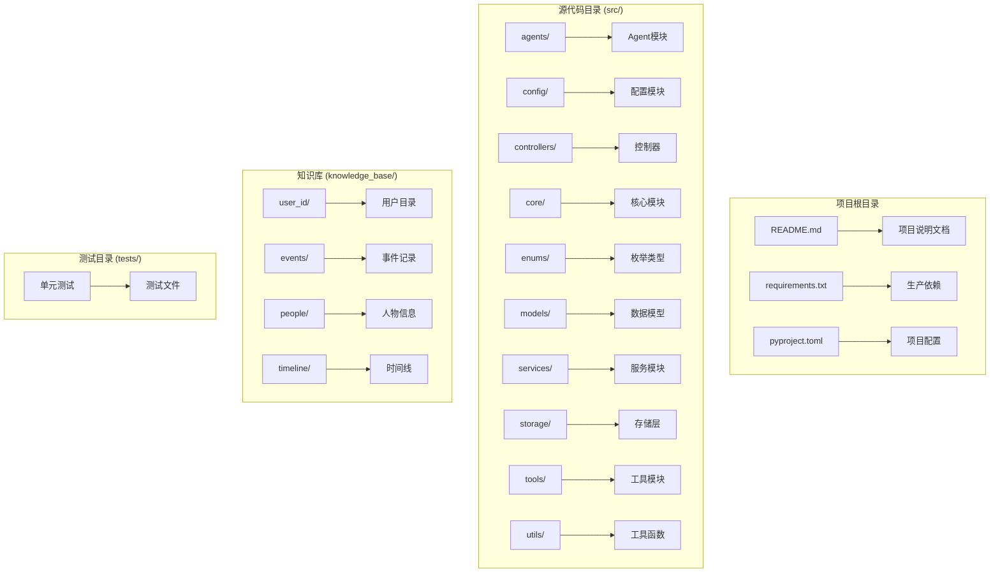
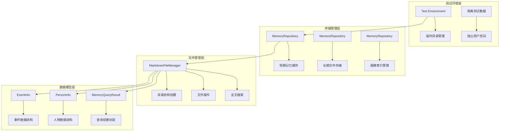
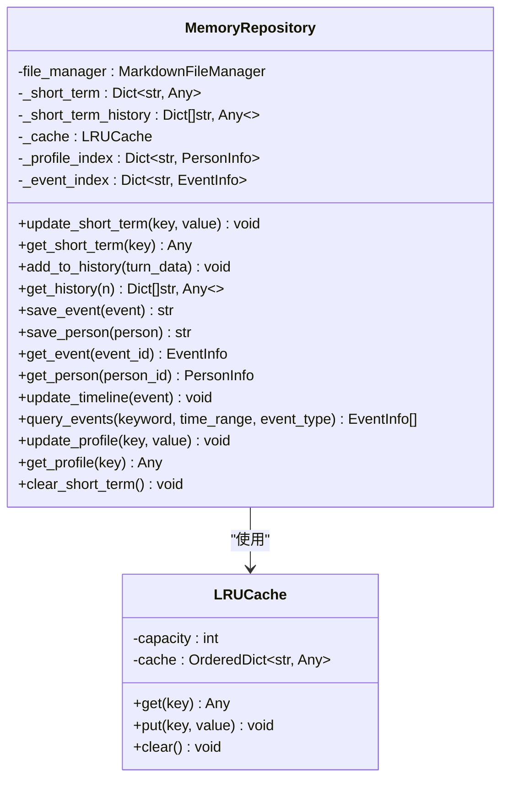
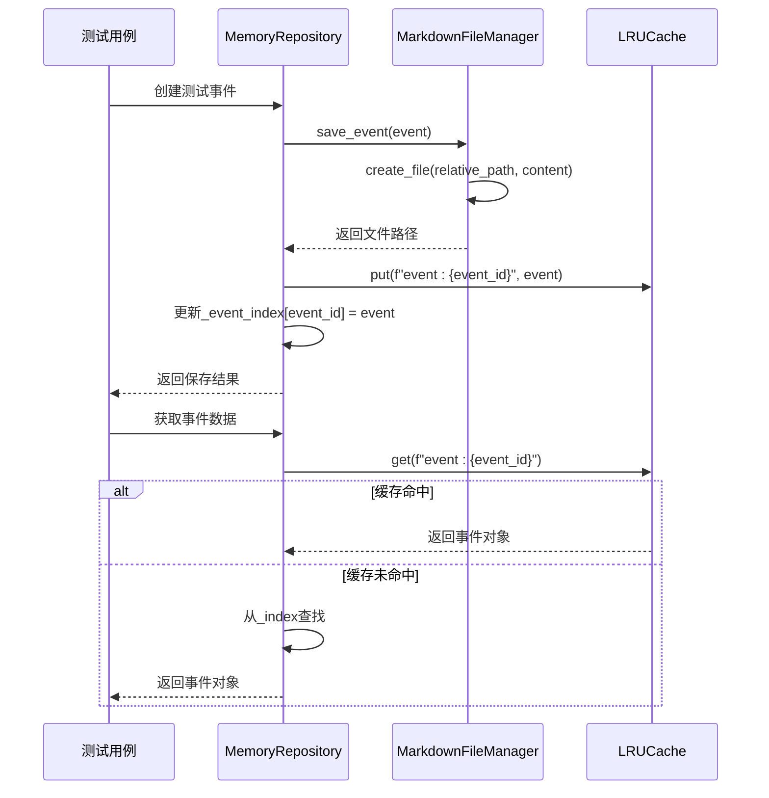
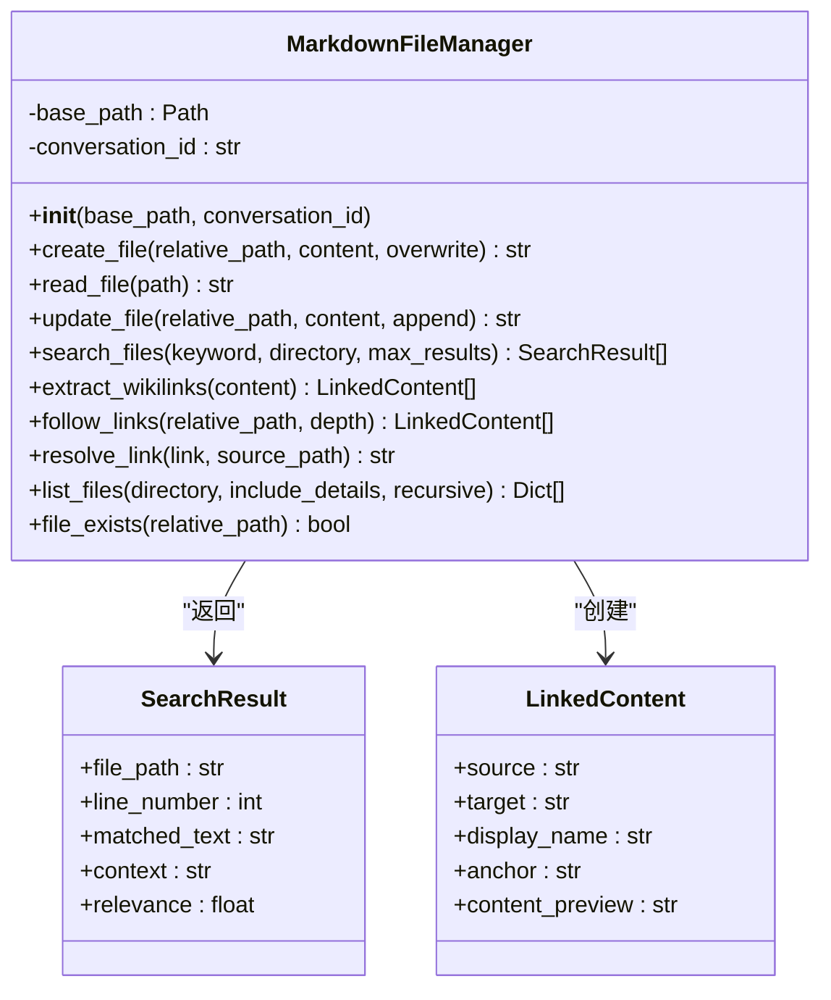
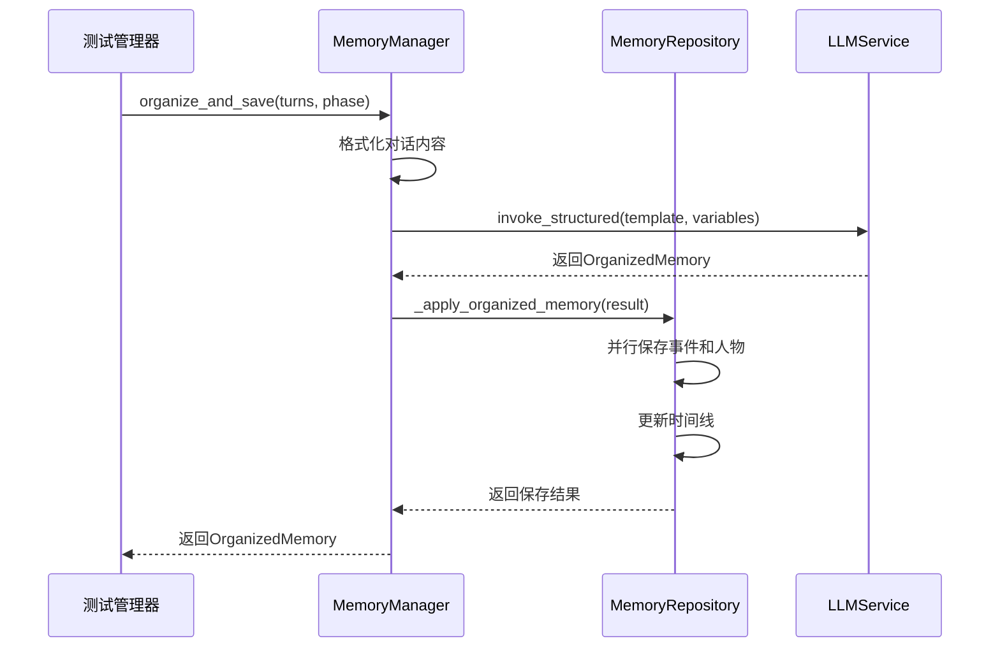
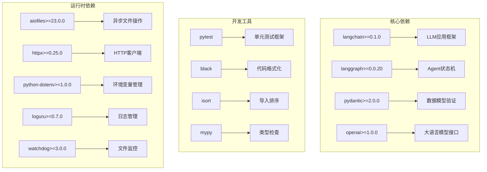

# 测试数据管理

<cite>
**本文档引用的文件**
- [README.md](file://README.md)
- [requirements.txt](file://requirements.txt)
- [pyproject.toml](file://pyproject.toml)
- [src/storage/memory_repository.py](file://src/storage/memory_repository.py)
- [src/storage/markdown_file_manager.py](file://src/storage/markdown_file_manager.py)
- [src/services/memory_manager.py](file://src/services/memory_manager.py)
- [src/config/llm_config.py](file://src/config/llm_config.py)
- [src/models/memory_query_result.py](file://src/models/memory_query_result.py)
- [src/models/event_info.py](file://src/models/event_info.py)
- [src/models/person_info.py](file://src/models/person_info.py)
- [tests/test_memory_repository.py](file://tests/test_memory_repository.py)
- [tests/test_markdown_file_manager.py](file://tests/test_markdown_file_manager.py)
- [tests/test_memory_manager.py](file://tests/test_memory_manager.py)
</cite>

## 目录
1. [简介](#简介)
2. [项目结构](#项目结构)
3. [核心组件](#核心组件)
4. [架构概览](#架构概览)
5. [详细组件分析](#详细组件分析)
6. [依赖分析](#依赖分析)
7. [性能考虑](#性能考虑)
8. [故障排除指南](#故障排除指南)
9. [结论](#结论)
10. [附录](#附录)

## 简介

本文档为"老人自传 Agent 系统"的测试数据管理提供全面的技术指导。该系统通过智能对话采访帮助老人记录和传承人生故事，采用基于大语言模型的架构，支持多轮友好访谈，收集、整理和归纳人生经历，最终生成完整的自传文本。

系统的核心价值包括传承价值、心理疗愈和自我实现，通过"人生回顾法"为老年人提供重要的心理治疗方法，提升自我效能感。项目采用模块化设计，包含问答引导层、结构化整理层、记忆管理层和写作生成层四个核心模块。

## 项目结构

项目采用清晰的分层架构设计，主要包含以下目录结构：

**图表来源**
- [README.md:92-200](file://README.md#L92-L200)

**章节来源**
- [README.md:92-200](file://README.md#L92-L200)

## 核心组件

系统的核心组件围绕测试数据管理展开，主要包括：

### 存储管理层
- **MemoryRepository**: 统一管理三层记忆的存储，包括短期记忆、长期记忆和画像记忆
- **MarkdownFileManager**: 管理记忆库的MD文件，提供文件创建、读取、更新和全文搜索功能
- **MemoryManager**: 提供记忆读写的高级接口，协调LLM服务完成信息整理

### 数据模型层
- **EventInfo**: 结构化记录单个事件信息
- **PersonInfo**: 结构化记录人物画像信息
- **MemoryQueryResult**: 封装记忆查询结果

### 测试支撑层
- **LRUCache**: 实现LRU缓存机制，支持测试数据的高效管理
- **测试用例**: 覆盖核心功能的单元测试，确保数据完整性

**章节来源**
- [src/storage/memory_repository.py:40-88](file://src/storage/memory_repository.py#L40-L88)
- [src/storage/markdown_file_manager.py:31-46](file://src/storage/markdown_file_manager.py#L31-L46)
- [src/services/memory_manager.py:27-46](file://src/services/memory_manager.py#L27-L46)

## 架构概览

系统采用分层架构设计，测试数据管理贯穿整个数据流：

**图表来源**
- [src/storage/memory_repository.py:16-88](file://src/storage/memory_repository.py#L16-L88)
- [src/storage/markdown_file_manager.py:31-131](file://src/storage/markdown_file_manager.py#L31-L131)
- [src/models/event_info.py:5-35](file://src/models/event_info.py#L5-L35)

## 详细组件分析

### MemoryRepository 组件分析

MemoryRepository 是测试数据管理的核心组件，负责统一管理三层记忆：

**图表来源**
- [src/storage/memory_repository.py:40-359](file://src/storage/memory_repository.py#L40-L359)

#### 测试数据创建策略

MemoryRepository 提供了完善的测试数据创建机制：

1. **短期记忆管理**: 通过 `_short_term` 字典和 `_short_term_history` 列表管理临时对话数据
2. **长期记忆存储**: 通过 MarkdownFileManager 将结构化数据持久化到文件系统
3. **缓存机制**: 使用 LRUCache 实现智能缓存，提高数据访问效率

#### 数据填充机制

测试数据的填充遵循以下流程：

**图表来源**
- [src/storage/memory_repository.py:176-200](file://src/storage/memory_repository.py#L176-L200)
- [src/storage/memory_repository.py:228-246](file://src/storage/memory_repository.py#L228-L246)

**章节来源**
- [src/storage/memory_repository.py:40-359](file://src/storage/memory_repository.py#L40-L359)

### MarkdownFileManager 组件分析

MarkdownFileManager 提供了完整的文件管理系统：

**图表来源**
- [src/storage/markdown_file_manager.py:31-546](file://src/storage/markdown_file_manager.py#L31-L546)

#### 测试数据隔离机制

系统通过以下方式确保测试数据的隔离性：

1. **临时目录管理**: 使用 `tempfile.TemporaryDirectory()` 创建隔离的测试环境
2. **独立用户空间**: 通过 `conversation_id` 参数为每个测试创建独立的用户目录
3. **文件系统隔离**: 每个测试运行在独立的文件系统路径中

**章节来源**
- [src/storage/markdown_file_manager.py:47-78](file://src/storage/markdown_file_manager.py#L47-L78)

### MemoryManager 组件分析

MemoryManager 提供了高级的记忆管理接口：

**图表来源**
- [src/services/memory_manager.py:111-156](file://src/services/memory_manager.py#L111-L156)

**章节来源**
- [src/services/memory_manager.py:27-470](file://src/services/memory_manager.py#L27-L470)

## 依赖分析

系统的关键依赖关系如下：

**图表来源**
- [requirements.txt:1-24](file://requirements.txt#L1-L24)

**章节来源**
- [requirements.txt:1-24](file://requirements.txt#L1-L24)
- [pyproject.toml:8-26](file://pyproject.toml#L8-L26)

## 性能考虑

测试数据管理的性能优化策略：

### 缓存策略
- **LRU缓存**: MemoryRepository 使用 LRUCache 限制缓存大小，避免内存泄漏
- **索引优化**: 通过 `_event_index` 和 `_profile_index` 提供快速查找
- **异步操作**: 使用 `asyncio.gather()` 并行处理多个存储任务

### 文件系统优化
- **目录结构预创建**: 在初始化时创建必要的目录结构，减少运行时开销
- **增量更新**: 支持文件追加模式，避免全量重写
- **文件监控**: 使用 watchdog 监控文件变化，及时响应数据更新

### 内存管理
- **短期记忆容量限制**: 通过 `_short_term_capacity` 控制内存使用
- **临时目录清理**: 测试结束后自动清理临时文件
- **资源释放**: 正确关闭文件句柄和连接

## 故障排除指南

### 常见问题及解决方案

#### 测试数据丢失
**问题**: 测试数据在测试间相互影响
**解决方案**: 
- 确保每个测试使用独立的临时目录
- 检查 `conversation_id` 参数设置
- 验证文件权限配置

#### 缓存失效
**问题**: 缓存数据不一致
**解决方案**:
- 检查缓存容量设置
- 验证缓存键的唯一性
- 实施缓存失效策略

#### 文件操作异常
**问题**: 文件读写失败
**解决方案**:
- 检查文件路径和权限
- 验证磁盘空间
- 确认文件编码格式

**章节来源**
- [tests/test_memory_repository.py:10-42](file://tests/test_memory_repository.py#L10-L42)
- [tests/test_markdown_file_manager.py:41-44](file://tests/test_markdown_file_manager.py#L41-L44)

## 结论

本测试数据管理方案提供了完整、可靠的测试数据生命周期管理：

1. **隔离性**: 通过临时目录和独立用户空间确保测试数据隔离
2. **完整性**: 覆盖短期记忆、长期存储和画像管理的完整数据流
3. **效率性**: 通过缓存和并行处理优化性能
4. **可靠性**: 完善的错误处理和资源管理机制

该方案支持多环境测试执行，具备良好的扩展性和维护性，能够满足复杂测试场景的需求。

## 附录

### 测试最佳实践

#### 数据准备
- 使用 `tempfile.TemporaryDirectory()` 创建隔离的测试环境
- 通过 `MarkdownFileManager` 初始化标准目录结构
- 准备标准化的测试数据格式

#### 测试执行
- 使用 `pytest.mark.asyncio` 装饰异步测试方法
- 通过 `@pytest.fixture` 提供测试依赖
- 实施参数化测试覆盖多种场景

#### 数据清理
- 测试完成后自动清理临时文件
- 验证所有资源正确释放
- 检查文件系统状态一致性

### 工具使用指南

#### 环境配置
- 配置 `.env` 文件设置 LLM API 密钥
- 设置 `KNOWLEDGE_BASE_PATH` 指向测试知识库
- 配置日志级别和输出格式

#### 调试技巧
- 使用 `pytest -v` 获取详细测试输出
- 通过 `pytest --tb=long` 查看完整错误堆栈
- 利用 `pytest --capture=no` 实时查看日志输出