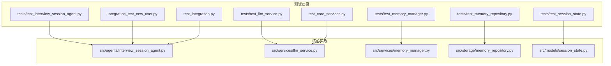
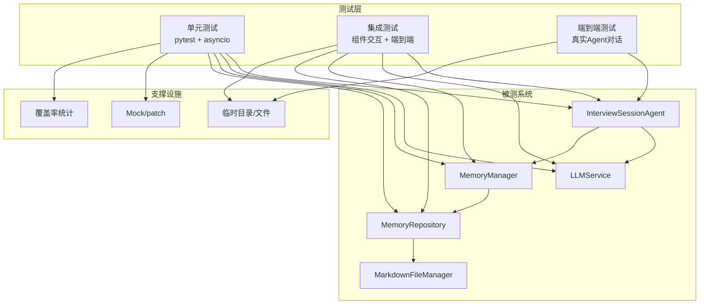
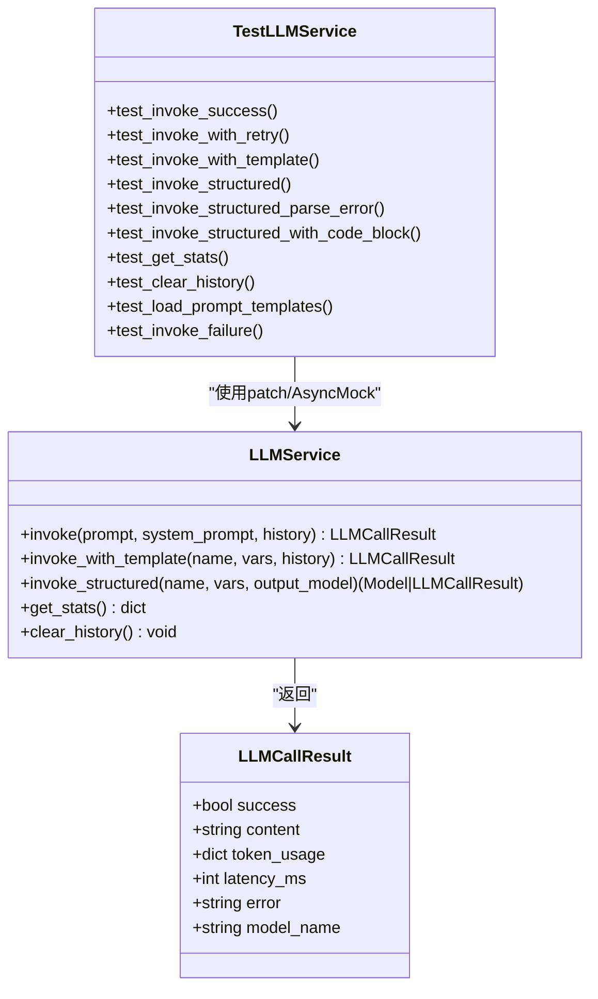
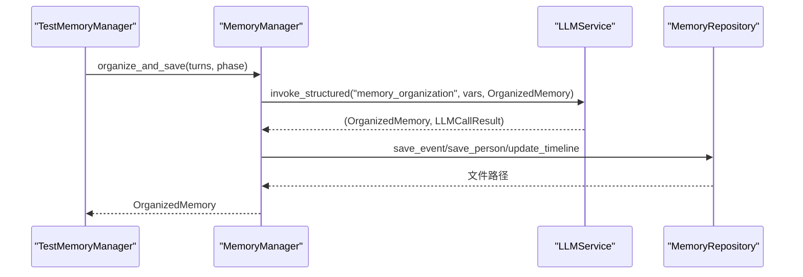
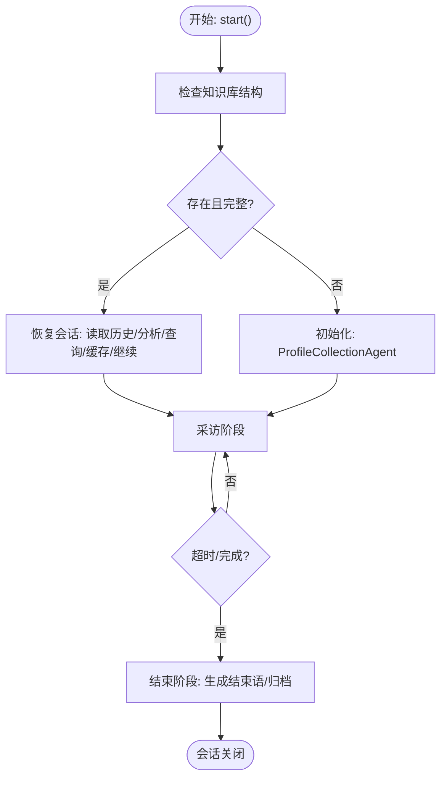
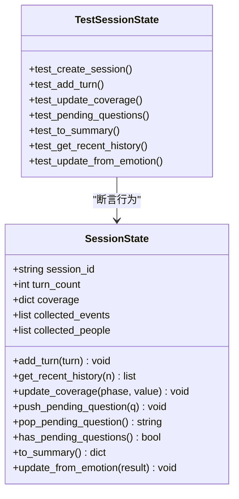
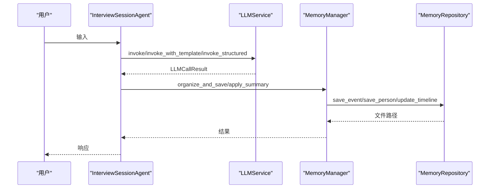
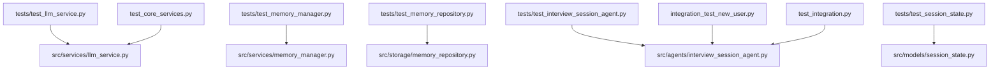

# 测试策略

<cite>
**本文引用的文件**
- [tests/test_interview_session_agent.py](file://tests/test_interview_session_agent.py)
- [tests/test_llm_service.py](file://tests/test_llm_service.py)
- [tests/test_memory_manager.py](file://tests/test_memory_manager.py)
- [tests/test_memory_repository.py](file://tests/test_memory_repository.py)
- [tests/test_session_state.py](file://tests/test_session_state.py)
- [integration_test_new_user.py](file://integration_test_new_user.py)
- [test_integration.py](file://test_integration.py)
- [src/agents/interview_session_agent.py](file://src/agents/interview_session_agent.py)
- [src/services/llm_service.py](file://src/services/llm_service.py)
- [src/services/memory_manager.py](file://src/services/memory_manager.py)
- [src/storage/memory_repository.py](file://src/storage/memory_repository.py)
- [src/models/session_state.py](file://src/models/session_state.py)
- [pyproject.toml](file://pyproject.toml)
- [requirements-dev.txt](file://requirements-dev.txt)
- [test_core_services.py](file://test_core_services.py)
</cite>

## 目录
1. [简介](#简介)
2. [项目结构](#项目结构)
3. [核心组件](#核心组件)
4. [架构总览](#架构总览)
5. [详细组件分析](#详细组件分析)
6. [依赖分析](#依赖分析)
7. [性能考虑](#性能考虑)
8. [故障排查指南](#故障排查指南)
9. [结论](#结论)
10. [附录](#附录)

## 简介
本文件面向“测试策略”的目标，系统化梳理该代码库的测试体系，覆盖单元测试框架设计、Mock对象使用与断言策略、集成测试设计思路（组件交互、端到端流程、回归机制）、测试数据管理（生成、隔离与清理）、持续集成与自动化测试流程（执行、报告与质量门禁）、测试最佳实践（覆盖率、性能与安全测试）以及测试环境搭建与维护要点。文档以仓库现有测试文件与核心实现为基础，提供可操作的建议与可视化图示。

## 项目结构
测试相关文件主要分布在以下位置：
- tests/：单元测试集合，覆盖Agent、LLM服务、记忆管理与存储、会话状态等
- integration_test_new_user.py：新用户端到端交互测试脚本
- test_integration.py：系统级集成测试脚本（情绪检测、问题生成、完整对话流程）
- test_core_services.py：核心服务功能测试脚本
- pyproject.toml 与 requirements-dev.txt：测试工具链与pytest配置

**图表来源**
- [tests/test_interview_session_agent.py:1-77](file://tests/test_interview_session_agent.py#L1-L77)
- [tests/test_llm_service.py:1-187](file://tests/test_llm_service.py#L1-L187)
- [tests/test_memory_manager.py:1-249](file://tests/test_memory_manager.py#L1-L249)
- [tests/test_memory_repository.py:1-325](file://tests/test_memory_repository.py#L1-L325)
- [tests/test_session_state.py:1-143](file://tests/test_session_state.py#L1-L143)
- [integration_test_new_user.py:1-176](file://integration_test_new_user.py#L1-L176)
- [test_integration.py:1-264](file://test_integration.py#L1-L264)
- [test_core_services.py:1-164](file://test_core_services.py#L1-L164)
- [src/agents/interview_session_agent.py:1-482](file://src/agents/interview_session_agent.py#L1-L482)
- [src/services/llm_service.py:1-481](file://src/services/llm_service.py#L1-L481)
- [src/services/memory_manager.py:1-470](file://src/services/memory_manager.py#L1-L470)
- [src/storage/memory_repository.py:1-359](file://src/storage/memory_repository.py#L1-L359)
- [src/models/session_state.py:1-200](file://src/models/session_state.py#L1-L200)

**章节来源**
- [pyproject.toml:24-26](file://pyproject.toml#L24-L26)
- [requirements-dev.txt:1-13](file://requirements-dev.txt#L1-L13)

## 核心组件
- 单元测试框架：基于pytest与pytest-asyncio，支持异步测试与覆盖率统计
- Mock对象：广泛使用unittest.mock（AsyncMock、patch）隔离外部依赖
- 断言策略：围绕业务结果（如结构化输出、调用历史、缓存命中、文件路径等）进行断言
- 集成测试：覆盖Agent生命周期、LLM调用链路、记忆读写与文件系统交互
- 测试数据管理：临时目录隔离、临时文件生成、缓存与索引更新
- 自动化与质量门禁：pytest配置、覆盖率阈值、预提交钩子

**章节来源**
- [tests/test_llm_service.py:1-187](file://tests/test_llm_service.py#L1-L187)
- [tests/test_memory_manager.py:1-249](file://tests/test_memory_manager.py#L1-L249)
- [tests/test_memory_repository.py:1-325](file://tests/test_memory_repository.py#L1-L325)
- [tests/test_interview_session_agent.py:1-77](file://tests/test_interview_session_agent.py#L1-L77)
- [tests/test_session_state.py:1-143](file://tests/test_session_state.py#L1-L143)
- [pyproject.toml:24-26](file://pyproject.toml#L24-L26)
- [requirements-dev.txt:1-13](file://requirements-dev.txt#L1-L13)

## 架构总览
测试体系围绕“单元测试 + 集成测试 + 端到端测试”三层展开，配合Mock与临时文件系统实现数据隔离与可重复性。

**图表来源**
- [tests/test_interview_session_agent.py:1-77](file://tests/test_interview_session_agent.py#L1-L77)
- [tests/test_llm_service.py:1-187](file://tests/test_llm_service.py#L1-L187)
- [tests/test_memory_manager.py:1-249](file://tests/test_memory_manager.py#L1-L249)
- [tests/test_memory_repository.py:1-325](file://tests/test_memory_repository.py#L1-L325)
- [integration_test_new_user.py:1-176](file://integration_test_new_user.py#L1-L176)
- [test_integration.py:1-264](file://test_integration.py#L1-L264)
- [src/agents/interview_session_agent.py:1-482](file://src/agents/interview_session_agent.py#L1-L482)
- [src/services/llm_service.py:1-481](file://src/services/llm_service.py#L1-L481)
- [src/services/memory_manager.py:1-470](file://src/services/memory_manager.py#L1-L470)
- [src/storage/memory_repository.py:1-359](file://src/storage/memory_repository.py#L1-L359)

## 详细组件分析

### 单元测试框架与Mock策略
- 异步测试：使用pytest-asyncio装饰器，覆盖异步方法（如LLM调用、存储写入）
- Mock策略：
  - 使用patch隔离外部API（如LangChain ChatOpenAI），注入AsyncMock以控制响应
  - 使用patch.object对特定方法进行桩替换，验证调用链与参数
  - 使用tempfile.TemporaryDirectory确保测试数据隔离
- 断言策略：
  - 成功/失败路径：校验LLM调用结果的success/error字段
  - 重试机制：断言调用次数与最终成功
  - 结构化输出：断言解析后的Pydantic模型字段
  - 统计与历史：断言调用历史长度、成功率、token用量

**图表来源**
- [tests/test_llm_service.py:1-187](file://tests/test_llm_service.py#L1-L187)
- [src/services/llm_service.py:1-481](file://src/services/llm_service.py#L1-L481)

**章节来源**
- [tests/test_llm_service.py:1-187](file://tests/test_llm_service.py#L1-L187)

### 记忆管理与存储的单元测试
- MemoryManager：
  - 组织并保存记忆：构造结构化输入，调用LLM模板，应用结果到存储
  - 查询与获取：封装repository的查询与缓存访问
  - 短期记忆与历史：更新/获取最近对话，容量控制
- MemoryRepository：
  - LRU缓存：容量、淘汰、清空
  - 事件/人物持久化：路径生成、Markdown写入、索引与缓存更新
  - 时间线更新：追加条目
  - 画像记忆：短期内存索引
- 测试重点：
  - 缓存命中/未命中路径
  - 文件路径与索引一致性
  - 查询关键字/类型过滤
  - 历史容量上限与截断

**图表来源**
- [tests/test_memory_manager.py:1-249](file://tests/test_memory_manager.py#L1-L249)
- [src/services/memory_manager.py:1-470](file://src/services/memory_manager.py#L1-L470)
- [src/storage/memory_repository.py:1-359](file://src/storage/memory_repository.py#L1-L359)
- [src/services/llm_service.py:1-481](file://src/services/llm_service.py#L1-L481)

**章节来源**
- [tests/test_memory_manager.py:1-249](file://tests/test_memory_manager.py#L1-L249)
- [tests/test_memory_repository.py:1-325](file://tests/test_memory_repository.py#L1-L325)

### 会话Agent的单元测试
- InterviewSessionAgent：
  - 知识库检查：目录结构完整性、非index.md文件存在性
  - 老用户恢复：读取最新对话、构建分析Prompt、查询知识库、缓存与继续对话
  - 新用户初始化：ProfileCollectionAgent驱动，完成后生成知识库并切换采访阶段
  - 时间控制：前5分钟归档、总时长限制、阶段切换
- 测试重点：
  - 知识库路径变更与结构校验
  - 异常路径（不存在用户、目录缺失）
  - 工具链调用（查询、缓存、归档）

**图表来源**
- [tests/test_interview_session_agent.py:1-77](file://tests/test_interview_session_agent.py#L1-L77)
- [src/agents/interview_session_agent.py:1-482](file://src/agents/interview_session_agent.py#L1-L482)

**章节来源**
- [tests/test_interview_session_agent.py:1-77](file://tests/test_interview_session_agent.py#L1-L77)
- [src/agents/interview_session_agent.py:1-482](file://src/agents/interview_session_agent.py#L1-L482)

### 会话状态模型的单元测试
- SessionState：
  - 创建与默认值
  - 添加对话轮次、最近历史获取
  - 覆盖率更新（边界值0~1）
  - 待追问队列（push/pop/has）
  - 情绪状态更新（含last_change_turn）
  - 转换为摘要字典

**图表来源**
- [tests/test_session_state.py:1-143](file://tests/test_session_state.py#L1-L143)
- [src/models/session_state.py:1-200](file://src/models/session_state.py#L1-L200)

**章节来源**
- [tests/test_session_state.py:1-143](file://tests/test_session_state.py#L1-L143)

### 集成测试设计思路
- 组件交互测试：
  - 情绪检测、问题生成、完整对话流程的协同验证
  - 通过ConversationOrchestrator驱动，验证状态流转与交接包
- 端到端流程测试：
  - integration_test_new_user.py：新用户首次对话，Agent自动初始化知识库、进行采访、归档与日志记录
  - test_integration.py：核心服务组合测试，覆盖情绪、问题生成与完整会话
- 回归测试机制：
  - 通过固定输入与期望输出（如对话轮次、事件/人物数量、主题数量）进行回归比对

**图表来源**
- [integration_test_new_user.py:1-176](file://integration_test_new_user.py#L1-L176)
- [test_integration.py:1-264](file://test_integration.py#L1-L264)
- [src/agents/interview_session_agent.py:1-482](file://src/agents/interview_session_agent.py#L1-L482)
- [src/services/llm_service.py:1-481](file://src/services/llm_service.py#L1-L481)
- [src/services/memory_manager.py:1-470](file://src/services/memory_manager.py#L1-L470)
- [src/storage/memory_repository.py:1-359](file://src/storage/memory_repository.py#L1-L359)

**章节来源**
- [integration_test_new_user.py:1-176](file://integration_test_new_user.py#L1-L176)
- [test_integration.py:1-264](file://test_integration.py#L1-L264)
- [test_core_services.py:1-164](file://test_core_services.py#L1-L164)

### 测试数据管理策略
- 生成与隔离：
  - 使用tempfile.TemporaryDirectory为每个测试创建隔离的文件系统空间
  - 通过MarkdownFileManager与MemoryRepository写入/读取测试数据
- 数据隔离与清理：
  - 每个测试fixture独立创建临时目录，结束后由操作系统回收
  - MemoryRepository提供clear_short_term与LRU缓存清空能力
- 缓存与索引：
  - LRU缓存与事件/人物索引在测试中被显式断言，确保一致性

**章节来源**
- [tests/test_memory_repository.py:1-325](file://tests/test_memory_repository.py#L1-L325)
- [tests/test_memory_manager.py:1-249](file://tests/test_memory_manager.py#L1-L249)

### 持续集成与自动化测试流程
- 测试执行：
  - pytest配置位于pyproject.toml，testpaths指向tests目录，asyncio_mode启用
  - requirements-dev.txt声明pytest、pytest-asyncio、pytest-cov等工具
- 结果报告：
  - pytest-cov提供覆盖率统计；可在CI中生成覆盖率报告
- 质量门禁：
  - 可在CI中设置覆盖率阈值（如总调用成功率、关键路径覆盖率）作为合并门禁

**章节来源**
- [pyproject.toml:24-26](file://pyproject.toml#L24-L26)
- [requirements-dev.txt:1-13](file://requirements-dev.txt#L1-L13)

### 测试最佳实践指南
- 测试覆盖率要求：
  - 建议对关键路径（LLM调用、记忆组织、文件写入）设置最小覆盖率阈值
  - 对异常分支（模板缺失、解析失败、文件系统异常）进行专项覆盖
- 性能测试：
  - 使用LLMService.get_stats统计平均延迟与token用量，监控性能回归
  - 对批量写入（事件/人物并发保存）进行异步并发测试
- 安全测试：
  - 对Prompt模板与用户输入进行注入风险评估（当前实现未发现敏感处理逻辑）
  - 对文件路径生成与目录遍历进行边界测试（已通过正则与清理函数处理）

**章节来源**
- [tests/test_llm_service.py:1-187](file://tests/test_llm_service.py#L1-L187)
- [src/services/llm_service.py:1-481](file://src/services/llm_service.py#L1-L481)
- [src/storage/memory_repository.py:1-359](file://src/storage/memory_repository.py#L1-L359)

### 测试环境搭建与维护
- 环境准备：
  - 安装开发依赖：pytest、pytest-asyncio、pytest-cov、black、isort、flake8、mypy
  - 配置pytest与mypy（pyproject.toml）
- 维护建议：
  - 为新增模块补充单元测试与集成测试
  - 对外部依赖（LLM、文件系统）统一使用Mock/临时目录
  - 在CI中启用覆盖率与静态检查（mypy、flake8、black/isort）

**章节来源**
- [requirements-dev.txt:1-13](file://requirements-dev.txt#L1-L13)
- [pyproject.toml:1-26](file://pyproject.toml#L1-L26)

## 依赖分析
测试文件与核心实现的依赖关系如下：

**图表来源**
- [tests/test_llm_service.py:1-187](file://tests/test_llm_service.py#L1-L187)
- [tests/test_memory_manager.py:1-249](file://tests/test_memory_manager.py#L1-L249)
- [tests/test_memory_repository.py:1-325](file://tests/test_memory_repository.py#L1-L325)
- [tests/test_interview_session_agent.py:1-77](file://tests/test_interview_session_agent.py#L1-L77)
- [tests/test_session_state.py:1-143](file://tests/test_session_state.py#L1-L143)
- [integration_test_new_user.py:1-176](file://integration_test_new_user.py#L1-L176)
- [test_integration.py:1-264](file://test_integration.py#L1-L264)
- [test_core_services.py:1-164](file://test_core_services.py#L1-L164)
- [src/agents/interview_session_agent.py:1-482](file://src/agents/interview_session_agent.py#L1-L482)
- [src/services/llm_service.py:1-481](file://src/services/llm_service.py#L1-L481)
- [src/services/memory_manager.py:1-470](file://src/services/memory_manager.py#L1-L470)
- [src/storage/memory_repository.py:1-359](file://src/storage/memory_repository.py#L1-L359)
- [src/models/session_state.py:1-200](file://src/models/session_state.py#L1-L200)

**章节来源**
- [tests/test_llm_service.py:1-187](file://tests/test_llm_service.py#L1-L187)
- [tests/test_memory_manager.py:1-249](file://tests/test_memory_manager.py#L1-L249)
- [tests/test_memory_repository.py:1-325](file://tests/test_memory_repository.py#L1-L325)
- [tests/test_interview_session_agent.py:1-77](file://tests/test_interview_session_agent.py#L1-L77)
- [tests/test_session_state.py:1-143](file://tests/test_session_state.py#L1-L143)
- [integration_test_new_user.py:1-176](file://integration_test_new_user.py#L1-L176)
- [test_integration.py:1-264](file://test_integration.py#L1-L264)
- [test_core_services.py:1-164](file://test_core_services.py#L1-L164)

## 性能考虑
- LLM调用统计：通过LLMService.get_stats获取调用次数、成功率、平均延迟与token用量，用于性能基线与回归监控
- 并发写入：MemoryManager在保存事件/人物时使用asyncio.gather进行并行，提升吞吐
- 缓存策略：LRU缓存与短期记忆减少重复IO与LLM调用

**章节来源**
- [tests/test_llm_service.py:1-187](file://tests/test_llm_service.py#L1-L187)
- [src/services/memory_manager.py:1-470](file://src/services/memory_manager.py#L1-L470)
- [src/storage/memory_repository.py:1-359](file://src/storage/memory_repository.py#L1-L359)

## 故障排查指南
- LLM调用失败：
  - 检查模板加载与名称匹配；确认invoke/invoke_with_template/invoke_structured的调用路径
  - 观察重试机制与指数退避日志
- 结构化输出解析失败：
  - 检查输出是否包含代码块包裹的JSON，确保解析逻辑能正确提取
- 记忆写入异常：
  - 校验事件/人物文件路径生成与Markdown写入
  - 检查索引与缓存更新是否一致
- 知识库检查失败：
  - 确认目录结构完整性与非index.md文件的存在性
- 会话超时/阶段切换：
  - 校验时间控制逻辑与阶段枚举状态

**章节来源**
- [tests/test_llm_service.py:1-187](file://tests/test_llm_service.py#L1-L187)
- [tests/test_memory_manager.py:1-249](file://tests/test_memory_manager.py#L1-L249)
- [tests/test_memory_repository.py:1-325](file://tests/test_memory_repository.py#L1-L325)
- [tests/test_interview_session_agent.py:1-77](file://tests/test_interview_session_agent.py#L1-L77)

## 结论
该测试体系以pytest为核心，结合大量Mock与临时文件系统，实现了对Agent、LLM服务、记忆管理与存储的全面覆盖。通过单元测试、集成测试与端到端测试的协同，保证了关键流程的稳定性与可回归性。建议在CI中引入覆盖率阈值与静态检查，持续完善异常分支与性能监控，进一步提升测试质量与工程可靠性。

## 附录
- 测试执行命令（示例）：pytest tests/ -v --asyncio-mode=auto
- 覆盖率生成（示例）：pytest tests/ --cov=src --cov-report=html
- 代码风格：black、isort、flake8、mypy已在pyproject.toml中配置