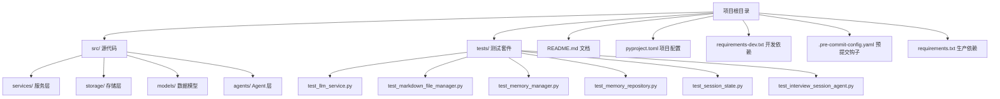
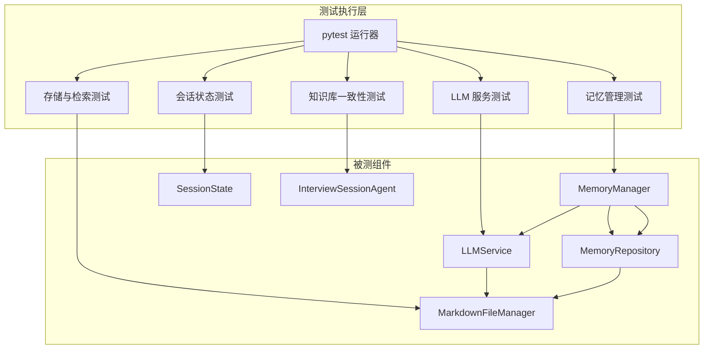
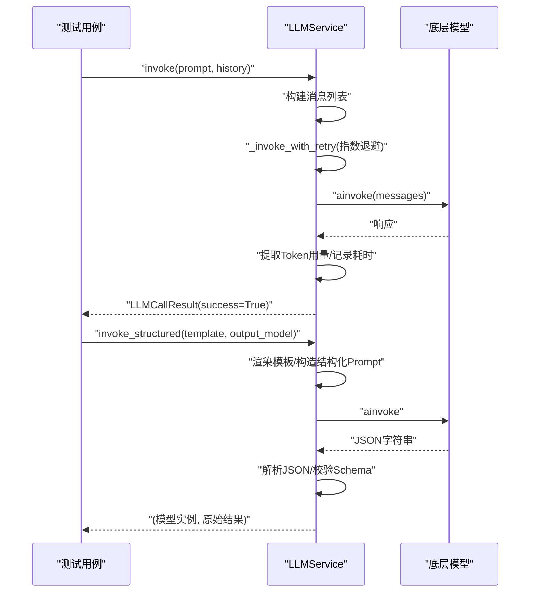
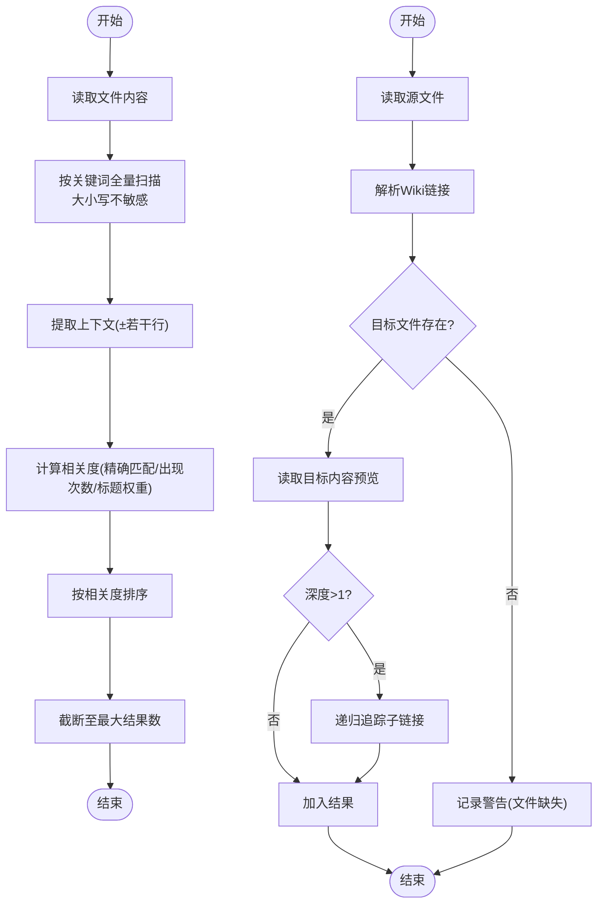
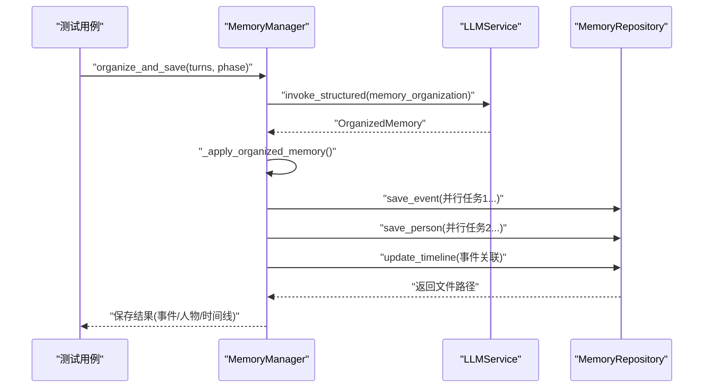
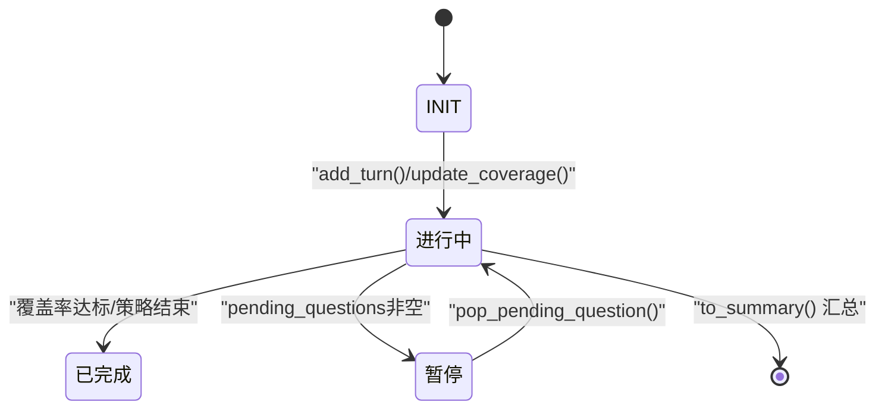
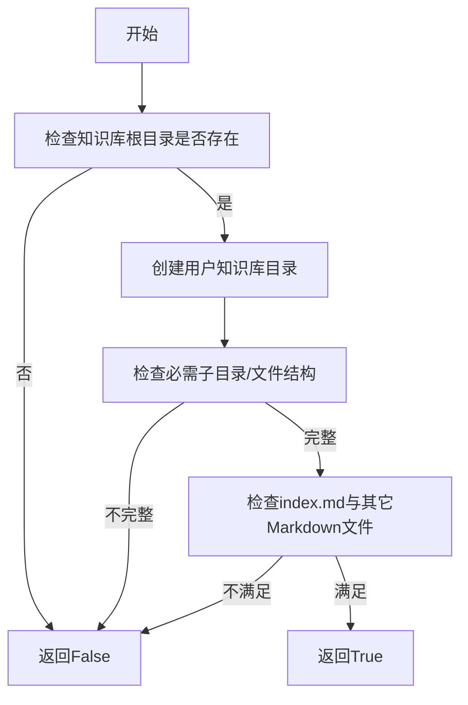
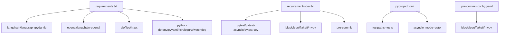

# 测试自动化

<cite>
**本文引用的文件**
- [README.md](file://README.md)
- [pyproject.toml](file://pyproject.toml)
- [requirements-dev.txt](file://requirements-dev.txt)
- [requirements.txt](file://requirements.txt)
- [.pre-commit-config.yaml](file://.pre-commit-config.yaml)
- [tests/test_interview_session_agent.py](file://tests/test_interview_session_agent.py)
- [tests/test_llm_service.py](file://tests/test_llm_service.py)
- [tests/test_markdown_file_manager.py](file://tests/test_markdown_file_manager.py)
- [tests/test_memory_manager.py](file://tests/test_memory_manager.py)
- [tests/test_memory_repository.py](file://tests/test_memory_repository.py)
- [tests/test_session_state.py](file://tests/test_session_state.py)
- [src/services/llm_service.py](file://src/services/llm_service.py)
- [src/storage/markdown_file_manager.py](file://src/storage/markdown_file_manager.py)
- [src/services/memory_manager.py](file://src/services/memory_manager.py)
- [src/storage/memory_repository.py](file://src/storage/memory_repository.py)
- [src/models/session_state.py](file://src/models/session_state.py)
</cite>

## 目录
1. [简介](#简介)
2. [项目结构](#项目结构)
3. [核心组件](#核心组件)
4. [架构总览](#架构总览)
5. [详细组件分析](#详细组件分析)
6. [依赖分析](#依赖分析)
7. [性能考虑](#性能考虑)
8. [故障排查指南](#故障排查指南)
9. [结论](#结论)
10. [附录](#附录)

## 简介
本文件面向“测试自动化”的技术文档目标，系统梳理该项目的测试自动化体系，涵盖持续集成与自动化测试流程设计、测试执行流水线、结果报告与质量门禁机制、测试脚本的自动化执行（含触发条件与并行策略）、测试结果的自动化分析与报告生成（覆盖率、性能指标、缺陷跟踪）、测试环境的自动化配置与管理（容器化与环境变量）、以及最佳实践与工具集成建议。文档以仓库现有测试与配置为依据，结合源码实现细节，提供可操作的指导。

## 项目结构
项目采用“源代码/测试/文档”清晰分离的组织方式，测试集中在 tests/ 目录，核心业务组件分布在 src/ 下，测试运行与质量工具通过 pyproject.toml、requirements-dev.txt 与 .pre-commit-config.yaml 管理。

图表来源
- [README.md:92-200](file://README.md#L92-L200)
- [pyproject.toml:1-26](file://pyproject.toml#L1-L26)
- [requirements-dev.txt:1-13](file://requirements-dev.txt#L1-L13)
- [requirements.txt:1-24](file://requirements.txt#L1-L24)

章节来源
- [README.md:92-200](file://README.md#L92-L200)
- [pyproject.toml:1-26](file://pyproject.toml#L1-L26)
- [requirements-dev.txt:1-13](file://requirements-dev.txt#L1-L13)
- [requirements.txt:1-24](file://requirements.txt#L1-L24)

## 核心组件
- 测试框架与运行
  - 使用 pytest 作为测试框架，支持异步测试与覆盖率统计；通过 pyproject.toml 指定测试路径与 asyncio 模式。
- 代码质量工具链
  - black、isort、flake8、mypy、pre-commit 集成，保证格式、导入顺序、静态检查与提交前校验。
- LLM 服务测试
  - 针对 LLMService 的调用、重试、模板渲染、结构化输出、统计与失败处理进行覆盖。
- 存储与检索测试
  - MarkdownFileManager 的文件读写、搜索、链接解析与追踪；MemoryRepository 的事件/人物/时间线存储与查询。
- 会话与记忆管理测试
  - MemoryManager 的结构化整理与并行保存；SessionState 的状态维护与摘要生成。
- 知识库一致性测试
  - InterviewSessionAgent 的知识库目录结构校验与异常处理。

章节来源
- [tests/test_llm_service.py:1-187](file://tests/test_llm_service.py#L1-L187)
- [tests/test_markdown_file_manager.py:1-207](file://tests/test_markdown_file_manager.py#L1-L207)
- [tests/test_memory_manager.py:1-249](file://tests/test_memory_manager.py#L1-L249)
- [tests/test_memory_repository.py:1-325](file://tests/test_memory_repository.py#L1-L325)
- [tests/test_session_state.py:1-143](file://tests/test_session_state.py#L1-L143)
- [tests/test_interview_session_agent.py:1-77](file://tests/test_interview_session_agent.py#L1-L77)

## 架构总览
测试自动化围绕“测试执行流水线—结果分析—质量门禁”闭环展开。下图展示测试执行与关键组件交互：

图表来源
- [tests/test_llm_service.py:1-187](file://tests/test_llm_service.py#L1-L187)
- [tests/test_markdown_file_manager.py:1-207](file://tests/test_markdown_file_manager.py#L1-L207)
- [tests/test_memory_manager.py:1-249](file://tests/test_memory_manager.py#L1-L249)
- [tests/test_memory_repository.py:1-325](file://tests/test_memory_repository.py#L1-L325)
- [tests/test_session_state.py:1-143](file://tests/test_session_state.py#L1-L143)
- [tests/test_interview_session_agent.py:1-77](file://tests/test_interview_session_agent.py#L1-L77)
- [src/services/llm_service.py:1-481](file://src/services/llm_service.py#L1-L481)
- [src/storage/markdown_file_manager.py:1-546](file://src/storage/markdown_file_manager.py#L1-L546)
- [src/services/memory_manager.py:1-470](file://src/services/memory_manager.py#L1-L470)
- [src/storage/memory_repository.py:1-359](file://src/storage/memory_repository.py#L1-L359)
- [src/models/session_state.py:1-139](file://src/models/session_state.py#L1-L139)

## 详细组件分析

### LLM 服务测试（LLMService）
- 覆盖点
  - 成功调用、重试机制、模板调用、结构化输出（含 JSON 解析与代码块包裹）、统计信息与历史清空、失败处理。
- 关键流程（invoke/重试/结构化输出）

图表来源
- [src/services/llm_service.py:225-438](file://src/services/llm_service.py#L225-L438)
- [tests/test_llm_service.py:24-187](file://tests/test_llm_service.py#L24-L187)

章节来源
- [src/services/llm_service.py:1-481](file://src/services/llm_service.py#L1-L481)
- [tests/test_llm_service.py:1-187](file://tests/test_llm_service.py#L1-L187)

### 存储与检索测试（MarkdownFileManager/MemoryRepository）
- 覆盖点
  - 文件创建/读取/更新/追加、章节追加、全文搜索（大小写不敏感、上下文、相关度）、Wiki 链接提取与解析、链接追踪（递归深度）、目录遍历与统计。
  - MemoryRepository 的事件/人物/时间线存储、索引与缓存、画像记忆、查询与历史管理、对话记录读取。
- 关键流程（文件搜索与链接追踪）

图表来源
- [src/storage/markdown_file_manager.py:285-430](file://src/storage/markdown_file_manager.py#L285-L430)
- [src/storage/memory_repository.py:176-284](file://src/storage/memory_repository.py#L176-L284)

章节来源
- [src/storage/markdown_file_manager.py:1-546](file://src/storage/markdown_file_manager.py#L1-L546)
- [src/storage/memory_repository.py:1-359](file://src/storage/memory_repository.py#L1-L359)
- [tests/test_markdown_file_manager.py:1-207](file://tests/test_markdown_file_manager.py#L1-L207)
- [tests/test_memory_repository.py:1-325](file://tests/test_memory_repository.py#L1-L325)

### 记忆管理测试（MemoryManager）
- 覆盖点
  - 短期记忆更新/获取/历史管理；结构化整理（并行保存事件/人物/时间线更新）；画像记忆更新；批量应用总结；清空会话。
- 关键流程（并行保存与时间线更新）

图表来源
- [src/services/memory_manager.py:111-193](file://src/services/memory_manager.py#L111-L193)
- [src/storage/memory_repository.py:176-261](file://src/storage/memory_repository.py#L176-L261)
- [tests/test_memory_manager.py:32-151](file://tests/test_memory_manager.py#L32-L151)

章节来源
- [src/services/memory_manager.py:1-470](file://src/services/memory_manager.py#L1-L470)
- [tests/test_memory_manager.py:1-249](file://tests/test_memory_manager.py#L1-L249)

### 会话状态测试（SessionState）
- 覆盖点
  - 创建会话、添加对话轮次、覆盖率更新（边界值）、事件/人物采集标记、待追问问题队列、摘要生成、最近历史获取、从情绪结果更新状态。
- 关键流程（状态更新与摘要）

图表来源
- [src/models/session_state.py:24-139](file://src/models/session_state.py#L24-L139)
- [tests/test_session_state.py:8-143](file://tests/test_session_state.py#L8-L143)

章节来源
- [src/models/session_state.py:1-139](file://src/models/session_state.py#L1-L139)
- [tests/test_session_state.py:1-143](file://tests/test_session_state.py#L1-L143)

### 知识库一致性测试（InterviewSessionAgent）
- 覆盖点
  - 知识库目录结构校验（存在性、完整性、索引文件、必需子目录与文件），异常路径处理。
- 关键流程（知识库检查）

图表来源
- [tests/test_interview_session_agent.py:16-77](file://tests/test_interview_session_agent.py#L16-L77)

章节来源
- [tests/test_interview_session_agent.py:1-77](file://tests/test_interview_session_agent.py#L1-L77)

## 依赖分析
- 测试运行与工具
  - pytest、pytest-asyncio、pytest-cov 用于测试执行与覆盖率；black、isort、flake8、mypy、pre-commit 用于代码质量与提交前检查。
- 生产依赖
  - langchain、langgraph、pydantic、openai、aiofiles、httpx、python-dotenv、pyyaml、rich、loguru、watchdog 等支撑核心功能。
- 项目配置
  - pyproject.toml 指定测试路径与 asyncio 模式；.pre-commit-config.yaml 定义格式化与静态检查钩子。

图表来源
- [requirements.txt:1-24](file://requirements.txt#L1-L24)
- [requirements-dev.txt:1-13](file://requirements-dev.txt#L1-L13)
- [pyproject.toml:24-26](file://pyproject.toml#L24-L26)
- [.pre-commit-config.yaml:1-20](file://.pre-commit-config.yaml#L1-L20)

章节来源
- [requirements.txt:1-24](file://requirements.txt#L1-L24)
- [requirements-dev.txt:1-13](file://requirements-dev.txt#L1-L13)
- [pyproject.toml:1-26](file://pyproject.toml#L1-L26)
- [.pre-commit-config.yaml:1-20](file://.pre-commit-config.yaml#L1-L20)

## 性能考虑
- 异步 I/O 与并发
  - MarkdownFileManager 与 MemoryRepository 大量使用异步文件读写与并发 gather，有助于提升大规模文件操作吞吐。
- 缓存与索引
  - MemoryRepository 内置 LRU 缓存与事件/人物索引，减少重复读取与查询成本。
- LLM 调用与重试
  - LLMService 的指数退避重试与统计信息（耗时、Token 使用）便于性能观测与优化。
- 建议
  - 在 CI 中启用并行测试（pytest-xdist）以缩短流水线时长；对大文件搜索与链接追踪设置合理上限与超时；对 LLM 调用增加速率限制与配额监控。

## 故障排查指南
- 测试运行
  - 使用 pytest -v 查看详细输出；使用 pytest --tb=short 快速定位异常；结合 pytest-cov 生成覆盖率报告以发现未覆盖路径。
- LLM 服务
  - 若结构化输出解析失败，检查模板渲染与 JSON 格式；确认代码块包裹场景的解析逻辑；关注重试次数与延迟配置。
- 存储层
  - 文件读取异常通常由路径或权限导致；检查 base_path 与对话 ID 配置；确认目录结构初始化逻辑。
- 记忆管理
  - 并行保存失败时，注意异常捕获与日志输出；核对事件/人物 ID 与时间线更新条件。
- 会话状态
  - 覆盖率更新需注意边界值（0~1）；待追问队列为空时 pop 应返回 None；从情绪结果更新状态需同步轮次计数。

章节来源
- [README.md:267-278](file://README.md#L267-L278)
- [src/services/llm_service.py:400-438](file://src/services/llm_service.py#L400-L438)
- [src/storage/markdown_file_manager.py:171-199](file://src/storage/markdown_file_manager.py#L171-L199)
- [src/services/memory_manager.py:158-193](file://src/services/memory_manager.py#L158-L193)
- [src/models/session_state.py:93-143](file://src/models/session_state.py#L93-L143)

## 结论
本项目已建立完善的测试自动化基础：以 pytest 为核心、配合覆盖率与代码质量工具、覆盖 LLM 服务、存储检索、记忆管理、会话状态与知识库一致性等关键路径。建议在现有基础上引入持续集成流水线（如 GitHub Actions/Azure DevOps），配置定时触发与 PR 触发、并行执行与质量门禁（覆盖率阈值、静态检查失败即阻断），以进一步提升测试效率与质量稳定性。

## 附录
- 快速开始与测试命令
  - 运行全部测试：pytest
  - 详细输出：pytest -v
  - 覆盖率报告：pytest --cov=src --cov-report=html
- 代码质量检查
  - 格式化：black src/
  - 导入排序：isort src/
  - 类型检查：mypy src/
  - 代码检查：flake8 src/

章节来源
- [README.md:267-294](file://README.md#L267-L294)