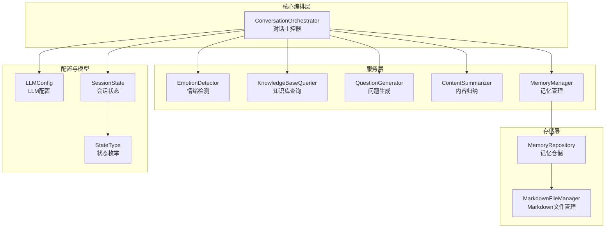
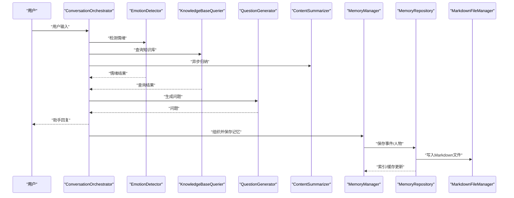
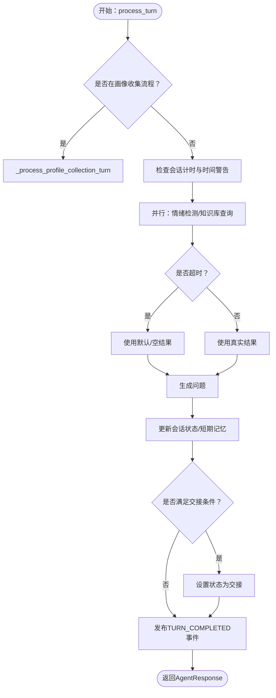
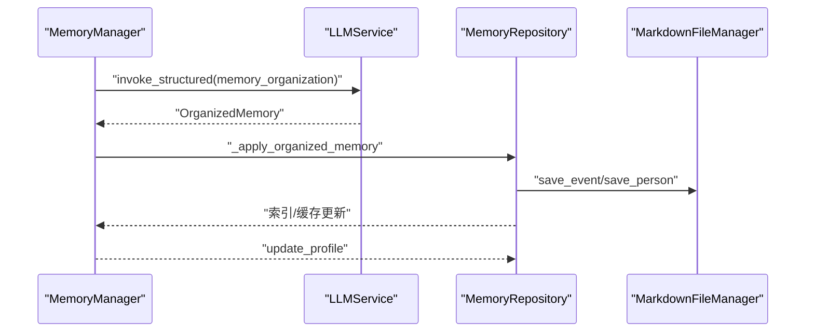
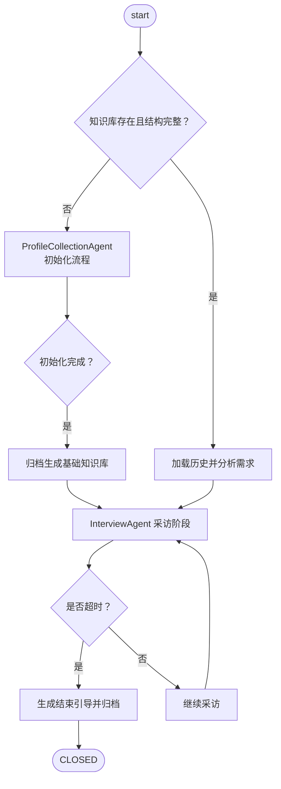
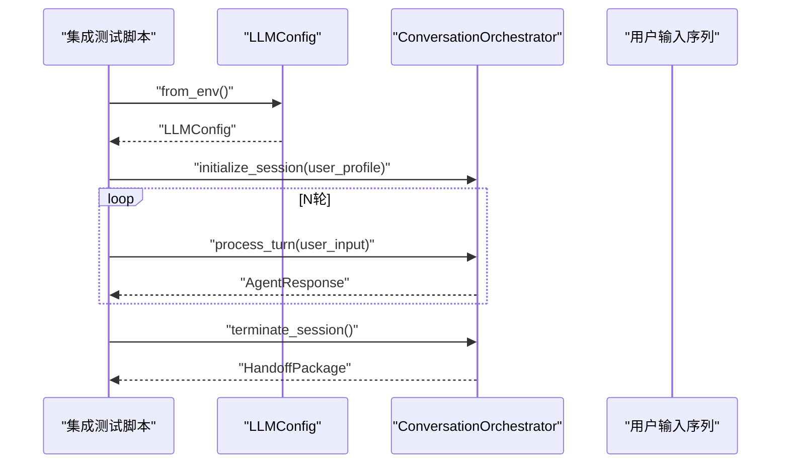
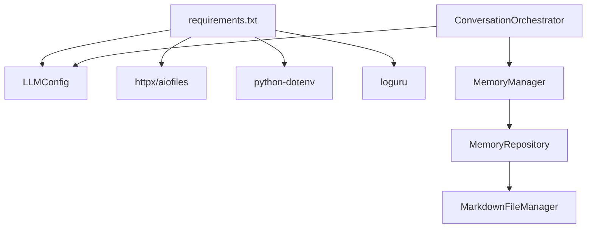

# 集成测试

<cite>
**本文引用的文件**
- [integration_test.py](file://test_integration.py)
- [integration_test_new_user.py](file://integration_test_new_user.py)
- [test_interview_session_agent.py](file://tests/test_interview_session_agent.py)
- [test_memory_manager.py](file://tests/test_memory_manager.py)
- [test_memory_repository.py](file://tests/test_memory_repository.py)
- [conversation_orchestrator.py](file://src/core/conversation_orchestrator.py)
- [interview_session_agent.py](file://src/agents/interview_session_agent.py)
- [memory_manager.py](file://src/services/memory_manager.py)
- [memory_repository.py](file://src/storage/memory_repository.py)
- [llm_config.py](file://src/config/llm_config.py)
- [session_state.py](file://src/models/session_state.py)
- [state_type.py](file://src/enums/state_type.py)
- [requirements.txt](file://requirements.txt)
</cite>

## 目录
1. [简介](#简介)
2. [项目结构](#项目结构)
3. [核心组件](#核心组件)
4. [架构总览](#架构总览)
5. [详细组件分析](#详细组件分析)
6. [依赖分析](#依赖分析)
7. [性能考虑](#性能考虑)
8. [故障排查指南](#故障排查指南)
9. [结论](#结论)
10. [附录](#附录)

## 简介
本文件面向“集成测试”的技术文档，聚焦于系统组件间的协同工作与端到端流程验证。文档围绕以下目标展开：
- 设计组件间交互测试场景，覆盖多模块协作与端到端流程；
- 实现系统组装测试，验证组件集成后的整体功能与性能；
- 阐述数据流测试，追踪数据在系统中的传递、转换与存储；
- 说明测试环境搭建与配置，包括测试数据库、模拟服务与外部依赖处理；
- 提供用例设计指南与故障排查方法，保障系统集成的稳定性与可靠性。

## 项目结构
该项目采用分层架构：核心编排层负责会话状态与流程控制；服务层提供情绪检测、问题生成、内容归纳、知识库查询与记忆管理；存储层负责Markdown文件与缓存；模型与枚举定义支撑状态机与数据契约。

图表来源
- [conversation_orchestrator.py:138-401](file://src/core/conversation_orchestrator.py#L138-L401)
- [memory_manager.py:27-61](file://src/services/memory_manager.py#L27-L61)
- [memory_repository.py:40-88](file://src/storage/memory_repository.py#L40-L88)
- [llm_config.py:10-41](file://src/config/llm_config.py#L10-L41)
- [session_state.py:24-83](file://src/models/session_state.py#L24-L83)
- [state_type.py:4-12](file://src/enums/state_type.py#L4-L12)

章节来源
- [conversation_orchestrator.py:138-401](file://src/core/conversation_orchestrator.py#L138-L401)
- [memory_manager.py:27-61](file://src/services/memory_manager.py#L27-L61)
- [memory_repository.py:40-88](file://src/storage/memory_repository.py#L40-L88)
- [llm_config.py:10-41](file://src/config/llm_config.py#L10-L41)
- [session_state.py:24-83](file://src/models/session_state.py#L24-L83)
- [state_type.py:4-12](file://src/enums/state_type.py#L4-L12)

## 核心组件
- 对话主控器（ConversationOrchestrator）：统一协调情绪检测、知识库查询、问题生成、内容归纳与记忆管理，驱动会话状态流转与交接。
- 记忆管理（MemoryManager）：将对话内容结构化为事件、人物与时间线，并写入存储层。
- 记忆仓储（MemoryRepository）：提供短期/长期/画像记忆的统一读写接口，维护LRU缓存与索引。
- 会话代理（InterviewSessionAgent）：面向用户的服务主体，负责会话生命周期、阶段切换与工具链集成。
- LLM配置（LLMConfig）：从环境变量加载模型提供商、模型名、API密钥与超时等配置。

章节来源
- [conversation_orchestrator.py:138-401](file://src/core/conversation_orchestrator.py#L138-L401)
- [memory_manager.py:27-61](file://src/services/memory_manager.py#L27-L61)
- [memory_repository.py:40-88](file://src/storage/memory_repository.py#L40-L88)
- [interview_session_agent.py:33-111](file://src/agents/interview_session_agent.py#L33-L111)
- [llm_config.py:10-41](file://src/config/llm_config.py#L10-L41)

## 架构总览
下图展示端到端集成测试的关键交互路径：用户输入经主控器并行触发多项服务，随后由记忆管理与仓储完成结构化存储与索引更新。

图表来源
- [conversation_orchestrator.py:236-344](file://src/core/conversation_orchestrator.py#L236-L344)
- [memory_manager.py:111-157](file://src/services/memory_manager.py#L111-L157)
- [memory_repository.py:176-227](file://src/storage/memory_repository.py#L176-L227)

章节来源
- [conversation_orchestrator.py:236-344](file://src/core/conversation_orchestrator.py#L236-L344)
- [memory_manager.py:111-157](file://src/services/memory_manager.py#L111-L157)
- [memory_repository.py:176-227](file://src/storage/memory_repository.py#L176-L227)

## 详细组件分析

### 组件A：对话主控器（ConversationOrchestrator）集成测试
- 测试目标
  - 验证会话初始化、轮次处理、情绪检测、知识库查询、问题生成与内容归纳的端到端流程；
  - 检查交接触发条件、会话计时与超时处理；
  - 验证事件总线发布与状态摘要生成。
- 关键流程
  - 初始化会话并加载LLM配置；
  - 并行执行情绪检测与知识库查询，限时等待；
  - 生成问题并更新会话状态与短期记忆；
  - 检查交接条件并准备交接包；
  - 终止会话并输出收集数据概览。
- 数据流要点
  - 输入：用户输入字符串；
  - 中间：ConversationTurn、EmotionResult、MemoryQueryResult；
  - 输出：AgentResponse（含消息、状态更新、暂停/交接标志）。
- 性能与并发
  - 使用异步任务与超时保护，避免阻塞；
  - 交接阈值与覆盖率阈值共同决定交接时机。

图表来源
- [conversation_orchestrator.py:236-344](file://src/core/conversation_orchestrator.py#L236-L344)
- [conversation_orchestrator.py:353-389](file://src/core/conversation_orchestrator.py#L353-L389)

章节来源
- [conversation_orchestrator.py:198-401](file://src/core/conversation_orchestrator.py#L198-L401)
- [session_state.py:24-139](file://src/models/session_state.py#L24-L139)

### 组件B：记忆管理与仓储（MemoryManager/MemoryRepository）集成测试
- 测试目标
  - 验证结构化记忆组织（事件/人物/时间线）、画像更新与查询；
  - 验证短期记忆、历史记录与LRU缓存行为；
  - 验证对话记录读取与时间线追加。
- 关键流程
  - MemoryManager组织对话轮次为结构化记忆；
  - 并行保存事件与人物，更新时间线；
  - MemoryRepository写入Markdown文件并维护索引与缓存；
  - 提供查询接口与画像记忆更新。
- 数据流要点
  - 输入：ConversationTurn列表；
  - 中间：OrganizedMemory（事件/人物/时间线更新）；
  - 输出：文件路径列表与索引更新。

图表来源
- [memory_manager.py:111-157](file://src/services/memory_manager.py#L111-L157)
- [memory_manager.py:158-193](file://src/services/memory_manager.py#L158-L193)
- [memory_repository.py:176-227](file://src/storage/memory_repository.py#L176-L227)

章节来源
- [memory_manager.py:111-193](file://src/services/memory_manager.py#L111-L193)
- [memory_repository.py:176-285](file://src/storage/memory_repository.py#L176-L285)

### 组件C：会话代理（InterviewSessionAgent）集成测试
- 测试目标
  - 验证新老用户识别、初始化流程、采访阶段与结束流程；
  - 验证时间控制、前五分钟归档与对话历史管理；
  - 验证工具链（缓存、查询、归档）集成。
- 关键流程
  - 启动：检查知识库结构，决定初始化或恢复；
  - 初始化：ProfileCollectionAgent收集用户画像；
  - 采访：InterviewAgent生成问题并推进对话；
  - 结束：生成结束引导并归档对话记录。
- 数据流要点
  - 输入：用户输入字符串；
  - 中间：会话阶段（INIT/PROFILE_COLLECTION/INTERVIEW/ENDING/CLOSED）；
  - 输出：助手回复与阶段切换。

图表来源
- [interview_session_agent.py:112-130](file://src/agents/interview_session_agent.py#L112-L130)
- [interview_session_agent.py:178-242](file://src/agents/interview_session_agent.py#L178-L242)
- [interview_session_agent.py:271-393](file://src/agents/interview_session_agent.py#L271-L393)

章节来源
- [interview_session_agent.py:33-111](file://src/agents/interview_session_agent.py#L33-L111)
- [interview_session_agent.py:112-393](file://src/agents/interview_session_agent.py#L112-L393)

### 组件D：系统组装测试（端到端）
- 测试目标
  - 验证从LLM配置加载到会话终止的完整链路；
  - 验证情绪检测、问题生成与完整对话流程；
  - 验证交接包生成与收集数据概览。
- 关键流程
  - 从环境变量加载LLM配置；
  - 初始化ConversationOrchestrator；
  - 逐轮处理用户输入，记录响应与状态；
  - 终止会话并打印交接包统计信息。

图表来源
- [integration_test.py:21-104](file://test_integration.py#L21-L104)
- [llm_config.py:42-61](file://src/config/llm_config.py#L42-L61)
- [conversation_orchestrator.py:198-401](file://src/core/conversation_orchestrator.py#L198-L401)

章节来源
- [integration_test.py:21-104](file://test_integration.py#L21-L104)
- [llm_config.py:42-61](file://src/config/llm_config.py#L42-L61)
- [conversation_orchestrator.py:198-401](file://src/core/conversation_orchestrator.py#L198-L401)

## 依赖分析
- 外部依赖
  - LLM SDK（OpenAI/Anthropic/Qwen等），通过LLMConfig从环境变量注入；
  - 异步HTTP客户端（httpx）与文件系统异步支持（aiofiles）；
  - 环境变量加载（python-dotenv）与日志（loguru）。
- 内部耦合
  - ConversationOrchestrator聚合多个服务与仓储；
  - MemoryManager依赖MemoryRepository与LLMService；
  - InterviewSessionAgent依赖MemoryManager与工具链。

图表来源
- [requirements.txt:1-24](file://requirements.txt#L1-L24)
- [llm_config.py:10-41](file://src/config/llm_config.py#L10-L41)
- [conversation_orchestrator.py:163-188](file://src/core/conversation_orchestrator.py#L163-L188)
- [memory_manager.py:47-61](file://src/services/memory_manager.py#L47-L61)
- [memory_repository.py:54-68](file://src/storage/memory_repository.py#L54-L68)

章节来源
- [requirements.txt:1-24](file://requirements.txt#L1-L24)
- [llm_config.py:10-41](file://src/config/llm_config.py#L10-L41)
- [conversation_orchestrator.py:163-188](file://src/core/conversation_orchestrator.py#L163-L188)
- [memory_manager.py:47-61](file://src/services/memory_manager.py#L47-L61)
- [memory_repository.py:54-68](file://src/storage/memory_repository.py#L54-L68)

## 性能考虑
- 异步与并发
  - 并行执行情绪检测与知识库查询，缩短单轮处理时间；
  - 使用gather并行保存事件与人物，提升批量写入效率。
- 超时与降级
  - 为关键异步任务设置超时，超时后使用默认/空结果保证鲁棒性；
  - 交接阈值与覆盖率阈值共同决定交接时机，避免无限轮次。
- 缓存与索引
  - LRU缓存减少重复读取；
  - 事件/人物索引加速查询与去重。

章节来源
- [conversation_orchestrator.py:269-302](file://src/core/conversation_orchestrator.py#L269-L302)
- [memory_manager.py:170-187](file://src/services/memory_manager.py#L170-L187)
- [memory_repository.py:16-38](file://src/storage/memory_repository.py#L16-L38)

## 故障排查指南
- LLM配置错误
  - 症状：初始化失败或调用LLM时报错；
  - 排查：确认QWEN专属环境变量（QWEN_URL、QWEN_APIKEY）是否配置；
  - 参考：[llm_config.py:42-61](file://src/config/llm_config.py#L42-L61)。
- 知识库结构缺失
  - 症状：InterviewSessionAgent无法识别为老用户；
  - 排查：确认知识库根目录下用户ID目录存在，且包含必要子目录与非index.md的Markdown文件；
  - 参考：[test_interview_session_agent.py:16-77](file://tests/test_interview_session_agent.py#L16-L77)。
- 记忆写入失败
  - 症状：事件/人物未落盘或索引为空；
  - 排查：检查MemoryRepository的保存路径与文件权限，确认Markdown文件管理器可用；
  - 参考：[memory_repository.py:176-227](file://src/storage/memory_repository.py#L176-L227)。
- 会话超时或交接异常
  - 症状：会话提前结束或未触发交接；
  - 排查：检查会话计时配置、交接阈值与覆盖率更新逻辑；
  - 参考：[conversation_orchestrator.py:345-352](file://src/core/conversation_orchestrator.py#L345-L352)、[session_state.py:93-106](file://src/models/session_state.py#L93-L106)。
- 测试日志与断言
  - 建议：在测试中增加日志输出与断言点，定位具体失败环节；
  - 参考：[test_memory_manager.py:32-96](file://tests/test_memory_manager.py#L32-L96)、[test_memory_repository.py:51-112](file://tests/test_memory_repository.py#L51-L112)。

章节来源
- [llm_config.py:42-61](file://src/config/llm_config.py#L42-L61)
- [test_interview_session_agent.py:16-77](file://tests/test_interview_session_agent.py#L16-L77)
- [memory_repository.py:176-227](file://src/storage/memory_repository.py#L176-L227)
- [conversation_orchestrator.py:345-352](file://src/core/conversation_orchestrator.py#L345-L352)
- [session_state.py:93-106](file://src/models/session_state.py#L93-L106)
- [test_memory_manager.py:32-96](file://tests/test_memory_manager.py#L32-L96)
- [test_memory_repository.py:51-112](file://tests/test_memory_repository.py#L51-L112)

## 结论
本文基于仓库现有代码，系统梳理了集成测试的设计思路与实现方法，覆盖组件间交互、端到端流程、数据流与性能特性，并提供了测试环境配置与故障排查建议。建议在后续迭代中补充：
- 更多跨模块的端到端测试用例；
- 模拟外部LLM服务的测试桩；
- 压力与稳定性测试方案。

## 附录
- 测试用例设计指南
  - 场景拆分：初始化/画像收集、采访阶段、结束阶段、超时与交接；
  - 输入构造：典型对话轮次、极端输入（超时、异常）、边界条件（空知识库）；
  - 断言策略：状态机推进、覆盖率变化、文件落盘、事件/人物/时间线一致性。
- 环境搭建与配置
  - LLM配置：优先使用QWEN专属环境变量；
  - 知识库路径：确保InterviewSessionAgent指向的用户目录存在；
  - 日志与输出：集成测试脚本已内置日志配置，便于问题定位。

章节来源
- [integration_test.py:1-264](file://test_integration.py#L1-L264)
- [integration_test_new_user.py:1-176](file://integration_test_new_user.py#L1-L176)
- [llm_config.py:42-61](file://src/config/llm_config.py#L42-L61)
- [interview_session_agent.py:64-68](file://src/agents/interview_session_agent.py#L64-L68)