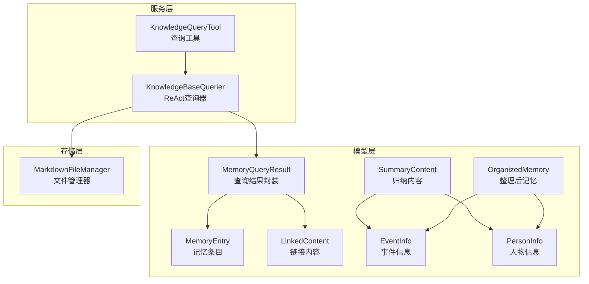
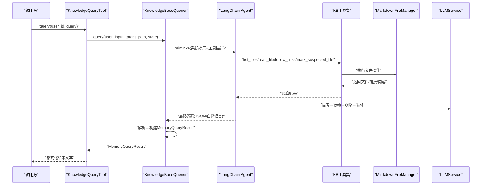
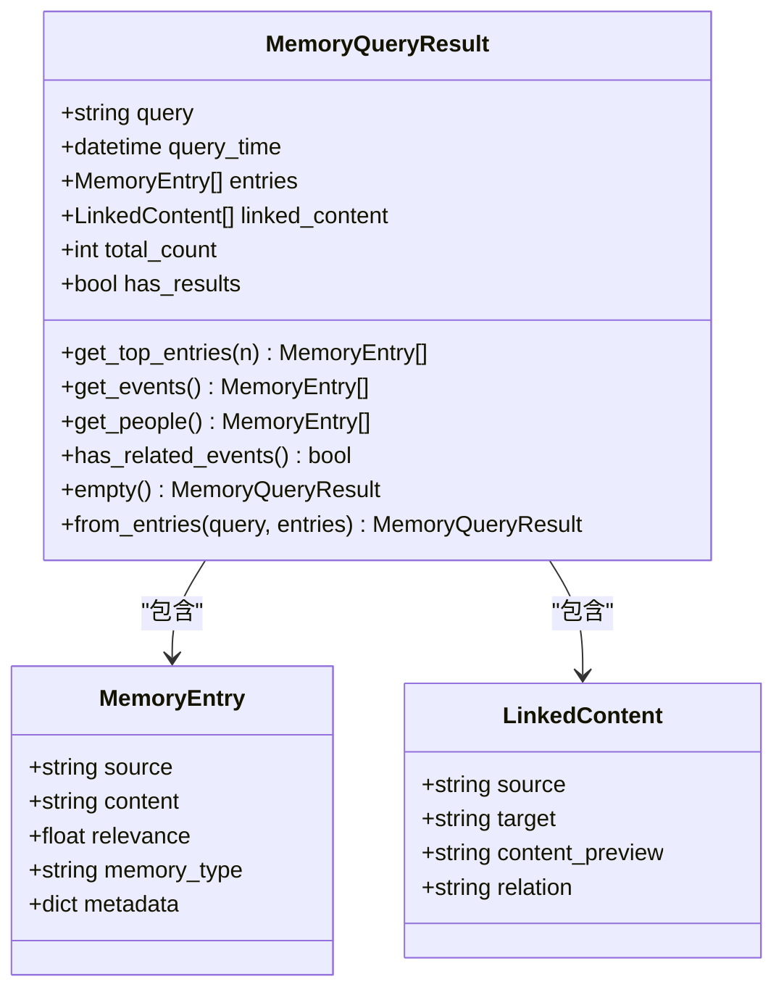
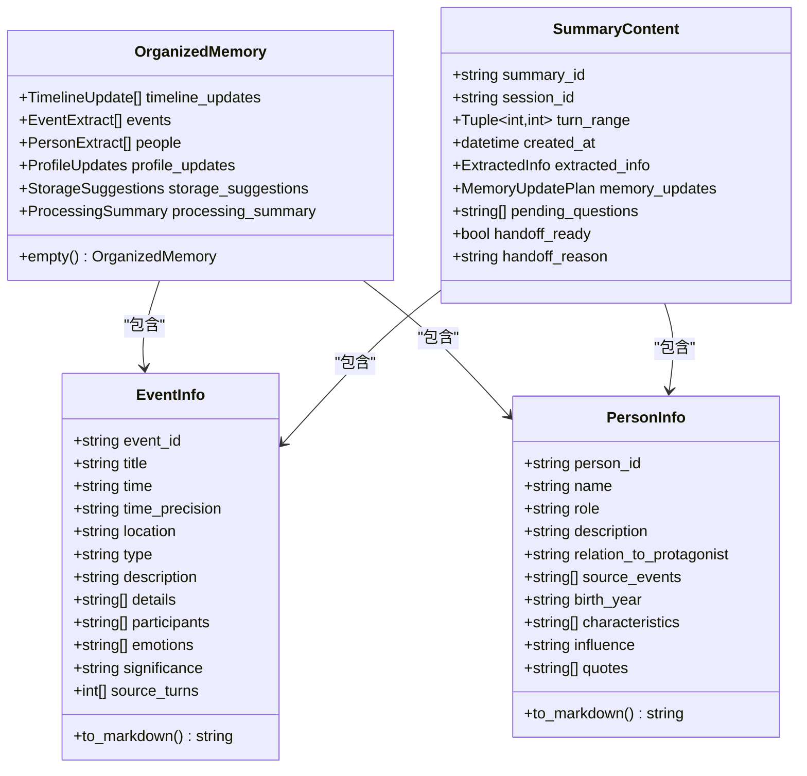
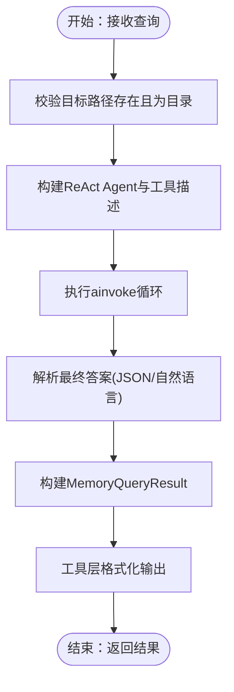
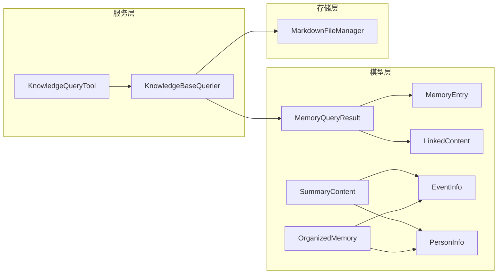

# 知识库数据模型

<cite>
**本文引用的文件**
- [memory_query_result.py](file://src/models/memory_query_result.py)
- [organized_memory.py](file://src/models/organized_memory.py)
- [person_info.py](file://src/models/person_info.py)
- [event_info.py](file://src/models/event_info.py)
- [summary_content.py](file://src/models/summary_content.py)
- [__init__.py](file://src/models/__init__.py)
- [knowledge_base_querier.py](file://src/services/knowledge_base_querier.py)
- [knowledge_query_tool.py](file://src/tools/knowledge_query_tool.py)
- [verify_models.py](file://verify_models.py)
</cite>

## 目录
1. [简介](#简介)
2. [项目结构](#项目结构)
3. [核心组件](#核心组件)
4. [架构概览](#架构概览)
5. [详细组件分析](#详细组件分析)
6. [依赖分析](#依赖分析)
7. [性能考虑](#性能考虑)
8. [故障排查指南](#故障排查指南)
9. [结论](#结论)
10. [附录](#附录)

## 简介
本技术文档围绕知识库数据模型展开，重点解释 MemoryQueryResult、MemoryEntry 和 LinkedContent 三大核心数据结构的设计理念、字段定义与约束，以及它们在知识库查询流程中的流转与转换。同时，文档阐述了数据验证规则与序列化机制，给出数据模型扩展与自定义字段添加的开发指南，并通过图示展示查询过程与数据关系。

## 项目结构
知识库数据模型位于 src/models 目录，围绕“查询结果封装、记忆条目结构、链接内容表示”三个维度构建，配合服务层与工具层形成从“查询—解析—封装—应用”的闭环。

图表来源
- [knowledge_base_querier.py:202-540](file://src/services/knowledge_base_querier.py#L202-L540)
- [knowledge_query_tool.py:11-81](file://src/tools/knowledge_query_tool.py#L11-L81)
- [memory_query_result.py:23-81](file://src/models/memory_query_result.py#L23-L81)
- [organized_memory.py:141-151](file://src/models/organized_memory.py#L141-L151)
- [event_info.py:5-69](file://src/models/event_info.py#L5-L69)
- [person_info.py:5-61](file://src/models/person_info.py#L5-L61)
- [summary_content.py:37-67](file://src/models/summary_content.py#L37-L67)

章节来源
- [__init__.py:1-86](file://src/models/__init__.py#L1-L86)

## 核心组件
本节聚焦 MemoryQueryResult、MemoryEntry、LinkedContent 三者的设计与职责边界，以及与其它模型的协作关系。

- MemoryQueryResult：封装一次知识库查询的完整结果，包含查询语句、时间戳、匹配的记忆条目列表、链接内容列表、统计信息等；提供常用过滤与聚合方法（如获取高相关度条目、事件/人物过滤、是否存在相关事件等），并支持空结果与从条目列表快速构建。
- MemoryEntry：单条记忆条目的载体，包含来源文件路径、内容摘要、相关度评分、记忆类型（短期/长期/画像）、元数据等；用于承载 LLM 或工具链抽取的上下文片段。
- LinkedContent：表示文件间链接关系，包含源文件路径、目标文件路径、内容预览、关联类型等；用于表达“文件A链接到文件B”的关系，便于后续上下文扩展。

章节来源
- [memory_query_result.py:6-81](file://src/models/memory_query_result.py#L6-L81)

## 架构概览
知识库查询采用 ReAct 模式，由 KnowledgeBaseQuerier 驱动工具链（列目录、读文件、追踪链接、标记疑似文件、探索报告等）完成信息收集，最终解析大模型输出为标准 JSON，再封装为 MemoryQueryResult 返回给上层。

图表来源
- [knowledge_base_querier.py:257-373](file://src/services/knowledge_base_querier.py#L257-L373)
- [knowledge_query_tool.py:33-66](file://src/tools/knowledge_query_tool.py#L33-L66)

## 详细组件分析

### MemoryQueryResult 与 MemoryEntry、LinkedContent
- 设计理念
  - MemoryQueryResult 作为“查询结果容器”，统一承载“直接匹配的记忆条目”和“通过链接扩展的关联内容”，并提供统计与过滤能力，便于上层（如问题生成、内容归纳、交接包）消费。
  - MemoryEntry 以“来源路径+摘要+相关度+类型+元数据”的最小必要信息表达一条记忆，便于跨模块复用与序列化。
  - LinkedContent 以“源→目标”的链接关系表达知识网络，支持内容预览与关系类型标注，便于后续扩展为图谱或推荐。
- 字段与约束
  - MemoryQueryResult：查询语句、查询时间、记忆条目列表、链接内容列表、总数、是否存在结果等；提供 get_top_entries、get_events、get_people、has_related_events、empty、from_entries 等方法。
  - MemoryEntry：来源、内容摘要、相关度、记忆类型、元数据字典。
  - LinkedContent：源文件、目标文件、内容预览、关系类型。
- 序列化与验证
  - 基于 Pydantic，自动进行字段类型校验与默认值处理；MemoryQueryResult 的构造器与工厂方法保证结果一致性。
  - 上层工具层可将 MemoryQueryResult 格式化为纯文本，便于对话或日志展示。

图表来源
- [memory_query_result.py:6-81](file://src/models/memory_query_result.py#L6-L81)

章节来源
- [memory_query_result.py:23-81](file://src/models/memory_query_result.py#L23-L81)

### 与整理与归纳模型的衔接
- OrganizedMemory：面向“结构化整理”的模型，包含时间线更新、事件提取、人物提取、画像更新、存储建议、处理摘要等，服务于记忆整理与落盘。
- EventInfo / PersonInfo：面向“单事件/单人物”的结构化记录，支持转为 Markdown 内容，便于写入知识库。
- SummaryContent：面向“归纳结果”的结构化输出，指导记忆更新与交接状态，包含提取信息、更新计划、待处理问题、交接状态等。

图表来源
- [organized_memory.py:141-151](file://src/models/organized_memory.py#L141-L151)
- [event_info.py:5-69](file://src/models/event_info.py#L5-L69)
- [person_info.py:5-61](file://src/models/person_info.py#L5-L61)
- [summary_content.py:37-67](file://src/models/summary_content.py#L37-L67)

章节来源
- [organized_memory.py:1-151](file://src/models/organized_memory.py#L1-L151)
- [event_info.py:1-69](file://src/models/event_info.py#L1-L69)
- [person_info.py:1-61](file://src/models/person_info.py#L1-L61)
- [summary_content.py:1-67](file://src/models/summary_content.py#L1-L67)

### 查询流程与数据转换
- 输入：用户查询语句、目标用户知识库路径、会话状态。
- Agent 行动：列目录、读文件、追踪链接、标记疑似文件、生成探索报告。
- 输出：标准 JSON 的“相关记忆”和“链接上下文”，经解析后构建 MemoryQueryResult。
- 工具层：将 MemoryQueryResult 格式化为可读文本，便于对话或日志展示。

图表来源
- [knowledge_base_querier.py:257-373](file://src/services/knowledge_base_querier.py#L257-L373)
- [knowledge_query_tool.py:33-81](file://src/tools/knowledge_query_tool.py#L33-L81)

章节来源
- [knowledge_base_querier.py:202-540](file://src/services/knowledge_base_querier.py#L202-L540)
- [knowledge_query_tool.py:11-81](file://src/tools/knowledge_query_tool.py#L11-L81)

## 依赖分析
- 模型层内部：MemoryQueryResult 依赖 MemoryEntry 与 LinkedContent；SummaryContent 依赖 EventInfo 与 PersonInfo；OrganizedMemory 同时依赖两类实体模型。
- 服务层：KnowledgeBaseQuerier 依赖 MarkdownFileManager 与 LLMService，负责 ReAct 查询与结果解析；KnowledgeQueryTool 作为上层封装，提供简洁查询接口。
- 导出与聚合：models/__init__.py 统一导出核心模型，便于上层按需导入。

图表来源
- [__init__.py:1-86](file://src/models/__init__.py#L1-L86)
- [knowledge_base_querier.py:202-540](file://src/services/knowledge_base_querier.py#L202-L540)
- [knowledge_query_tool.py:11-81](file://src/tools/knowledge_query_tool.py#L11-L81)

章节来源
- [__init__.py:1-86](file://src/models/__init__.py#L1-L86)

## 性能考虑
- ReAct 循环控制：通过最大迭代次数与工具描述中的探索策略，避免无序扫描导致的性能浪费。
- 一次性全量目录扫描：优先使用 list_files 全量获取目录结构，减少重复 IO。
- 内容读取优先：优先完整阅读文档，降低碎片检索带来的重复读取成本。
- 结果缓存与去重：在工具层可引入访问路径与疑似文件集合的去重逻辑，减少重复工作。
- 序列化开销：MemoryQueryResult 与其它模型基于 Pydantic，序列化/反序列化开销可控；建议在高频路径使用 model_dump_json/model_validate_json 时注意批量处理。

## 故障排查指南
- 目标路径无效：若目标路径为空、不存在或非目录，查询器返回空结果；建议在调用前校验路径合法性。
- 工具链异常：工具执行过程中捕获异常并记录日志；检查工具描述、路径安全与权限。
- 最终答案解析失败：当大模型未按 JSON 输出时，采用自然语言降级解析；若仍失败，返回最小化有效结构；建议调整提示词模板与工具描述。
- 结果格式化：工具层对 MemoryQueryResult 的格式化逻辑可作为调试输出的参考，便于定位上游解析问题。

章节来源
- [knowledge_base_querier.py:280-373](file://src/services/knowledge_base_querier.py#L280-L373)
- [knowledge_query_tool.py:68-81](file://src/tools/knowledge_query_tool.py#L68-L81)

## 结论
MemoryQueryResult、MemoryEntry 与 LinkedContent 构成了知识库查询结果的“轻量、强内聚、可扩展”数据骨架，配合 OrganizedMemory、EventInfo、PersonInfo、SummaryContent 等模型，实现了从“查询—解析—封装—整理—落盘”的完整闭环。通过 Pydantic 的验证与序列化机制，确保了数据传输的一致性与完整性；通过 ReAct 查询模式与工具链，保障了查询过程的可控与可观测。

## 附录

### 数据验证规则与序列化机制
- 字段类型与默认值：基于 Pydantic 的自动校验与默认值处理，确保字段类型正确与缺省值合理。
- 时间字段：MemoryQueryResult 的查询时间为默认工厂函数生成的当前时间，保证每次查询的时间戳准确。
- 数值范围：MemoryQueryResult 中的 get_top_entries、get_events、get_people 等方法提供稳定的过滤与聚合能力。
- 序列化：支持 model_dump_json 与 model_validate_json，便于跨模块传递与持久化。

章节来源
- [memory_query_result.py:23-81](file://src/models/memory_query_result.py#L23-L81)
- [verify_models.py:129-142](file://verify_models.py#L129-L142)

### 数据模型扩展与自定义字段添加指南
- 新增字段步骤
  - 在对应模型文件中添加字段定义与类型注解，必要时设置默认值与约束（如 ge/le）。
  - 如需对外暴露，更新 models/__init__.py 的导出列表，确保上层可按需导入。
  - 编写单元测试或集成测试，验证字段在序列化、反序列化与工具链中的行为。
- 扩展建议
  - 保持字段语义清晰、命名一致，避免与现有字段冲突。
  - 若涉及复杂关系（如图谱），可参考 LinkedContent 的“源→目标”关系设计，逐步扩展为边/节点模型。
  - 对于需要持久化的结构化数据，优先使用 Pydantic 模型，结合 to_markdown 方法输出为 Markdown，便于人工审阅与版本管理。

章节来源
- [__init__.py:41-86](file://src/models/__init__.py#L41-L86)
- [event_info.py:34-69](file://src/models/event_info.py#L34-L69)
- [person_info.py:34-61](file://src/models/person_info.py#L34-L61)