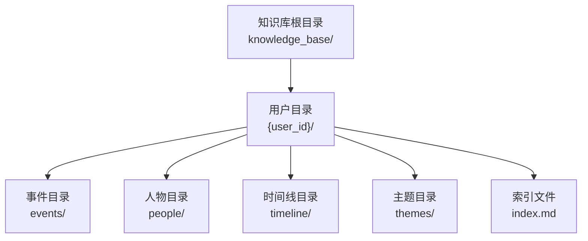
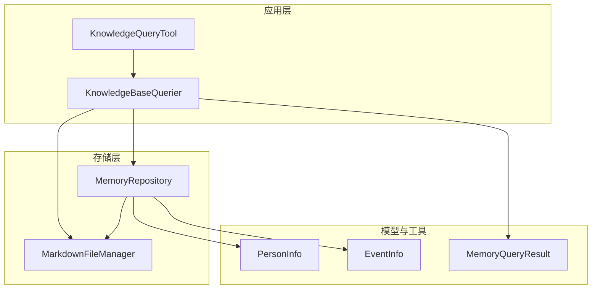
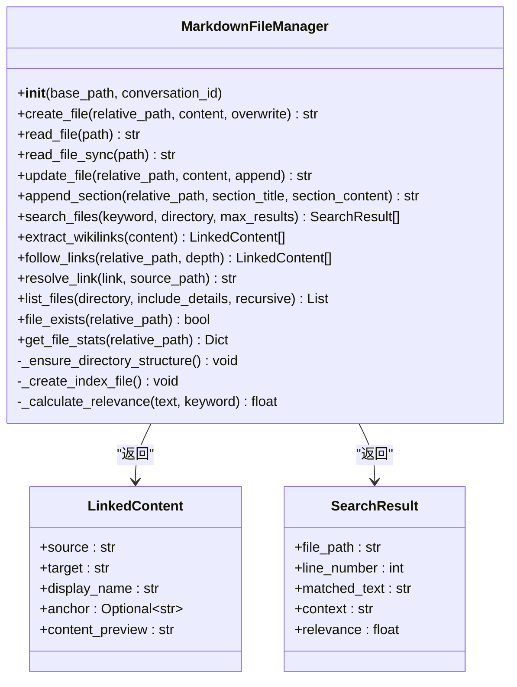
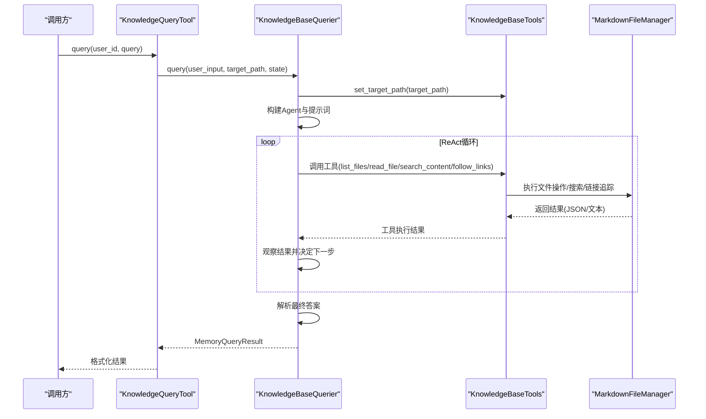
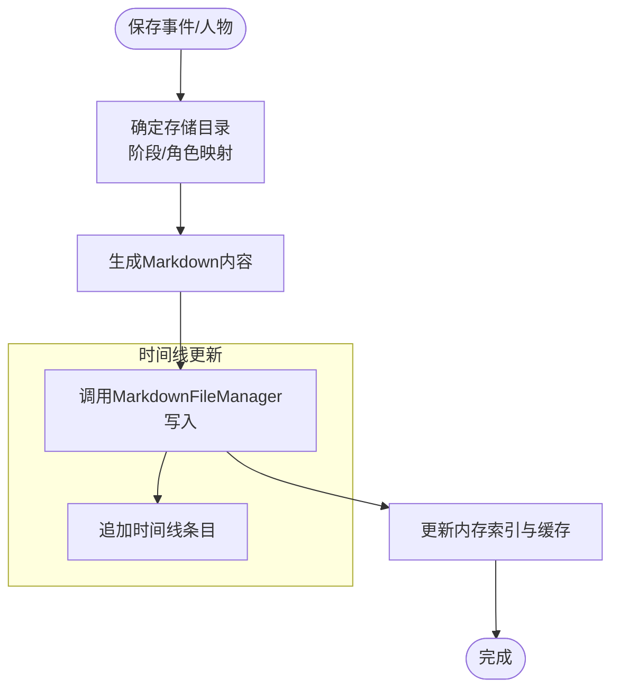
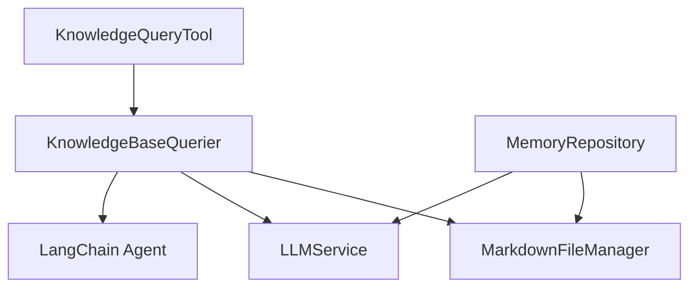

# 知识库文件管理

<cite>
**本文引用的文件**
- [markdown_file_manager.py](file://src/storage/markdown_file_manager.py)
- [test_markdown_file_manager.py](file://tests/test_markdown_file_manager.py)
- [knowledge_base_querier.py](file://src/services/knowledge_base_querier.py)
- [knowledge_query_tool.py](file://src/tools/knowledge_query_tool.py)
- [memory_repository.py](file://src/storage/memory_repository.py)
- [memory_query_result.py](file://src/models/memory_query_result.py)
- [person_info.py](file://src/models/person_info.py)
- [event_info.py](file://src/models/event_info.py)
- [index.md](file://knowledge_base/index.md)
- [README.md](file://README.md)
</cite>

## 目录
1. [简介](#简介)
2. [项目结构](#项目结构)
3. [核心组件](#核心组件)
4. [架构概览](#架构概览)
5. [详细组件分析](#详细组件分析)
6. [依赖分析](#依赖分析)
7. [性能考虑](#性能考虑)
8. [故障排查指南](#故障排查指南)
9. [结论](#结论)
10. [附录](#附录)

## 简介
本技术文档围绕知识库文件管理系统展开，重点解释 MarkdownFileManager 的实现机制，涵盖文件读写、目录遍历、内容解析、搜索与链接追踪等功能；同时阐明知识库的文件系统结构设计（事件、人物、主题、时间线），并提供路径安全验证机制、最佳实践与扩展指南，帮助开发者高效、安全地维护与扩展该系统。

## 项目结构
知识库采用“用户隔离”的文件系统结构，每个用户拥有独立的知识库目录，内部按领域划分子目录，统一入口为 index.md 索引文件。核心模块位于 src/ 下，测试位于 tests/，知识库根目录为 knowledge_base/。

图表来源
- [README.md:334-359](file://README.md#L334-L359)
- [index.md:1-22](file://knowledge_base/index.md#L1-L22)

章节来源
- [README.md:334-359](file://README.md#L334-L359)
- [index.md:1-22](file://knowledge_base/index.md#L1-L22)

## 核心组件
- MarkdownFileManager：负责知识库文件的创建、读取、更新、异步/同步读取、目录遍历、全文搜索、Wiki链接提取与追踪、路径解析与安全校验。
- KnowledgeBaseQuerier：基于 ReAct 模式的知识库查询服务，封装工具集，限定查询范围，解析最终答案并构建 MemoryQueryResult。
- KnowledgeQueryTool：对外查询工具，封装 KnowledgeBaseQuerier 的调用，提供简洁查询接口。
- MemoryRepository：三层记忆仓储（短期、长期、画像）的统一管理，负责事件与人物的持久化、索引与缓存、时间线更新与查询。
- 数据模型：MemoryQueryResult、LinkedContent、MemoryEntry、PersonInfo、EventInfo 等，用于结构化存储与传输。

章节来源
- [markdown_file_manager.py:31-78](file://src/storage/markdown_file_manager.py#L31-L78)
- [knowledge_base_querier.py:202-236](file://src/services/knowledge_base_querier.py#L202-L236)
- [knowledge_query_tool.py:11-32](file://src/tools/knowledge_query_tool.py#L11-L32)
- [memory_repository.py:40-88](file://src/storage/memory_repository.py#L40-L88)
- [memory_query_result.py:23-50](file://src/models/memory_query_result.py#L23-L50)

## 架构概览
系统采用“文件系统 + LLM Agent”的混合架构：文件系统承载结构化知识，MarkdownFileManager 提供底层文件操作与解析；KnowledgeBaseQuerier 通过 LangChain Agent 的 ReAct 循环，结合工具集在限定路径内进行探索与检索；MemoryRepository 负责三层记忆的统一管理与持久化。

图表来源
- [knowledge_query_tool.py:25-31](file://src/tools/knowledge_query_tool.py#L25-L31)
- [knowledge_base_querier.py:220-236](file://src/services/knowledge_base_querier.py#L220-L236)
- [markdown_file_manager.py:31-78](file://src/storage/markdown_file_manager.py#L31-L78)
- [memory_repository.py:54-88](file://src/storage/memory_repository.py#L54-L88)
- [memory_query_result.py:23-50](file://src/models/memory_query_result.py#L23-L50)
- [person_info.py:5-17](file://src/models/person_info.py#L5-L17)
- [event_info.py:5-17](file://src/models/event_info.py#L5-L17)

## 详细组件分析

### MarkdownFileManager 组件分析
- 职责与定位
  - 管理记忆库的 Markdown 文件，提供创建、读取、更新、追加章节、目录遍历、全文搜索、Wiki 链接提取与追踪、路径解析与安全校验。
  - 作为知识库查询与记忆管理的基础设施，被 KnowledgeBaseQuerier 与 MemoryRepository 广泛使用。

- 关键实现要点
  - 目录结构初始化：确保 events/childhood、events/youth、events/middle_age、events/elderly、people/family、people/friends、people/colleagues、people/others、timeline、themes 等目录存在，并创建 index.md。
  - 文件操作：支持异步与同步读取，创建与更新文件，追加章节；对已存在文件默认走追加模式而非覆盖。
  - 搜索功能：全文检索，按行匹配关键词，计算相关度并返回上下文；结果按相关度排序。
  - 链接处理：提取 Wiki 链接（支持路径、锚点、显示名），解析链接为绝对路径，支持相对路径基于源文件解析；支持递归追踪链接并附带内容预览。
  - 目录遍历：支持递归与非递归列出文件，可选择返回详细信息（名称、类型、修改时间等）。
  - 路径安全：提供 file_exists、get_file_stats 等工具方法；配合上层工具集的安全路径校验共同防范路径遍历攻击。

图表来源
- [markdown_file_manager.py:31-546](file://src/storage/markdown_file_manager.py#L31-L546)

章节来源
- [markdown_file_manager.py:31-546](file://src/storage/markdown_file_manager.py#L31-L546)

### 知识库查询服务（KnowledgeBaseQuerier）分析
- 职责与定位
  - 基于 ReAct 模式，通过 LangChain Agent 的 Thought → Action → Observation 循环，在限定目标路径内进行系统化探索与检索。
  - 提供工具集：list_files、read_file、search_content、follow_links、mark_suspected_file、get_exploration_report、has_visited。
  - 严格限制查询范围，防止越权访问；解析最终答案，构建 MemoryQueryResult。

- 关键实现要点
  - 目标路径校验：确保目标路径存在且为目录，设置当前目标路径。
  - 工具集构建：使用装饰器注册工具，提供 JSON 格式输出；read_file 使用同步版本避免事件循环问题。
  - 路径安全：在工具集中对相对路径进行安全校验，防止目录遍历攻击；过滤超出范围的链接。
  - 最终答案解析：支持标准 JSON 与自然语言降级解析，保证输出稳定性。
  - 探索报告：记录已访问路径与标记文件，便于回溯与审计。

图表来源
- [knowledge_query_tool.py:33-66](file://src/tools/knowledge_query_tool.py#L33-L66)
- [knowledge_base_querier.py:257-373](file://src/services/knowledge_base_querier.py#L257-L373)
- [knowledge_base_querier.py:54-196](file://src/services/knowledge_base_querier.py#L54-L196)
- [markdown_file_manager.py:134-262](file://src/storage/markdown_file_manager.py#L134-L262)

章节来源
- [knowledge_base_querier.py:17-200](file://src/services/knowledge_base_querier.py#L17-L200)
- [knowledge_base_querier.py:202-373](file://src/services/knowledge_base_querier.py#L202-L373)
- [knowledge_query_tool.py:11-81](file://src/tools/knowledge_query_tool.py#L11-L81)

### 记忆仓储（MemoryRepository）分析
- 职责与定位
  - 统一管理三层记忆：短期记忆（内存）、长期记忆（文件系统）、画像记忆（结构化索引）。
  - 负责事件与人物的持久化、索引与缓存、时间线更新与查询。

- 关键实现要点
  - 短期记忆：内存字典与历史队列，支持容量限制与时间戳记录。
  - 长期记忆：通过 MarkdownFileManager 写入事件与人物 Markdown 文件，更新时间线；提供查询接口。
  - 画像记忆：内存索引（PersonInfo、EventInfo），支持快速检索。
  - 缓存：LRU 缓存，提升频繁访问的性能。
  - 工具方法：根据时间判断人生阶段目录、根据角色确定人物目录、文件名清洗与生成。

图表来源
- [memory_repository.py:175-261](file://src/storage/memory_repository.py#L175-L261)
- [markdown_file_manager.py:134-169](file://src/storage/markdown_file_manager.py#L134-L169)

章节来源
- [memory_repository.py:40-359](file://src/storage/memory_repository.py#L40-L359)

### 数据模型与文件系统结构
- 数据模型
  - MemoryQueryResult：封装查询结果，包含条目列表、链接内容、总数与是否有结果等。
  - MemoryEntry：单条记忆条目，包含来源、内容、相关度、记忆类型与元数据。
  - LinkedContent：链接内容，包含源文件、目标文件、显示名、锚点与内容预览。
  - PersonInfo：人物信息，支持转为 Markdown 格式并生成 Wiki 链接。
  - EventInfo：事件信息，支持转为 Markdown 格式并生成 Wiki 链接与时间线关联。

- 文件系统结构
  - 用户目录：{user_id}/
  - 事件目录：events/childhood、events/youth、events/middle_age、events/elderly
  - 人物目录：people/family、people/friends、people/colleagues、people/others
  - 时间线目录：timeline/
  - 主题目录：themes/
  - 索引文件：index.md

章节来源
- [memory_query_result.py:6-81](file://src/models/memory_query_result.py#L6-L81)
- [person_info.py:5-61](file://src/models/person_info.py#L5-L61)
- [event_info.py:5-69](file://src/models/event_info.py#L5-L69)
- [README.md:334-359](file://README.md#L334-L359)
- [index.md:1-22](file://knowledge_base/index.md#L1-L22)

## 依赖分析
- 组件耦合与职责边界
  - MarkdownFileManager 是底层基础设施，被 KnowledgeBaseQuerier 与 MemoryRepository 复用，职责清晰、低耦合。
  - KnowledgeBaseQuerier 通过工具集与上层调用方解耦，工具集内部进行路径安全校验。
  - MemoryRepository 依赖 MarkdownFileManager 与 LLM 服务，负责三层记忆的统一管理。

- 外部依赖与集成点
  - LangChain Agent：用于 ReAct 模式，工具集通过装饰器注册。
  - aiofiles：异步文件读写，提升 I/O 性能。
  - Pydantic：数据模型验证与序列化。

图表来源
- [knowledge_query_tool.py:25-31](file://src/tools/knowledge_query_tool.py#L25-L31)
- [knowledge_base_querier.py:220-256](file://src/services/knowledge_base_querier.py#L220-L256)
- [memory_repository.py:82-87](file://src/storage/memory_repository.py#L82-L87)
- [markdown_file_manager.py:1-10](file://src/storage/markdown_file_manager.py#L1-L10)

章节来源
- [knowledge_base_querier.py:1-15](file://src/services/knowledge_base_querier.py#L1-L15)
- [knowledge_query_tool.py:1-8](file://src/tools/knowledge_query_tool.py#L1-L8)
- [memory_repository.py:1-13](file://src/storage/memory_repository.py#L1-L13)

## 性能考虑
- 异步 I/O：使用 aiofiles 进行异步文件读写，减少阻塞，提升高并发场景下的吞吐量。
- 搜索相关度：通过关键词出现次数、精确匹配与标题行加分计算相关度，兼顾准确性与性能。
- 缓存策略：MemoryRepository 使用 LRU 缓存，降低重复读取与解析成本。
- 目录遍历：list_files 支持递归与非递归，建议在大规模目录中谨慎使用递归，必要时限制深度。
- 路径解析：resolve_link 与工具集的安全校验减少无效 I/O，避免不必要的文件读取。

## 故障排查指南
- 文件读取异常
  - 现象：读取不存在的文件抛出 FileNotFoundError。
  - 排查：确认相对路径是否正确，使用 file_exists 检查；检查 base_path 与目标路径拼接逻辑。
- 覆盖与追加行为
  - 现象：创建同名文件未覆盖而是追加。
  - 排查：检查 overwrite 参数；默认行为为追加，如需覆盖请显式设置 overwrite=True。
- 搜索结果为空
  - 现象：关键词搜索无结果。
  - 排查：确认关键词大小写不敏感；检查搜索范围 directory；查看 max_results 限制。
- 链接追踪失败
  - 现象：follow_links 无法读取目标文件。
  - 排查：确认 Wiki 链接格式；检查 resolve_link 解析结果；确认目标文件存在。
- 路径安全告警
  - 现象：工具集记录危险路径警告。
  - 排查：避免使用 ../、/../、\\..\\ 等相对路径；确保所有操作基于目标路径相对路径。

章节来源
- [markdown_file_manager.py:171-229](file://src/storage/markdown_file_manager.py#L171-L229)
- [markdown_file_manager.py:285-334](file://src/storage/markdown_file_manager.py#L285-L334)
- [knowledge_base_querier.py:34-52](file://src/services/knowledge_base_querier.py#L34-L52)
- [test_markdown_file_manager.py:41-44](file://tests/test_markdown_file_manager.py#L41-L44)

## 结论
MarkdownFileManager 为知识库提供了稳定、高效的文件系统操作与内容解析能力；结合 KnowledgeBaseQuerier 的 ReAct 探索与工具集的安全校验，实现了可控、可审计的知识库查询；MemoryRepository 则将三层记忆统一管理，保障了事件与人物数据的持久化与可检索性。整体架构清晰、职责明确、扩展性强，适合在多用户场景下持续演进。

## 附录

### 文件路径安全验证机制
- 工具集安全校验
  - 在 get_full_path 中对相对路径进行安全校验，防止 ../、/../、\\..\\ 等危险路径。
  - 使用 os.path.normpath 规范化路径，避免路径注入。
- MarkdownFileManager 链接解析
  - resolve_link 支持绝对路径与相对路径解析，基于源文件路径组合，确保使用正斜杠。
- 建议
  - 始终使用相对路径进行操作；在外部输入中严格校验路径合法性；对用户上传的路径进行白名单过滤。

章节来源
- [knowledge_base_querier.py:30-52](file://src/services/knowledge_base_querier.py#L30-L52)
- [markdown_file_manager.py:432-471](file://src/storage/markdown_file_manager.py#L432-L471)

### 文件搜索与链接追踪最佳实践
- 搜索
  - 使用不区分大小写的关键词匹配；合理设置 max_results；利用相关度排序筛选结果。
  - 建议在搜索前先 list_files 获取完整目录结构，再进行定向检索。
- 链接追踪
  - 使用 follow_links 进行递归追踪，注意 depth 控制；对返回的链接进行范围过滤。
  - 提取 Wiki 链接时，支持锚点与显示名，便于后续内容预览与导航。
- 写入与更新
  - 事件与人物写入前先生成 Markdown 内容；使用 append_section 追加章节，保持文档完整性。
  - 使用 update_file 的 append 模式合并增量内容，避免覆盖已有信息。

章节来源
- [markdown_file_manager.py:285-354](file://src/storage/markdown_file_manager.py#L285-L354)
- [markdown_file_manager.py:390-430](file://src/storage/markdown_file_manager.py#L390-L430)
- [memory_repository.py:176-226](file://src/storage/memory_repository.py#L176-L226)

### 扩展指南
- 新增领域目录
  - 在 MarkdownFileManager._ensure_directory_structure 中添加新目录；在 index.md 中补充索引项。
- 新增工具
  - 在 KnowledgeBaseTools 中新增工具函数，遵循现有参数与返回规范；使用装饰器注册。
- 新增数据模型
  - 在 models 目录新增 Pydantic 模型，提供 to_markdown 方法以便写入知识库。
- 性能优化
  - 对高频读取的文件引入缓存；对大规模目录使用非递归 list_files；对搜索结果进行分页与去重。
- 安全加固
  - 对所有外部输入路径进行白名单与长度限制；定期审计工具集的安全校验逻辑。

章节来源
- [markdown_file_manager.py:80-103](file://src/storage/markdown_file_manager.py#L80-L103)
- [index.md:1-22](file://knowledge_base/index.md#L1-L22)
- [knowledge_base_querier.py:54-196](file://src/services/knowledge_base_querier.py#L54-L196)
- [person_info.py:34-61](file://src/models/person_info.py#L34-L61)
- [event_info.py:34-69](file://src/models/event_info.py#L34-L69)