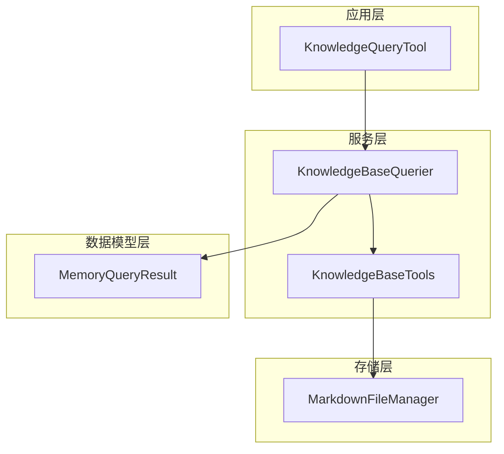
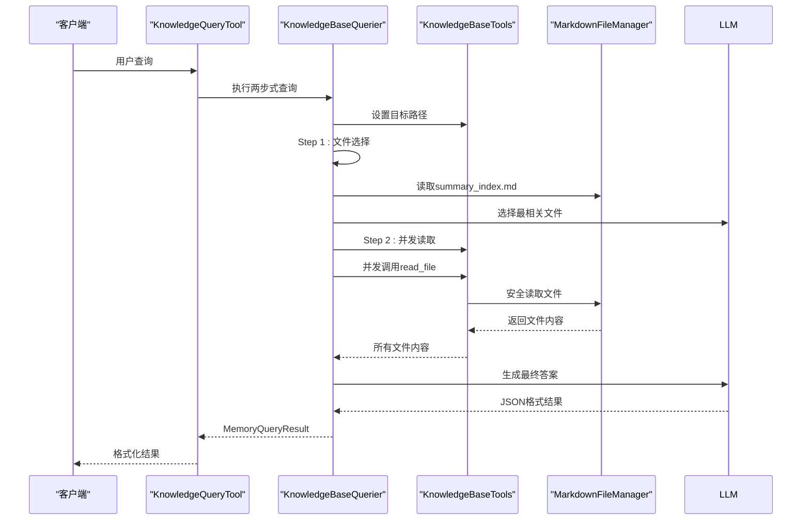
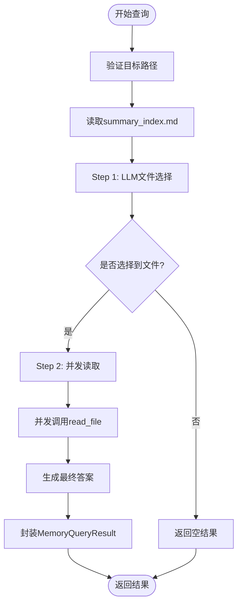
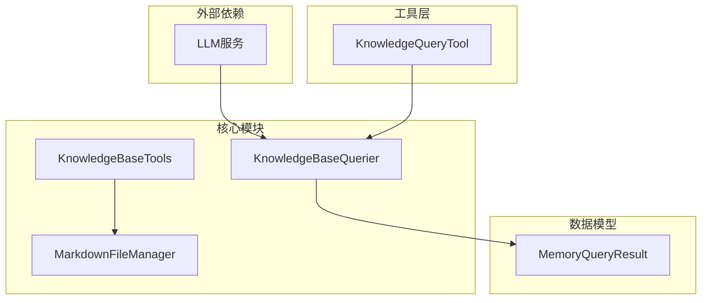

# 知识库查询工具

<cite>
**本文档引用的文件**
- [knowledge_base_querier.py](file://src/services/knowledge_base_querier.py)
- [knowledge_query_tool.py](file://src/tools/knowledge_query_tool.py)
- [markdown_file_manager.py](file://src/storage/markdown_file_manager.py)
- [memory_query_result.py](file://src/models/memory_query_result.py)
- [test_kb_tools.py](file://test_kb_tools.py)
</cite>

## 更新摘要
**变更内容**
- 知识库查询工具已简化为仅剩基础文件读取功能
- 移除了list_files、search_content、follow_links等复杂工具
- 移除了工具管理、探索报告和路径验证功能
- 采用两步式工作流替代ReAct多轮迭代
- 简化了安全机制设计，专注于路径验证和访问控制

## 目录
1. [简介](#简介)
2. [项目结构](#项目结构)
3. [核心组件](#核心组件)
4. [架构概览](#架构概览)
5. [详细组件分析](#详细组件分析)
6. [依赖关系分析](#依赖关系分析)
7. [性能考虑](#性能考虑)
8. [故障排除指南](#故障排除指南)
9. [结论](#结论)

## 简介

知识库查询工具集是一个基于两步式工作流构建的智能知识检索系统，专门用于处理结构化的Markdown文档知识库。该系统通过文件选择和并发读取相结合的方式，避免了长时间延迟与SSE超时问题，能够高效地处理用户查询并生成高质量的查询结果。

系统的核心价值在于：
- **两步式工作流**：先文件选择再并发读取，避免ReAct多轮迭代的延迟
- **安全防护**：内置路径验证和访问控制机制
- **高效查询**：通过LLM选择最相关文件，减少不必要的文件读取
- **结果整合**：将查询结果封装为统一的MemoryQueryResult格式

## 项目结构

知识库查询工具集位于项目的`src/services`和`src/storage`目录中，采用分层架构设计：

**图表来源**
- [knowledge_base_querier.py:105-137](file://src/services/knowledge_base_querier.py#L105-L137)
- [knowledge_query_tool.py:11-35](file://src/tools/knowledge_query_tool.py#L11-L35)

**章节来源**
- [knowledge_base_querier.py:1-518](file://src/services/knowledge_base_querier.py#L1-L518)
- [knowledge_query_tool.py:1-83](file://src/tools/knowledge_query_tool.py#L1-L83)

## 核心组件

### KnowledgeBaseTools 工具集

**更新** 知识库工具集已大幅简化，仅保留基础的安全文件读取功能：

- **read_file** - 安全文件内容读取
- **路径验证** - 目录遍历防护和访问控制
- **目标路径管理** - 当前工作目录设置和路径解析

### KnowledgeBaseQuerier 查询器

KnowledgeBaseQuerier实现了两步式工作流的智能查询流程，负责：
- **Step 1 文件选择**：基于summary_index.md和用户查询，由LLM选出最相关的文件路径列表
- **Step 2 并发读取**：并发读取所选文件，组装上下文后由LLM生成最终答案
- **安全控制**：内置路径验证和访问控制机制
- **结果封装**：将查询结果封装为MemoryQueryResult格式

### MarkdownFileManager 文件管理器

提供底层的文件操作能力：
- 文件创建、读取、更新
- 全文搜索功能
- Wiki链接解析和追踪
- 目录结构管理

**章节来源**
- [knowledge_base_querier.py:47-104](file://src/services/knowledge_base_querier.py#L47-L104)
- [knowledge_base_querier.py:105-518](file://src/services/knowledge_base_querier.py#L105-L518)

## 架构概览

系统采用两步式工作流架构，每步都有明确的目标和优化策略：

**图表来源**
- [knowledge_base_querier.py:141-224](file://src/services/knowledge_base_querier.py#L141-L224)
- [knowledge_query_tool.py:37-69](file://src/tools/knowledge_query_tool.py#L37-L69)

## 详细组件分析

### KnowledgeBaseTools 类设计

**更新** KnowledgeBaseTools类已简化为仅包含必要的安全文件读取功能：

#### read_file 工具

**功能特性**：
- 同步文件读取，避免事件循环冲突
- **路径安全验证**：防止目录遍历攻击
- **访问控制**：禁止访问特定路径片段（如/biography）
- **错误处理**：完善的异常捕获和错误反馈
- **路径解析**：支持相对路径和绝对路径

**参数配置**：
- `file_path`: 文件路径（相对于目标路径或绝对路径）

**返回值格式**：
- 成功：文件内容字符串
- 失败：错误信息字符串（如"该路径不在工作区域内"或"无法读取文件:..."）

#### 路径验证机制

**功能特性**：
- **目录遍历防护**：检测并阻止".."、"/../"、"\..\"等危险路径
- **禁止路径检查**：禁止访问包含"biography"的路径
- **路径规范化**：使用os.path.normpath进行路径标准化
- **安全边界**：确保文件操作仅在目标路径范围内

**章节来源**
- [knowledge_base_querier.py:78-103](file://src/services/knowledge_base_querier.py#L78-L103)
- [knowledge_base_querier.py:30-44](file://src/services/knowledge_base_querier.py#L30-L44)

### 安全机制设计

**更新** 安全机制已简化但更加聚焦：

#### 路径验证
- **目录遍历攻击防护**：严格检查相对路径中的危险字符
- **相对路径限制**：防止路径逃逸到目标路径之外
- **目标路径范围控制**：确保所有文件操作都在指定范围内

#### 访问控制
- **禁止路径片段**：完全禁止访问包含"biography"的路径
- **实时检查**：每次文件读取前进行访问权限验证
- **操作拦截**：发现违规访问时立即返回错误信息

#### 资源限制
- **文件数量限制**：单次查询最多选择8个文件
- **结果处理**：静默跳过无法读取的文件
- **内存控制**：按需读取文件内容，避免内存溢出

**章节来源**
- [knowledge_base_querier.py:26-44](file://src/services/knowledge_base_querier.py#L26-L44)
- [knowledge_base_querier.py:119-121](file://src/services/knowledge_base_querier.py#L119-L121)

### 两步式工作流优化策略

**更新** 系统已完全采用两步式工作流替代ReAct多轮迭代：

#### Step 1：文件选择
- **基于LLM的选择**：使用summary_index.md和用户查询让LLM选择最相关文件
- **数量限制**：最多选择8个文件，避免过度查询
- **路径过滤**：自动过滤禁止访问的路径

#### Step 2：并发读取 + 答案生成
- **并发执行**：使用asyncio.gather()并发读取所有选中文件
- **静默处理**：跳过无法读取的文件，不影响整体查询
- **上下文组装**：将所有文件内容组装后由LLM生成最终答案

**图表来源**
- [knowledge_base_querier.py:141-224](file://src/services/knowledge_base_querier.py#L141-L224)

**章节来源**
- [knowledge_base_querier.py:228-343](file://src/services/knowledge_base_querier.py#L228-L343)

## 依赖关系分析

系统采用清晰的依赖层次结构：

**图表来源**
- [knowledge_base_querier.py:19-21](file://src/services/knowledge_base_querier.py#L19-L21)
- [knowledge_query_tool.py:4-6](file://src/tools/knowledge_query_tool.py#L4-L6)

**章节来源**
- [knowledge_base_querier.py:1-518](file://src/services/knowledge_base_querier.py#L1-L518)
- [knowledge_query_tool.py:1-83](file://src/tools/knowledge_query_tool.py#L1-L83)

## 性能考虑

### 查询优化策略

**更新** 两步式工作流显著提升了查询性能：

1. **文件选择优化**：通过LLM预先筛选最相关文件，避免全库扫描
2. **并发处理**：Step 2阶段使用asyncio.gather()并发读取文件
3. **静默容错**：无法读取的文件不会影响整体查询结果
4. **资源控制**：限制最大文件数量和查询深度

### 内存管理

- **按需读取**：文件内容按需读取，避免一次性加载所有文件
- **结果集控制**：最多8个文件的结果集，控制内存使用
- **异常处理**：及时清理异常状态，避免内存泄漏
- **异步安全**：使用asyncio.to_thread确保线程安全

### 并发处理

- **异步文件操作**：使用asyncio.gather()实现真正的并发
- **事件循环安全**：通过asyncio.to_thread避免阻塞事件循环
- **并发工具调用**：工具内部状态不共享，避免竞态条件

## 故障排除指南

### 常见问题及解决方案

#### 路径访问错误
**症状**：read_file返回"该路径不在工作区域内"
**原因**：路径包含禁止访问的片段或超出目标路径范围
**解决**：检查路径是否包含"biography"或是否为相对路径逃逸

#### 查询超时
**症状**：查询长时间无响应
**原因**：LLM调用失败或文件读取异常
**解决**：检查网络连接、目标路径存在性和文件权限

#### 内存不足
**症状**：系统内存使用过高
**原因**：文件内容过大或并发读取过多
**解决**：减少MAX_FILES限制或优化文件内容

### 调试技巧

1. **启用详细日志**：查看查询过程和错误信息
2. **检查路径验证**：确认路径验证机制正常工作
3. **监控资源使用**：观察内存和CPU使用情况
4. **验证文件选择**：检查LLM选择的文件是否合理

**章节来源**
- [knowledge_base_querier.py:91-103](file://src/services/knowledge_base_querier.py#L91-L103)
- [knowledge_base_querier.py:238-242](file://src/services/knowledge_base_querier.py#L238-L242)

## 结论

知识库查询工具集经过重大简化后，形成了一个更加高效和安全的查询系统，具有以下特点：

**技术优势**：
- **两步式工作流**：显著提升查询速度和用户体验
- **简化安全机制**：聚焦核心安全防护，减少复杂性
- **高效的工具协作**：仅保留必要的文件读取功能
- **完善的错误处理**：静默容错和降级处理机制

**应用场景**：
- 个人记忆库管理
- 企业知识库检索
- 智能问答系统
- 文档分析和总结

**扩展潜力**：
- 支持更多文件格式
- 集成向量数据库
- 实现增量学习
- 多模态内容处理

该系统为构建复杂的知识管理系统提供了坚实的基础，其简洁而高效的架构使其易于维护和扩展，同时保持了强大的功能和安全性。