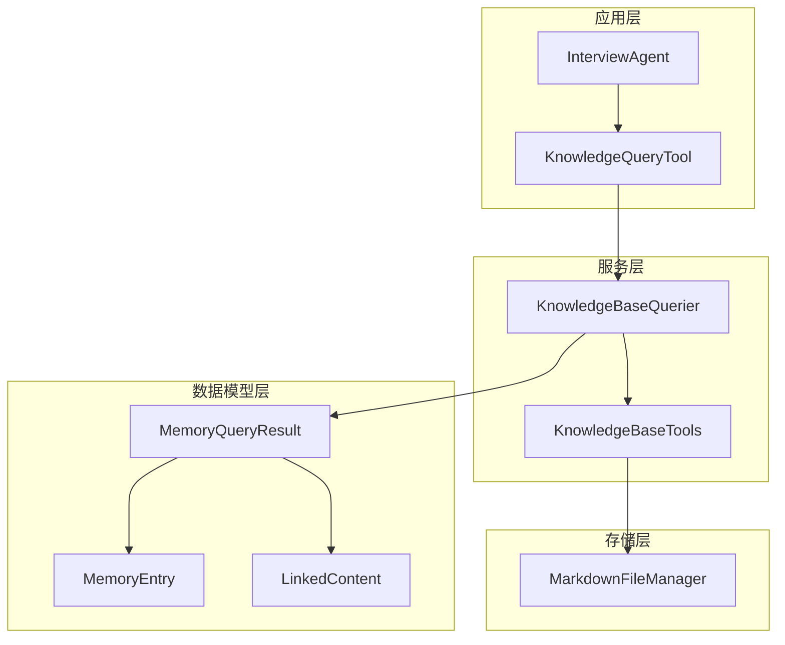
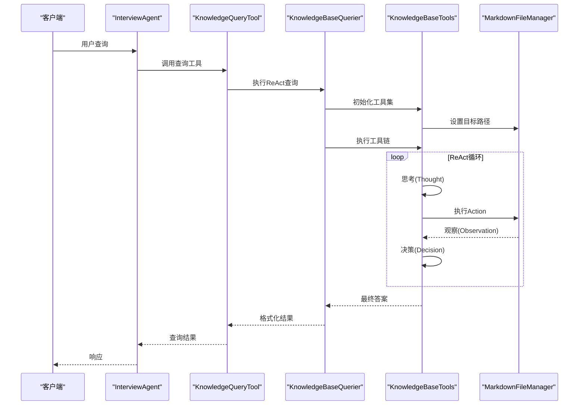
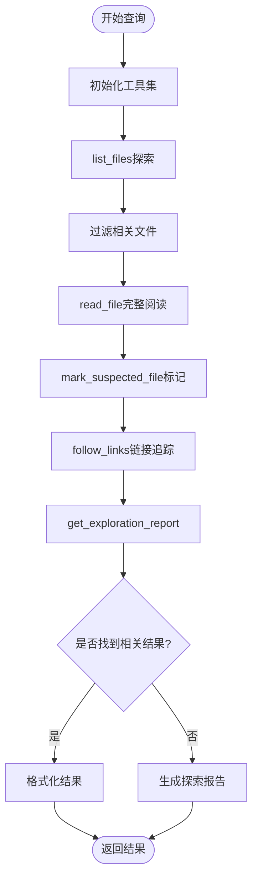
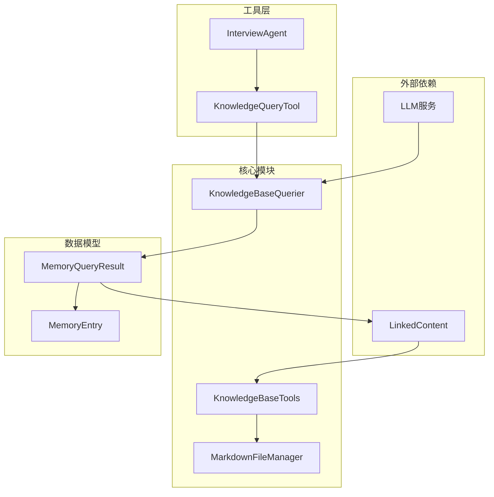

# 知识库查询工具

<cite>
**本文档引用的文件**
- [knowledge_base_querier.py](file://src/services/knowledge_base_querier.py)
- [markdown_file_manager.py](file://src/storage/markdown_file_manager.py)
- [knowledge_query_tool.py](file://src/tools/knowledge_query_tool.py)
- [memory_query_result.py](file://src/models/memory_query_result.py)
- [interview_agent.py](file://src/agents/interview_agent.py)
- [test_kb_tools.py](file://test_kb_tools.py)
</cite>

## 目录
1. [简介](#简介)
2. [项目结构](#项目结构)
3. [核心组件](#核心组件)
4. [架构概览](#架构概览)
5. [详细组件分析](#详细组件分析)
6. [依赖关系分析](#依赖关系分析)
7. [性能考虑](#性能考虑)
8. [故障排除指南](#故障排除指南)
9. [结论](#结论)

## 简介

知识库查询工具集是一个基于LangChain框架构建的智能知识检索系统，专门用于处理结构化的Markdown文档知识库。该系统通过ReAct（Reasoning and Acting）模式实现智能推理和行动，能够自动探索知识库、识别相关信息并生成高质量的查询结果。

系统的核心价值在于：
- **智能探索**：通过ReAct模式自动探索知识库结构
- **多模态检索**：支持全文搜索、链接追踪和路径探索
- **安全控制**：内置路径验证和访问控制机制
- **结果整合**：将多个工具的输出整合为统一的查询结果

## 项目结构

知识库查询工具集位于项目的`src/services`和`src/storage`目录中，采用分层架构设计：



**图表来源**
- [knowledge_base_querier.py:17-200](file://src/services/knowledge_base_querier.py#L17-L200)
- [knowledge_query_tool.py:11-31](file://src/tools/knowledge_query_tool.py#L11-L31)

**章节来源**
- [knowledge_base_querier.py:1-540](file://src/services/knowledge_base_querier.py#L1-L540)
- [markdown_file_manager.py:31-546](file://src/storage/markdown_file_manager.py#L31-L546)

## 核心组件

### KnowledgeBaseTools 工具集

KnowledgeBaseTools是系统的核心工具集合，提供了六个主要的工具函数：

1. **list_files** - 文件列表探索
2. **read_file** - 文件内容读取  
3. **search_content** - 全文内容搜索
4. **follow_links** - Wiki链接追踪
5. **mark_suspected_file** - 疑似文件标记
6. **get_exploration_report** - 探索状态报告

### KnowledgeBaseQuerier 查询器

KnowledgeBaseQuerier实现了ReAct模式的智能查询流程，负责：
- 理解用户查询意图
- 动态选择合适的工具
- 管理查询状态和上下文
- 整合多源查询结果

### MarkdownFileManager 文件管理器

提供底层的文件操作能力：
- 文件创建、读取、更新
- 全文搜索功能
- Wiki链接解析和追踪
- 目录结构管理

**章节来源**
- [knowledge_base_querier.py:17-200](file://src/services/knowledge_base_querier.py#L17-L200)
- [knowledge_base_querier.py:202-540](file://src/services/knowledge_base_querier.py#L202-L540)

## 架构概览

系统采用分层架构，每层都有明确的职责分离：



**图表来源**
- [knowledge_base_querier.py:257-373](file://src/services/knowledge_base_querier.py#L257-L373)
- [knowledge_query_tool.py:33-66](file://src/tools/knowledge_query_tool.py#L33-L66)

## 详细组件分析

### KnowledgeBaseTools 类设计

KnowledgeBaseTools类实现了完整的工具集，每个工具都经过精心设计以满足特定的查询需求：

#### list_files 工具

**功能特性**：
- 支持递归和非递归目录遍历
- 返回详细的文件元数据（名称、类型、修改时间）
- 自动排序：目录优先于文件
- 安全路径验证，防止目录遍历攻击

**参数配置**：
- `path`: 相对路径（相对于当前目标路径）
- `recursive`: 是否递归列出（默认True）

**返回值格式**：
```json
[
  {
    "path": "string",
    "name": "string", 
    "type": "directory|file",
    "modified": "datetime",
    "is_dir": true|false,
    "is_file": true|false
  }
]
```

#### read_file 工具

**功能特性**：
- 同步文件读取，避免事件循环冲突
- 支持绝对路径和相对路径
- 错误处理和异常捕获
- 直接返回文件内容

**参数配置**：
- `file_path`: 文件路径（相对于目标路径）

**返回值格式**：
- 文件内容字符串
- 或错误信息字符串

#### search_content 工具

**功能特性**：
- 全文搜索功能
- 支持关键词匹配
- 相关度评分和上下文提取
- 结果数量限制

**参数配置**：
- `keyword`: 搜索关键词
- `limit`: 最大结果数量（默认10）

**返回值格式**：
```json
[
  {
    "file_path": "string",
    "line_number": 1,
    "matched_text": "string",
    "context": "string",
    "relevance": 0.0-1.0
  }
]
```

#### follow_links 工具

**功能特性**：
- Wiki链接解析和追踪
- 支持多层深度链接
- 内容预览功能
- 链接有效性验证

**参数配置**：
- `file_path`: 源文件路径
- `depth`: 追踪深度（默认1）

**返回值格式**：
```json
[
  {
    "source": "string",
    "target": "string", 
    "display_name": "string",
    "anchor": "string",
    "content_preview": "string"
  }
]
```

#### mark_suspected_file 工具

**功能特性**：
- 标记疑似相关文件
- 去重处理
- 状态跟踪
- 操作反馈

**参数配置**：
- `file_path`: 文件路径

**返回值格式**：
- 标记成功信息
- 或失败信息

#### get_exploration_report 工具

**功能特性**：
- 汇总探索状态
- 访问路径统计
- 标记文件清单
- 探索完整性报告

**参数配置**：
- 无参数

**返回值格式**：
```json
{
  "visited_paths": ["string"],
  "suspected_files": ["string"],
  "total_visited": 1,
  "total_suspected": 1
}
```

### 安全机制设计

系统实现了多层次的安全防护机制：

#### 路径验证
- 目录遍历攻击防护
- 相对路径限制
- 目标路径范围控制

#### 访问控制
- 工具调用权限管理
- 路径访问限制
- 资源使用监控

#### 资源限制
- 最大迭代次数限制
- 结果数量限制
- 内存使用控制

**章节来源**
- [knowledge_base_querier.py:54-196](file://src/services/knowledge_base_querier.py#L54-L196)
- [knowledge_base_querier.py:34-52](file://src/services/knowledge_base_querier.py#L34-L52)

### 工具协作模式

系统采用ReAct模式实现智能工具协作：



**图表来源**
- [knowledge_base_querier.py:413-433](file://src/services/knowledge_base_querier.py#L413-L433)

### 调用顺序优化策略

系统实现了多种优化策略以提高查询效率：

1. **全面优先策略**：首次调用时使用递归探索获取完整目录结构
2. **完整阅读优先**：优先完整读取文档内容而非片段检索
3. **相关性优先**：优先处理与查询关键词相关的文件
4. **去重优化**：避免重复访问相同路径
5. **缓存机制**：利用工具内部状态减少重复计算

**章节来源**
- [knowledge_base_querier.py:420-433](file://src/services/knowledge_base_querier.py#L420-L433)

## 依赖关系分析

系统采用清晰的依赖层次结构：



**图表来源**
- [knowledge_base_querier.py:1-20](file://src/services/knowledge_base_querier.py#L1-L20)
- [knowledge_query_tool.py:1-8](file://src/tools/knowledge_query_tool.py#L1-L8)

**章节来源**
- [knowledge_base_querier.py:1-540](file://src/services/knowledge_base_querier.py#L1-L540)
- [markdown_file_manager.py:1-546](file://src/storage/markdown_file_manager.py#L1-L546)

## 性能考虑

### 查询优化策略

1. **批量操作**：首次探索时使用递归模式获取完整结构
2. **智能缓存**：利用工具内部状态避免重复访问
3. **结果排序**：按相关度和重要性排序返回结果
4. **资源控制**：限制最大结果数量和查询深度

### 内存管理

- 文件内容按需读取
- 结果集大小限制
- 临时状态及时清理
- 异常情况下的资源回收

### 并发处理

- 异步文件操作
- 事件循环安全的同步调用
- 并发工具调用的协调

## 故障排除指南

### 常见问题及解决方案

#### 路径访问错误
**症状**：工具调用返回空结果或错误信息
**原因**：路径不在目标范围内或文件不存在
**解决**：检查目标路径设置和文件存在性

#### 查询超时
**症状**：查询长时间无响应
**原因**：递归深度过大或文件数量过多
**解决**：调整递归深度和结果数量限制

#### 内存不足
**症状**：系统内存使用过高
**原因**：大量文件同时加载
**解决**：优化查询策略，限制结果数量

### 调试技巧

1. **启用详细日志**：查看工具调用的详细信息
2. **检查探索报告**：分析查询过程和状态
3. **验证路径安全**：确认路径验证机制正常工作
4. **监控资源使用**：观察内存和CPU使用情况

**章节来源**
- [knowledge_base_querier.py:91-93](file://src/services/knowledge_base_querier.py#L91-L93)
- [knowledge_base_querier.py:106-108](file://src/services/knowledge_base_querier.py#L106-L108)

## 结论

知识库查询工具集是一个设计精良的智能检索系统，具有以下特点：

**技术优势**：
- 基于ReAct模式的智能推理
- 多层次的安全防护机制
- 高效的工具协作策略
- 完善的错误处理和恢复机制

**应用场景**：
- 个人记忆库管理
- 企业知识库检索
- 智能问答系统
- 文档分析和总结

**扩展潜力**：
- 支持更多文件格式
- 集成向量数据库
- 实现增量学习
- 多模态内容处理

该系统为构建复杂的知识管理系统提供了坚实的基础，其模块化设计和清晰的架构使其易于维护和扩展。