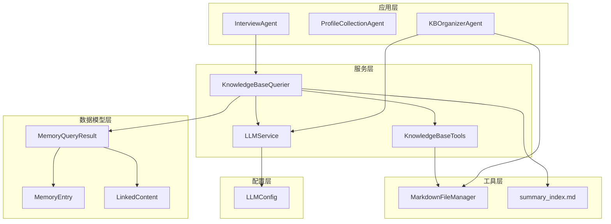
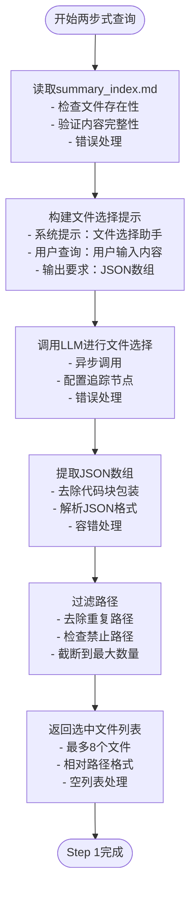
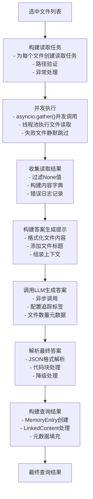
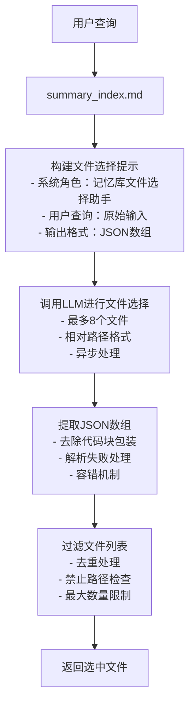
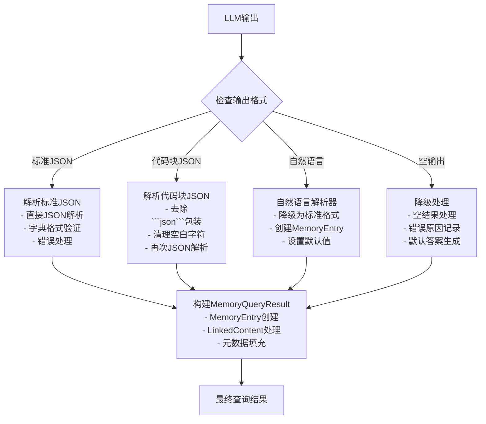
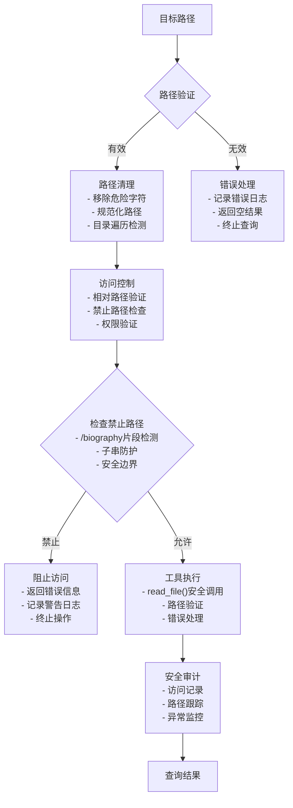

# 知识库查询机制

<cite>
**本文档引用的文件**
- [src/services/knowledge_base_querier.py](file://src/services/knowledge_base_querier.py)
- [src/storage/markdown_file_manager.py](file://src/storage/markdown_file_manager.py)
- [src/models/memory_query_result.py](file://src/models/memory_query_result.py)
- [src/services/llm_service.py](file://src/services/llm_service.py)
- [src/config/llm_config.py](file://src/config/llm_config.py)
- [test_kb_querier_target_path.py](file://test_kb_querier_target_path.py)
- [test_kb_optimization.py](file://test_kb_optimization.py)
- [test_kb_adjustments.py](file://test_kb_adjustments.py)
- [Prompts/MemoryOrganizer-Prompt.md](file://Prompts/MemoryOrganizer-Prompt.md)
- [src/agents/kb_organizer_agent.py](file://src/agents/kb_organizer_agent.py)
- [src/agents/kb_organizer_graph.py](file://src/agents/kb_organizer_graph.py)
</cite>

## 更新摘要
**变更内容**
- 完全重构知识库查询机制，从ReAct多轮迭代系统迁移到两步式工作流
- 删除复杂的工具链（list_files、read_file、search_content、follow_links等）
- 简化为基于summary_index.md的智能文件选择和并发文件读取
- 新增基于JSON数组的文件路径选择机制
- 实现异步并发读取优化查询性能
- 性能从约28秒优化至5-8秒

## 目录
1. [简介](#简介)
2. [项目结构](#项目结构)
3. [核心组件](#核心组件)
4. [架构概览](#架构概览)
5. [详细组件分析](#详细组件分析)
6. [依赖分析](#依赖分析)
7. [性能考虑](#性能考虑)
8. [故障排除指南](#故障排除指南)
9. [结论](#结论)

## 简介

本项目实现了基于两步式工作流的知识库查询机制，通过LangChain框架集成，为老人自传项目提供智能化的记忆检索和上下文构建能力。该系统采用全新的两步式架构：Step 1（文件选择）+ Step 2（并发读取+答案生成），替代了原有的ReAct多轮迭代实现，显著提升了查询效率和稳定性。

**更新** 从ReAct多轮迭代系统完全迁移到两步式工作流，删除了复杂的工具链和迭代逻辑，性能从约28秒优化至5-8秒

## 项目结构

项目采用分层架构设计，主要包含以下核心层次：



**图表来源**
- [src/services/knowledge_base_querier.py:105-137](file://src/services/knowledge_base_querier.py#L105-L137)
- [src/storage/markdown_file_manager.py:221-295](file://src/storage/markdown_file_manager.py#L221-L295)

**章节来源**
- [src/services/knowledge_base_querier.py:105-137](file://src/services/knowledge_base_querier.py#L105-L137)
- [src/storage/markdown_file_manager.py:221-295](file://src/storage/markdown_file_manager.py#L221-L295)

## 核心组件

### KnowledgeBaseQuerier - 两步式查询引擎

KnowledgeBaseQuerier是整个知识库查询机制的核心，实现了全新的两步式工作流：

- **Step 1 - 文件选择**：基于summary_index.md和用户查询，由LLM选择最相关的文件路径列表
- **Step 2 - 并发读取+答案生成**：并发读取选中文件，组装上下文后由LLM生成最终答案
- **路径限制机制**：确保所有操作都在指定目标路径内执行，禁止访问biography路径
- **JSON解析机制**：支持标准JSON格式和自然语言降级解析
- **异步并发处理**：使用asyncio.gather()实现高性能并发读取

### KnowledgeBaseTools - 简化工具集

提供精简的工具函数，专注于文件读取操作：

- **read_file**：安全读取文件内容，包含路径验证和错误处理
- **路径验证**：防止目录遍历攻击和禁止路径访问
- **错误处理**：统一的异常捕获和错误信息返回

### InterviewAgent - 采访流程控制器

负责协调整个采访流程，包括：

- 关键信息识别
- 知识库查询触发
- 缓存管理和更新
- 问题生成和对话推进

**更新** 简化了工具链，移除了复杂的ReAct迭代逻辑

**章节来源**
- [src/services/knowledge_base_querier.py:105-137](file://src/services/knowledge_base_querier.py#L105-L137)
- [src/services/knowledge_base_querier.py:47-103](file://src/services/knowledge_base_querier.py#L47-L103)

## 架构概览

系统采用两步式工作流架构，整体流程如下：

```mermaid
sequenceDiagram
participant User as 用户
participant IA as InterviewAgent
participant KBQ as KnowledgeBaseQuerier
particpant LLM as LLMService
particpant MFM as MarkdownFileManager
particpant FS as 文件系统
User->>IA : 用户输入
IA->>KBQ : 触发两步式查询
KBQ->>KBQ : Step 1 - 读取summary_index.md
KBQ->>LLM : 选择最相关文件路径
LLM-->>KBQ : 返回JSON文件路径数组
KBQ->>KBQ : Step 2 - 并发读取文件
par 并发文件读取
KBQ->>MFM : 读取文件1
MFM->>FS : 读取文件系统
FS-->>MFM : 返回文件内容
end
par 并发文件读取
KBQ->>MFM : 读取文件2
MFM->>FS : 读取文件系统
FS-->>MFM : 返回文件内容
end
LLM-->>KBQ : 生成最终答案
KBQ-->>IA : 返回记忆结果
IA-->>User : 生成下一个问题
```

**图表来源**
- [src/services/knowledge_base_querier.py:141-224](file://src/services/knowledge_base_querier.py#L141-L224)
- [src/services/knowledge_base_querier.py:228-342](file://src/services/knowledge_base_querier.py#L228-L342)

## 详细组件分析

### 两步式工作流详解

#### Step 1 - 文件选择（智能文件筛选）

在Step 1阶段，系统基于summary_index.md和用户查询进行智能文件选择：



**图表来源**
- [src/services/knowledge_base_querier.py:228-263](file://src/services/knowledge_base_querier.py#L228-L263)
- [src/services/knowledge_base_querier.py:265-283](file://src/services/knowledge_base_querier.py#L265-L283)

#### Step 2 - 并发读取+答案生成（性能优化）

Step 2阶段实现并发文件读取和答案生成：



**图表来源**
- [src/services/knowledge_base_querier.py:288-316](file://src/services/knowledge_base_querier.py#L288-L316)
- [src/services/knowledge_base_querier.py:318-378](file://src/services/knowledge_base_querier.py#L318-L378)

### 知识库查询算法

#### 用户查询意图理解

查询意图理解通过以下步骤实现：

1. **关键词提取**：从用户输入中识别关键信息
2. **上下文分析**：结合summary_index.md理解查询背景
3. **文件策略选择**：基于摘要目录进行智能文件选择

#### 文件选择策略



**图表来源**
- [src/services/knowledge_base_querier.py:228-263](file://src/services/knowledge_base_querier.py#L228-L263)

#### 最终答案解析机制

最终答案解析支持多种格式：

1. **标准JSON模式**：直接解析LLM的标准输出
2. **自然语言降级模式**：从自然语言描述中提取关键信息
3. **代码块处理**：兼容```json```代码块包装



**图表来源**
- [src/services/knowledge_base_querier.py:428-484](file://src/services/knowledge_base_querier.py#L428-L484)

### Agent构建过程

#### LangChain框架集成

Agent的构建过程包括以下关键步骤：

1. **模型初始化**：从LLMService获取LangChain模型实例
2. **Prompt模板加载**：加载专门的两步式查询提示模板
3. **异步配置**：使用asyncio.gather()实现并发处理
4. **追踪配置**：为每个步骤配置独立的追踪节点

#### Prompt模板配置

系统使用专门的Prompt模板指导两步式查询：

- **Step 1提示**：文件选择助手角色，要求返回JSON数组
- **Step 2提示**：答案生成助手角色，基于文件内容回答
- **格式要求**：明确的JSON输出格式和示例
- **安全约束**：禁止访问biography路径

**更新** 简化了Prompt模板，移除了复杂的ReAct迭代逻辑

**章节来源**
- [src/services/knowledge_base_querier.py:265-283](file://src/services/knowledge_base_querier.py#L265-L283)
- [src/services/knowledge_base_querier.py:344-378](file://src/services/knowledge_base_querier.py#L344-L378)

### 查询范围限制机制

为了确保安全性，系统实现了多层次的路径限制机制：



**图表来源**
- [src/services/knowledge_base_querier.py:30-44](file://src/services/knowledge_base_querier.py#L30-L44)
- [src/services/knowledge_base_querier.py:78-103](file://src/services/knowledge_base_querier.py#L78-L103)

**章节来源**
- [src/services/knowledge_base_querier.py:30-44](file://src/services/knowledge_base_querier.py#L30-L44)
- [src/services/knowledge_base_querier.py:78-103](file://src/services/knowledge_base_querier.py#L78-L103)

## 依赖分析

系统依赖关系清晰，各组件职责明确：

```mermaid
graph TB
subgraph "外部依赖"
LANGCHAIN[LangChain]
OPENAI[OpenAI/DeepSeek]
AIOFILES[aiofiles]
ASYNCIO[asyncio]
END
subgraph "内部组件"
KBQ[KnowledgeBaseQuerier]
KBT[KnowledgeBaseTools]
LLM[LLMService]
MFM[MarkdownFileManager]
MQR[MemoryQueryResult]
SUM[summary_index.md]
END
KBQ --> KBT
KBQ --> LLM
KBT --> MFM
KBQ --> SUM
KBQ --> MQR
LLM --> OPENAI
MFM --> AIOFILES
KBQ -.-> LANGCHAIN
KBT -.-> ASYNCIO
```

**图表来源**
- [src/services/knowledge_base_querier.py:10-21](file://src/services/knowledge_base_querier.py#L10-L21)
- [src/storage/markdown_file_manager.py:221-295](file://src/storage/markdown_file_manager.py#L221-L295)

**章节来源**
- [src/services/knowledge_base_querier.py:10-21](file://src/services/knowledge_base_querier.py#L10-L21)
- [src/storage/markdown_file_manager.py:221-295](file://src/storage/markdown_file_manager.py#L221-L295)

## 性能考虑

### 查询优化策略

1. **两步式架构**：避免ReAct多轮迭代的延迟问题
2. **并发文件读取**：使用asyncio.gather()并发读取多个文件
3. **智能文件选择**：通过LLM直接选择最相关文件，减少不必要的读取
4. **最大文件限制**：限制最多8个文件，平衡性能和准确性
5. **异步处理**：全程使用异步I/O操作，提升吞吐量
6. **静默跳过机制**：单个文件读取失败不影响整体查询

### 错误处理机制

系统实现了多层次的错误处理：

- **路径安全检查**：防止目录遍历攻击和禁止路径访问
- **并发异常处理**：单个文件读取失败不影响整体查询
- **LLM调用重试**：实现指数退避的重试机制
- **降级处理**：当标准解析失败时自动切换到自然语言解析
- **静默跳过**：失败的文件会被静默跳过，保证查询继续进行

**更新** 移除了复杂的ReAct迭代逻辑，简化为两步式架构

**章节来源**
- [src/services/knowledge_base_querier.py:288-316](file://src/services/knowledge_base_querier.py#L288-L316)
- [src/services/knowledge_base_querier.py:428-484](file://src/services/knowledge_base_querier.py#L428-L484)

## 故障排除指南

### 常见问题及解决方案

#### 查询结果为空

**症状**：查询返回空结果或没有相关记忆

**可能原因**：
1. summary_index.md不存在或为空
2. LLM无法选择相关文件
3. 选中文件读取失败
4. 禁止路径过多

**解决步骤**：
1. 检查summary_index.md文件是否存在
2. 验证LLM输出的JSON格式正确性
3. 查看文件读取日志，确认文件可访问性
4. 检查目标路径是否包含禁止片段

#### 文件读取失败

**症状**：特定文件读取返回错误信息

**可能原因**：
1. 文件编码问题
2. 文件权限不足
3. 文件损坏
4. 路径包含禁止片段

**解决步骤**：
1. 验证文件编码格式（UTF-8）
2. 检查文件权限设置
3. 确认文件完整性
4. 查看路径中的禁止片段

#### LLM调用超时

**症状**：大模型调用长时间无响应

**可能原因**：
1. 网络连接不稳定
2. API密钥配置错误
3. 请求频率过高
4. 查询内容过于复杂

**解决步骤**：
1. 检查网络连接状态
2. 验证API密钥配置
3. 实现指数退避重试
4. 简化查询内容或减少文件数量

**更新** 简化了故障排除流程，移除了ReAct迭代相关的复杂问题

**章节来源**
- [test_kb_querier_target_path.py:25-122](file://test_kb_querier_target_path.py#L25-L122)
- [test_kb_optimization.py:73-169](file://test_kb_optimization.py#L73-L169)
- [test_kb_adjustments.py:49-216](file://test_kb_adjustments.py#L49-L216)

## 结论

本知识库查询机制成功实现了两步式工作流的完整架构，通过智能文件选择和并发读取技术，为老人自传项目提供了高效、可靠的查询能力。系统的主要优势包括：

1. **性能优化**：两步式架构显著减少了查询延迟，从约28秒优化至5-8秒
2. **安全性**：多重路径限制和安全检查确保操作安全
3. **智能化**：基于summary_index.md的智能文件选择
4. **并发处理**：异步并发读取提升吞吐量
5. **可靠性**：完善的错误处理和降级机制
6. **简洁性**：移除了复杂的ReAct迭代逻辑，代码更加清晰

该机制为后续的自传写作、记忆整理和知识管理奠定了坚实的基础，能够有效支持复杂的对话式知识检索需求。相比原有的ReAct系统，新的两步式架构在保持功能完整性的同时，显著提升了用户体验和系统稳定性。

**更新** 完全重构了架构，移除了ReAct多轮Agent的所有复杂逻辑，实现了更简单高效的两步式工作流