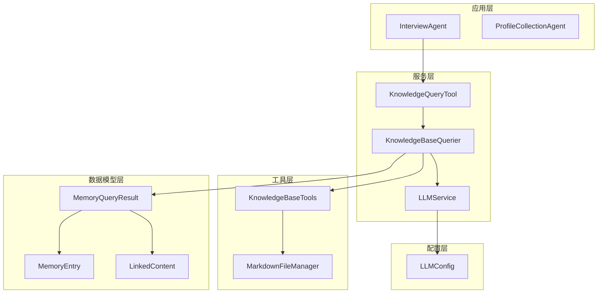
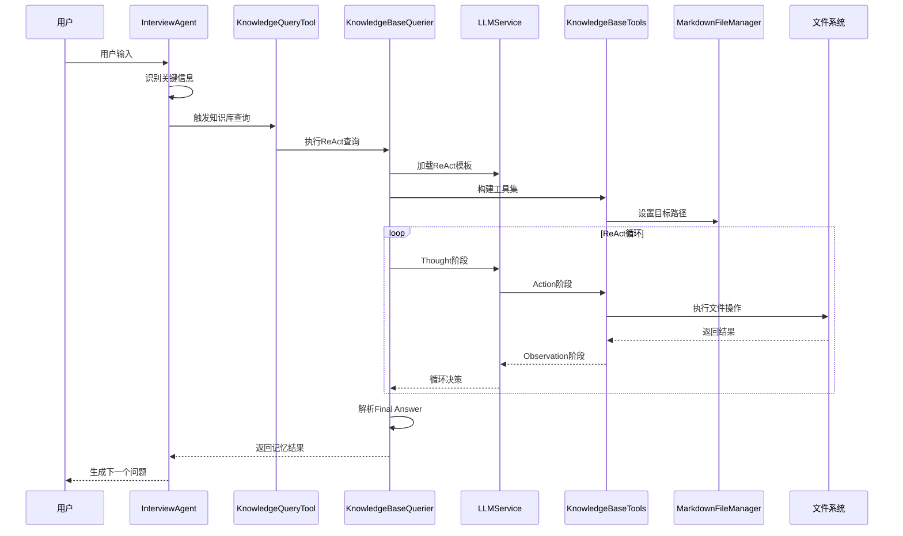
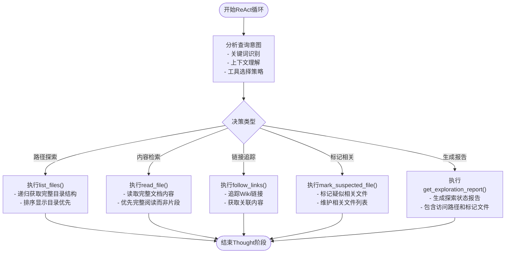
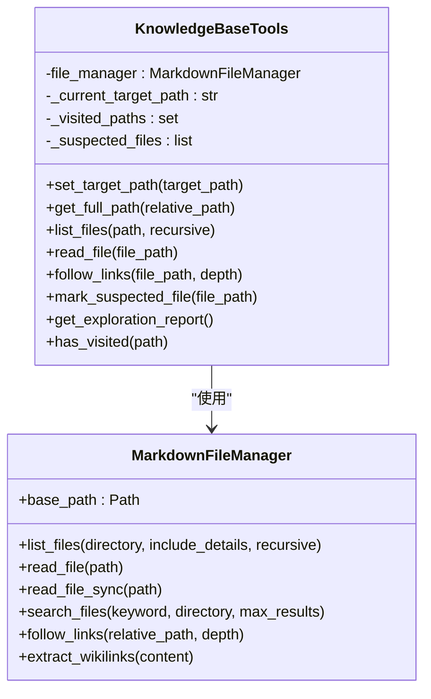
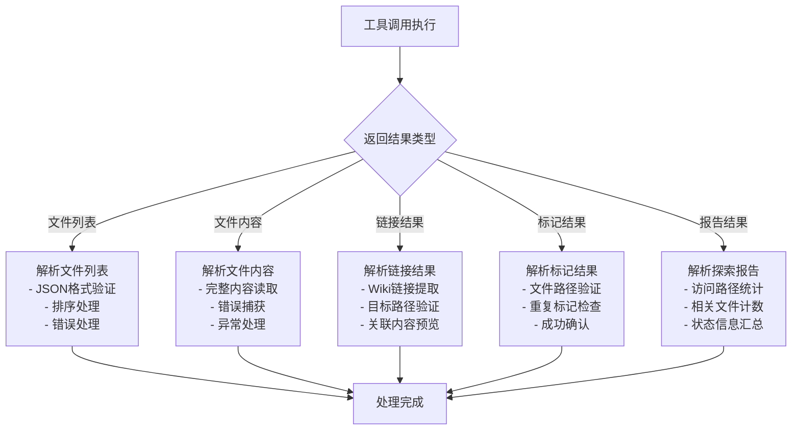
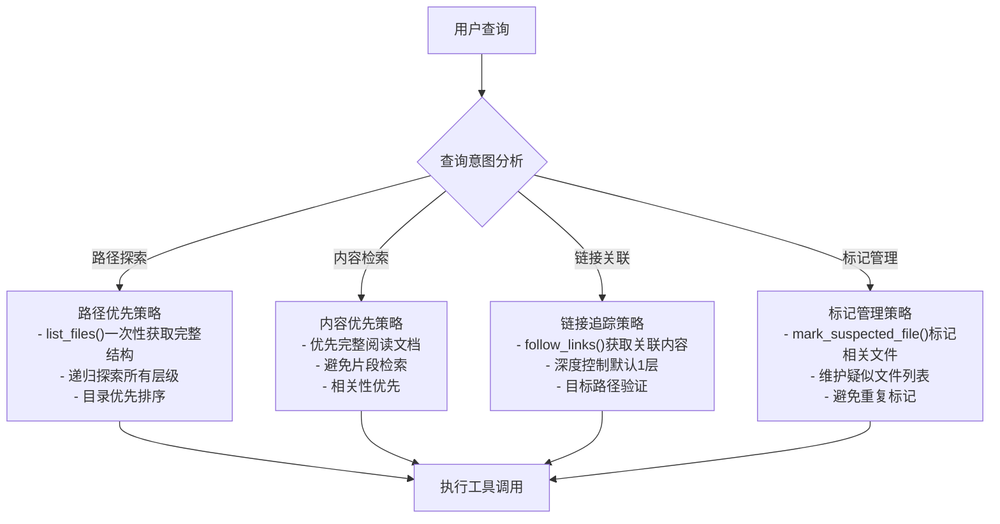
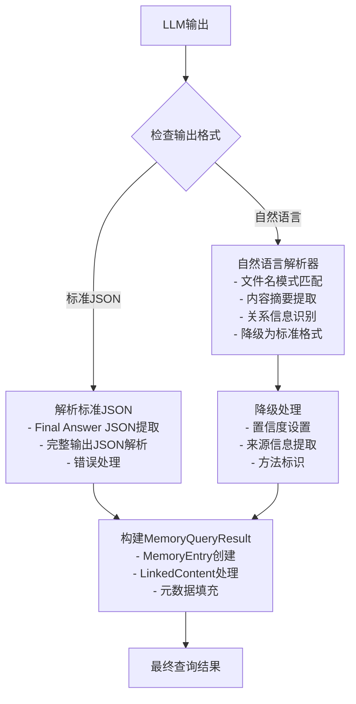
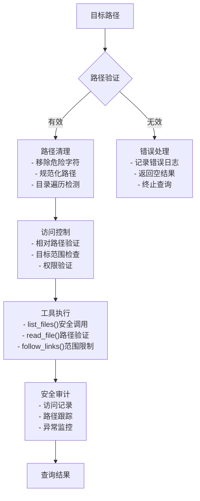
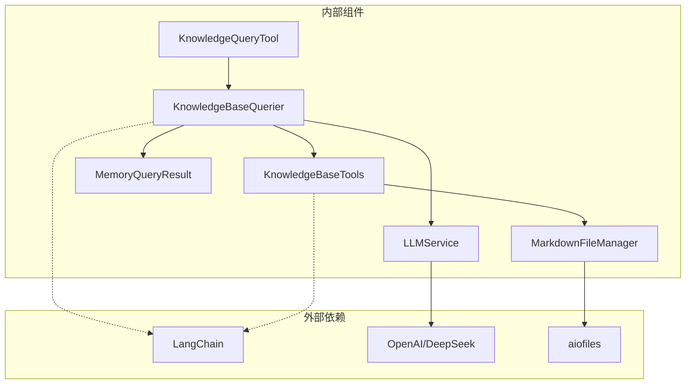

# 知识库查询机制

<cite>
**本文档引用的文件**
- [src/services/knowledge_base_querier.py](file://src/services/knowledge_base_querier.py)
- [src/tools/knowledge_query_tool.py](file://src/tools/knowledge_query_tool.py)
- [src/agents/interview_agent.py](file://src/agents/interview_agent.py)
- [src/storage/markdown_file_manager.py](file://src/storage/markdown_file_manager.py)
- [src/models/memory_query_result.py](file://src/models/memory_query_result.py)
- [src/services/llm_service.py](file://src/services/llm_service.py)
- [src/config/llm_config.py](file://src/config/llm_config.py)
- [test_kb_querier_target_path.py](file://test_kb_querier_target_path.py)
- [test_kb_optimization.py](file://test_kb_optimization.py)
- [test_kb_adjustments.py](file://test_kb_adjustments.py)
- [Prompts/MemoryOrganizer-Prompt.md](file://Prompts/MemoryOrganizer-Prompt.md)
</cite>

## 目录
1. [简介](#简介)
2. [项目结构](#项目结构)
3. [核心组件](#核心组件)
4. [架构概览](#架构概览)
5. [详细组件分析](#详细组件分析)
6. [依赖分析](#依赖分析)
7. [性能考虑](#性能考虑)
8. [故障排除指南](#故障排除指南)
9. [结论](#结论)

## 简介

本项目实现了基于ReAct（Reasoning and Acting）模式的知识库查询机制，通过LangChain框架集成，为老人自传项目提供智能化的记忆检索和上下文构建能力。该系统能够理解用户查询意图，动态选择合适的工具进行知识库探索，并返回结构化的记忆结果。

## 项目结构

项目采用分层架构设计，主要包含以下核心层次：

**图表来源**
- [src/agents/interview_agent.py:16-346](file://src/agents/interview_agent.py#L16-L346)
- [src/services/knowledge_base_querier.py:202-540](file://src/services/knowledge_base_querier.py#L202-L540)
- [src/tools/knowledge_query_tool.py:11-81](file://src/tools/knowledge_query_tool.py#L11-L81)

**章节来源**
- [src/agents/interview_agent.py:16-346](file://src/agents/interview_agent.py#L16-L346)
- [src/services/knowledge_base_querier.py:202-540](file://src/services/knowledge_base_querier.py#L202-L540)
- [src/tools/knowledge_query_tool.py:11-81](file://src/tools/knowledge_query_tool.py#L11-L81)

## 核心组件

### KnowledgeBaseQuerier - ReAct查询引擎

KnowledgeBaseQuerier是整个知识库查询机制的核心，实现了ReAct模式的完整流程：

- **ReAct循环实现**：Thought → Action → Observation → Final Answer
- **工具选择策略**：根据查询意图动态选择最适合的工具
- **路径限制机制**：确保所有操作都在指定目标路径内执行
- **结果解析**：支持标准JSON格式和自然语言降级解析

### KnowledgeBaseTools - 工具集

提供一组专门的工具函数，封装了知识库的各种操作：

- **list_files**：递归列出目录结构，支持排序和过滤
- **read_file**：读取文件完整内容
- **follow_links**：追踪Wiki链接，获取关联内容
- **mark_suspected_file**：标记疑似相关文件
- **探索报告**：生成路径探索状态报告

### InterviewAgent - 采访流程控制器

负责协调整个采访流程，包括：

- 关键信息识别
- 知识库查询触发
- 缓存管理和更新
- 问题生成和对话推进

**章节来源**
- [src/services/knowledge_base_querier.py:202-540](file://src/services/knowledge_base_querier.py#L202-L540)
- [src/tools/knowledge_query_tool.py:11-81](file://src/tools/knowledge_query_tool.py#L11-L81)
- [src/agents/interview_agent.py:16-346](file://src/agents/interview_agent.py#L16-L346)

## 架构概览

系统采用LangChain Agent框架实现ReAct模式，整体架构如下：

**图表来源**
- [src/services/knowledge_base_querier.py:257-373](file://src/services/knowledge_base_querier.py#L257-L373)
- [src/agents/interview_agent.py:115-184](file://src/agents/interview_agent.py#L115-L184)

## 详细组件分析

### ReAct模式实现详解

#### Thought阶段（推理阶段）

在Thought阶段，LLM会分析当前状态并决定下一步行动：

**图表来源**
- [src/services/knowledge_base_querier.py:435-511](file://src/services/knowledge_base_querier.py#L435-L511)

#### Action阶段（行动阶段）

Action阶段负责执行具体的工具调用，所有操作都受到严格的路径限制：

**图表来源**
- [src/services/knowledge_base_querier.py:17-200](file://src/services/knowledge_base_querier.py#L17-L200)
- [src/storage/markdown_file_manager.py:31-546](file://src/storage/markdown_file_manager.py#L31-L546)

#### Observation阶段（观察阶段）

Observation阶段接收工具调用结果并进行处理：

**图表来源**
- [src/services/knowledge_base_querier.py:54-196](file://src/services/knowledge_base_querier.py#L54-L196)

### 知识库查询算法

#### 用户查询意图理解

查询意图理解通过以下步骤实现：

1. **关键词提取**：从用户输入中识别关键信息
2. **上下文分析**：结合对话历史理解查询背景
3. **工具策略选择**：根据意图选择最优工具组合

#### 工具选择策略

**图表来源**
- [src/services/knowledge_base_querier.py:374-433](file://src/services/knowledge_base_querier.py#L374-L433)

#### 最终答案解析机制

最终答案解析支持两种模式：

1. **标准JSON模式**：直接解析LLM的标准输出
2. **自然语言降级模式**：从自然语言描述中提取关键信息

**图表来源**
- [src/services/knowledge_base_querier.py:435-540](file://src/services/knowledge_base_querier.py#L435-L540)

### Agent构建过程

#### LangChain框架集成

Agent的构建过程包括以下关键步骤：

1. **模型初始化**：从LLMService获取LangChain模型实例
2. **Prompt模板加载**：加载knowledge_base_react模板
3. **Agent创建**：使用create_agent函数构建ReAct Agent
4. **工具注册**：注册KnowledgeBaseTools的所有工具

#### Prompt模板配置

系统使用专门的Prompt模板指导Agent的行为：

- **系统提示**：定义Agent的角色和行为准则
- **工具描述**：详细说明可用工具的功能和使用方法
- **查询范围**：明确限定查询的目录范围
- **探索指南**：提供最佳实践的探索策略

**章节来源**
- [src/services/knowledge_base_querier.py:237-255](file://src/services/knowledge_base_querier.py#L237-L255)
- [src/services/llm_service.py:126-161](file://src/services/llm_service.py#L126-L161)

### 查询范围限制机制

为了确保安全性，系统实现了多层次的路径限制机制：

**图表来源**
- [src/services/knowledge_base_querier.py:30-52](file://src/services/knowledge_base_querier.py#L30-L52)
- [src/services/knowledge_base_querier.py:114-141](file://src/services/knowledge_base_querier.py#L114-L141)

**章节来源**
- [src/services/knowledge_base_querier.py:30-52](file://src/services/knowledge_base_querier.py#L30-L52)

## 依赖分析

系统依赖关系清晰，各组件职责明确：

**图表来源**
- [src/services/knowledge_base_querier.py:1-14](file://src/services/knowledge_base_querier.py#L1-L14)
- [src/tools/knowledge_query_tool.py:1-8](file://src/tools/knowledge_query_tool.py#L1-L8)

**章节来源**
- [src/services/knowledge_base_querier.py:1-14](file://src/services/knowledge_base_querier.py#L1-L14)
- [src/tools/knowledge_query_tool.py:1-8](file://src/tools/knowledge_query_tool.py#L1-L8)

## 性能考虑

### 查询优化策略

1. **一次性路径探索**：使用list_files()的递归选项一次性获取完整目录结构，避免多次往返调用
2. **智能文件访问**：优先完整阅读文档内容，减少碎片化检索
3. **相关性优先**：根据文件名和查询关键词的相关性进行排序
4. **缓存机制**：InterviewAgent使用MemoryCacheTool缓存查询结果

### 错误处理机制

系统实现了多层次的错误处理：

- **路径安全检查**：防止目录遍历攻击
- **工具调用异常**：捕获并记录工具执行错误
- **LLM调用重试**：实现指数退避的重试机制
- **降级处理**：当标准解析失败时自动切换到自然语言解析

**章节来源**
- [src/services/knowledge_base_querier.py:435-511](file://src/services/knowledge_base_querier.py#L435-L511)
- [src/services/llm_service.py:400-437](file://src/services/llm_service.py#L400-L437)

## 故障排除指南

### 常见问题及解决方案

#### 查询结果为空

**症状**：查询返回空结果或探索报告

**可能原因**：
1. 查询关键词与知识库内容不匹配
2. 目标路径设置错误
3. 文件权限问题

**解决步骤**：
1. 检查目标路径的有效性
2. 验证文件权限设置
3. 尝试更宽泛的查询关键词
4. 查看探索报告获取更多信息

#### 工具调用失败

**症状**：特定工具调用抛出异常

**可能原因**：
1. 文件不存在或路径错误
2. 文件编码问题
3. 磁盘空间不足

**解决步骤**：
1. 验证文件路径的正确性
2. 检查文件编码格式
3. 确认磁盘空间充足
4. 查看详细的错误日志

#### LLM调用超时

**症状**：大模型调用长时间无响应

**可能原因**：
1. 网络连接不稳定
2. API密钥配置错误
3. 请求频率过高

**解决步骤**：
1. 检查网络连接状态
2. 验证API密钥配置
3. 实现指数退避重试
4. 调整请求频率

**章节来源**
- [test_kb_querier_target_path.py:25-122](file://test_kb_querier_target_path.py#L25-L122)
- [test_kb_optimization.py:73-169](file://test_kb_optimization.py#L73-L169)
- [test_kb_adjustments.py:49-216](file://test_kb_adjustments.py#L49-L216)

## 结论

本知识库查询机制成功实现了ReAct模式的完整闭环，通过精心设计的工具集和严格的路径限制，为老人自传项目提供了可靠的知识检索能力。系统的主要优势包括：

1. **安全性**：多重路径限制和安全检查确保操作安全
2. **智能化**：基于ReAct模式的自主决策能力
3. **可扩展性**：模块化设计便于功能扩展
4. **可靠性**：完善的错误处理和降级机制

该机制为后续的自传写作、记忆整理和知识管理奠定了坚实的基础，能够有效支持复杂的对话式知识检索需求。