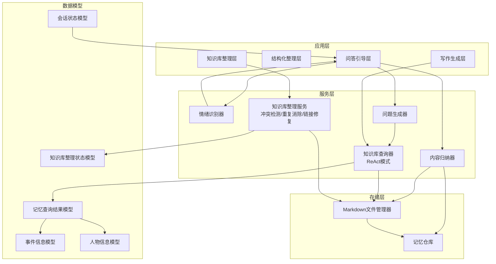
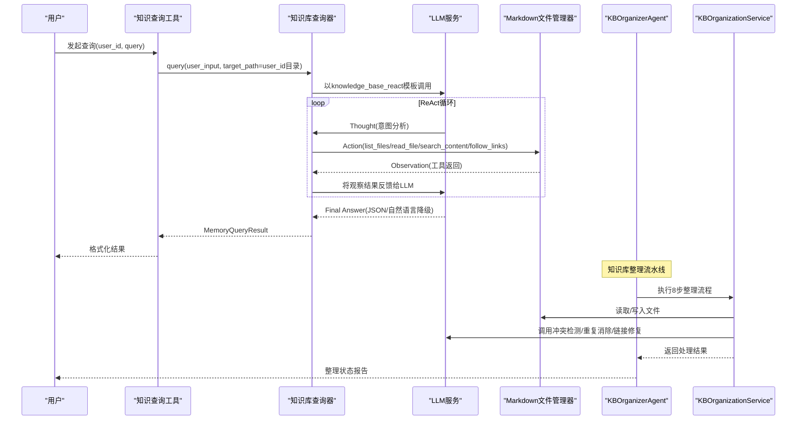
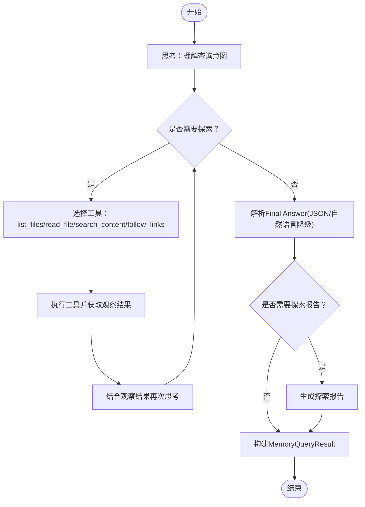
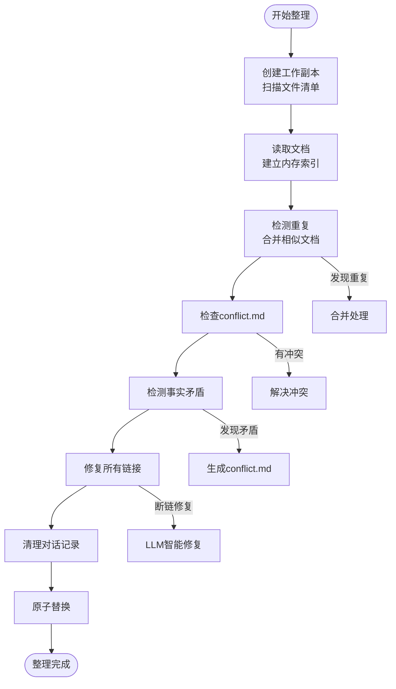
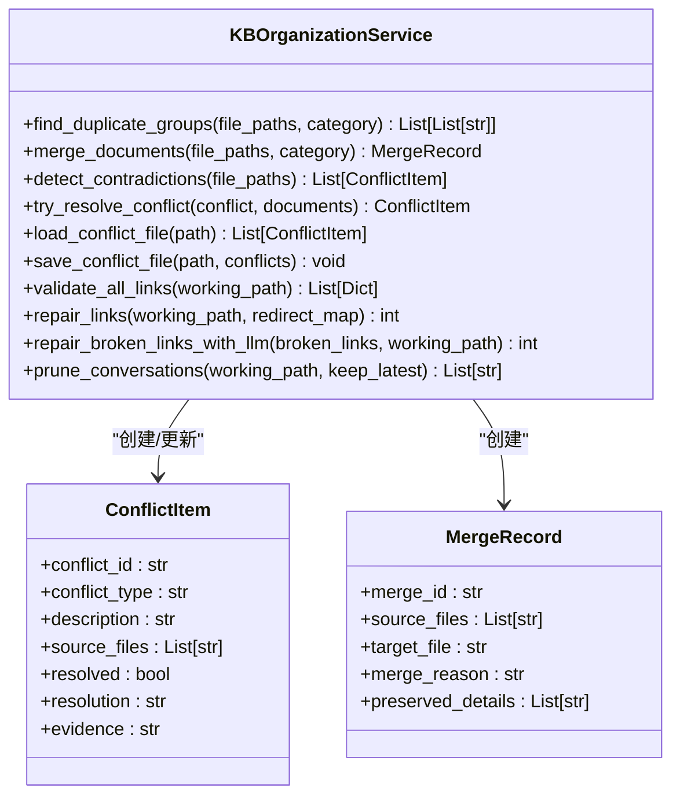
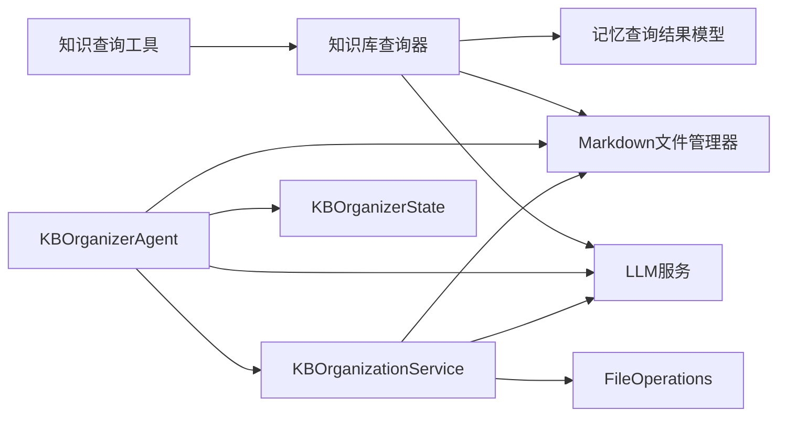

# 知识库系统

<cite>
**本文引用的文件**
- [知识库查询器](file://src/services/knowledge_base_querier.py)
- [知识查询工具](file://src/tools/knowledge_query_tool.py)
- [Markdown文件管理器](file://src/storage/markdown_file_manager.py)
- [LLM服务](file://src/services/llm_service.py)
- [记忆查询结果模型](file://src/models/memory_query_result.py)
- [事件信息模型](file://src/models/event_info.py)
- [人物信息模型](file://src/models/person_info.py)
- [会话状态模型](file://src/models/session_state.py)
- [知识库查询器Prompt](file://Prompts/KnowledgeBaseQuerier-Prompt.md)
- [系统架构设计文档](file://问答引导层Agent-系统架构设计.md)
- [项目说明文档](file://README.md)
- [知识库整理Agent](file://src/agents/kb_organizer_agent.py)
- [知识库整理服务](file://src/services/kb_organization_service.py)
- [知识库整理状态模型](file://src/models/kb_organizer_state.py)
- [知识库整理Runner](file://src/service/agent_runners/kb_organizer_runner.py)
- [知识库整理路由](file://src/service/routes/kb_organizer.py)
- [矛盾检测Prompt](file://src/prompts/KBConflictDetector-Prompt.md)
- [重复检测Prompt](file://src/prompts/KBDuplicateDetector-Prompt.md)
- [链接修复Prompt](file://src/prompts/KBLinkRepairer-Prompt.md)
</cite>

## 更新摘要
**所做更改**
- 新增知识库自动整理功能章节，详细介绍KBOrganizerAgent和kb_organization_service的实现
- 更新架构总览图，增加知识库整理流水线
- 新增知识库整理流程的详细分析和执行步骤
- 更新依赖关系图，体现新的整理组件
- 新增知识库维护和自动化整理的最佳实践

## 目录
1. [简介](#简介)
2. [项目结构](#项目结构)
3. [核心组件](#核心组件)
4. [架构总览](#架构总览)
5. [详细组件分析](#详细组件分析)
6. [依赖关系分析](#依赖关系分析)
7. [性能考虑](#性能考虑)
8. [故障排查指南](#故障排查指南)
9. [结论](#结论)
10. [附录](#附录)

## 简介
本文件面向知识库系统的技术文档，重点围绕以下目标展开：
- 深入解释KnowledgeBaseQuerier的ReAct模式实现，包括思考、行动和观察三个阶段的执行流程
- 详细说明知识库的文件系统结构，包括事件分类、人物管理和时间线组织的目录设计
- 阐述知识查询工具的实现机制，包括自然语言查询解析、语义匹配算法和结果排序策略
- 解释知识库的索引机制和搜索优化技术，包括全文检索、关键词匹配和相关性评分
- **新增**：详细介绍KBOrganizerAgent的自动化知识库整理功能，包括冲突检测、重复消除和链接修复
- 提供知识库的扩展和定制指南，包括新增分类、修改查询策略和优化存储结构的方法
- 包含知识库维护和数据迁移的最佳实践

## 项目结构
知识库系统采用分层架构，围绕"记忆库"这一核心数据资产，通过多层服务协同完成从对话到结构化记忆再到检索与生成的闭环。**新增**的知识库整理流水线为系统提供了自动化维护能力。

**图表来源**
- [系统架构设计文档](file://问答引导层Agent-系统架构设计.md)
- [项目说明文档](file://README.md)
- [知识库整理Agent](file://src/agents/kb_organizer_agent.py)
- [知识库整理服务](file://src/services/kb_organization_service.py)

**章节来源**
- [系统架构设计文档](file://问答引导层Agent-系统架构设计.md)
- [项目说明文档](file://README.md)

## 核心组件
- 知识库查询器（KnowledgeBaseQuerier）：基于ReAct模式的智能查询代理，结合工具链与LLM实现动态探索与判断
- 知识查询工具（KnowledgeQueryTool）：对外封装查询接口，负责用户ID到目标路径映射与结果格式化
- **新增**：知识库整理Agent（KBOrganizerAgent）：采用Plan-Execute模式的自动化整理流水线，执行8步固定流程
- **新增**：知识库整理服务（KBOrganizationService）：核心业务逻辑实现，提供冲突检测、重复消除、链接修复等能力
- **新增**：知识库整理状态模型（KBOrganizerState）：维护整理流程的完整运行上下文和状态信息
- Markdown文件管理器（MarkdownFileManager）：提供文件读写、全文检索、链接追踪与目录结构保证
- LLM服务（LLMService）：统一的大模型调用入口，负责Prompt模板加载与结构化输出
- 记忆查询结果模型（MemoryQueryResult）：标准化查询结果的数据结构
- 事件/人物信息模型：结构化事件与人物数据，便于写入与展示
- 会话状态模型（SessionState）：贯穿会话生命周期的状态载体

**章节来源**
- [知识库查询器](file://src/services/knowledge_base_querier.py)
- [知识查询工具](file://src/tools/knowledge_query_tool.py)
- [知识库整理Agent](file://src/agents/kb_organizer_agent.py)
- [知识库整理服务](file://src/services/kb_organization_service.py)
- [知识库整理状态模型](file://src/models/kb_organizer_state.py)
- [Markdown文件管理器](file://src/storage/markdown_file_manager.py)
- [LLM服务](file://src/services/llm_service.py)
- [记忆查询结果模型](file://src/models/memory_query_result.py)
- [事件信息模型](file://src/models/event_info.py)
- [人物信息模型](file://src/models/person_info.py)
- [会话状态模型](file://src/models/session_state.py)

## 架构总览
ReAct模式通过"思考-行动-观察-再思考"的循环，使LLM在知识库中自主决策查询策略。**新增**的知识库整理流水线采用Plan-Execute模式，通过8步固定流程实现自动化维护。系统以Prompt模板驱动Agent，借助工具链完成文件枚举、内容读取、全文搜索与链接追踪，并最终输出结构化结果。

**图表来源**
- [知识库查询器](file://src/services/knowledge_base_querier.py)
- [知识查询工具](file://src/tools/knowledge_query_tool.py)
- [LLM服务](file://src/services/llm_service.py)
- [知识库查询器Prompt](file://Prompts/KnowledgeBaseQuerier-Prompt.md)
- [知识库整理Agent](file://src/agents/kb_organizer_agent.py)
- [知识库整理服务](file://src/services/kb_organization_service.py)

**章节来源**
- [知识库查询器](file://src/services/knowledge_base_querier.py)
- [知识库查询器Prompt](file://Prompts/KnowledgeBaseQuerier-Prompt.md)
- [知识库整理Agent](file://src/agents/kb_organizer_agent.py)
- [知识库整理服务](file://src/services/kb_organization_service.py)

## 详细组件分析

### 知识库查询器（KnowledgeBaseQuerier）与ReAct模式
- ReAct执行流程
  - 思考（Thought）：理解用户输入，推断查询意图与策略
  - 行动（Action）：调用工具链（list_files、read_file、search_content、follow_links）
  - 观察（Observation）：接收工具返回结果，作为下一步决策依据
  - 判断（Final Answer）：输出结构化结果，包含相关记忆、链接上下文与搜索摘要
- 工具链与目标路径约束
  - 所有操作严格限定在target_path范围内，避免越权访问
  - 工具描述动态注入目标路径，指导LLM正确使用相对路径
- 最终答案解析与降级策略
  - 优先解析标准JSON格式的Final Answer
  - 若失败，尝试从自然语言描述中提取来源与内容，生成降级答案
- 探索报告
  - 当未找到直接结果时，生成包含已访问路径、疑似相关文件与标记清单的探索报告

**图表来源**
- [知识库查询器](file://src/services/knowledge_base_querier.py)
- [知识库查询器Prompt](file://Prompts/KnowledgeBaseQuerier-Prompt.md)

**章节来源**
- [知识库查询器](file://src/services/knowledge_base_querier.py)
- [知识库查询器Prompt](file://Prompts/KnowledgeBaseQuerier-Prompt.md)

### 知识查询工具（KnowledgeQueryTool）
- 职责
  - 将用户ID映射到知识库目标路径
  - 封装KnowledgeBaseQuerier调用，统一查询入口
  - 格式化查询结果，便于上层消费
- 关键点
  - 目标路径拼接：./knowledge_base/{user_id}
  - 结果格式化：支持字符串、MemoryQueryResult与字典的多形态输出

**章节来源**
- [知识查询工具](file://src/tools/knowledge_query_tool.py)

### 知识库整理Agent（KBOrganizerAgent）与自动化整理流水线
**新增**：KBOrganizerAgent采用Plan-Execute模式，通过8步固定流程实现知识库的自动化整理维护。

- 8步固定流程
  - 任务规划：创建工作副本并扫描文件清单
  - 文档读取：阅读所有文档并建立内存索引
  - 重复合并：检测并合并重复/相似文档
  - 冲突检查：检查并处理已有conflict.md
  - 矛盾检测：检测文档间的事实矛盾
  - 链接修复：校验并修复所有文档链接
  - 对话清理：清理对话记录，仅保留最新两份
  - 原子替换：备份原目录，工作副本取代
- 状态管理
  - 使用KBOrganizerState维护完整运行上下文
  - 支持任务重试机制，最大重试次数为2次
  - 实时跟踪任务进度和执行结果
- 错误处理
  - 链接修复失败时标记为FAILED并触发重试
  - 任务失败自动重置状态重新执行
  - 详细的日志记录和错误追踪

**图表来源**
- [知识库整理Agent](file://src/agents/kb_organizer_agent.py)
- [知识库整理状态模型](file://src/models/kb_organizer_state.py)

**章节来源**
- [知识库整理Agent](file://src/agents/kb_organizer_agent.py)
- [知识库整理状态模型](file://src/models/kb_organizer_state.py)

### 知识库整理服务（KBOrganizationService）与核心业务逻辑
**新增**：KBOrganizationService提供知识库整理的核心业务逻辑，包含冲突检测、重复消除、链接修复等关键功能。

- 重复检测与合并
  - 基于LLM的语义重复检测，识别高度相似文档
  - 智能文档合并，确保不丢失任何细节
  - 业务规则过滤，避免误合并相关但不同的文档
- 矛盾检测与修复
  - 扫描文档集合，识别事实性矛盾
  - 尝试在已有文档信息中自动解决矛盾
  - 生成标准格式的conflict.md文件
- 链接校验与修复
  - 全面校验工作目录下所有Markdown文件的Wiki链接
  - 支持基于重定向映射的批量修复
  - LLM智能修复断链，提高修复成功率
- 对话记录清理
  - 仅保留最新N份对话记录，删除历史冗余数据
  - 支持JSON和LOG格式的对话文件清理

**图表来源**
- [知识库整理服务](file://src/services/kb_organization_service.py)
- [知识库整理状态模型](file://src/models/kb_organizer_state.py)

**章节来源**
- [知识库整理服务](file://src/services/kb_organization_service.py)
- [知识库整理状态模型](file://src/models/kb_organizer_state.py)

### Markdown文件管理器（MarkdownFileManager）
- 文件操作
  - 创建、读取、更新、追加章节
  - 同步与异步读取，满足不同调用场景
- 全文检索
  - 遍历目录下所有.md文件，按关键词匹配
  - 计算相关度分数，包含精确匹配、出现次数与标题加分
  - 提供上下文窗口，便于展示匹配片段
- 链接追踪
  - 提取Wiki链接（[[path]]、[[path|display_name]]、[[path#anchor]]等）
  - 支持递归追踪，深度可配置
  - 解析链接为绝对路径，确保跨目录引用正确
- 目录结构与索引
  - 自动创建事件、人物、时间线、主题等目录
  - 自动生成index.md索引文件，便于导航

**章节来源**
- [Markdown文件管理器](file://src/storage/markdown_file_manager.py)

### LLM服务（LLMService）
- 统一模型接入
  - 支持OpenAI/Qwen/DeepSeek/Anthropic等提供商
  - LangChain ChatOpenAI封装，统一调用接口
- Prompt模板管理
  - 从Python模块与Markdown文件加载模板
  - 提供模板变量说明与渲染能力
- 结构化输出
  - 支持结构化调用，自动解析JSON并校验Schema
  - 提供重试机制与调用统计

**章节来源**
- [LLM服务](file://src/services/llm_service.py)

### 记忆查询结果模型（MemoryQueryResult）
- 结构
  - query：原始查询
  - entries：匹配的记忆条目（含来源、内容、相关度、类型与元数据）
  - linked_content：通过链接关联的内容
  - total_count/has_results：汇总统计
- 辅助方法
  - get_top_entries：按相关度排序取Top-N
  - get_events/get_people：按来源类型过滤
  - empty/from_entries：构造便捷方法

**章节来源**
- [记忆查询结果模型](file://src/models/memory_query_result.py)

### 事件与人物信息模型
- 事件信息（EventInfo）
  - 结构化事件：时间、地点、类型、描述、参与者、情感标签、来源对话轮次等
  - to_markdown：生成标准Markdown格式
- 人物信息（PersonInfo）
  - 结构化人物：关系、描述、影响、相关事件、名言等
  - to_markdown：生成标准Markdown格式

**章节来源**
- [事件信息模型](file://src/models/event_info.py)
- [人物信息模型](file://src/models/person_info.py)

### 会话状态模型（SessionState）
- 记录会话生命周期内的状态：当前阶段、策略、覆盖率、已采集事件/人物、当前话题、情绪状态、对话历史、用户偏好等
- 提供添加对话轮次、更新覆盖率、标记采集、待追问问题管理等方法

**章节来源**
- [会话状态模型](file://src/models/session_state.py)

## 依赖关系分析
- 知识库查询器依赖
  - LLM服务：获取模型与Prompt模板
  - Markdown文件管理器：提供文件系统操作与全文检索
  - 记忆查询结果模型：标准化输出
- **新增**：知识库整理Agent依赖
  - LLM服务：调用各种整理Prompt模板
  - KBOrganizationService：执行核心业务逻辑
  - Markdown文件管理器：文件读写操作
  - KBOrganizerState：状态管理
- **新增**：知识库整理服务依赖
  - LLM服务：结构化调用进行各种检测和修复
  - Markdown文件管理器：文件系统操作
  - FileOperations：文件系统底层操作
- 知识查询工具依赖
  - 知识库查询器：封装查询与格式化
- Markdown文件管理器依赖
  - 标准库与aiofiles：异步文件IO
  - 正则表达式：链接解析与匹配
- LLM服务依赖
  - LangChain与各提供商SDK：统一模型接口
  - Prompt模板：系统提示与变量渲染

**图表来源**
- [知识库查询器](file://src/services/knowledge_base_querier.py)
- [知识查询工具](file://src/tools/knowledge_query_tool.py)
- [知识库整理Agent](file://src/agents/kb_organizer_agent.py)
- [知识库整理服务](file://src/services/kb_organization_service.py)
- [知识库整理状态模型](file://src/models/kb_organizer_state.py)
- [Markdown文件管理器](file://src/storage/markdown_file_manager.py)
- [LLM服务](file://src/services/llm_service.py)
- [记忆查询结果模型](file://src/models/memory_query_result.py)

**章节来源**
- [知识库查询器](file://src/services/knowledge_base_querier.py)
- [知识查询工具](file://src/tools/knowledge_query_tool.py)
- [知识库整理Agent](file://src/agents/kb_organizer_agent.py)
- [知识库整理服务](file://src/services/kb_organization_service.py)
- [知识库整理状态模型](file://src/models/kb_organizer_state.py)
- [Markdown文件管理器](file://src/storage/markdown_file_manager.py)
- [LLM服务](file://src/services/llm_service.py)
- [记忆查询结果模型](file://src/models/memory_query_result.py)

## 性能考虑
- ReAct循环控制
  - 通过最大迭代次数限制，避免无限循环与资源耗尽
- 工具调用策略
  - 初始阶段优先list_files一次性获取全量目录结构，减少多次往返
  - 优先完整读取文档内容，降低片段检索带来的噪声
- **新增**：知识库整理性能优化
  - 批量处理：链接修复采用10个链接一批的批量处理策略
  - 智能重试：任务失败自动重试，最多2次
  - 内存管理：文档内容缓存，避免重复读取
  - 并发控制：合理设置LLM调用并发度，避免API限流
- 检索与排序
  - 全文检索采用关键词匹配与相关度评分，结合上下文窗口展示
  - 相关度计算包含精确匹配、出现次数与标题加分，兼顾召回与精度
- IO与并发
  - 异步读取与文件写入，提升高并发场景下的吞吐
  - 合理设置最大结果数与上下文长度，平衡准确性与性能

## 故障排查指南
- ReAct模式未返回标准JSON
  - 现象：最终答案解析失败
  - 处理：启用自然语言降级策略，从输出中提取来源与内容
- 工具调用异常
  - 现象：list_files/read_file/search_content/follow_links返回错误
  - 处理：检查目标路径合法性、文件存在性与权限；查看工具描述与相对路径使用
- 目标路径无效
  - 现象：查询返回空结果或错误日志
  - 处理：确认target_path存在且为目录；确保用户ID对应的知识库目录已创建
- LLM调用失败
  - 现象：模型调用抛出异常或返回空内容
  - 处理：检查API密钥、网络连通性与重试配置；查看调用统计与错误日志
- **新增**：知识库整理故障排查
  - 现象：链接修复失败
  - 处理：检查断链数量和类型，确认LLM可用性；查看日志中的具体错误信息
  - 现象：重复检测LLM调用失败
  - 处理：检查文档内容长度限制，适当调整Prompt模板
  - 现象：原子替换失败
  - 处理：检查备份目录权限，确认文件操作成功

**章节来源**
- [知识库查询器](file://src/services/knowledge_base_querier.py)
- [LLM服务](file://src/services/llm_service.py)
- [知识库整理Agent](file://src/agents/kb_organizer_agent.py)
- [知识库整理服务](file://src/services/kb_organization_service.py)

## 结论
本知识库系统通过ReAct模式将大模型的推理能力与文件系统工具链深度融合，实现了从自然语言到结构化记忆的高效检索与组织。**新增**的知识库整理流水线进一步增强了系统的自动化能力，通过8步固定流程实现冲突检测、重复消除、链接修复等维护任务。其模块化设计与清晰的依赖关系，既保证了查询的灵活性与准确性，也为后续扩展与优化提供了良好基础。

## 附录

### 知识库文件系统结构
- 用户级目录
  - knowledge_base/{user_id}/
    - index.md：用户索引
    - events/：事件记录，按人生阶段细分
      - childhood/、youth/、middle_age/、elderly/
    - people/：人物信息，按关系细分
      - family/、friends/、colleagues/、others/
    - timeline/：时间线
    - themes/：主题标签
    - logs/：日志文件（用于知识库整理）
- 系统级索引
  - knowledge_base/index.md：全局索引，包含事件、人物、时间线与主题导航

**章节来源**
- [项目说明文档](file://README.md)

### 知识库整理流程与扩展指南
**新增**：知识库整理流程详细说明

- 8步固定流程详解
  - 任务规划：创建工作副本，扫描events、people、timeline、themes目录
  - 文档读取：将所有文档内容读取到内存，建立快速访问索引
  - 重复合并：按类别检测重复文档，智能合并相似内容
  - 冲突检查：读取并处理现有的conflict.md文件
  - 矛盾检测：扫描所有文档，识别事实性矛盾并尝试自动解决
  - 链接修复：全面校验链接，修复断链并更新重定向映射
  - 对话清理：删除历史对话记录，仅保留最新两份
  - 原子替换：备份原目录，用工作副本替换
- 新增分类支持
  - 在Markdown文件管理器中扩展目录结构与索引生成逻辑
  - 在Prompt中更新工具描述与探索策略
- 修改整理策略
  - 调整任务执行顺序和条件判断
  - 优化重复检测阈值和矛盾识别规则
  - 增强链接修复的智能程度
- 优化存储结构
  - 增加索引文件与元数据字段，提升检索效率
  - 引入缓存机制，减少重复读取
  - 添加冲突检测的增量更新机制

**章节来源**
- [知识库整理Agent](file://src/agents/kb_organizer_agent.py)
- [知识库整理服务](file://src/services/kb_organization_service.py)
- [知识库整理状态模型](file://src/models/kb_organizer_state.py)
- [Markdown文件管理器](file://src/storage/markdown_file_manager.py)

### 维护与迁移最佳实践
**新增**：知识库维护和自动化整理最佳实践

- 自动化整理流程
  - 定期执行知识库整理，建议每周或每月一次
  - 监控整理结果，关注重复文档合并和链接修复情况
  - 建立整理报告机制，记录重要变更
- 数据迁移
  - 保持目录命名一致性，确保Wiki链接可解析
  - 迁移前后验证索引文件完整性与可达性
  - 使用知识库整理功能进行迁移后的数据清洗
- 索引维护
  - 定期重建索引，确保导航与搜索准确
  - 对新增分类及时更新索引与Prompt描述
  - 监控整理效果，持续优化整理策略
- 版本演进
  - 通过Prompt模板版本管理查询策略变更
  - 保留历史查询结果与探索报告，便于回溯与审计
  - 建立知识库整理的历史记录，支持回滚和审计
- **新增**：整理流程监控
  - 建立整理任务状态监控机制
  - 设置告警阈值，及时发现整理失败
  - 定期审查conflict.md文件，确保矛盾得到妥善处理

**章节来源**
- [知识库整理Agent](file://src/agents/kb_organizer_agent.py)
- [知识库整理服务](file://src/services/kb_organization_service.py)
- [知识库整理状态模型](file://src/models/kb_organizer_state.py)
- [Markdown文件管理器](file://src/storage/markdown_file_manager.py)
- [知识库整理路由](file://src/service/routes/kb_organizer.py)
- [知识库整理Runner](file://src/service/agent_runners/kb_organizer_runner.py)