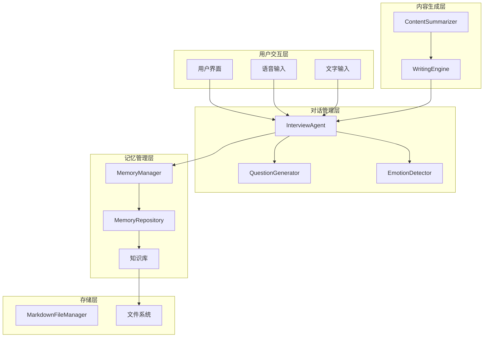
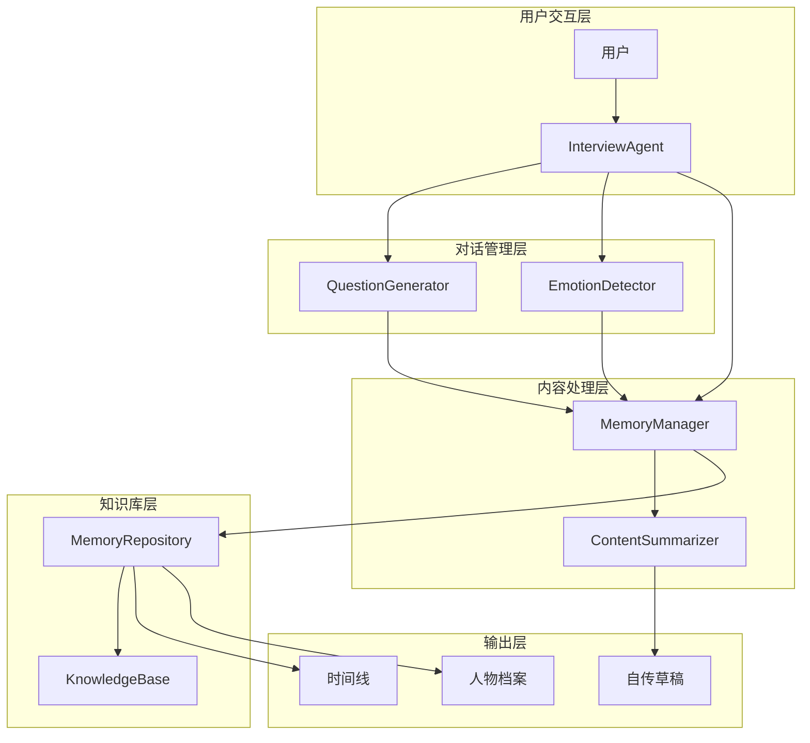
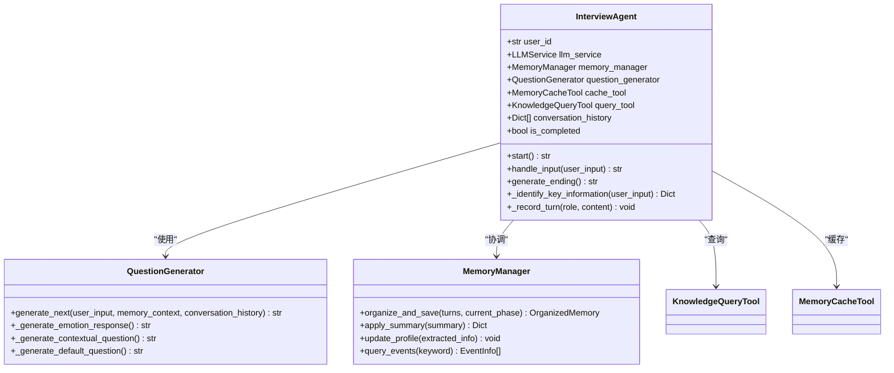
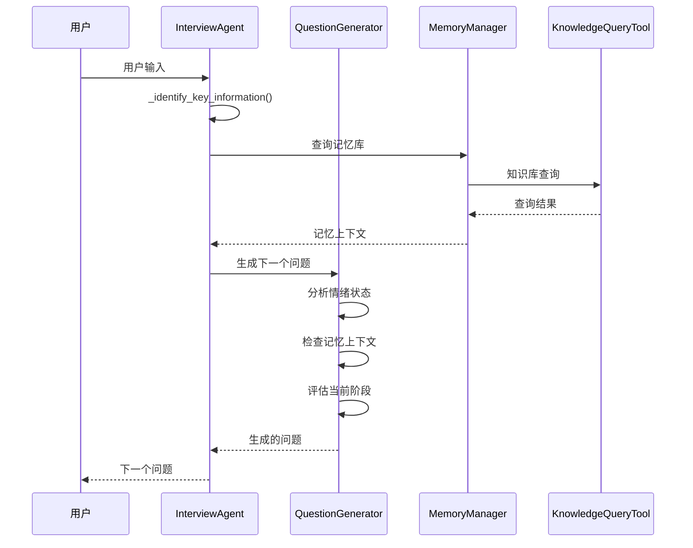
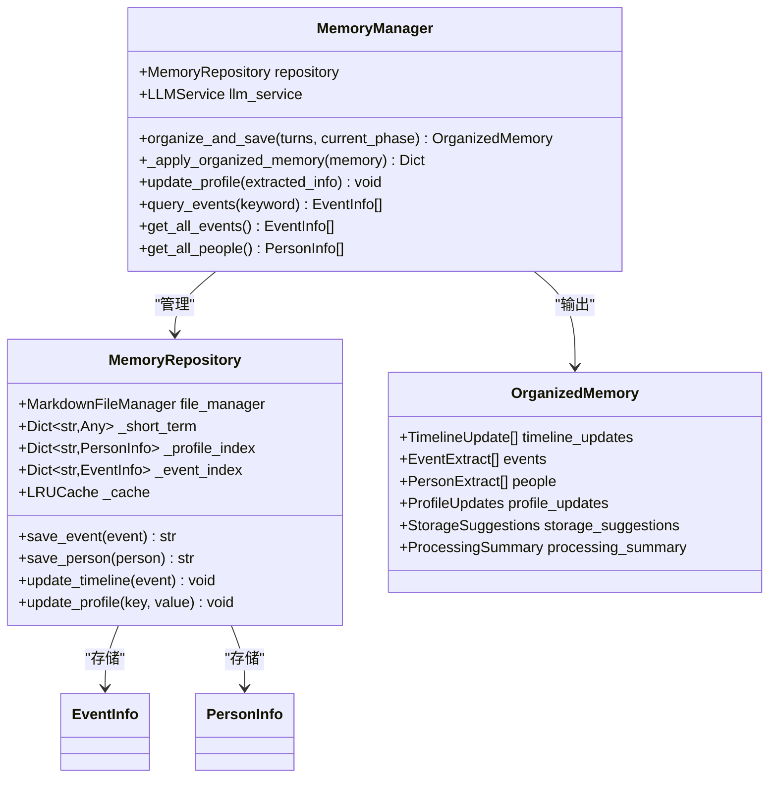
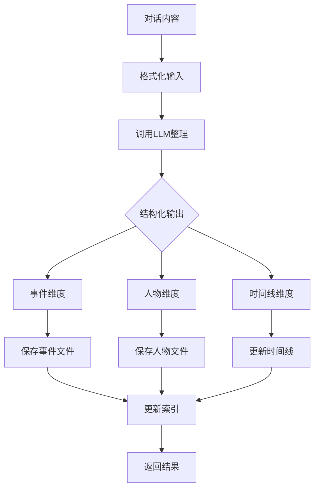
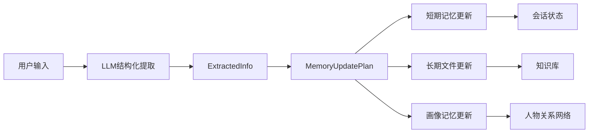
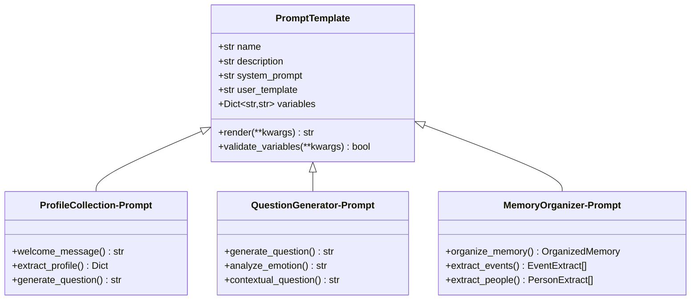
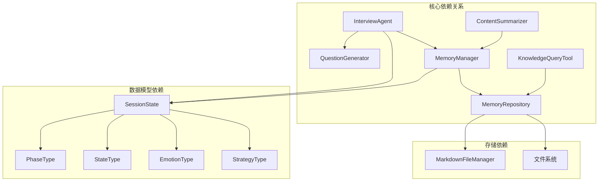
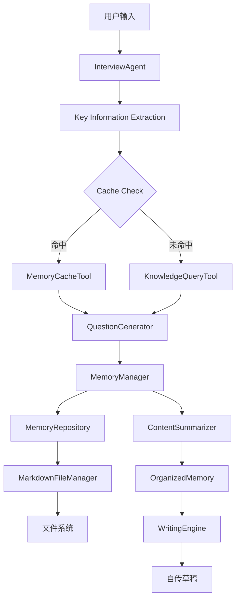

# 自传生成系统

<cite>
**本文档引用的文件**
- [README.md](file://README.md)
- [老人自传 Agent 协作架构.md](file://老人自传 Agent 协作架构.md)
- [老人自传写作指南.md](file://老人自传写作指南.md)
- [ProfileCollection-Prompt.md](file://Prompts/ProfileCollection-Prompt.md)
- [MemoryOrganizer-Prompt.md](file://Prompts/MemoryOrganizer-Prompt.md)
- [QuestionGenerator-Prompt.md](file://Prompts/QuestionGenerator-Prompt.md)
- [interview_agent.py](file://src/agents/interview_agent.py)
- [memory_manager.py](file://src/services/memory_manager.py)
- [session_state.py](file://src/models/session_state.py)
- [phase_type.py](file://src/enums/phase_type.py)
- [state_type.py](file://src/enums/state_type.py)
- [emotion_type.py](file://src/enums/emotion_type.py)
- [strategy_type.py](file://src/enums/strategy_type.py)
- [memory_repository.py](file://src/storage/memory_repository.py)
- [content_summarizer.py](file://src/services/content_summarizer.py)
- [knowledge_query_tool.py](file://src/tools/knowledge_query_tool.py)
- [base.py](file://src/prompts/base.py)
- [organized_memory.py](file://src/models/organized_memory.py)
</cite>

## 目录
1. [简介](#简介)
2. [项目结构](#项目结构)
3. [核心组件](#核心组件)
4. [架构概览](#架构概览)
5. [详细组件分析](#详细组件分析)
6. [依赖关系分析](#依赖关系分析)
7. [性能考量](#性能考量)
8. [故障排除指南](#故障排除指南)
9. [结论](#结论)
10. [附录](#附录)

## 简介
本系统是一个基于大语言模型的智能自传生成平台，通过多轮友好对话帮助老人记录和传承人生故事。系统采用分层架构设计，包含问答引导层、结构化整理层、时间线梳理层、多层记忆库和撰写层五大核心模块，实现从信息采集到自传生成的完整自动化流程。

系统的核心价值在于：
- **传承价值**：家族历史的载体，承载至少两代人的记忆
- **心理疗愈**："人生回顾法"是重要的老年心理治疗方法，提升自我效能感
- **自我实现**：重新赋予生命价值和意义，为过去的人事物赋予新解读
- **家庭和谐**：子女通过自传理解父母的生命历程，增加彼此对话

## 项目结构
系统采用模块化设计，主要分为以下层次：



**图表来源**
- [README.md:92-200](file://README.md#L92-L200)
- [老人自传 Agent 协作架构.md:9-101](file://老人自传 Agent 协作架构.md#L9-L101)

**章节来源**
- [README.md:92-200](file://README.md#L92-L200)
- [老人自传 Agent 协作架构.md:9-101](file://老人自传 Agent 协作架构.md#L9-L101)

## 核心组件
系统包含五大核心组件，每个组件都有明确的职责分工：

### 问答引导层 (InterviewAgent)
负责与用户进行多轮对话，通过智能问题生成引导用户回忆人生经历。该组件具备以下核心能力：
- 情绪识别与安抚
- 关键信息提取
- 知识库查询与缓存管理
- 个性化问题生成

### 结构化整理层 (MemoryManager)
将对话内容转换为结构化的知识条目，支持多维度存储：
- 事件维度：提取完整的事件记录
- 人物维度：识别并完善人物画像
- 时间线维度：建立或更新人生时间线

### 时间线梳理层
基于结构化信息生成创作大纲，确保内容的逻辑连贯性和完整性。

### 多层记忆库
采用三层记忆架构：
- **短期记忆**：内存缓存，支持快速访问
- **长期记忆**：文件系统存储，持久化知识
- **画像记忆**：结构化存储，维护人物关系网络

### 撰写层
基于记忆库生成自传章节草稿，确保内容的真实性和情感表达的平衡。

**章节来源**
- [interview_agent.py:16-346](file://src/agents/interview_agent.py#L16-L346)
- [memory_manager.py:27-470](file://src/services/memory_manager.py#L27-L470)
- [老人自传 Agent 协作架构.md:154-441](file://老人自传 Agent 协作架构.md#L154-L441)

## 架构概览
系统采用分层解耦的设计理念，各组件职责清晰，相互协作完成自传生成任务。



**图表来源**
- [老人自传 Agent 协作架构.md:107-148](file://老人自传 Agent 协作架构.md#L107-L148)
- [interview_agent.py:115-184](file://src/agents/interview_agent.py#L115-L184)

系统的核心特点是：
1. **分层解耦**：各Agent职责清晰，独立可扩展
2. **记忆驱动**：多层记忆库作为核心数据枢纽
3. **交叉印证**：多库联动确保信息准确性
4. **迭代优化**：支持用户反馈循环修订
5. **后台持续**：写作引擎可离线持续工作

**章节来源**
- [老人自传 Agent 协作架构.md:501-532](file://老人自传 Agent 协作架构.md#L501-L532)
- [README.md:27-53](file://README.md#L27-L53)

## 详细组件分析

### 问答引导层组件分析

#### InterviewAgent 类设计
InterviewAgent是系统的核心对话管理组件，负责整个采访流程的协调和控制。



**图表来源**
- [interview_agent.py:16-346](file://src/agents/interview_agent.py#L16-L346)
- [memory_manager.py:27-470](file://src/services/memory_manager.py#L27-L470)

#### 问题生成流程
系统采用智能问题生成策略，根据不同场景生成合适的引导问题：



**图表来源**
- [QuestionGenerator-Prompt.md:287-302](file://Prompts/QuestionGenerator-Prompt.md#L287-L302)
- [interview_agent.py:115-184](file://src/agents/interview_agent.py#L115-L184)

**章节来源**
- [interview_agent.py:16-346](file://src/agents/interview_agent.py#L16-L346)
- [QuestionGenerator-Prompt.md:10-352](file://Prompts/QuestionGenerator-Prompt.md#L10-L352)

### 记忆管理层组件分析

#### MemoryManager 类设计
MemoryManager是系统的核心数据处理组件，负责将非结构化的对话内容转换为结构化的知识条目。



**图表来源**
- [memory_manager.py:27-470](file://src/services/memory_manager.py#L27-L470)
- [memory_repository.py:40-359](file://src/storage/memory_repository.py#L40-L359)
- [organized_memory.py:141-151](file://src/models/organized_memory.py#L141-L151)

#### 记忆组织流程
系统采用三维度记忆组织策略，确保信息的完整性和可检索性：



**图表来源**
- [MemoryOrganizer-Prompt.md:87-183](file://Prompts/MemoryOrganizer-Prompt.md#L87-L183)
- [memory_manager.py:111-156](file://src/services/memory_manager.py#L111-L156)

**章节来源**
- [memory_manager.py:27-470](file://src/services/memory_manager.py#L27-L470)
- [MemoryOrganizer-Prompt.md:10-773](file://Prompts/MemoryOrganizer-Prompt.md#L10-L773)

### 写作生成层组件分析

#### 内容归纳服务
ContentSummarizer负责将对话内容归纳为结构化信息，指导后续的记忆库更新。



**图表来源**
- [content_summarizer.py:17-177](file://src/services/content_summarizer.py#L17-L177)

**章节来源**
- [content_summarizer.py:17-177](file://src/services/content_summarizer.py#L17-L177)

### Prompt 模板系统分析

#### Prompt 模板基类设计
系统采用统一的Prompt模板管理系统，支持动态变量渲染和参数验证。



**图表来源**
- [base.py:6-33](file://src/prompts/base.py#L6-L33)
- [ProfileCollection-Prompt.md:100-405](file://Prompts/ProfileCollection-Prompt.md#L100-L405)
- [QuestionGenerator-Prompt.md:10-352](file://Prompts/QuestionGenerator-Prompt.md#L10-L352)
- [MemoryOrganizer-Prompt.md:10-773](file://Prompts/MemoryOrganizer-Prompt.md#L10-L773)

**章节来源**
- [base.py:6-33](file://src/prompts/base.py#L6-L33)
- [ProfileCollection-Prompt.md:100-405](file://Prompts/ProfileCollection-Prompt.md#L100-L405)

## 依赖关系分析

### 组件耦合度分析
系统采用松耦合设计，各组件通过明确的接口进行交互：



**图表来源**
- [session_state.py:24-139](file://src/models/session_state.py#L24-L139)
- [phase_type.py:4-10](file://src/enums/phase_type.py#L4-L10)
- [state_type.py:4-12](file://src/enums/state_type.py#L4-L12)
- [emotion_type.py:4-50](file://src/enums/emotion_type.py#L4-L50)
- [strategy_type.py:4-8](file://src/enums/strategy_type.py#L4-L8)

### 数据流分析
系统采用流水线式的数据处理架构，确保数据在各组件间的顺畅流转：



**图表来源**
- [interview_agent.py:115-184](file://src/agents/interview_agent.py#L115-L184)
- [knowledge_query_tool.py:33-81](file://src/tools/knowledge_query_tool.py#L33-L81)
- [memory_manager.py:111-156](file://src/services/memory_manager.py#L111-L156)

**章节来源**
- [session_state.py:24-139](file://src/models/session_state.py#L24-L139)
- [knowledge_query_tool.py:33-81](file://src/tools/knowledge_query_tool.py#L33-L81)

## 性能考量
系统在设计时充分考虑了性能优化，采用多种策略确保高效运行：

### 缓存策略
- **LRU缓存**：MemoryRepository实现LRU缓存机制，限制缓存容量为100个条目
- **短期记忆**：会话级内存缓存，容量限制为20条记录
- **查询缓存**：基于关键词标签的缓存机制，避免重复查询

### 并行处理
- **异步操作**：大量I/O操作采用异步处理，提高并发性能
- **批量存储**：事件和人物信息采用批量保存策略，减少文件系统开销
- **并行任务**：使用asyncio.gather()并行执行多个存储任务

### 内存管理
- **容量限制**：短期记忆和缓存都有明确的容量限制
- **及时清理**：会话结束后自动清理短期记忆
- **垃圾回收**：定期清理无效的缓存条目

## 故障排除指南

### 常见问题诊断
系统提供了完善的错误处理和诊断机制：

#### LLM调用异常处理
```python
# LLM调用失败时的降级处理
try:
    result, raw = await self.llm_service.invoke_structured(...)
except Exception as e:
    logger.error(f"LLM调用失败: {e}")
    # 返回默认问题或降级策略
    return self._get_fallback_question(state)
```

#### 记忆库查询异常
```python
# 知识库查询异常处理
async def query(self, user_id: str, query: Any, max_iterations: int = 5):
    try:
        result = await self.querier.query(...)
        return self._format_result(result)
    except Exception as e:
        logger.error(f"知识库查询失败: {e}")
        return "查询失败，请稍后重试"
```

#### 文件存储异常
```python
# 文件存储异常处理
async def create_file(self, relative_path: str, content: str, overwrite: bool = True):
    try:
        # 文件创建逻辑
        pass
    except Exception as e:
        logger.error(f"文件创建失败: {e}")
        # 回滚操作
        await self._rollback_operation()
        raise
```

### 性能监控指标
系统建立了完善的监控体系，关键指标包括：

| 指标类别 | 监控指标 | 目标值 | 说明 |
|---------|---------|-------|------|
| 问答引导层 | 问题质量评分 | >4.5/5 | 基于用户反馈的评分 |
| 问答引导层 | 用户完成率 | >80% | 完成完整采访的用户比例 |
| 结构化处理层 | 信息抽取准确率 | >90% | 事件和人物识别准确率 |
| 时间线梳理层 | 时间线冲突率 | <5% | 事件时间冲突的比例 |
| 撰写层 | 事实校验通过率 | >95% | 生成内容的事实准确性 |
| 撰写层 | 用户满意度 | >4.5/5 | 基于用户反馈的评分 |

### 日志记录策略
系统采用分级日志记录机制：
- **DEBUG级别**：详细的调试信息，用于开发和测试
- **INFO级别**：常规操作日志，记录系统正常运行状态
- **WARNING级别**：潜在问题警告，需要关注但不影响系统运行
- **ERROR级别**：严重错误，影响系统功能

**章节来源**
- [老人自传 Agent 协作架构.md:569-580](file://老人自传 Agent 协作架构.md#L569-L580)
- [interview_agent.py:223-242](file://src/agents/interview_agent.py#L223-L242)
- [knowledge_query_tool.py:68-81](file://src/tools/knowledge_query_tool.py#L68-L81)

## 结论
自传生成系统通过智能化的对话管理和结构化知识处理，实现了从信息采集到自传生成的完整自动化流程。系统的核心优势包括：

1. **智能化对话管理**：通过多层记忆库和智能问题生成，确保信息收集的完整性和准确性
2. **结构化知识处理**：采用三维度记忆组织策略，提高信息的可检索性和可用性
3. **个性化定制能力**：支持不同采访策略和语言风格调整，适应不同用户需求
4. **质量控制机制**：建立多层次的质量检查体系，确保生成内容的真实性和完整性
5. **用户体验优化**：注重情感陪伴和心理关怀，提供温暖友好的交互体验

系统的设计充分体现了现代AI应用的最佳实践，为老年人自传创作提供了强有力的技术支撑。

## 附录

### 最佳实践指南

#### 内容组织最佳实践
- **时间线优先**：建议采用时间线经典策略，按时间顺序收集信息
- **深度挖掘**：对重要事件进行深度追问，获取更多细节信息
- **情感表达**：鼓励用户表达当时的情感和感受
- **交叉验证**：通过不同渠道验证重要信息的真实性

#### 叙事技巧建议
- **故事化表达**：将抽象的经历转化为具体的故事
- **细节描写**：增加具体的场景、对话和感受描述
- **情感注入**：体现当时的情绪和现在的反思
- **时代背景**：结合历史事件和个人经历

#### 读者体验优化
- **渐进式访谈**：每次只问1-2个问题，避免信息过载
- **及时反馈**：定期总结已记录内容，让老人看到进展
- **灵活跳转**：允许老人随时切换话题，不强制按顺序
- **语音优先**：支持语音输入，降低使用门槛

### 迭代改进机制
系统建立了完善的迭代改进流程：
1. **用户反馈收集**：通过问卷调查和深度访谈收集用户意见
2. **数据分析**：分析使用数据和质量指标，识别改进机会
3. **功能优化**：根据反馈和数据分析结果优化系统功能
4. **A/B测试**：对新功能进行对比测试，确保改进效果
5. **持续部署**：采用持续集成和部署，快速发布改进版本

### 个性化定制功能
系统支持多种个性化定制选项：
- **作者背景适配**：根据用户的教育背景、职业经历调整对话策略
- **语言风格调整**：支持不同的语言风格，从正式到口语化
- **文化背景考虑**：考虑不同地区的文化差异和表达习惯
- **情感状态适配**：根据用户的情绪状态调整对话节奏和内容

**章节来源**
- [老人自传写作指南.md:118-253](file://老人自传写作指南.md#L118-L253)
- [老人自传 Agent 协作架构.md:583-644](file://老人自传 Agent 协作架构.md#L583-L644)