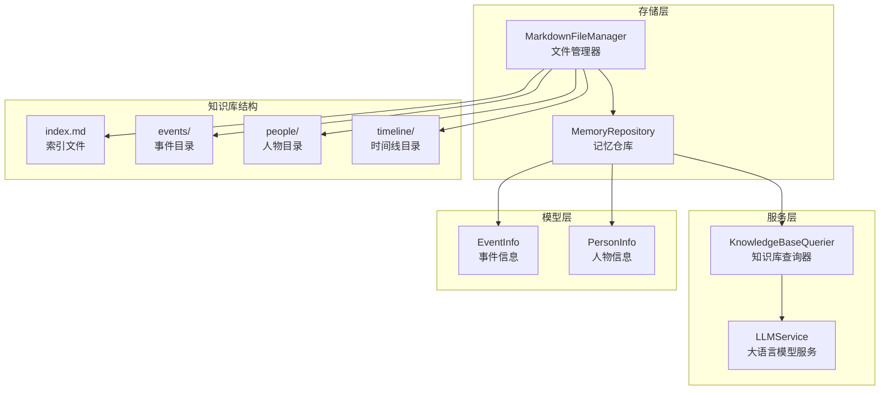
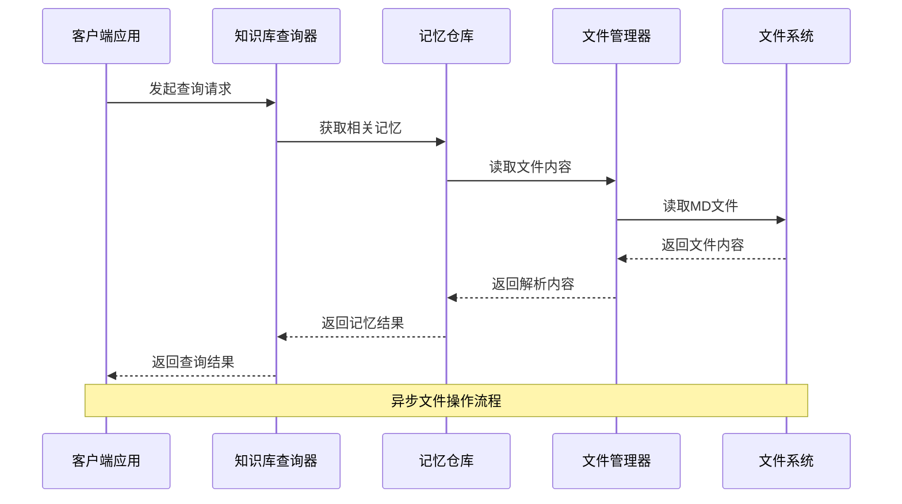
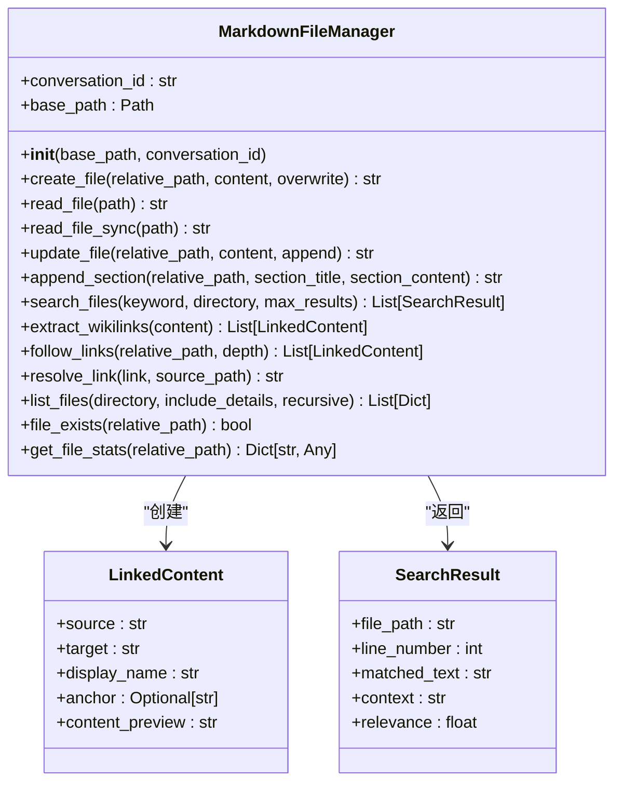
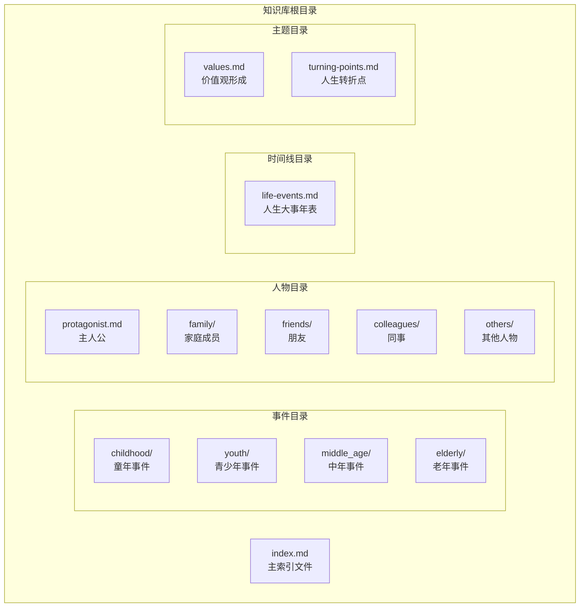
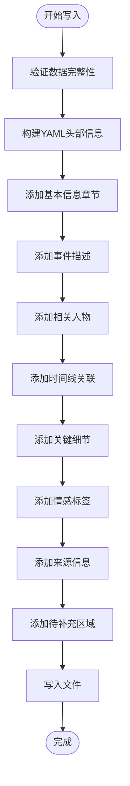
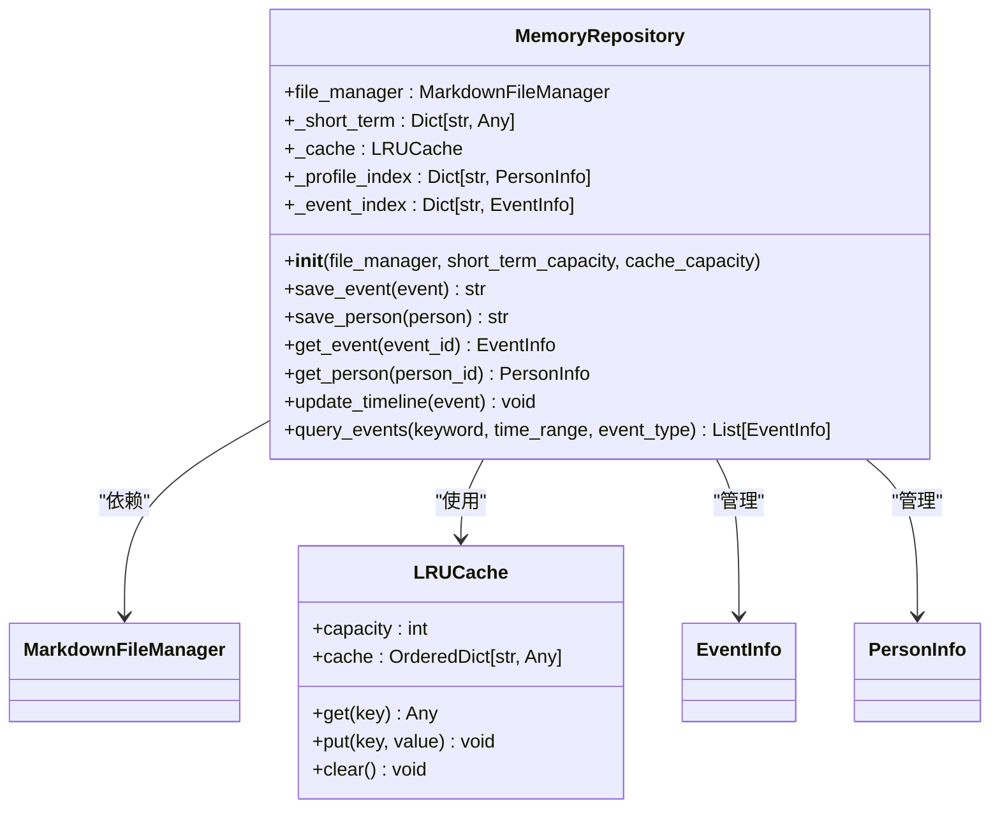
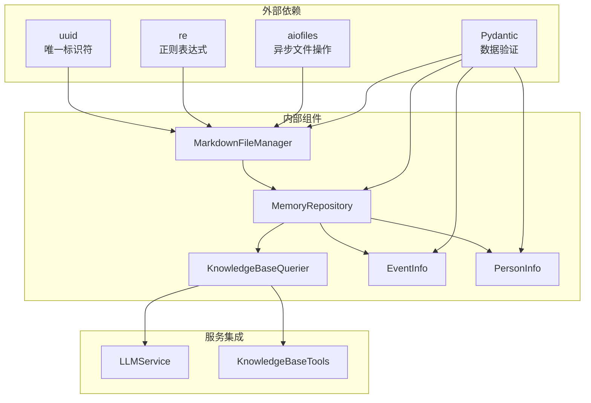
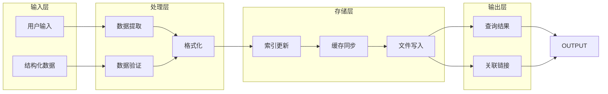
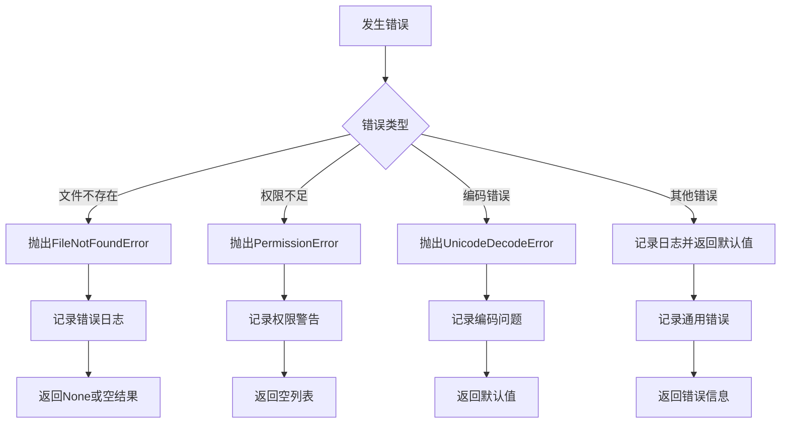

# Markdown文件管理器

<cite>
**本文引用的文件**
- [markdown_file_manager.py](file://src/storage/markdown_file_manager.py)
- [memory_repository.py](file://src/storage/memory_repository.py)
- [knowledge_base_querier.py](file://src/services/knowledge_base_querier.py)
- [event_info.py](file://src/models/event_info.py)
- [person_info.py](file://src/models/person_info.py)
- [test_markdown_file_manager.py](file://tests/test_markdown_file_manager.py)
- [demo_memory_storage.py](file://demo_memory_storage.py)
- [README.md](file://README.md)
- [index.md](file://knowledge_base/index.md)
- [保护妹妹与邻居家胖墩打架.md](file://knowledge_base/test_user001/events/childhood/保护妹妹与邻居家胖墩打架.md)
- [母亲.md](file://knowledge_base/test_user001/people/family/母亲.md)
- [life-events.md](file://knowledge_base/test_user001/timeline/life-events.md)
</cite>

## 目录
1. [简介](#简介)
2. [项目结构](#项目结构)
3. [核心组件](#核心组件)
4. [架构概览](#架构概览)
5. [详细组件分析](#详细组件分析)
6. [依赖关系分析](#依赖关系分析)
7. [性能考虑](#性能考虑)
8. [故障排除指南](#故障排除指南)
9. [结论](#结论)
10. [附录](#附录)

## 简介
Markdown文件管理器是"老人自传Agent系统"的核心存储组件，负责管理记忆库的Markdown文件系统。该系统采用分层架构设计，通过统一的文件管理接口支持事件、人物、时间线等多维度记忆的存储、检索和维护。

## 项目结构
该项目采用模块化设计，主要包含以下核心模块：

**图表来源**
- [markdown_file_manager.py:31-131](file://src/storage/markdown_file_manager.py#L31-L131)
- [memory_repository.py:40-88](file://src/storage/memory_repository.py#L40-L88)

**章节来源**
- [README.md:92-200](file://README.md#L92-L200)
- [markdown_file_manager.py:80-131](file://src/storage/markdown_file_manager.py#L80-L131)

## 核心组件
Markdown文件管理器包含以下核心组件：

### 文件管理器组件
- **目录结构管理**：自动创建和维护标准目录结构
- **文件操作接口**：支持创建、读取、更新、删除操作
- **全文搜索功能**：基于关键词的智能搜索
- **Wiki链接处理**：支持双向链接追踪和解析
- **文件统计信息**：提供文件元数据查询

### 记忆仓库组件
- **三层记忆管理**：短期记忆、长期记忆、画像记忆
- **缓存机制**：LRU缓存优化性能
- **索引管理**：事件和人物信息索引
- **文件命名规范**：标准化的文件命名和冲突处理

**章节来源**
- [markdown_file_manager.py:31-546](file://src/storage/markdown_file_manager.py#L31-L546)
- [memory_repository.py:40-359](file://src/storage/memory_repository.py#L40-L359)

## 架构概览
系统采用分层架构，各层职责明确：

**图表来源**
- [knowledge_base_querier.py:257-373](file://src/services/knowledge_base_querier.py#L257-L373)
- [memory_repository.py:176-226](file://src/storage/memory_repository.py#L176-L226)

## 详细组件分析

### MarkdownFileManager组件分析

#### 类结构设计

**图表来源**
- [markdown_file_manager.py:13-29](file://src/storage/markdown_file_manager.py#L13-L29)
- [markdown_file_manager.py:31-546](file://src/storage/markdown_file_manager.py#L31-L546)

#### 文件操作机制
系统提供了完整的文件生命周期管理：

1. **文件创建流程**
   - 验证目标路径和权限
   - 确保父目录存在
   - 写入UTF-8编码内容
   - 记录操作日志

2. **文件读取机制**
   - 支持同步和异步两种模式
   - 自动处理绝对路径和相对路径
   - 异常处理和错误报告

3. **文件更新策略**
   - 追加模式支持内容增量更新
   - 覆盖模式强制替换现有内容
   - 自动创建缺失的父目录

**章节来源**
- [markdown_file_manager.py:134-262](file://src/storage/markdown_file_manager.py#L134-L262)

#### 目录结构设计
系统采用标准化的目录组织方式：

**图表来源**
- [markdown_file_manager.py:80-98](file://src/storage/markdown_file_manager.py#L80-L98)
- [README.md:334-358](file://README.md#L334-L358)

#### 文件命名规则和冲突处理
系统实现了智能的文件命名和冲突处理机制：

1. **事件文件命名**
   - 基于事件标题生成文件名
   - 清理特殊字符，保留中文和字母数字
   - 限制文件名长度防止过长

2. **人物文件命名**
   - 使用人物姓名作为文件名
   - 自动处理重复姓名冲突
   - 主人公信息单独存储

3. **冲突检测机制**
   - 文件存在性检查
   - 覆盖模式和追加模式选择
   - 自动创建缺失目录结构

**章节来源**
- [memory_repository.py:349-359](file://src/storage/memory_repository.py#L349-L359)
- [memory_repository.py:202-226](file://src/storage/memory_repository.py#L202-L226)

#### 文件内容格式化标准
系统采用统一的Markdown格式标准：

**图表来源**
- [event_info.py:34-69](file://src/models/event_info.py#L34-L69)
- [person_info.py:34-61](file://src/models/person_info.py#L34-L61)

#### 文件索引和元数据同步机制
系统实现了多层次的索引和同步机制：

1. **文件索引管理**
   - 自动生成主索引文件
   - 维护目录结构索引
   - 支持递归文件列表

2. **元数据同步策略**
   - 事件和人物信息索引
   - LRU缓存优化访问性能
   - 实时更新和持久化

3. **变更监控机制**
   - 文件存在性检查
   - 修改时间戳跟踪
   - 统计信息查询接口

**章节来源**
- [markdown_file_manager.py:475-546](file://src/storage/markdown_file_manager.py#L475-L546)
- [memory_repository.py:16-38](file://src/storage/memory_repository.py#L16-L38)

### MemoryRepository组件分析

#### 记忆管理层架构

**图表来源**
- [memory_repository.py:40-88](file://src/storage/memory_repository.py#L40-L88)
- [memory_repository.py:16-38](file://src/storage/memory_repository.py#L16-L38)

#### 三层记忆管理机制
系统实现了完整的记忆层次结构：

1. **短期记忆**
   - 内存中的临时存储
   - 对话历史记录
   - 容量限制管理

2. **长期记忆**
   - 文件系统的持久存储
   - 结构化的Markdown文件
   - 索引和缓存优化

3. **画像记忆**
   - 结构化的数据模型
   - 人物和事件信息
   - 快速查询和更新

**章节来源**
- [memory_repository.py:91-173](file://src/storage/memory_repository.py#L91-L173)
- [memory_repository.py:288-307](file://src/storage/memory_repository.py#L288-L307)

## 依赖关系分析

### 组件耦合关系

**图表来源**
- [markdown_file_manager.py:1-10](file://src/storage/markdown_file_manager.py#L1-L10)
- [memory_repository.py:1-12](file://src/storage/memory_repository.py#L1-L12)
- [knowledge_base_querier.py:1-15](file://src/services/knowledge_base_querier.py#L1-L15)

### 数据流分析
系统的数据流遵循清晰的处理管道：

**图表来源**
- [memory_repository.py:176-226](file://src/storage/memory_repository.py#L176-L226)
- [knowledge_base_querier.py:257-373](file://src/services/knowledge_base_querier.py#L257-L373)

**章节来源**
- [memory_repository.py:176-284](file://src/storage/memory_repository.py#L176-L284)
- [knowledge_base_querier.py:202-373](file://src/services/knowledge_base_querier.py#L202-L373)

## 性能考虑
系统在设计时充分考虑了性能优化：

### 缓存策略
- **LRU缓存**：限制内存使用，提高频繁访问的性能
- **短期记忆**：减少磁盘I/O操作
- **文件统计**：快速获取文件元数据

### 异步操作
- **异步文件读写**：避免阻塞主线程
- **并发处理**：支持多文件同时操作
- **事件循环**：高效的异步任务调度

### 内存管理
- **容量限制**：防止内存泄漏
- **垃圾回收**：及时释放不再使用的资源
- **延迟加载**：按需加载大型文件

## 故障排除指南

### 常见问题诊断
1. **文件读取失败**
   - 检查文件路径和权限
   - 验证UTF-8编码格式
   - 确认文件存在性

2. **目录创建异常**
   - 检查磁盘空间和权限
   - 验证路径格式
   - 处理特殊字符

3. **搜索功能失效**
   - 确认关键词格式
   - 检查文件编码
   - 验证搜索范围

### 错误处理机制
系统实现了完善的错误处理策略：

**图表来源**
- [markdown_file_manager.py:188-189](file://src/storage/markdown_file_manager.py#L188-L189)
- [test_markdown_file_manager.py:41-44](file://tests/test_markdown_file_manager.py#L41-L44)

### 最佳实践建议
1. **文件操作最佳实践**
   - 使用异步操作处理大量文件
   - 实施适当的错误处理和重试机制
   - 定期备份重要数据文件

2. **性能优化建议**
   - 合理使用缓存机制
   - 避免频繁的文件系统操作
   - 实施批量处理策略

3. **安全性考虑**
   - 验证用户输入和文件路径
   - 实施访问控制和权限管理
   - 定期审计文件系统完整性

**章节来源**
- [test_markdown_file_manager.py:14-207](file://tests/test_markdown_file_manager.py#L14-L207)
- [demo_memory_storage.py:16-118](file://demo_memory_storage.py#L16-L118)

## 结论
Markdown文件管理器为"老人自传Agent系统"提供了强大而灵活的存储解决方案。通过标准化的目录结构、智能的文件命名机制、完善的索引管理和高效的缓存策略，系统能够可靠地管理复杂的记忆数据。其模块化设计和清晰的职责分离使得系统易于维护和扩展，为未来的功能增强奠定了坚实的基础。

## 附录

### 文件格式示例
系统支持的标准文件格式包括：

1. **事件文件格式**
   - 标题：事件的简要描述
   - 基本信息：时间、地点、类型
   - 事件描述：详细内容
   - 相关人物：Wiki链接
   - 时间线关联：年表链接
   - 关键细节：重要信息点
   - 情感标签：#标签形式
   - 来源记录：对话轮次信息

2. **人物文件格式**
   - 标题：人物姓名
   - 基本信息：关系、描述
   - 与主人公的关系：详细说明
   - 对主人公的影响：评估等级
   - 相关事件：事件链接
   - 重要语录：引用内容
   - 来源记录：事件列表

### 配置选项
系统支持的配置参数：

1. **基础路径配置**
   - base_path：知识库根目录
   - conversation_id：对话标识符

2. **缓存配置**
   - short_term_capacity：短期记忆容量
   - cache_capacity：缓存容量

3. **文件操作配置**
   - overwrite：覆盖模式开关
   - append：追加模式开关

**章节来源**
- [README.md:334-358](file://README.md#L334-L358)
- [memory_repository.py:54-67](file://src/storage/memory_repository.py#L54-L67)