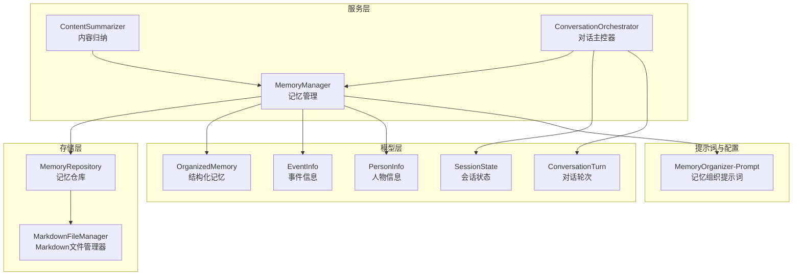
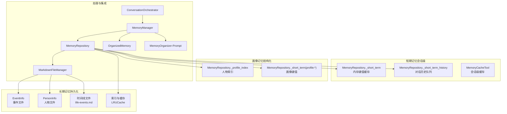
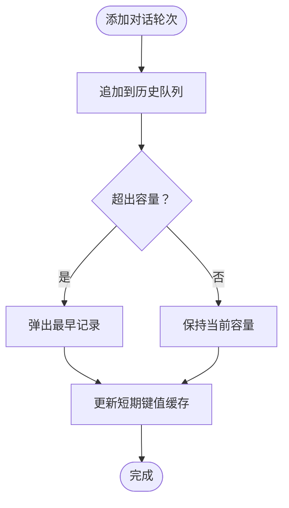
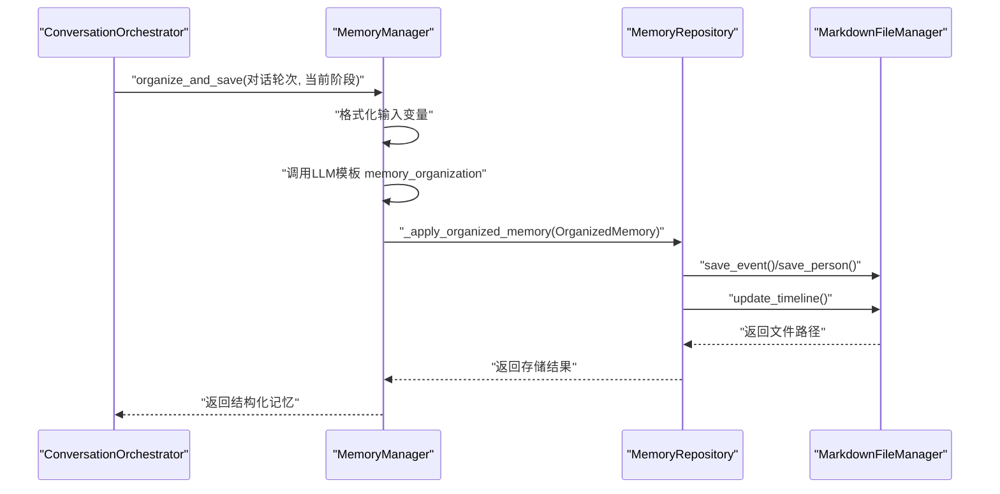
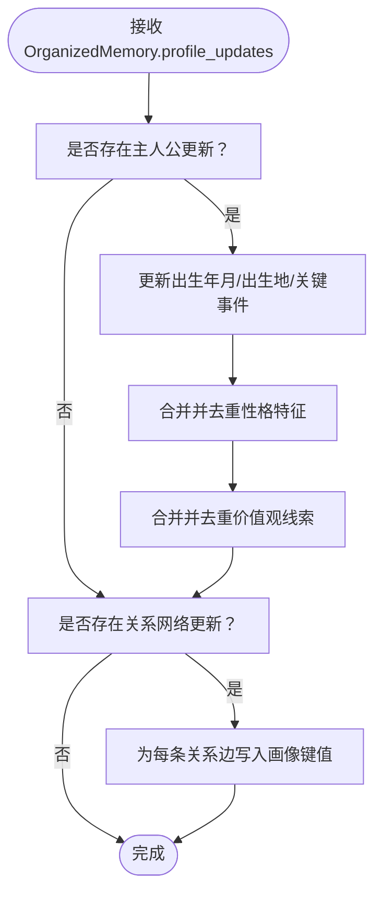
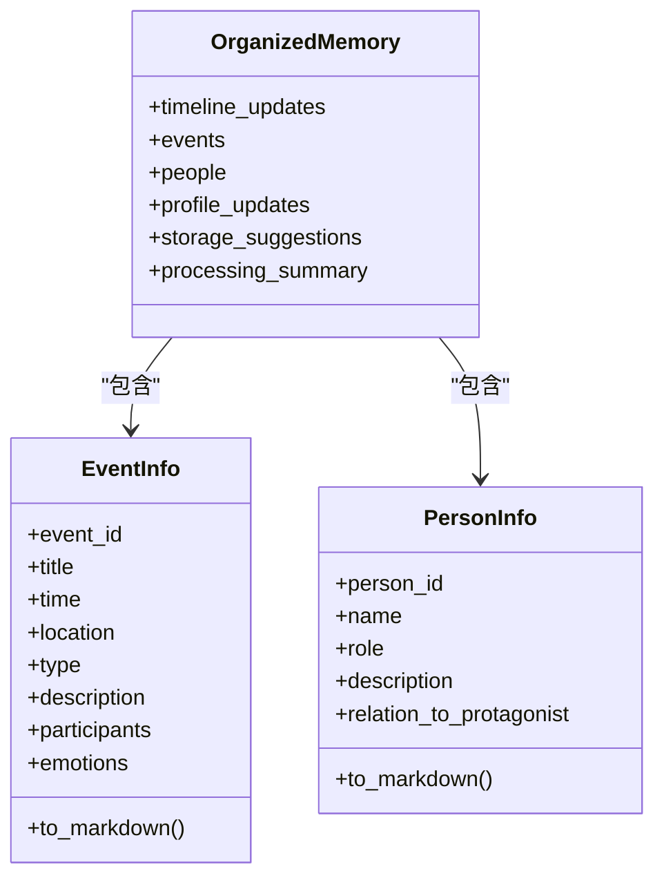
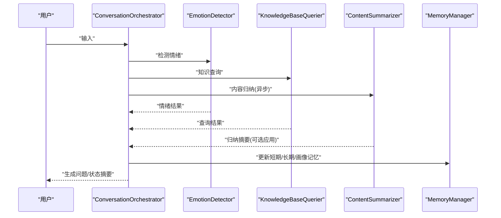
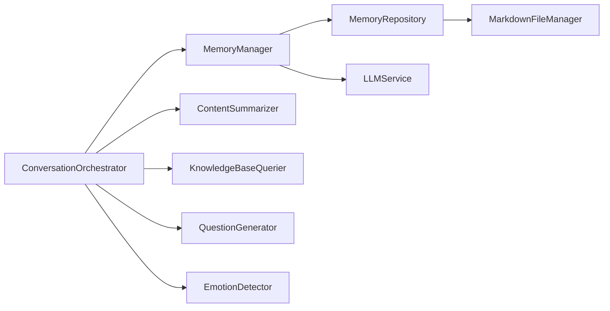

# 三层记忆架构

<cite>
**本文引用的文件**
- [src/services/memory_manager.py](file://src/services/memory_manager.py)
- [src/storage/memory_repository.py](file://src/storage/memory_repository.py)
- [src/storage/markdown_file_manager.py](file://src/storage/markdown_file_manager.py)
- [src/models/session_state.py](file://src/models/session_state.py)
- [src/models/organized_memory.py](file://src/models/organized_memory.py)
- [src/models/event_info.py](file://src/models/event_info.py)
- [src/models/person_info.py](file://src/models/person_info.py)
- [src/models/conversation_turn.py](file://src/models/conversation_turn.py)
- [src/enums/phase_type.py](file://src/enums/phase_type.py)
- [src/tools/memory_cache_tool.py](file://src/tools/memory_cache_tool.py)
- [src/services/content_summarizer.py](file://src/services/content_summarizer.py)
- [src/core/conversation_orchestrator.py](file://src/core/conversation_orchestrator.py)
- [Prompts/MemoryOrganizer-Prompt.md](file://Prompts/MemoryOrganizer-Prompt.md)
- [MEMORY_INTERACTION_GUIDE.md](file://MEMORY_INTERACTION_GUIDE.md)
- [knowledge_base/test_user001/people/family/母亲.md](file://knowledge_base/test_user001/people/family/母亲.md)
- [knowledge_base/test_user001/events/childhood/四合院家庭生活.md](file://knowledge_base/test_user001/events/childhood/四合院家庭生活.md)
- [knowledge_base/test_user001/timeline/life-events.md](file://knowledge_base/test_user001/timeline/life-events.md)
</cite>

## 目录
1. [简介](#简介)
2. [项目结构](#项目结构)
3. [核心组件](#核心组件)
4. [架构总览](#架构总览)
5. [详细组件分析](#详细组件分析)
6. [依赖关系分析](#依赖关系分析)
7. [性能考量](#性能考量)
8. [故障排查指南](#故障排查指南)
9. [结论](#结论)
10. [附录](#附录)

## 简介
本技术文档围绕“三层记忆架构”展开，系统性阐述短期记忆、长期记忆与画像记忆的设计理念、实现原理与相互关系。短期记忆负责会话级的临时存储与对话历史管理；长期记忆负责结构化事件、人物与时间线的持久化存储；画像记忆则负责个人档案的构建与演进。文档还给出生命周期管理、数据转换机制、最佳实践与性能优化建议，并通过真实示例文件展示最终产物形态。

## 项目结构
项目采用“按职责分层”的组织方式，核心模块包括：
- 服务层：记忆管理、内容归纳、知识库查询、情感检测、问题生成等
- 存储层：记忆仓库、Markdown文件管理器
- 模型层：会话状态、结构化记忆、事件/人物信息、对话轮次等
- 枚举与提示词：阶段类型、记忆组织提示词模板
- 示例与测试：交互式记忆管理指南、示例知识库文件

图表来源
- [src/core/conversation_orchestrator.py:138-197](file://src/core/conversation_orchestrator.py#L138-L197)
- [src/services/memory_manager.py:27-61](file://src/services/memory_manager.py#L27-L61)
- [src/storage/memory_repository.py:40-87](file://src/storage/memory_repository.py#L40-L87)
- [src/storage/markdown_file_manager.py:31-45](file://src/storage/markdown_file_manager.py#L31-L45)
- [src/models/session_state.py:24-86](file://src/models/session_state.py#L24-L86)
- [src/models/organized_memory.py:141-151](file://src/models/organized_memory.py#L141-L151)
- [src/models/event_info.py:5-33](file://src/models/event_info.py#L5-L33)
- [src/models/person_info.py:5-33](file://src/models/person_info.py#L5-L33)
- [src/models/conversation_turn.py:14-52](file://src/models/conversation_turn.py#L14-L52)
- [Prompts/MemoryOrganizer-Prompt.md:1-10](file://Prompts/MemoryOrganizer-Prompt.md#L1-L10)

章节来源
- [src/core/conversation_orchestrator.py:138-197](file://src/core/conversation_orchestrator.py#L138-L197)
- [src/services/memory_manager.py:27-61](file://src/services/memory_manager.py#L27-L61)
- [src/storage/memory_repository.py:40-87](file://src/storage/memory_repository.py#L40-L87)
- [src/storage/markdown_file_manager.py:31-45](file://src/storage/markdown_file_manager.py#L31-L45)

## 核心组件
- MemoryManager：统一协调短期/长期/画像三类记忆的读写与结构化整理，封装LLM调用与存储应用逻辑
- MemoryRepository：三层记忆的统一存储入口，短期记忆内存缓存、长期记忆文件系统、画像记忆内存索引
- MarkdownFileManager：负责文件系统操作、全文搜索、Wiki链接解析与追踪
- SessionState：贯穿会话生命周期的状态容器，承载覆盖率、对话历史、待追问问题等
- OrganizedMemory：LLM输出的结构化记忆载体，包含事件、人物、时间线更新与画像更新
- EventInfo/PersonInfo：事件与人物的结构化数据模型，支持Markdown序列化
- ConversationTurn：单轮对话的数据模型，承载实体、事件预览与情绪
- MemoryCacheTool：会话级短期缓存工具，支持关键词检索与追加更新
- ContentSummarizer：内容归纳服务，驱动记忆更新计划与异步处理
- ConversationOrchestrator：对话主控器，协调各Agent异步工作、触发归纳与交接

章节来源
- [src/services/memory_manager.py:27-61](file://src/services/memory_manager.py#L27-L61)
- [src/storage/memory_repository.py:40-87](file://src/storage/memory_repository.py#L40-L87)
- [src/storage/markdown_file_manager.py:31-45](file://src/storage/markdown_file_manager.py#L31-L45)
- [src/models/session_state.py:24-86](file://src/models/session_state.py#L24-L86)
- [src/models/organized_memory.py:141-151](file://src/models/organized_memory.py#L141-L151)
- [src/models/event_info.py:5-33](file://src/models/event_info.py#L5-L33)
- [src/models/person_info.py:5-33](file://src/models/person_info.py#L5-L33)
- [src/models/conversation_turn.py:14-52](file://src/models/conversation_turn.py#L14-L52)
- [src/tools/memory_cache_tool.py:8-27](file://src/tools/memory_cache_tool.py#L8-L27)
- [src/services/content_summarizer.py:17-33](file://src/services/content_summarizer.py#L17-L33)
- [src/core/conversation_orchestrator.py:138-161](file://src/core/conversation_orchestrator.py#L138-L161)

## 架构总览
三层记忆架构以“短期-长期-画像”为主线，结合会话状态与结构化提示词，实现从对话到知识的闭环：

图表来源
- [src/storage/memory_repository.py:70-81](file://src/storage/memory_repository.py#L70-L81)
- [src/storage/memory_repository.py:169-173](file://src/storage/memory_repository.py#L169-L173)
- [src/storage/memory_repository.py:288-298](file://src/storage/memory_repository.py#L288-L298)
- [src/storage/memory_repository.py:176-200](file://src/storage/memory_repository.py#L176-L200)
- [src/storage/memory_repository.py:202-226](file://src/storage/memory_repository.py#L202-L226)
- [src/storage/memory_repository.py:248-261](file://src/storage/memory_repository.py#L248-L261)
- [src/storage/memory_repository.py:16-38](file://src/storage/memory_repository.py#L16-L38)
- [src/services/memory_manager.py:111-156](file://src/services/memory_manager.py#L111-L156)
- [Prompts/MemoryOrganizer-Prompt.md:1-10](file://Prompts/MemoryOrganizer-Prompt.md#L1-L10)

## 详细组件分析

### 短期记忆：临时存储与会话状态
短期记忆由内存缓存与对话历史队列构成，容量受控，适合会话级临时数据与上下文维护：
- 内存缓存：键值对存储，带时间戳，支持快速读取与更新
- 对话历史：固定容量队列，先进先出，保证最新N轮对话可用
- 会话缓存工具：支持按关键词标签检索与追加更新，便于Agent间共享片段

图表来源
- [src/storage/memory_repository.py:103-110](file://src/storage/memory_repository.py#L103-L110)
- [src/storage/memory_repository.py:91-102](file://src/storage/memory_repository.py#L91-L102)
- [src/tools/memory_cache_tool.py:63-84](file://src/tools/memory_cache_tool.py#L63-L84)

章节来源
- [src/storage/memory_repository.py:91-110](file://src/storage/memory_repository.py#L91-L110)
- [src/storage/memory_repository.py:169-173](file://src/storage/memory_repository.py#L169-L173)
- [src/tools/memory_cache_tool.py:8-27](file://src/tools/memory_cache_tool.py#L8-L27)

### 长期记忆：持久化存储与分类组织
长期记忆以Markdown文件形式持久化，按“事件-人物-时间线”三大维度分类存储，并提供索引与缓存加速：
- 事件存储：按人生阶段目录（童年/青少年/青年/中年/老年）组织，文件名清洗与去重
- 人物存储：按角色分类（家庭/朋友/同事/其他），主人公单独存放
- 时间线更新：在时间线文件中追加节点，建立事件与时间线的双向链接
- 索引与缓存：LRU缓存与内存索引，提升查询效率

图表来源
- [src/services/memory_manager.py:111-156](file://src/services/memory_manager.py#L111-L156)
- [src/services/memory_manager.py:158-193](file://src/services/memory_manager.py#L158-L193)
- [src/storage/memory_repository.py:176-200](file://src/storage/memory_repository.py#L176-L200)
- [src/storage/memory_repository.py:202-226](file://src/storage/memory_repository.py#L202-L226)
- [src/storage/memory_repository.py:248-261](file://src/storage/memory_repository.py#L248-L261)
- [Prompts/MemoryOrganizer-Prompt.md:1-10](file://Prompts/MemoryOrganizer-Prompt.md#L1-L10)

章节来源
- [src/storage/memory_repository.py:176-200](file://src/storage/memory_repository.py#L176-L200)
- [src/storage/memory_repository.py:202-226](file://src/storage/memory_repository.py#L202-L226)
- [src/storage/memory_repository.py:248-261](file://src/storage/memory_repository.py#L248-L261)
- [src/storage/memory_repository.py:16-38](file://src/storage/memory_repository.py#L16-L38)

### 画像记忆：个人档案构建
画像记忆以结构化键值与索引的形式在短期内存中维护，支持对主人公基础信息、关键事件、性格特征、价值观与关系网络的增量更新：
- 主人公信息：出生年月、出生地、关键人生节点、性格特征、价值观线索
- 关系网络：人物关系边，记录关系描述与证据
- 索引与查询：通过键前缀“profile:”隔离画像空间，支持快速读取

图表来源
- [src/services/memory_manager.py:349-395](file://src/services/memory_manager.py#L349-L395)
- [src/storage/memory_repository.py:288-298](file://src/storage/memory_repository.py#L288-L298)

章节来源
- [src/services/memory_manager.py:349-395](file://src/services/memory_manager.py#L349-L395)
- [src/storage/memory_repository.py:288-298](file://src/storage/memory_repository.py#L288-L298)

### 数据模型与转换机制
- OrganizedMemory：LLM输出的统一结构，包含时间线更新、事件提取、人物提取与画像更新
- EventInfo/PersonInfo：面向存储的结构化模型，提供Markdown序列化能力
- 转换链路：MemoryManager将LLM输出转换为内部模型，再委派MemoryRepository写入文件与索引

图表来源
- [src/models/organized_memory.py:141-151](file://src/models/organized_memory.py#L141-L151)
- [src/models/event_info.py:5-33](file://src/models/event_info.py#L5-L33)
- [src/models/person_info.py:5-33](file://src/models/person_info.py#L5-L33)

章节来源
- [src/models/organized_memory.py:141-151](file://src/models/organized_memory.py#L141-L151)
- [src/models/event_info.py:5-33](file://src/models/event_info.py#L5-L33)
- [src/models/person_info.py:5-33](file://src/models/person_info.py#L5-L33)

### 生命周期管理与控制流
- 会话生命周期：初始化会话、逐轮处理、情绪检测、知识查询、内容归纳、交接与终止
- 会话状态：记录轮次、覆盖率、对话历史、待追问问题、情绪状态等
- 交接触发：达到轮次阈值或阶段覆盖率达标时触发

图表来源
- [src/core/conversation_orchestrator.py:236-344](file://src/core/conversation_orchestrator.py#L236-L344)
- [src/services/content_summarizer.py:43-93](file://src/services/content_summarizer.py#L43-L93)
- [src/services/memory_manager.py:435-466](file://src/services/memory_manager.py#L435-L466)

章节来源
- [src/core/conversation_orchestrator.py:198-234](file://src/core/conversation_orchestrator.py#L198-L234)
- [src/core/conversation_orchestrator.py:236-344](file://src/core/conversation_orchestrator.py#L236-L344)
- [src/models/session_state.py:24-86](file://src/models/session_state.py#L24-L86)

## 依赖关系分析
- 组件耦合：ConversationOrchestrator聚合多个服务，MemoryManager依赖MemoryRepository与LLMService，MemoryRepository依赖MarkdownFileManager与知识库查询器
- 外部依赖：LLMService（通过提示词模板）、文件系统（MarkdownFileManager）
- 潜在循环：当前实现未见循环依赖，但需注意LLMService与MemoryManager之间通过提示词模板的间接耦合

图表来源
- [src/core/conversation_orchestrator.py:163-187](file://src/core/conversation_orchestrator.py#L163-L187)
- [src/services/memory_manager.py:47-60](file://src/services/memory_manager.py#L47-L60)
- [src/storage/memory_repository.py:83-87](file://src/storage/memory_repository.py#L83-L87)

章节来源
- [src/core/conversation_orchestrator.py:163-187](file://src/core/conversation_orchestrator.py#L163-L187)
- [src/services/memory_manager.py:47-60](file://src/services/memory_manager.py#L47-L60)
- [src/storage/memory_repository.py:83-87](file://src/storage/memory_repository.py#L83-L87)

## 性能考量
- 并行写入：MemoryManager在应用结构化记忆时并行保存事件与人物，显著降低I/O等待
- LRU缓存：MemoryRepository内置LRU缓存与内存索引，减少重复读取与文件系统访问
- 异步处理：ContentSummarizer与对话主控器均采用异步任务，避免阻塞主线程
- 文件系统优化：MarkdownFileManager提供异步读写与全文搜索，支持链接追踪与索引生成
- 建议
  - 批量写入：在高并发场景下，考虑引入批处理缓冲区
  - 缓存策略：针对热点事件/人物ID，扩大LRU容量并增加命中率监控
  - I/O优化：对频繁更新的文件采用追加写入策略，减少随机写
  - 提示词优化：合理裁剪上下文长度，降低LLM调用成本

[本节为通用性能讨论，无需特定文件分析]

## 故障排查指南
- LLM调用失败
  - 检查提示词模板是否正确加载，确认变量填充是否完整
  - 查看日志输出，定位错误原因（如结构化输出解析失败）
- 文件写入异常
  - 确认MarkdownFileManager的基础路径与目录结构是否正确
  - 检查磁盘权限与空间，避免写入失败
- 记忆更新不生效
  - 确认MemoryManager的apply_summary流程是否被调用
  - 检查OrganizedMemory的事件/人物ID是否符合预期
- 会话状态异常
  - 检查SessionState的覆盖率与对话历史是否正确更新
  - 关注情绪检测与知识查询的超时处理

章节来源
- [src/services/memory_manager.py:147-150](file://src/services/memory_manager.py#L147-L150)
- [src/storage/markdown_file_manager.py:134-170](file://src/storage/markdown_file_manager.py#L134-L170)
- [src/core/conversation_orchestrator.py:286-302](file://src/core/conversation_orchestrator.py#L286-L302)

## 结论
三层记忆架构以短期记忆保障会话流畅性，以长期记忆实现知识沉淀，以画像记忆支撑个性化体验。通过结构化的数据模型、提示词模板与统一的存储抽象，系统实现了从对话到知识的高效转化。建议在生产环境中进一步强化缓存与I/O优化，并完善持久化与可视化能力，以支撑更大规模的记忆管理需求。

[本节为总结性内容，无需特定文件分析]

## 附录

### 示例文件形态
- 事件文件：包含基本信息、描述、人物、时间线关联、关键细节、情感标签与来源
- 人物文件：包含基本信息、关系、影响、相关事件、重要语录与来源
- 时间线文件：按时间点追加节点，链接到具体事件

章节来源
- [knowledge_base/test_user001/events/childhood/四合院家庭生活.md:1-34](file://knowledge_base/test_user001/events/childhood/四合院家庭生活.md#L1-L34)
- [knowledge_base/test_user001/people/family/母亲.md:1-23](file://knowledge_base/test_user001/people/family/母亲.md#L1-L23)
- [knowledge_base/test_user001/timeline/life-events.md:1-12](file://knowledge_base/test_user001/timeline/life-events.md#L1-L12)

### 交互式测试指南
- 提供了从初始化、选择人生阶段、开始采访到查看历史与清空状态的完整流程
- 展示了结构化记忆的输出与存储位置

章节来源
- [MEMORY_INTERACTION_GUIDE.md:1-172](file://MEMORY_INTERACTION_GUIDE.md#L1-L172)