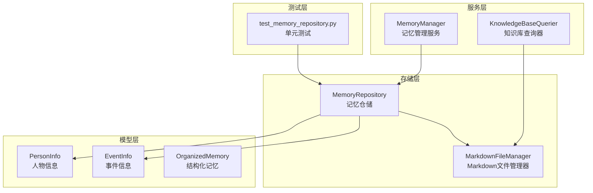
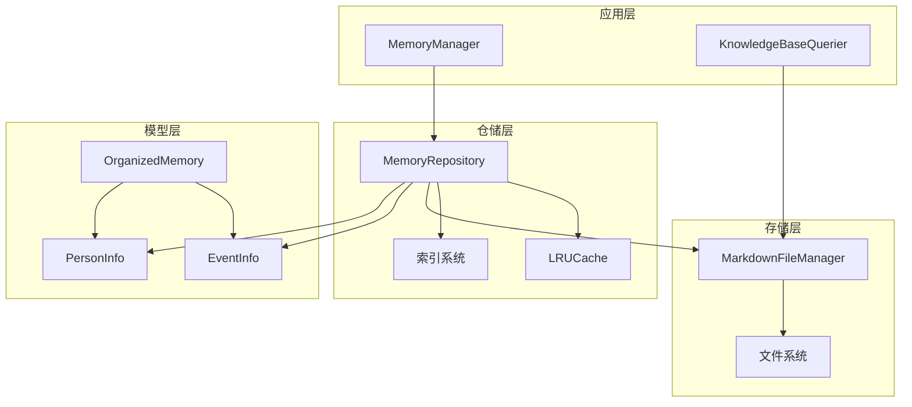
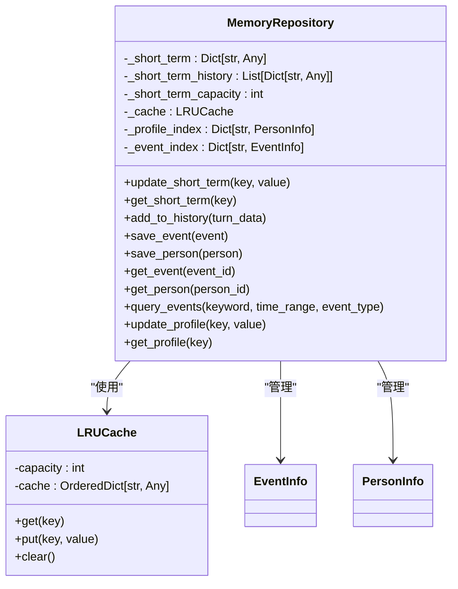
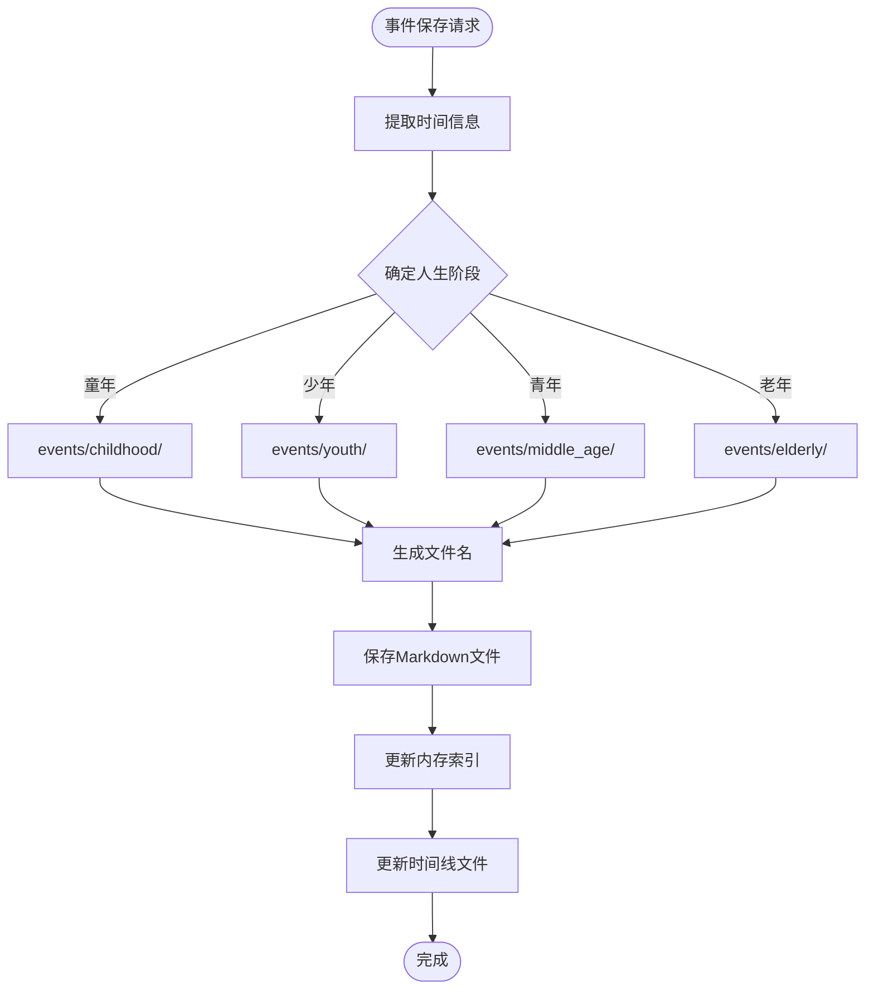
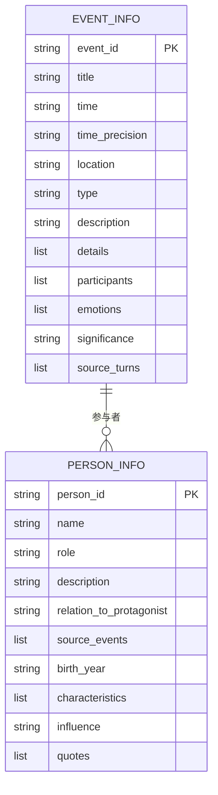
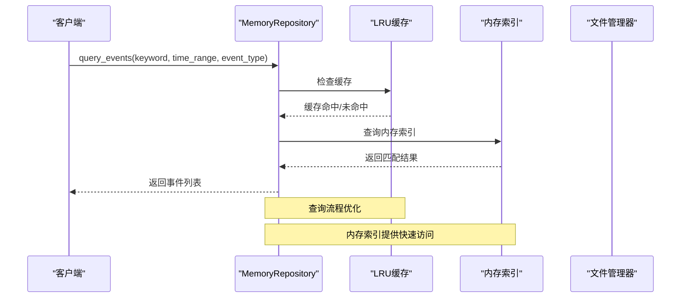
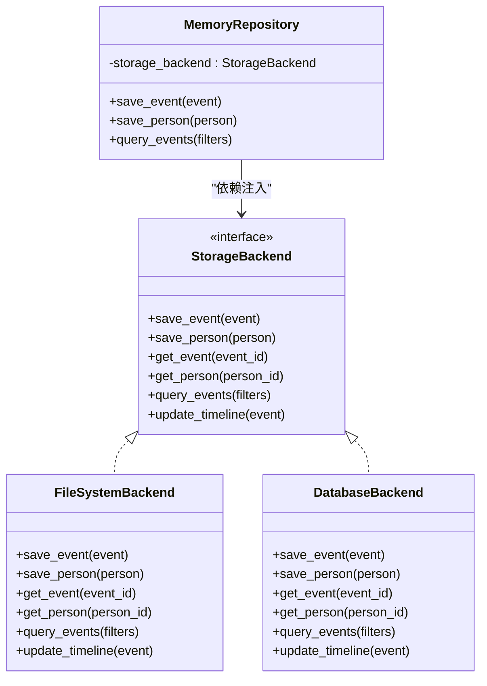
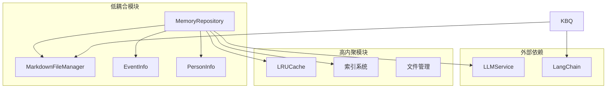
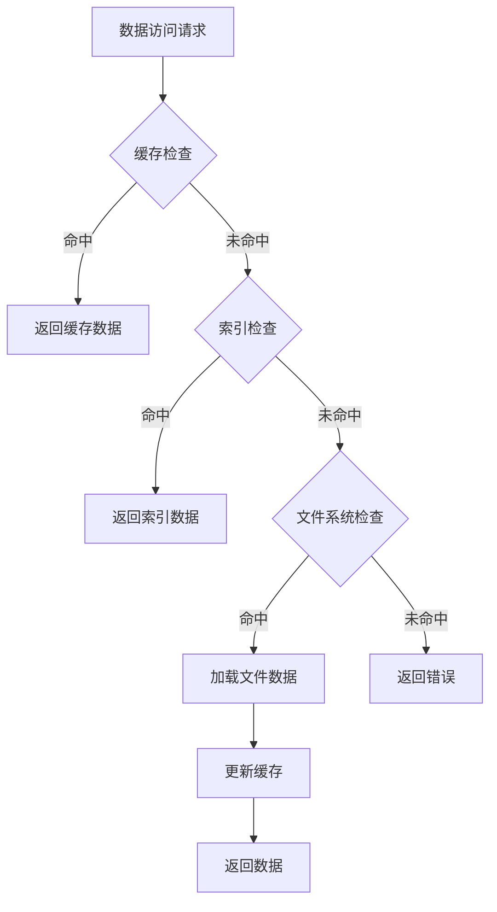
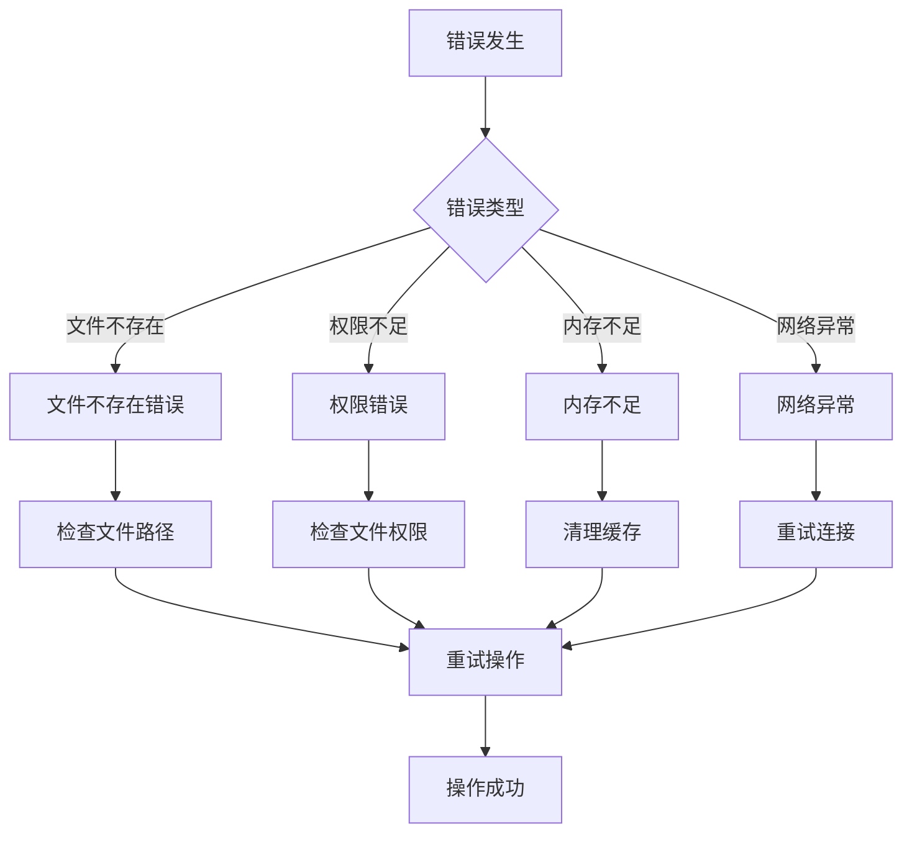

# 记忆仓储层

<cite>
**本文档引用的文件**
- [memory_repository.py](file://src/storage/memory_repository.py)
- [markdown_file_manager.py](file://src/storage/markdown_file_manager.py)
- [event_info.py](file://src/models/event_info.py)
- [person_info.py](file://src/models/person_info.py)
- [organized_memory.py](file://src/models/organized_memory.py)
- [phase_type.py](file://src/enums/phase_type.py)
- [memory_manager.py](file://src/services/memory_manager.py)
- [knowledge_base_querier.py](file://src/services/knowledge_base_querier.py)
- [memory_query_result.py](file://src/models/memory_query_result.py)
- [test_memory_repository.py](file://tests/test_memory_repository.py)
- [demo_memory_storage.py](file://demo_memory_storage.py)
</cite>

## 目录
1. [简介](#简介)
2. [项目结构](#项目结构)
3. [核心组件](#核心组件)
4. [架构概览](#架构概览)
5. [详细组件分析](#详细组件分析)
6. [依赖关系分析](#依赖关系分析)
7. [性能考虑](#性能考虑)
8. [故障排除指南](#故障排除指南)
9. [结论](#结论)
10. [附录](#附录)

## 简介
记忆仓储层是自传写作系统的核心数据基础设施，负责统一管理三层记忆的存储与检索。该系统采用Markdown文件作为主要存储介质，结合内存缓存和索引机制，实现了高效的记忆管理能力。系统支持事件信息、人物信息和时间线的结构化存储，并提供了丰富的查询接口和扩展能力。

## 项目结构
记忆仓储层位于项目的存储和模型层，主要包含以下核心模块：



**图表来源**
- [memory_repository.py:1-359](file://src/storage/memory_repository.py#L1-L359)
- [markdown_file_manager.py:1-546](file://src/storage/markdown_file_manager.py#L1-L546)
- [event_info.py:1-69](file://src/models/event_info.py#L1-L69)
- [person_info.py:1-61](file://src/models/person_info.py#L1-L61)
- [organized_memory.py:1-151](file://src/models/organized_memory.py#L1-L151)

**章节来源**
- [memory_repository.py:1-359](file://src/storage/memory_repository.py#L1-L359)
- [markdown_file_manager.py:1-546](file://src/storage/markdown_file_manager.py#L1-L546)

## 核心组件
记忆仓储层由多个相互协作的组件构成，每个组件都有明确的职责分工：

### MemoryRepository - 记忆仓储核心
MemoryRepository是整个系统的中央协调者，负责：
- **短期记忆管理**：维护会话期间的临时数据
- **长期记忆存储**：管理事件和人物信息的持久化存储
- **缓存机制**：实现LRU缓存以提升访问性能
- **索引维护**：维护事件和人物的内存索引
- **查询接口**：提供事件和人物的检索能力

### MarkdownFileManager - 文件管理器
负责Markdown文件的创建、读取、更新和搜索：
- **目录结构管理**：自动创建和维护标准的目录结构
- **全文搜索**：提供高效的文件内容搜索能力
- **链接追踪**：支持Wiki链接的解析和追踪
- **异步IO操作**：优化文件读写的性能

### 数据模型层
包含结构化的数据模型定义：
- **EventInfo**：事件信息的标准化表示
- **PersonInfo**：人物画像的结构化存储
- **OrganizedMemory**：LLM整理后的结构化记忆输出

**章节来源**
- [memory_repository.py:40-88](file://src/storage/memory_repository.py#L40-L88)
- [markdown_file_manager.py:31-45](file://src/storage/markdown_file_manager.py#L31-L45)
- [event_info.py:5-17](file://src/models/event_info.py#L5-L17)
- [person_info.py:5-17](file://src/models/person_info.py#L5-L17)

## 架构概览
记忆仓储层采用分层架构设计，实现了清晰的关注点分离：



**图表来源**
- [memory_manager.py:27-61](file://src/services/memory_manager.py#L27-L61)
- [memory_repository.py:40-88](file://src/storage/memory_repository.py#L40-L88)
- [markdown_file_manager.py:31-45](file://src/storage/markdown_file_manager.py#L31-L45)

## 详细组件分析

### MemoryRepository - 记忆仓储核心组件

#### 数据模型设计
MemoryRepository采用三层记忆架构：



**图表来源**
- [memory_repository.py:40-88](file://src/storage/memory_repository.py#L40-L88)
- [memory_repository.py:16-38](file://src/storage/memory_repository.py#L16-L38)

#### 时间线管理机制
系统实现了智能的时间线管理，支持事件的自动排序和时间关联：



**图表来源**
- [memory_repository.py:176-200](file://src/storage/memory_repository.py#L176-L200)
- [memory_repository.py:248-261](file://src/storage/memory_repository.py#L248-L261)

#### 人物关系网络存储策略
系统采用灵活的关系网络存储机制：

| 关系类型 | 存储位置 | 证据记录 | 动态更新 |
|---------|----------|----------|----------|
| 家庭成员 | people/family/ | 事件关联 | 支持 |
| 朋友 | people/friends/ | 人物关系 | 支持 |
| 同事 | people/colleagues/ | 事件参与 | 支持 |
| 其他 | people/others/ | 事件提及 | 支持 |

**章节来源**
- [memory_repository.py:202-226](file://src/storage/memory_repository.py#L202-L226)
- [memory_repository.py:338-347](file://src/storage/memory_repository.py#L338-L347)

### 数据模型详细分析

#### EventInfo - 事件信息模型
EventInfo提供了完整的事件描述能力：



**图表来源**
- [event_info.py:19-33](file://src/models/event_info.py#L19-L33)
- [person_info.py:19-32](file://src/models/person_info.py#L19-L32)

#### 事件存储格式
事件信息采用Markdown格式存储，包含完整的元数据：

| 字段 | 类型 | 描述 | 示例 |
|------|------|------|------|
| event_id | string | 事件唯一标识符 | "event_001" |
| title | string | 事件标题 | "童年入学" |
| time | string | 时间描述 | "1957年9月" |
| type | string | 事件类型 | "education" |
| description | string | 事件描述 | "李小明进入学校..." |
| participants | list[string] | 参与人物 | ["李小明", "李建国"] |
| emotions | list[string] | 情感标签 | ["好奇", "兴奋"] |

**章节来源**
- [event_info.py:5-69](file://src/models/event_info.py#L5-L69)
- [person_info.py:5-61](file://src/models/person_info.py#L5-L61)

### 查询接口设计

#### 仓储层查询接口
MemoryRepository提供了灵活的查询能力：



**图表来源**
- [memory_repository.py:262-284](file://src/storage/memory_repository.py#L262-L284)

#### 关键词搜索实现
系统支持多维度的关键词搜索：

| 搜索维度 | 实现方式 | 性能特点 |
|----------|----------|----------|
| 标题搜索 | 直接字符串匹配 | O(n) |
| 描述搜索 | 正则表达式匹配 | O(n*m) |
| 事件类型 | 枚举值比较 | O(1) |
| 时间范围 | 字符串比较 | O(1) |

**章节来源**
- [memory_repository.py:262-284](file://src/storage/memory_repository.py#L262-L284)

### 扩展接口和自定义存储后端

#### 存储后端抽象
系统设计支持多种存储后端：



**图表来源**
- [memory_repository.py:40-88](file://src/storage/memory_repository.py#L40-L88)

#### 自定义存储后端集成方案
支持通过依赖注入的方式集成自定义存储后端：

1. **实现接口**：实现StorageBackend接口
2. **配置注入**：在MemoryRepository初始化时注入新后端
3. **迁移策略**：提供数据迁移工具和脚本
4. **兼容性测试**：确保新后端满足所有接口要求

**章节来源**
- [memory_repository.py:54-67](file://src/storage/memory_repository.py#L54-L67)

## 依赖关系分析

### 组件耦合度分析
记忆仓储层展现了良好的模块化设计：



**图表来源**
- [memory_repository.py:8-11](file://src/storage/memory_repository.py#L8-L11)
- [knowledge_base_querier.py:10-12](file://src/services/knowledge_base_querier.py#L10-L12)

### 外部依赖管理
系统对外部依赖的管理体现了清晰的设计原则：

| 依赖类型 | 作用 | 版本控制 | 替代方案 |
|----------|------|----------|----------|
| LLMService | AI推理引擎 | 通过工厂函数注入 | 其他AI服务提供商 |
| LangChain | Agent框架 | 通过工具接口 | 其他框架替代 |
| Pydantic | 数据验证 | 类型注解驱动 | 其他验证库 |
| aiofiles | 异步IO | 文件操作优化 | 同步替代方案 |

**章节来源**
- [memory_repository.py:8-11](file://src/storage/memory_repository.py#L8-L11)
- [knowledge_base_querier.py:10-12](file://src/services/knowledge_base_querier.py#L10-L12)

## 性能考虑

### 缓存策略优化
系统采用了多层次的缓存机制：



**图表来源**
- [memory_repository.py:230-246](file://src/storage/memory_repository.py#L230-L246)

### 性能优化措施
1. **LRU缓存**：限制缓存大小，避免内存溢出
2. **内存索引**：提供O(1)的查找性能
3. **异步IO**：文件操作采用异步模式
4. **批量操作**：支持并发的文件写入

### 内存使用分析
- **短期记忆**：固定容量限制，避免无限增长
- **缓存系统**：可配置容量，支持LRU淘汰
- **索引系统**：内存中维护完整的索引
- **文件系统**：持久化存储，支持大规模数据

## 故障排除指南

### 常见问题诊断
系统提供了完善的错误处理机制：



**图表来源**
- [memory_repository.py:159-161](file://src/storage/memory_repository.py#L159-L161)

### 调试工具和方法
1. **日志记录**：详细的操作日志和错误信息
2. **状态监控**：实时监控缓存命中率和内存使用
3. **性能分析**：提供查询性能和存储效率分析
4. **数据验证**：自动验证数据完整性和一致性

**章节来源**
- [memory_repository.py:13-13](file://src/storage/memory_repository.py#L13-L13)

## 结论
记忆仓储层展现了优秀的软件工程实践，通过合理的架构设计和模块化实现，成功解决了复杂记忆管理的需求。系统的主要优势包括：

1. **清晰的架构层次**：分层设计使得各组件职责明确
2. **高性能的存储机制**：多级缓存和索引系统保证了查询效率
3. **灵活的扩展能力**：支持多种存储后端和自定义扩展
4. **完善的错误处理**：提供了健壮的错误处理和恢复机制

该系统为自传写作项目提供了坚实的数据基础，能够支持大规模的记忆管理和高效的知识检索需求。

## 附录

### 快速开始示例
系统提供了完整的演示脚本，展示了基本的存储和查询功能：

```python
# 创建存储实例
file_manager = MarkdownFileManager()
memory_repo = MemoryRepository(file_manager)

# 存储事件信息
event = EventInfo(
    event_id="event_001",
    title="童年入学",
    time="1957年9月",
    description="李小明进入学校..."
)

await memory_repo.save_event(event)
```

### API参考
系统提供了完整的API接口，支持事件和人物的增删改查操作，以及复杂查询功能。

**章节来源**
- [demo_memory_storage.py:16-118](file://demo_memory_storage.py#L16-L118)
- [test_memory_repository.py:44-325](file://tests/test_memory_repository.py#L44-L325)