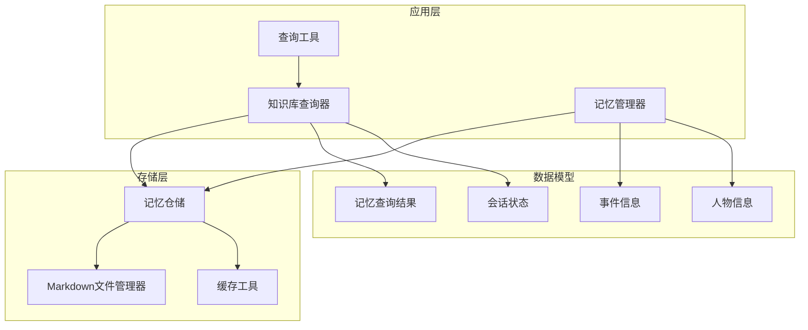
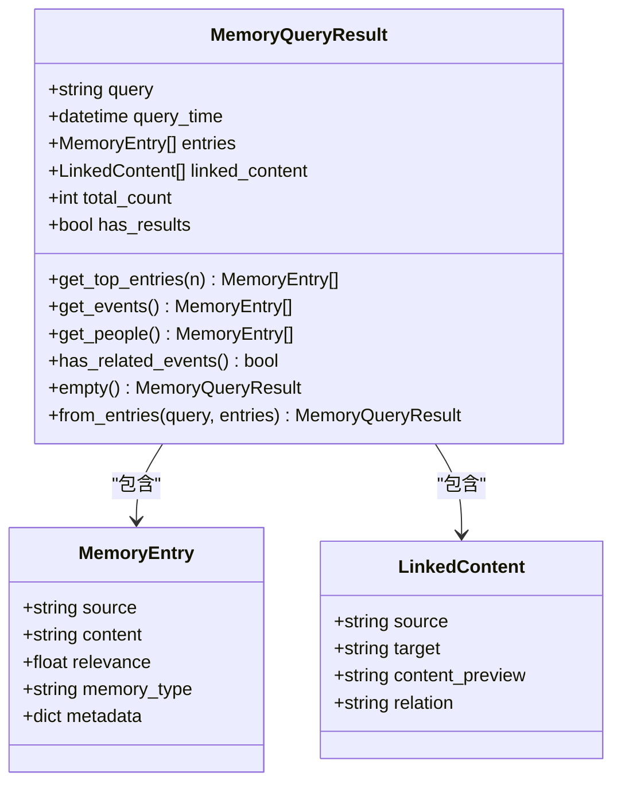
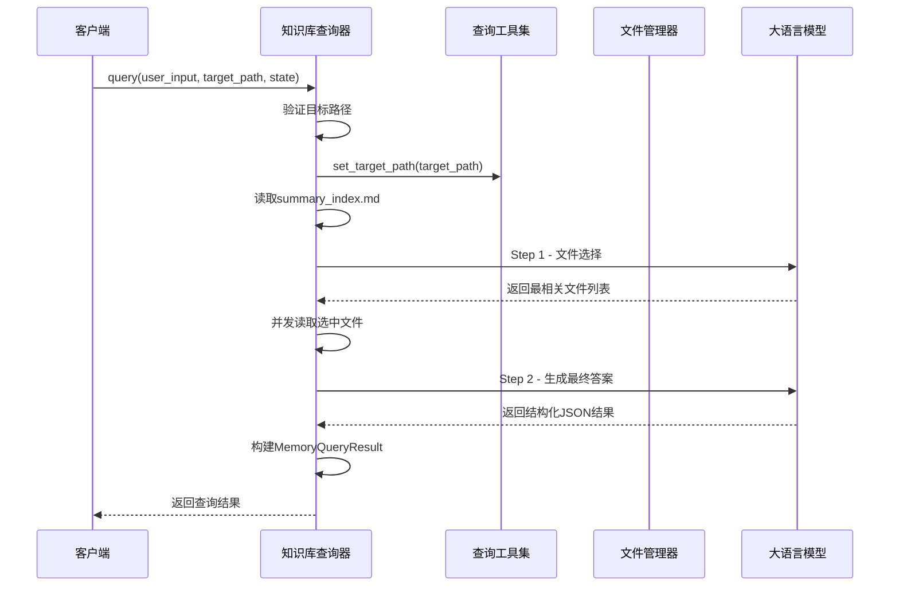
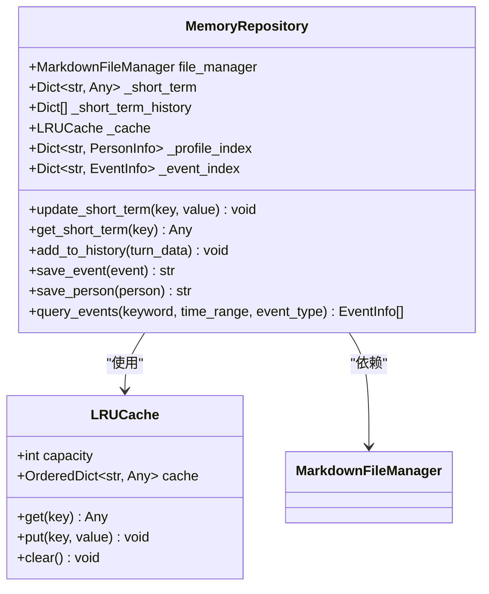
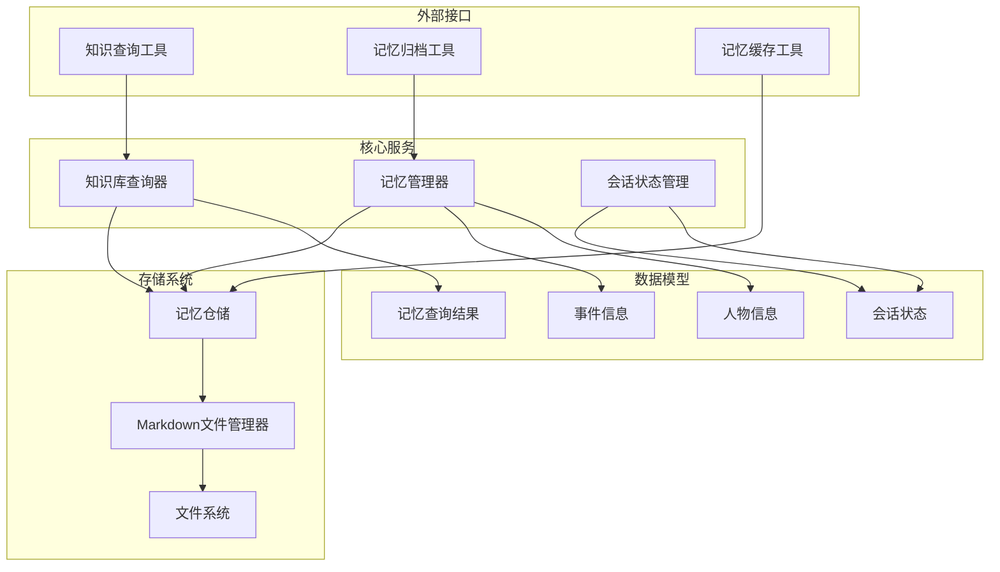
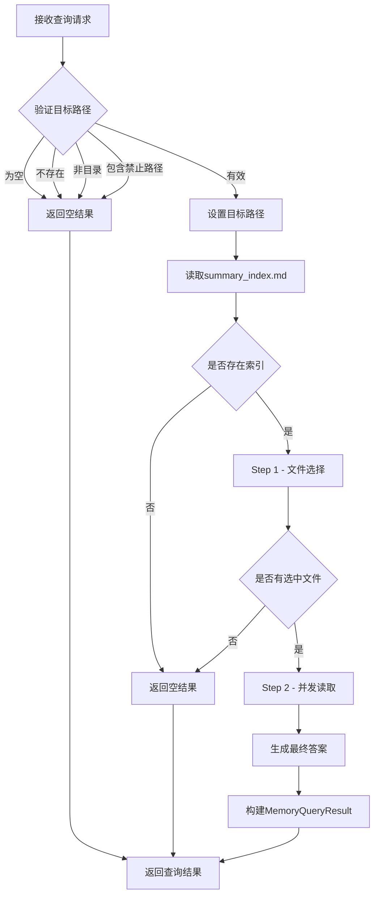
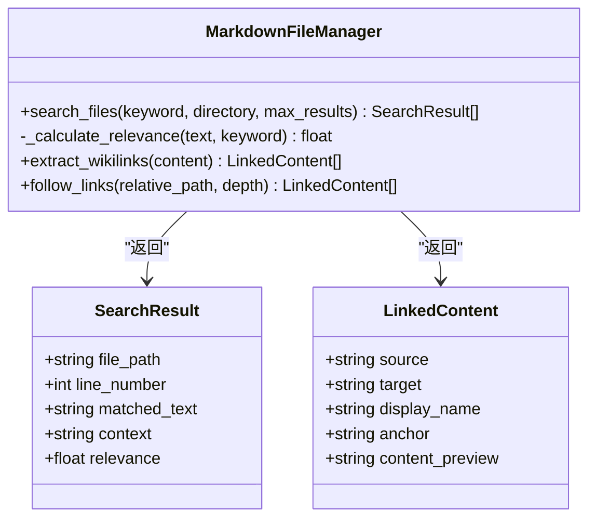
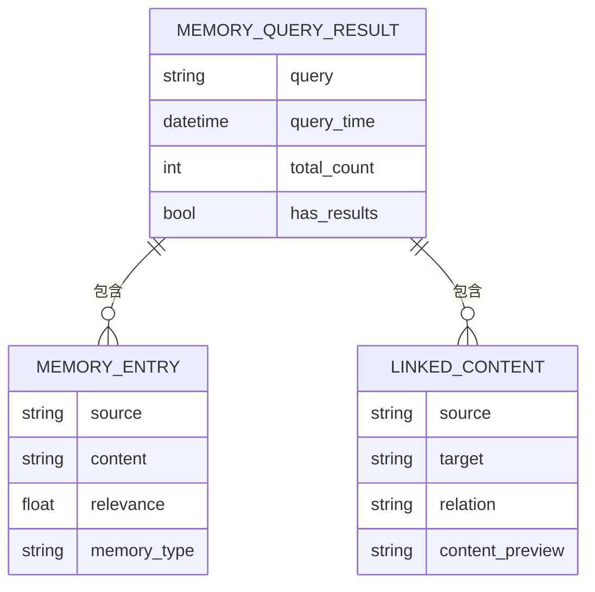
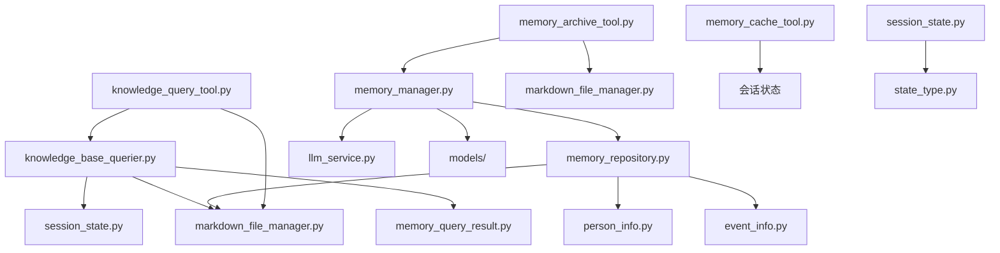

# 记忆查询系统

<cite>
**本文档引用的文件**
- [memory_query_result.py](file://src/models/memory_query_result.py)
- [knowledge_base_querier.py](file://src/services/knowledge_base_querier.py)
- [knowledge_query_tool.py](file://src/tools/knowledge_query_tool.py)
- [memory_repository.py](file://src/storage/memory_repository.py)
- [markdown_file_manager.py](file://src/storage/markdown_file_manager.py)
- [event_info.py](file://src/models/event_info.py)
- [person_info.py](file://src/models/person_info.py)
- [memory_manager.py](file://src/services/memory_manager.py)
- [memory_cache_tool.py](file://src/tools/memory_cache_tool.py)
- [memory_archive_tool.py](file://src/tools/memory_archive_tool.py)
- [session_state.py](file://src/models/session_state.py)
- [state_type.py](file://src/enums/state_type.py)
- [README.md](file://README.md)
- [test_memory_repository.py](file://tests/test_memory_repository.py)
- [test_memory_manager.py](file://tests/test_memory_manager.py)
- [test_kb_optimization.py](file://tests/test_kb_optimization.py)
- [test_kb_querier_target_path.py](file://tests/test_kb_querier_target_path.py)
</cite>

## 更新摘要
**变更内容**
- 更新知识库查询器架构：从基于LangChain Agent的ReAct实现迁移到确定性的两步式工作流
- 新增两步式工作流的详细流程说明和性能优化策略
- 更新查询接口设计和参数验证机制
- 增强安全边界和路径访问控制机制
- 完善并发查询处理和结果格式化

## 目录
1. [简介](#简介)
2. [项目结构](#项目结构)
3. [核心组件](#核心组件)
4. [架构概览](#架构概览)
5. [详细组件分析](#详细组件分析)
6. [依赖分析](#依赖分析)
7. [性能考虑](#性能考虑)
8. [故障排除指南](#故障排除指南)
9. [结论](#结论)
10. [附录](#附录)

## 简介

记忆查询系统是老人自传 Agent 系统的核心组成部分，负责提供多维度的记忆检索能力。该系统已从传统的基于LangChain Agent的ReAct模式升级为确定性的两步式工作流，显著提升了查询性能和响应速度。

系统采用三层记忆架构：
- **短期记忆**：会话级别的临时存储，支持 LRU 缓存
- **长期记忆**：基于 Markdown 文件系统的持久化存储
- **画像记忆**：结构化的个人档案信息

**更新** 系统现已采用两步式工作流架构，替代原有的ReAct多轮迭代实现，避免长时间延迟与SSE超时问题。

## 项目结构

**图表来源**
- [knowledge_base_querier.py:105-137](file://src/services/knowledge_base_querier.py#L105-L137)
- [memory_repository.py:40-88](file://src/storage/memory_repository.py#L40-L88)
- [memory_query_result.py:23-81](file://src/models/memory_query_result.py#L23-L81)

**章节来源**
- [README.md:92-200](file://README.md#L92-L200)

## 核心组件

### 记忆查询结果模型

MemoryQueryResult 是查询结果的核心数据结构，提供统一的结果封装：

**图表来源**
- [memory_query_result.py:6-81](file://src/models/memory_query_result.py#L6-L81)

### 知识库查询器

KnowledgeBaseQuerier 实现了确定性的两步式工作流查询机制：

**图表来源**
- [knowledge_base_querier.py:141-224](file://src/services/knowledge_base_querier.py#L141-L224)

**章节来源**
- [knowledge_base_querier.py:105-518](file://src/services/knowledge_base_querier.py#L105-L518)

### 记忆仓储

MemoryRepository 提供统一的记忆存储管理：

**图表来源**
- [memory_repository.py:16-88](file://src/storage/memory_repository.py#L16-L88)

**章节来源**
- [memory_repository.py:40-359](file://src/storage/memory_repository.py#L40-L359)

## 架构概览

**图表来源**
- [knowledge_query_tool.py:11-83](file://src/tools/knowledge_query_tool.py#L11-L83)
- [memory_archive_tool.py:10-112](file://src/tools/memory_archive_tool.py#L10-L112)
- [memory_cache_tool.py:8-89](file://src/tools/memory_cache_tool.py#L8-L89)

## 详细组件分析

### 查询接口设计

#### 参数验证机制

查询接口实现了多层次的参数验证：

**图表来源**
- [knowledge_base_querier.py:158-224](file://src/services/knowledge_base_querier.py#L158-L224)

#### 查询优化策略

系统采用了多种查询优化技术：

1. **两步式工作流**：避免ReAct多轮迭代的延迟问题
2. **文件选择限制**：最多选择8个最相关的文件
3. **并发文件读取**：使用asyncio.gather()并行处理
4. **路径访问控制**：禁止访问/biography路径
5. **结果缓存**：LRU缓存机制减少重复查询
6. **相关性排序**：基于相关度对结果进行排序

**更新** 新的两步式工作流显著提升了查询性能，避免了传统ReAct模式的多轮延迟问题。

**章节来源**
- [knowledge_base_querier.py:119-121](file://src/services/knowledge_base_querier.py#L119-L121)
- [knowledge_base_querier.py:228-263](file://src/services/knowledge_base_querier.py#L228-L263)
- [knowledge_base_querier.py:288-316](file://src/services/knowledge_base_querier.py#L288-L316)

### 多维度查询能力

#### 关键词搜索

系统提供了灵活的关键词搜索功能：

**图表来源**
- [markdown_file_manager.py:285-431](file://src/storage/markdown_file_manager.py#L285-L431)

#### 事件类型查询

MemoryRepository 支持按事件类型进行过滤查询：

**章节来源**
- [memory_repository.py:262-284](file://src/storage/memory_repository.py#L262-L284)

### 查询结果格式化

#### MemoryQueryResult 数据结构

查询结果采用统一的数据结构进行封装：

**图表来源**
- [memory_query_result.py:23-81](file://src/models/memory_query_result.py#L23-L81)

**章节来源**
- [memory_query_result.py:1-81](file://src/models/memory_query_result.py#L1-L81)

### 性能优化策略

#### 缓存机制

系统实现了多层次的缓存策略：

1. **短期记忆缓存**：会话级别的 LRU 缓存
2. **文件系统缓存**：基于文件内容的缓存
3. **查询结果缓存**：避免重复的文件操作

#### 并发查询处理

系统支持异步查询处理：

**更新** 采用两步式工作流后，查询性能得到显著提升：
- Step 1文件选择：单轮LLM调用，快速确定相关文件
- Step 2并发读取：使用asyncio.gather()并行读取文件
- 总体响应时间从多轮ReAct的数秒降低到单次LLM调用级别

**章节来源**
- [memory_repository.py:16-38](file://src/storage/memory_repository.py#L16-L38)
- [knowledge_base_querier.py:288-316](file://src/services/knowledge_base_querier.py#L288-L316)

## 依赖分析

**图表来源**
- [knowledge_base_querier.py:1-14](file://src/services/knowledge_base_querier.py#L1-L14)
- [memory_manager.py:1-14](file://src/services/memory_manager.py#L1-L14)

**章节来源**
- [knowledge_base_querier.py:1-14](file://src/services/knowledge_base_querier.py#L1-L14)
- [memory_manager.py:1-14](file://src/services/memory_manager.py#L1-L14)

## 性能考虑

### 查询性能优化

1. **索引机制**：MemoryRepository 维护事件和人物的内存索引
2. **缓存策略**：LRU缓存减少重复查询
3. **异步处理**：使用 asyncio 提高并发性能
4. **结果排序**：基于相关度进行智能排序
5. **两步式工作流**：显著降低查询延迟

**更新** 新架构的性能提升：
- 查询延迟从ReAct的多轮迭代降至单次LLM调用
- 并发文件读取大幅提升大文件集合的处理效率
- 最大文件选择数限制避免过度计算开销

### 存储优化

1. **文件系统结构**：合理的目录结构提高查询效率
2. **增量更新**：支持文件的增量更新
3. **批量操作**：支持批量保存和查询操作

## 故障排除指南

### 常见问题及解决方案

#### 查询结果为空

可能原因：
- 目标路径不存在或权限不足
- 查询关键词过于精确
- 知识库中没有相关数据
- summary_index.md不存在或为空

解决方法：
- 检查目标路径的有效性
- 尝试使用更宽松的查询条件
- 使用探索报告功能获取更多信息
- 确保summary_index.md存在且格式正确

#### 性能问题

可能原因：
- 缓存未正确配置
- 查询过于频繁
- 文件系统过大
- 并发读取失败

解决方法：
- 调整缓存容量设置
- 实现查询去重机制
- 优化文件系统结构
- 检查网络连接和文件权限

#### 两步式工作流异常

可能原因：
- Step 1文件选择失败
- Step 2并发读取超时
- LLM响应解析错误

解决方法：
- 检查summary_index.md格式
- 验证文件访问权限
- 查看LLM调用日志
- 实施适当的超时和重试机制

**章节来源**
- [knowledge_base_querier.py:228-263](file://src/services/knowledge_base_querier.py#L228-L263)
- [knowledge_base_querier.py:318-342](file://src/services/knowledge_base_querier.py#L318-L342)

## 结论

记忆查询系统通过从ReAct模式向两步式工作流的架构升级，实现了性能和可靠性的双重提升。新系统采用确定性的两步式查询流程，显著降低了查询延迟，提高了响应速度，同时保持了强大的查询能力和灵活的扩展接口。

系统的主要优势包括：
- **性能卓越**：两步式工作流大幅降低查询延迟
- **安全可靠**：多重路径访问控制和错误处理机制
- **扩展灵活**：支持自定义查询工具和条件
- **并发高效**：异步文件读取和LLM调用
- **结果统一**：标准化的MemoryQueryResult数据结构

## 附录

### 扩展接口和自定义查询条件

系统提供了完善的扩展接口：

1. **自定义查询工具**：可以通过扩展 KnowledgeBaseTools 添加新的查询工具
2. **自定义查询条件**：支持按时间范围、事件类型等多维度过滤
3. **自定义结果处理**：可以扩展 MemoryQueryResult 的处理逻辑
4. **两步式工作流定制**：可根据业务需求调整文件选择和答案生成策略

### 最佳实践

1. **合理设置缓存容量**：根据系统资源和使用场景调整缓存大小
2. **优化查询策略**：结合业务场景选择合适的查询方式
3. **监控系统性能**：定期检查查询性能和缓存命中率
4. **备份重要数据**：定期备份知识库数据，防止数据丢失
5. **实施安全措施**：严格遵守路径访问控制和数据保护原则

### 测试验证

系统提供了完整的测试套件验证功能：

- **两步式工作流测试**：验证文件选择和并发读取功能
- **路径访问控制测试**：确保禁止路径的安全隔离
- **性能基准测试**：评估查询响应时间和吞吐量
- **错误处理测试**：验证异常情况下的系统稳定性

**章节来源**
- [test_kb_optimization.py:73-150](file://tests/test_kb_optimization.py#L73-L150)
- [test_kb_querier_target_path.py:25-103](file://tests/test_kb_querier_target_path.py#L25-L103)