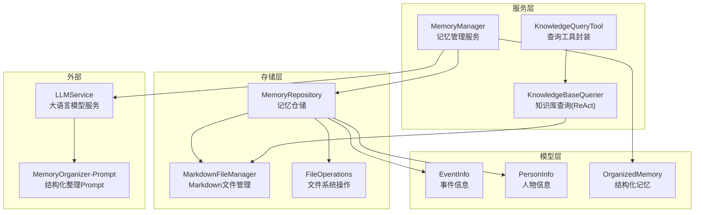
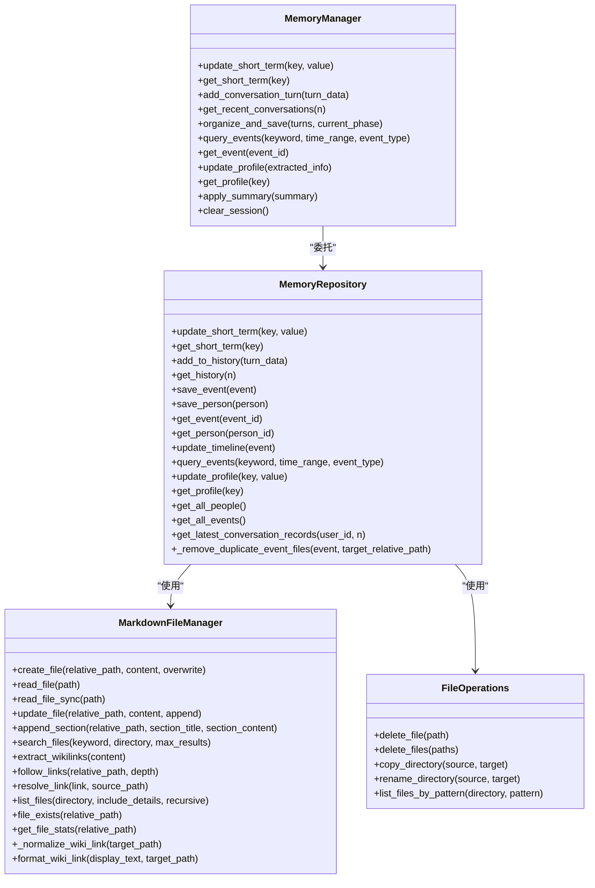
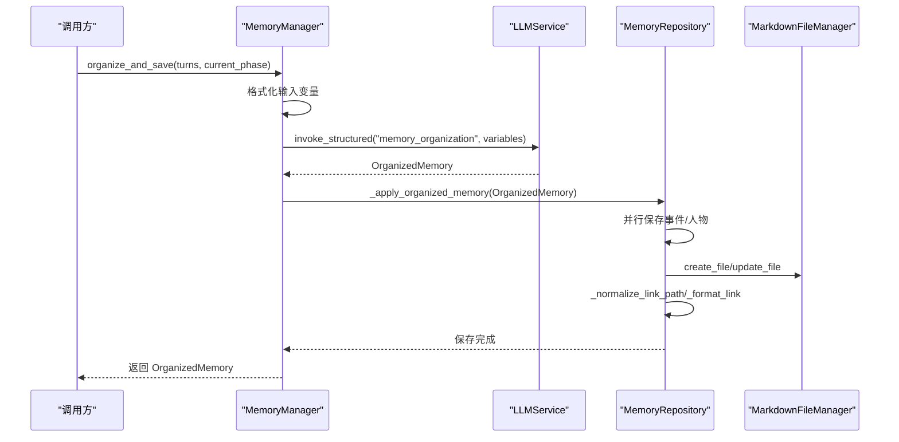
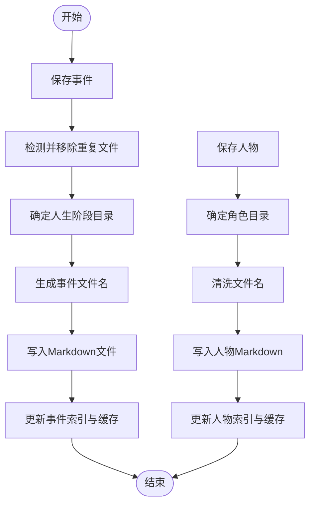
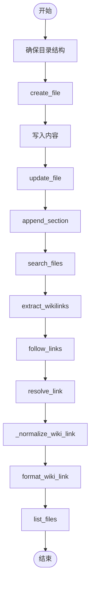
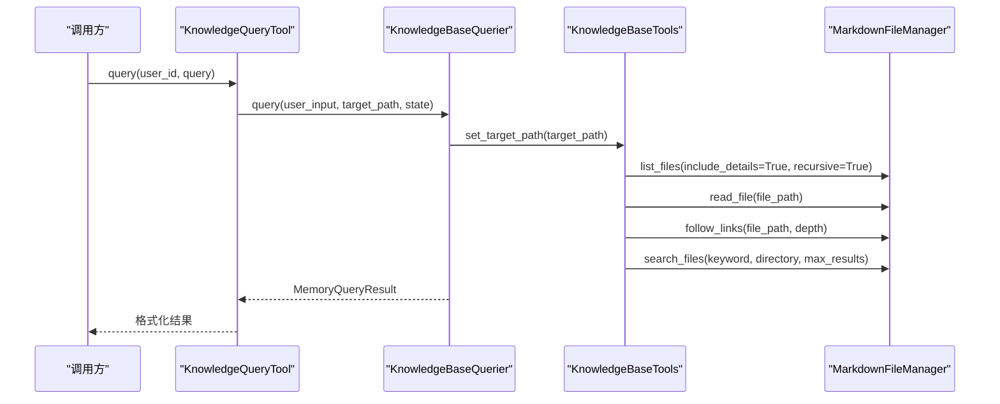
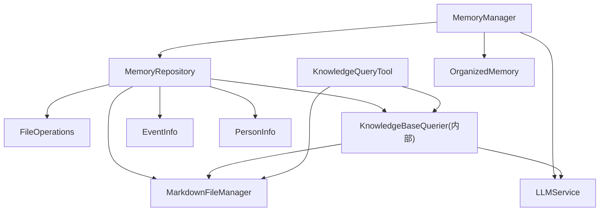

# 记忆管理系统

<cite>
**本文引用的文件**
- [memory_manager.py](file://src/services/memory_manager.py)
- [memory_repository.py](file://src/storage/memory_repository.py)
- [markdown_file_manager.py](file://src/storage/markdown_file_manager.py)
- [file_operations.py](file://src/storage/file_operations.py)
- [event_info.py](file://src/models/event_info.py)
- [person_info.py](file://src/models/person_info.py)
- [organized_memory.py](file://src/models/organized_memory.py)
- [knowledge_base_querier.py](file://src/services/knowledge_base_querier.py)
- [knowledge_query_tool.py](file://src/tools/knowledge_query_tool.py)
- [phase_type.py](file://src/enums/phase_type.py)
- [MemoryOrganizer-Prompt.md](file://Prompts/MemoryOrganizer-Prompt.md)
- [README.md](file://README.md)
- [test_memory_manager.py](file://tests/test_memory_manager.py)
- [test_memory_repository.py](file://tests/test_memory_repository.py)
- [test_markdown_file_manager.py](file://tests/test_markdown_file_manager.py)
</cite>

## 更新摘要
**变更内容**
- 增强了 MarkdownFileManager 的路径规范化和链接处理能力，修复了路径重复问题
- 新增了独立的 file_operations.py 文件，提供底层文件系统操作工具
- 改进了 MemoryRepository 的重复事件文件检测和清理机制
- 优化了链接解析和规范化算法，提升了文件操作的可靠性

## 目录
1. [简介](#简介)
2. [项目结构](#项目结构)
3. [核心组件](#核心组件)
4. [架构总览](#架构总览)
5. [详细组件分析](#详细组件分析)
6. [依赖关系分析](#依赖关系分析)
7. [性能考量](#性能考量)
8. [故障排查指南](#故障排查指南)
9. [结论](#结论)
10. [附录](#附录)

## 简介
本文件面向"记忆管理系统"的技术文档，聚焦三层记忆架构（短期记忆、长期记忆、画像记忆）的设计理念与实现，系统梳理 MemoryManager 的组织结构与存储策略、MemoryRepository 的数据模型与检索算法、MarkdownFileManager 的文件管理机制，并给出记忆查询（语义检索、关键词搜索、关联查询）的实现方式与最佳实践、性能优化建议（缓存策略、存储空间管理）。

## 项目结构
系统采用分层架构，围绕"知识库（Markdown 文件系统）"为核心存储，结合 LLM 的结构化整理能力，形成"对话→结构化→存储→查询"的闭环。

**图表来源**
- [memory_manager.py:27-470](file://src/services/memory_manager.py#L27-L470)
- [memory_repository.py:40-359](file://src/storage/memory_repository.py#L40-L359)
- [markdown_file_manager.py:31-546](file://src/storage/markdown_file_manager.py#L31-L546)
- [file_operations.py:18-126](file://src/storage/file_operations.py#L18-L126)

**章节来源**
- [README.md:27-200](file://README.md#L27-L200)

## 核心组件
- MemoryManager：统一管理三层记忆的读写与结构化整理，协调 MemoryRepository 与 LLMService，提供短期记忆、长期记忆、画像记忆的统一接口。
- MemoryRepository：三层记忆的统一仓储，负责短期内存缓存、长期文件系统持久化、画像索引与查询，具备重复文件检测和清理能力。
- MarkdownFileManager：文件系统抽象，提供异步/同步文件读写、全文搜索、Wiki链接追踪、目录结构管理，增强路径规范化和链接解析。
- FileOperations：独立的文件系统操作工具类，提供删除、复制、重命名等底层文件操作，补充 MarkdownFileManager 的功能。
- 结构化模型：EventInfo、PersonInfo、OrganizedMemory 等，支撑数据模型与存储格式。
- KnowledgeBaseQuerier：基于 ReAct 的知识库查询服务，结合工具链实现路径探索、文件读取、链接追踪与结果解析。
- KnowledgeQueryTool：对外查询工具封装，简化调用。

**章节来源**
- [memory_manager.py:27-470](file://src/services/memory_manager.py#L27-L470)
- [memory_repository.py:40-359](file://src/storage/memory_repository.py#L40-L359)
- [markdown_file_manager.py:31-546](file://src/storage/markdown_file_manager.py#L31-L546)
- [file_operations.py:18-126](file://src/storage/file_operations.py#L18-L126)

## 架构总览
三层记忆架构的设计理念与职责：
- 短期记忆：驻留于内存，容量有限，用于会话上下文与近期对话历史，支持快速读写与容量淘汰。
- 长期记忆：以 Markdown 文件系统持久化，按事件/人物/时间线维度组织，支持结构化存储与跨文件链接，具备智能重复文件检测。
- 画像记忆：结构化索引，记录主人公基础信息、性格特征、价值观、关系网络等，支持增量更新与去重合并。

**图表来源**
- [memory_manager.py:27-470](file://src/services/memory_manager.py#L27-L470)
- [memory_repository.py:40-359](file://src/storage/memory_repository.py#L40-L359)
- [markdown_file_manager.py:31-546](file://src/storage/markdown_file_manager.py#L31-L546)
- [file_operations.py:18-126](file://src/storage/file_operations.py#L18-L126)

## 详细组件分析

### MemoryManager 实现原理
- 组织结构与职责
  - 短期记忆：维护键值对与对话历史队列，容量受控。
  - 长期记忆：通过 LLM 将对话整理为结构化 OrganizedMemory，再并行保存事件与人物，并更新时间线。
  - 画像记忆：从结构化结果中提取主人公画像与关系网络，进行去重合并与增量更新。
- 存储策略
  - 事件与人物文件按人生阶段与角色分类存储，时间线文件集中维护。
  - 采用并行异步写入，提高吞吐；缓存命中优先，减少重复解析。
  - 增强的链接规范化机制，确保跨文件引用的准确性。
- 检索算法
  - 事件查询：基于内存索引与缓存的关键词/类型过滤。
  - 画像查询：基于短期内存键值访问。
- 关键流程（结构化整理与保存）
  - 格式化输入变量（对话内容、现有时间线、现有人物、当前人生阶段）。
  - 调用 LLM 的 memory_organization 模板，输出结构化 OrganizedMemory。
  - 转换为 EventInfo/PersonInfo，保存事件并更新时间线，保存人物，更新画像。

**图表来源**
- [memory_manager.py:114-197](file://src/services/memory_manager.py#L114-L197)
- [memory_manager.py:277-325](file://src/services/memory_manager.py#L277-L325)

**章节来源**
- [memory_manager.py:27-470](file://src/services/memory_manager.py#L27-L470)

### MemoryRepository 数据模型设计
- 短期记忆
  - 字典存储，带时间戳；对话历史为固定容量的队列，超出容量淘汰最早项。
- 长期记忆
  - 事件：EventInfo，转为 Markdown 写入 events/{phase}/{title}.md。
  - 人物：PersonInfo，转为 Markdown 写入 people/{role}/{name}.md；主人公单独存储。
  - 时间线：更新 timeline/life-events.md，追加时间点条目。
  - 索引与缓存：事件与人物索引字典 + LRU 缓存，查询优先命中缓存。
  - 重复文件检测：智能检测同一年份、同类型、标题高度相似的旧事件文件并清理。
- 画像记忆
  - 以短期内存键值形式存储，键名前缀 profile:，便于与短期记忆隔离。
- 查询
  - 事件查询：遍历索引，按关键词与类型过滤。
  - 人物/事件获取：优先缓存，其次索引。
- 工具方法
  - 人生阶段目录映射、角色目录映射、文件名清洗与生成。

**图表来源**
- [memory_repository.py:176-226](file://src/storage/memory_repository.py#L176-L226)
- [memory_repository.py:228-246](file://src/storage/memory_repository.py#L228-L246)
- [memory_repository.py:401-447](file://src/storage/memory_repository.py#L401-L447)

**章节来源**
- [memory_repository.py:40-359](file://src/storage/memory_repository.py#L40-L359)

### MarkdownFileManager 文件管理机制
- 目录结构管理
  - 确保 events/childhood、events/youth、events/middle_age、events/elderly、people/family、people/friends、people/colleagues、people/others、timeline、themes 等目录存在；创建 index.md。
- 文件创建与读写
  - 异步创建/更新文件，支持覆盖与追加；同步读取用于特定场景。
  - 追加章节：在文件末尾追加 Markdown 章节。
- 全文搜索
  - 遍历目录下所有 .md 文件，按关键词匹配，计算相关度并返回上下文。
- 链接处理
  - 提取 Wiki 链接，支持递归追踪，解析链接为绝对路径。
  - 增强的路径规范化：自动去除 knowledge_base 前缀，处理相对路径和绝对路径。
- 工具方法
  - 列出文件、检查存在、获取文件统计信息。

**图表来源**
- [markdown_file_manager.py:80-131](file://src/storage/markdown_file_manager.py#L80-L131)
- [markdown_file_manager.py:134-282](file://src/storage/markdown_file_manager.py#L134-L282)
- [markdown_file_manager.py:285-355](file://src/storage/markdown_file_manager.py#L285-L355)
- [markdown_file_manager.py:358-472](file://src/storage/markdown_file_manager.py#L358-L472)
- [markdown_file_manager.py:475-546](file://src/storage/markdown_file_manager.py#L475-L546)
- [markdown_file_manager.py:299-386](file://src/storage/markdown_file_manager.py#L299-L386)

**章节来源**
- [markdown_file_manager.py:31-546](file://src/storage/markdown_file_manager.py#L31-L546)

### FileOperations 文件系统操作
- 独立的文件系统操作工具类，提供 MarkdownFileManager 未覆盖的功能：
  - 异步删除单个文件和批量删除文件
  - 递归复制目录和重命名/移动目录
  - 按 glob 模式列出文件
- 设计特点
  - 静态方法设计，无实例状态
  - 异步删除操作，提高性能
  - 错误处理完善，提供详细的日志信息

**章节来源**
- [file_operations.py:18-126](file://src/storage/file_operations.py#L18-L126)

### 记忆查询实现方式
- 语义检索（ReAct 模式）
  - KnowledgeBaseQuerier 通过 LangChain Agent，结合 list_files、read_file、follow_links、search_content、mark_suspected_file、get_exploration_report 等工具，实现路径探索、文件读取、链接追踪与结果解析。
  - 工具描述中严格限定查询范围，确保所有操作在目标路径内执行。
- 关键词搜索
  - MarkdownFileManager 的 search_files 提供全文关键词搜索，支持最大结果数限制与相关度排序。
- 关联查询
  - 通过 Wiki 链接提取与 follow_links，实现跨文件的关联内容追踪。
- 知识查询工具封装
  - KnowledgeQueryTool 封装查询入口，自动拼接用户目录路径，格式化结果。

**图表来源**
- [knowledge_query_tool.py:33-66](file://src/tools/knowledge_query_tool.py#L33-L66)
- [knowledge_base_querier.py:257-373](file://src/services/knowledge_base_querier.py#L257-L373)

**章节来源**
- [knowledge_base_querier.py:202-540](file://src/services/knowledge_base_querier.py#L202-L540)
- [knowledge_query_tool.py:11-81](file://src/tools/knowledge_query_tool.py#L11-L81)
- [markdown_file_manager.py:285-355](file://src/storage/markdown_file_manager.py#L285-L355)

## 依赖关系分析
- MemoryManager 依赖 MemoryRepository 与 LLMService，负责高层记忆管理与结构化整理。
- MemoryRepository 依赖 MarkdownFileManager、FileOperations 与 KnowledgeBaseQuerier（内部实例），负责文件系统与查询工具。
- KnowledgeBaseQuerier 依赖 LLMService 与 MarkdownFileManager，提供 ReAct 查询能力。
- KnowledgeQueryTool 依赖 KnowledgeBaseQuerier 与 MarkdownFileManager，提供对外查询封装。
- FileOperations 独立存在，为系统提供底层文件操作支持。
- 模型层（EventInfo、PersonInfo、OrganizedMemory）为数据契约，贯穿存储与查询。

**图表来源**
- [memory_manager.py:5-12](file://src/services/memory_manager.py#L5-L12)
- [memory_repository.py:8-87](file://src/storage/memory_repository.py#L8-L87)
- [knowledge_base_querier.py:10-234](file://src/services/knowledge_base_querier.py#L10-L234)
- [knowledge_query_tool.py:25-31](file://src/tools/knowledge_query_tool.py#L25-L31)
- [file_operations.py:18-126](file://src/storage/file_operations.py#L18-L126)

**章节来源**
- [memory_manager.py:1-15](file://src/services/memory_manager.py#L1-L15)
- [memory_repository.py:1-13](file://src/storage/memory_repository.py#L1-L13)
- [knowledge_base_querier.py:1-14](file://src/services/knowledge_base_querier.py#L1-L14)
- [knowledge_query_tool.py:1-8](file://src/tools/knowledge_query_tool.py#L1-L8)

## 性能考量
- 缓存策略
  - MemoryRepository 内置 LRU 缓存，命中优先，降低重复解析成本；事件与人物索引配合缓存，查询 O(1)。
  - 短期记忆容量可控，避免无限增长；对话历史队列固定容量，保证会话上下文新鲜度。
- 并发与异步
  - MemoryManager 在应用结构化结果时采用 asyncio.gather 并行保存事件与人物，显著提升吞吐。
  - MarkdownFileManager 的文件读写采用异步 aiofiles，适合高并发场景。
  - FileOperations 提供异步删除操作，提高批量文件处理性能。
- 存储空间管理
  - 事件与人物文件按阶段/角色分类，便于清理与迁移；时间线集中维护，减少碎片。
  - 增强的重复文件检测机制，自动清理同一年份、同类型、标题高度相似的旧文件。
  - 建议定期归档旧用户目录，清理冗余文件；对超大文件进行拆分或压缩。
- 搜索效率
  - 全文搜索限制最大结果数，避免全库扫描带来的性能开销；相关度评分用于排序。
  - ReAct 查询通过一次性列出所有层级目录，减少多次往返调用。
  - 增强的路径规范化算法，减少链接解析的时间开销。

## 故障排查指南
- LLM 结构化输出失败
  - 现象：MemoryManager 组织失败，返回空结构化结果。
  - 排查：检查 LLMService 的 memory_organization 模板是否正确加载；查看日志错误信息。
  - 参考：[memory_manager.py:147-149](file://src/services/memory_manager.py#L147-L149)
- 文件写入异常
  - 现象：保存事件/人物时报错或文件未创建。
  - 排查：确认 MarkdownFileManager 的 base_path 是否存在；检查权限与磁盘空间；查看覆盖/追加逻辑。
  - 参考：[markdown_file_manager.py:134-170](file://src/storage/markdown_file_manager.py#L134-L170)
- 查询无结果
  - 现象：ReAct 查询返回空或仅探索报告。
  - 排查：确认 target_path 是否正确；检查工具描述中的路径限制；确认文件名与关键词匹配。
  - 参考：[knowledge_base_querier.py:280-294](file://src/services/knowledge_base_querier.py#L280-L294)
- 短期记忆溢出
  - 现象：会话历史过多导致内存占用上升。
  - 排查：检查 MemoryRepository 的历史容量配置；必要时调用 clear_session 清空短期记忆。
  - 参考：[memory_repository.py:107-110](file://src/storage/memory_repository.py#L107-L110)
- 路径解析错误
  - 现象：Wiki 链接无法正确解析或显示。
  - 排查：检查 _normalize_wiki_link 和 resolve_link 方法；确认路径格式和相对路径解析。
  - 参考：[markdown_file_manager.py:299-386](file://src/storage/markdown_file_manager.py#L299-L386)
  - 参考：[markdown_file_manager.py:699-747](file://src/storage/markdown_file_manager.py#L699-L747)
- 重复文件清理失败
  - 现象：事件文件重复或清理不彻底。
  - 排查：检查 _remove_duplicate_event_files 方法；确认文件内容解析和相似度计算。
  - 参考：[memory_repository.py:401-447](file://src/storage/memory_repository.py#L401-L447)

**章节来源**
- [memory_manager.py:147-149](file://src/services/memory_manager.py#L147-L149)
- [markdown_file_manager.py:134-170](file://src/storage/markdown_file_manager.py#L134-L170)
- [knowledge_base_querier.py:280-294](file://src/services/knowledge_base_querier.py#L280-L294)
- [memory_repository.py:107-110](file://src/storage/memory_repository.py#L107-L110)
- [markdown_file_manager.py:299-386](file://src/storage/markdown_file_manager.py#L299-L386)
- [markdown_file_manager.py:699-747](file://src/storage/markdown_file_manager.py#L699-L747)
- [memory_repository.py:401-447](file://src/storage/memory_repository.py#L401-L447)

## 结论
记忆管理系统通过三层记忆架构与结构化整理流程，实现了从对话到知识库的高效闭环。MemoryManager 作为高层协调者，结合 MemoryRepository 的三层存储与 MarkdownFileManager 的文件系统能力，提供了稳定可靠的长期记忆与画像管理；新增的 FileOperations 类进一步增强了系统的文件操作能力；增强的路径规范化和重复文件检测机制提升了系统的可靠性和数据质量。KnowledgeBaseQuerier 以 ReAct 模式实现语义检索与关联查询，满足复杂知识库的动态探索需求。通过合理的缓存策略与异步并发，系统在性能与可维护性之间取得良好平衡。

## 附录
- 三层记忆区别与作用机制
  - 短期记忆：会话上下文与近期对话，容量小、速度快。
  - 长期记忆：结构化 Markdown 文件，按阶段/角色组织，支持跨文件链接，具备智能重复文件检测。
  - 画像记忆：结构化索引，记录主人公画像与关系网络，支持增量更新。
- 最佳实践
  - 使用 MemoryManager 的 organize_and_save 统一入口，确保结构化整理与存储一致性。
  - 合理设置短期记忆容量与历史队列长度，避免内存压力。
  - 对大文件采用分段写入与异步更新，提升稳定性。
  - 定期清理冗余文件与旧用户目录，控制存储空间。
  - 使用 KnowledgeQueryTool 进行对外查询封装，统一路径与格式化输出。
  - 利用 FileOperations 进行批量文件操作，提高系统维护效率。
  - 充分利用增强的路径规范化功能，确保链接的准确性和一致性。