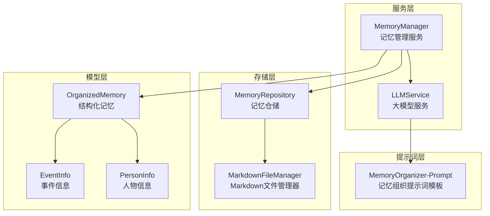
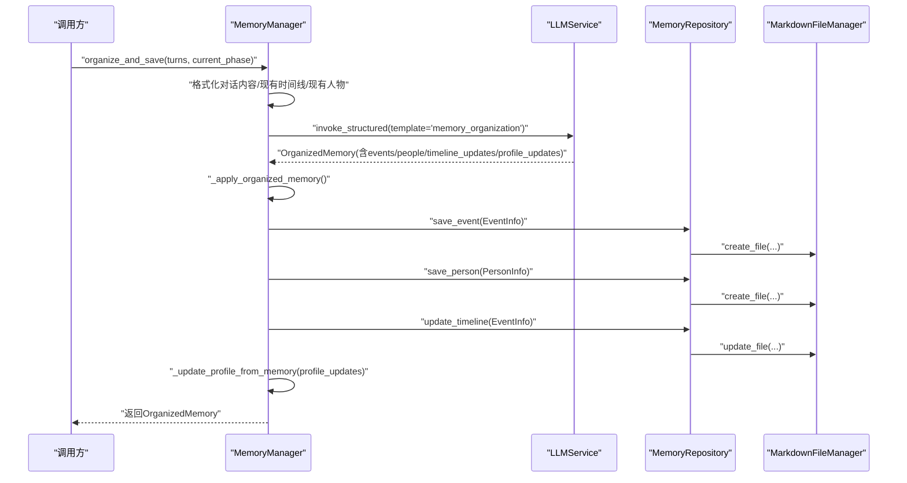
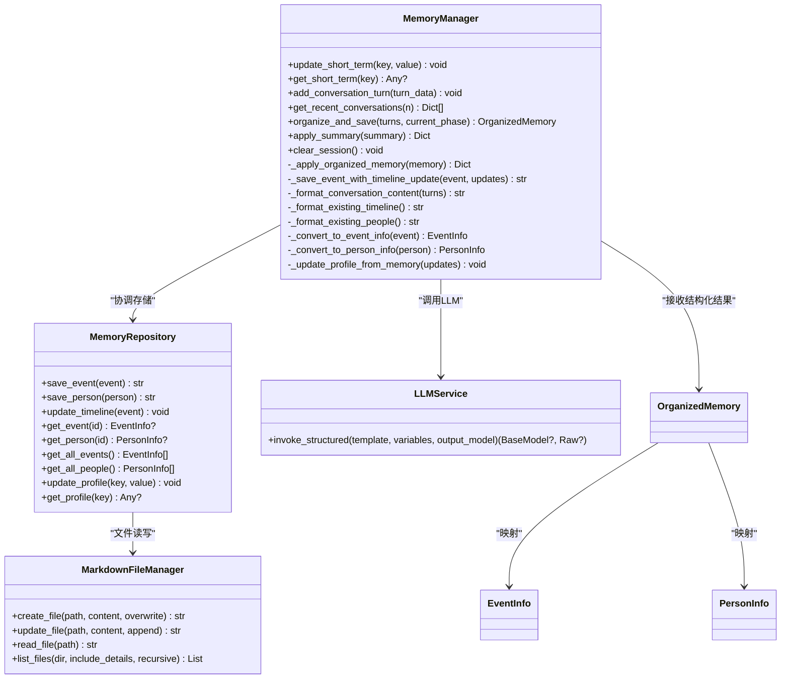
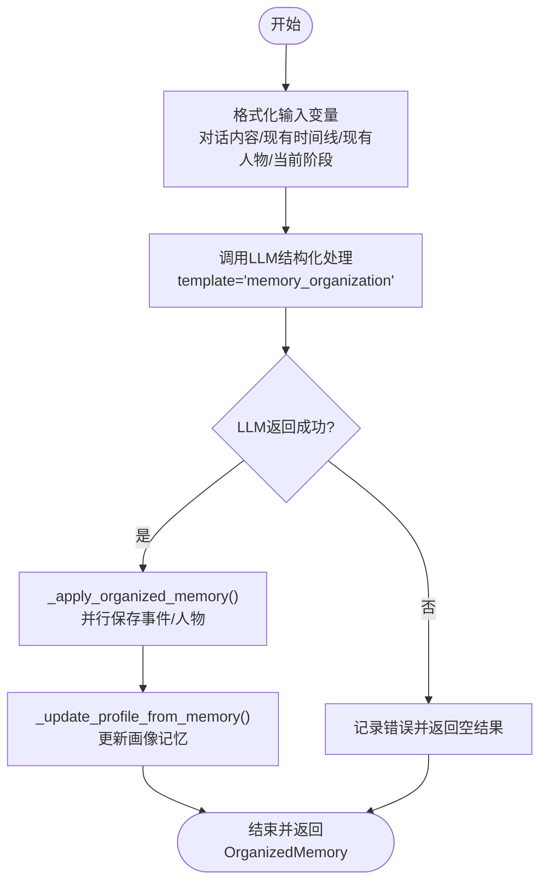
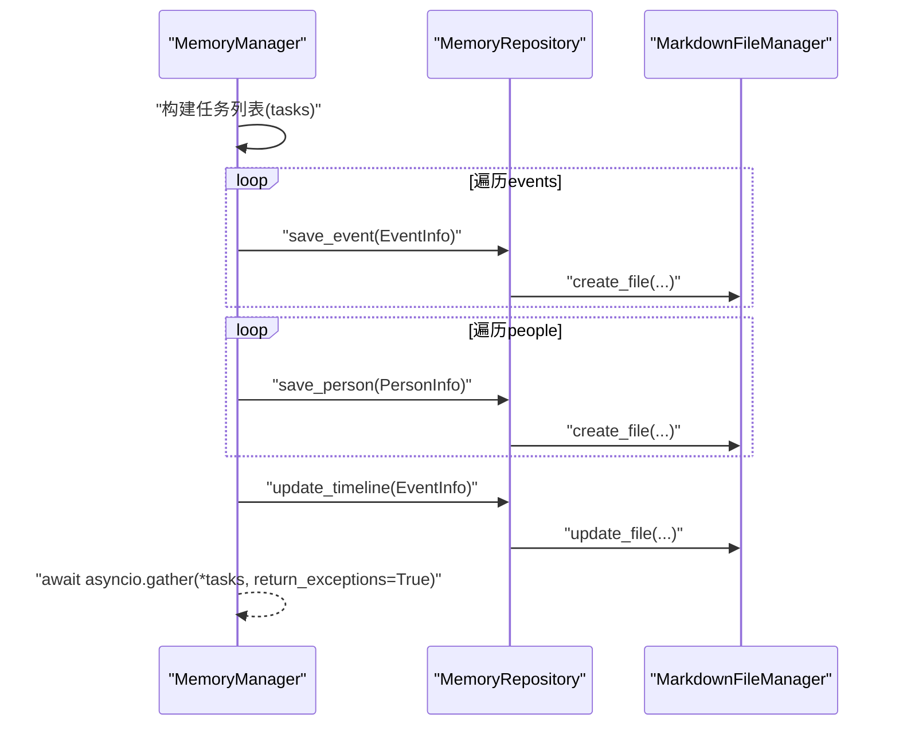
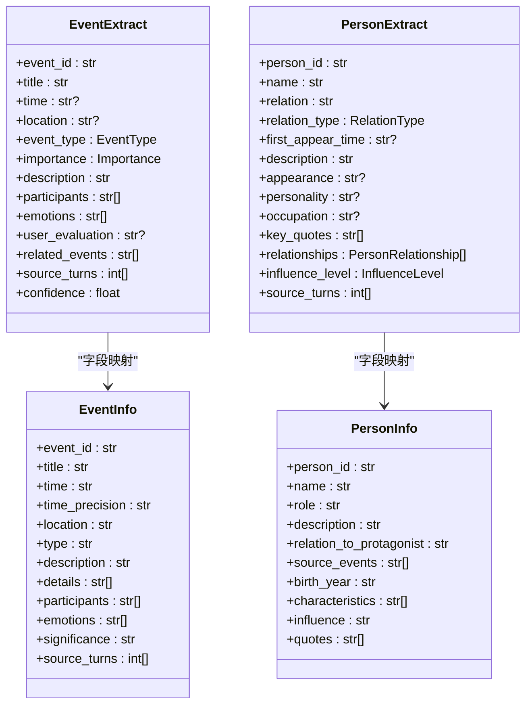
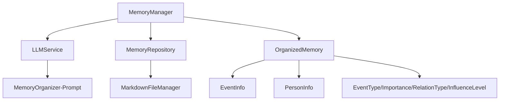

# 记忆组织工作流

<cite>
**本文档引用的文件**
- [src/services/memory_manager.py](file://src/services/memory_manager.py)
- [src/storage/memory_repository.py](file://src/storage/memory_repository.py)
- [src/storage/markdown_file_manager.py](file://src/storage/markdown_file_manager.py)
- [src/services/llm_service.py](file://src/services/llm_service.py)
- [Prompts/MemoryOrganizer-Prompt.md](file://Prompts/MemoryOrganizer-Prompt.md)
- [src/models/organized_memory.py](file://src/models/organized_memory.py)
- [src/models/event_info.py](file://src/models/event_info.py)
- [src/models/person_info.py](file://src/models/person_info.py)
- [src/enums/phase_type.py](file://src/enums/phase_type.py)
- [src/models/conversation_turn.py](file://src/models/conversation_turn.py)
- [src/models/session_state.py](file://src/models/session_state.py)
- [demo_memory_storage.py](file://demo_memory_storage.py)
</cite>

## 目录
1. [简介](#简介)
2. [项目结构](#项目结构)
3. [核心组件](#核心组件)
4. [架构总览](#架构总览)
5. [详细组件分析](#详细组件分析)
6. [依赖关系分析](#依赖关系分析)
7. [性能考量](#性能考量)
8. [故障排查指南](#故障排查指南)
9. [结论](#结论)
10. [附录](#附录)

## 简介
本文件面向“记忆组织工作流”的技术文档，围绕 MemoryManager 的 organize_and_save 方法展开，系统阐述：
- 对话内容格式化
- LLM 结构化处理
- 多维度存储（时间线、事件、人物）
- 并行处理机制（事件保存、人物保存、时间线更新）
- 记忆转换过程（EventExtract 到 EventInfo、PersonExtract 到 PersonInfo）
- 画像记忆更新（主人公信息与关系网络）
- 错误处理与回滚机制
- 性能监控与优化建议

## 项目结构
该项目采用分层架构，围绕“对话-记忆-存储”主线组织：
- 服务层：MemoryManager 负责协调 LLM 整理与存储
- 存储层：MemoryRepository 提供三层记忆（短期、长期、画像）统一访问
- 文件层：MarkdownFileManager 负责文件系统读写与索引
- LLM 层：LLMService 提供统一的结构化输出能力
- 模型层：OrganizedMemory、EventInfo、PersonInfo 等数据模型定义

图表来源
- [src/services/memory_manager.py:27-156](file://src/services/memory_manager.py#L27-L156)
- [src/storage/memory_repository.py:40-87](file://src/storage/memory_repository.py#L40-L87)
- [src/storage/markdown_file_manager.py:31-45](file://src/storage/markdown_file_manager.py#L31-L45)
- [src/services/llm_service.py:32-69](file://src/services/llm_service.py#L32-L69)
- [Prompts/MemoryOrganizer-Prompt.md:1-773](file://Prompts/MemoryOrganizer-Prompt.md#L1-L773)
- [src/models/organized_memory.py:141-151](file://src/models/organized_memory.py#L141-L151)
- [src/models/event_info.py:5-33](file://src/models/event_info.py#L5-L33)
- [src/models/person_info.py:5-32](file://src/models/person_info.py#L5-L32)

章节来源
- [src/services/memory_manager.py:27-156](file://src/services/memory_manager.py#L27-L156)
- [src/storage/memory_repository.py:40-87](file://src/storage/memory_repository.py#L40-L87)
- [src/storage/markdown_file_manager.py:31-45](file://src/storage/markdown_file_manager.py#L31-L45)
- [src/services/llm_service.py:32-69](file://src/services/llm_service.py#L32-L69)
- [Prompts/MemoryOrganizer-Prompt.md:1-773](file://Prompts/MemoryOrganizer-Prompt.md#L1-L773)
- [src/models/organized_memory.py:141-151](file://src/models/organized_memory.py#L141-L151)
- [src/models/event_info.py:5-33](file://src/models/event_info.py#L5-L33)
- [src/models/person_info.py:5-32](file://src/models/person_info.py#L5-L32)

## 核心组件
- MemoryManager：对外提供 organize_and_save 接口，负责格式化输入、调用 LLM、应用结构化结果、并行保存与画像更新。
- MemoryRepository：三层记忆统一入口，提供事件/人物/时间线的读写与索引、LRU缓存、画像记忆。
- MarkdownFileManager：文件系统抽象，负责创建/读取/更新 Markdown 文件，支持全文检索与 Wiki 链接追踪。
- LLMService：统一的大模型调用入口，支持结构化输出与模板管理。
- OrganizedMemory/EventExtract/PersonExtract：结构化输出模型，定义时间线更新、事件、人物、画像更新等字段。
- EventInfo/PersonInfo：最终落盘的结构化数据模型，提供 to_markdown 序列化。

章节来源
- [src/services/memory_manager.py:27-156](file://src/services/memory_manager.py#L27-L156)
- [src/storage/memory_repository.py:40-87](file://src/storage/memory_repository.py#L40-L87)
- [src/storage/markdown_file_manager.py:31-45](file://src/storage/markdown_file_manager.py#L31-L45)
- [src/services/llm_service.py:32-69](file://src/services/llm_service.py#L32-L69)
- [src/models/organized_memory.py:141-151](file://src/models/organized_memory.py#L141-L151)
- [src/models/event_info.py:5-33](file://src/models/event_info.py#L5-L33)
- [src/models/person_info.py:5-32](file://src/models/person_info.py#L5-L32)

## 架构总览
记忆组织工作流的端到端流程如下：

图表来源
- [src/services/memory_manager.py:111-156](file://src/services/memory_manager.py#L111-L156)
- [src/services/memory_manager.py:158-193](file://src/services/memory_manager.py#L158-L193)
- [src/storage/memory_repository.py:176-200](file://src/storage/memory_repository.py#L176-L200)
- [src/storage/memory_repository.py:202-226](file://src/storage/memory_repository.py#L202-L226)
- [src/storage/memory_repository.py:248-260](file://src/storage/memory_repository.py#L248-L260)
- [src/services/llm_service.py:32-69](file://src/services/llm_service.py#L32-L69)
- [Prompts/MemoryOrganizer-Prompt.md:83-183](file://Prompts/MemoryOrganizer-Prompt.md#L83-L183)

## 详细组件分析

### MemoryManager 组件
- 职责
  - 统一管理三层记忆的读写
  - 调用 LLM 将对话内容整理为结构化信息
  - 协调 MemoryRepository 完成存储
  - 提供记忆查询接口
- 关键方法
  - organize_and_save：主流程（格式化输入、调用 LLM、应用结果、并行保存、画像更新）
  - _apply_organized_memory：并行保存事件/人物，触发时间线更新
  - _save_event_with_timeline_update：事件保存并更新时间线
  - _convert_to_event_info/_convert_to_person_info：结构化数据映射
  - _update_profile_from_memory：画像记忆更新（主人公信息与关系网络）

图表来源
- [src/services/memory_manager.py:27-156](file://src/services/memory_manager.py#L27-L156)
- [src/storage/memory_repository.py:40-87](file://src/storage/memory_repository.py#L40-L87)
- [src/storage/markdown_file_manager.py:31-45](file://src/storage/markdown_file_manager.py#L31-L45)
- [src/services/llm_service.py:32-69](file://src/services/llm_service.py#L32-L69)
- [src/models/organized_memory.py:141-151](file://src/models/organized_memory.py#L141-L151)
- [src/models/event_info.py:5-33](file://src/models/event_info.py#L5-L33)
- [src/models/person_info.py:5-32](file://src/models/person_info.py#L5-L32)

章节来源
- [src/services/memory_manager.py:27-156](file://src/services/memory_manager.py#L27-L156)
- [src/storage/memory_repository.py:40-87](file://src/storage/memory_repository.py#L40-L87)
- [src/storage/markdown_file_manager.py:31-45](file://src/storage/markdown_file_manager.py#L31-L45)
- [src/services/llm_service.py:32-69](file://src/services/llm_service.py#L32-L69)
- [src/models/organized_memory.py:141-151](file://src/models/organized_memory.py#L141-L151)
- [src/models/event_info.py:5-33](file://src/models/event_info.py#L5-L33)
- [src/models/person_info.py:5-32](file://src/models/person_info.py#L5-L32)

### organize_and_save 方法全流程
- 输入准备
  - 对话内容格式化：逐轮转为“第 N 轮、时间、用户、助手”结构
  - 现有时间线与人物索引格式化：限制数量与排序
  - 当前人生阶段标签映射
- LLM 结构化处理
  - 使用 memory_organization 模板，输出 OrganizedMemory
  - 包含 timeline_updates、events、people、profile_updates、storage_suggestions、processing_summary
- 应用结构化结果
  - 并行保存事件与人物，事件保存后按 timeline_updates 触发时间线更新
  - 更新画像记忆（主人公信息与关系网络）
- 返回值
  - 返回 OrganizedMemory，便于上层继续处理或记录

图表来源
- [src/services/memory_manager.py:111-156](file://src/services/memory_manager.py#L111-L156)
- [src/services/memory_manager.py:158-193](file://src/services/memory_manager.py#L158-L193)
- [Prompts/MemoryOrganizer-Prompt.md:83-183](file://Prompts/MemoryOrganizer-Prompt.md#L83-L183)

章节来源
- [src/services/memory_manager.py:111-156](file://src/services/memory_manager.py#L111-L156)
- [Prompts/MemoryOrganizer-Prompt.md:83-183](file://Prompts/MemoryOrganizer-Prompt.md#L83-L183)

### 记忆整理的三个维度
- 时间线梳理
  - timeline_updates：包含时间点、时间类型、人生阶段、事件引用、意义
  - 保存事件后，根据 event_reference 匹配更新时间线文件
- 事件分类
  - 事件类型枚举：birth、family、education、career、marriage、children、achievement、difficulty、migration、other
  - 重要性：core、important、normal
  - 事件信息包含时间、地点、参与者、情感标签、用户评价、来源对话轮次等
- 人物关系识别
  - 人物关系类型：family、friend、colleague、neighbor、teacher、student、other
  - 影响程度：high、medium、low
  - 关系网络：通过 profile_updates 的关系边更新画像记忆

章节来源
- [src/models/organized_memory.py:6-46](file://src/models/organized_memory.py#L6-L46)
- [src/models/organized_memory.py:48-78](file://src/models/organized_memory.py#L48-L78)
- [src/models/organized_memory.py:80-94](file://src/models/organized_memory.py#L80-L94)
- [src/models/organized_memory.py:106-115](file://src/models/organized_memory.py#L106-L115)
- [src/storage/memory_repository.py:248-260](file://src/storage/memory_repository.py#L248-L260)

### 并行处理机制
- 并行保存策略
  - 事件保存与时间线更新：每个事件生成一个任务，完成后统一 gather
  - 人物保存：每个人物生成一个任务，完成后统一 gather
  - 两个任务集合并发执行，提升吞吐
- 异步执行策略
  - 使用 asyncio.gather 并发执行多个 IO 密集型任务
  - return_exceptions=True 保证部分失败不影响整体流程
- 时间线更新
  - 事件保存后，遍历 timeline_updates，匹配 event_reference 后更新时间线文件

图表来源
- [src/services/memory_manager.py:158-193](file://src/services/memory_manager.py#L158-L193)
- [src/storage/memory_repository.py:176-200](file://src/storage/memory_repository.py#L176-L200)
- [src/storage/memory_repository.py:202-226](file://src/storage/memory_repository.py#L202-L226)
- [src/storage/memory_repository.py:248-260](file://src/storage/memory_repository.py#L248-L260)

章节来源
- [src/services/memory_manager.py:158-193](file://src/services/memory_manager.py#L158-L193)
- [src/storage/memory_repository.py:176-200](file://src/storage/memory_repository.py#L176-L200)
- [src/storage/memory_repository.py:202-226](file://src/storage/memory_repository.py#L202-L226)
- [src/storage/memory_repository.py:248-260](file://src/storage/memory_repository.py#L248-L260)

### 记忆转换过程
- EventExtract → EventInfo
  - 字段映射：event_id、title、time、location、type、description、participants、emotions、user_evaluation、source_turns、confidence
  - 未包含 fields：details、related_events、time_precision
- PersonExtract → PersonInfo
  - 字段映射：person_id、name、role、description、relation_to_protagonist、source_events、birth_year、characteristics、influence、quotes
  - 未包含 fields：appearance、personality、occupation、key_quotes、relationships、influence_level、source_turns
  - 关系映射：将 PersonExtract.relationships 转为字典

图表来源
- [src/services/memory_manager.py:251-283](file://src/services/memory_manager.py#L251-L283)
- [src/models/organized_memory.py:58-94](file://src/models/organized_memory.py#L58-L94)
- [src/models/event_info.py:5-33](file://src/models/event_info.py#L5-L33)
- [src/models/person_info.py:5-32](file://src/models/person_info.py#L5-L32)

章节来源
- [src/services/memory_manager.py:251-283](file://src/services/memory_manager.py#L251-L283)
- [src/models/organized_memory.py:58-94](file://src/models/organized_memory.py#L58-L94)
- [src/models/event_info.py:5-33](file://src/models/event_info.py#L5-L33)
- [src/models/person_info.py:5-32](file://src/models/person_info.py#L5-L32)

### 画像记忆的更新机制
- 主人公信息
  - birth_year、birth_place、key_life_events、personality_traits、values_hints
  - 使用 set 去重合并，避免重复
- 关系网络
  - 通过 profile_updates.relationship_network 遍历边，以 relation_{p1}_{p2} 作为键存储关系描述与证据
- 更新策略
  - 仅在存在 profile_updates 时才执行
  - 画像记忆存储在短期记忆索引中，便于快速读取

章节来源
- [src/services/memory_manager.py:349-395](file://src/services/memory_manager.py#L349-L395)
- [src/storage/memory_repository.py:288-298](file://src/storage/memory_repository.py#L288-L298)

### 错误处理与回滚机制
- LLM 调用失败
  - 当 LLM 返回 None 时，记录错误并返回空的 OrganizedMemory.empty()
- 并行保存异常
  - 使用 return_exceptions=True，捕获异常并继续执行其他任务
  - 通过返回字典中的字符串路径统计成功保存数量
- 文件系统异常
  - MarkdownFileManager 在 create/update 时抛出 FileNotFoundError 或写入异常
  - 建议上层捕获并进行重试或降级处理
- 回滚建议
  - 当前实现未提供自动回滚；建议在事务型存储或原子写入基础上增加回滚策略（例如：先写临时文件，成功后再替换）

章节来源
- [src/services/memory_manager.py:147-149](file://src/services/memory_manager.py#L147-L149)
- [src/services/memory_manager.py:184-186](file://src/services/memory_manager.py#L184-L186)
- [src/storage/markdown_file_manager.py:134-169](file://src/storage/markdown_file_manager.py#L134-L169)
- [src/storage/markdown_file_manager.py:231-261](file://src/storage/markdown_file_manager.py#L231-L261)

### 性能监控与优化建议
- 性能监控
  - LLMService 记录调用耗时、Token 使用量、错误率
  - 建议在 MemoryManager 中记录 organize_and_save 的耗时与任务数量
- 优化建议
  - 事件/人物数量较多时，考虑分批并发（控制并发度上限）
  - LRU 缓存命中率：通过 _cache.get/_cache.put 提升查询效率
  - 文件系统写入：批量写入或延迟写入，减少磁盘压力
  - Prompt 模板复用：确保模板加载一次性完成，避免重复解析

章节来源
- [src/services/llm_service.py:20-30](file://src/services/llm_service.py#L20-L30)
- [src/storage/memory_repository.py:16-38](file://src/storage/memory_repository.py#L16-L38)

## 依赖关系分析
- 组件耦合
  - MemoryManager 依赖 LLMService 与 MemoryRepository
  - MemoryRepository 依赖 MarkdownFileManager
  - LLMService 依赖 Prompt 模板与配置
- 数据模型依赖
  - OrganizedMemory 依赖 EventType、Importance、RelationType、InfluenceLevel
  - EventInfo/PersonInfo 依赖各自 to_markdown 序列化

图表来源
- [src/services/memory_manager.py:5-13](file://src/services/memory_manager.py#L5-L13)
- [src/storage/memory_repository.py:8-11](file://src/storage/memory_repository.py#L8-L11)
- [src/services/llm_service.py:12-13](file://src/services/llm_service.py#L12-L13)
- [Prompts/MemoryOrganizer-Prompt.md:1-773](file://Prompts/MemoryOrganizer-Prompt.md#L1-L773)
- [src/models/organized_memory.py:6-46](file://src/models/organized_memory.py#L6-L46)

章节来源
- [src/services/memory_manager.py:5-13](file://src/services/memory_manager.py#L5-L13)
- [src/storage/memory_repository.py:8-11](file://src/storage/memory_repository.py#L8-L11)
- [src/services/llm_service.py:12-13](file://src/services/llm_service.py#L12-L13)
- [Prompts/MemoryOrganizer-Prompt.md:1-773](file://Prompts/MemoryOrganizer-Prompt.md#L1-L773)
- [src/models/organized_memory.py:6-46](file://src/models/organized_memory.py#L6-L46)

## 性能考量
- 并发策略
  - 事件与人物保存并发执行，减少总耗时
  - 建议根据硬件资源设置最大并发数，避免磁盘与网络拥塞
- 缓存策略
  - LRU 缓存用于事件/人物索引，降低重复读取成本
- I/O 优化
  - MarkdownFileManager 使用异步文件操作，适合高并发写入
- LLM 成本控制
  - 控制输入长度与上下文窗口，合理裁剪 existing_timeline/existing_people
  - 使用结构化输出减少后处理开销

## 故障排查指南
- LLM 返回空结果
  - 检查模板名称与变量是否正确传递
  - 查看日志中的错误信息，定位 Prompt 或模型配置问题
- 并发保存失败
  - 检查返回的异常列表，定位具体失败的任务
  - 确认文件路径权限与磁盘空间
- 时间线未更新
  - 确认 timeline_updates 中的 event_reference 是否与事件 ID 匹配
  - 检查时间线文件是否存在与可写
- 画像更新无效
  - 确认 profile_updates 是否为空
  - 检查键名格式（如 relation_{p1}_{p2}）是否一致

章节来源
- [src/services/memory_manager.py:147-149](file://src/services/memory_manager.py#L147-L149)
- [src/services/memory_manager.py:184-186](file://src/services/memory_manager.py#L184-L186)
- [src/storage/memory_repository.py:248-260](file://src/storage/memory_repository.py#L248-L260)
- [src/services/memory_manager.py:349-395](file://src/services/memory_manager.py#L349-L395)

## 结论
记忆组织工作流通过 MemoryManager 的 organize_and_save 方法，实现了从对话到结构化记忆再到多维度存储的完整闭环。其核心优势在于：
- LLM 结构化输出确保信息质量与一致性
- 并行保存显著提升吞吐
- 三层记忆分离使系统具备良好的可扩展性
- 画像记忆动态维护为主人公自传提供持续演进的能力

建议在生产环境中进一步完善错误回滚、并发限流与监控告警，以保障稳定性与可观测性。

## 附录
- 示例演示脚本展示了存储路径结构与主人公单独存储功能，可作为集成参考
- 会话状态与对话轮次模型为工作流提供了上下文与进度跟踪能力

章节来源
- [demo_memory_storage.py:16-115](file://demo_memory_storage.py#L16-L115)
- [src/models/session_state.py:24-86](file://src/models/session_state.py#L24-L86)
- [src/models/conversation_turn.py:14-52](file://src/models/conversation_turn.py#L14-L52)