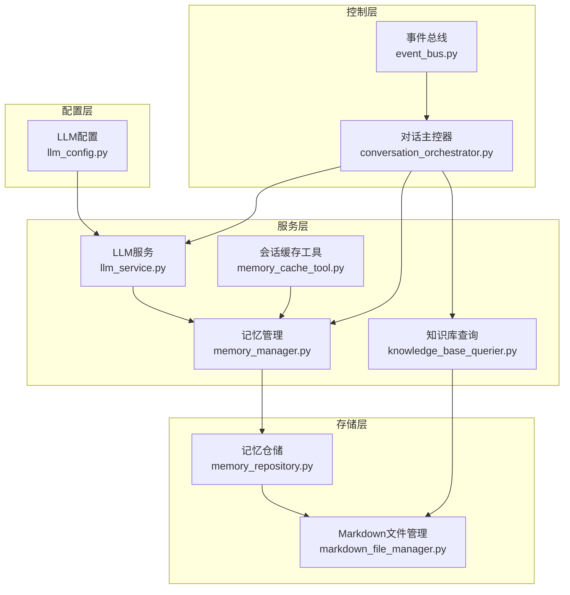
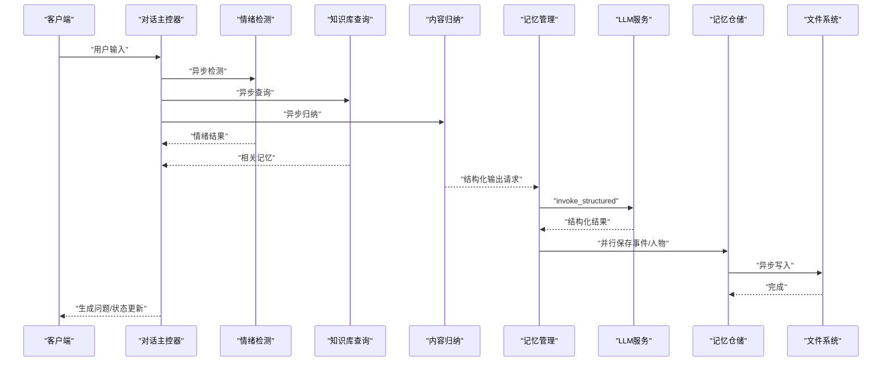
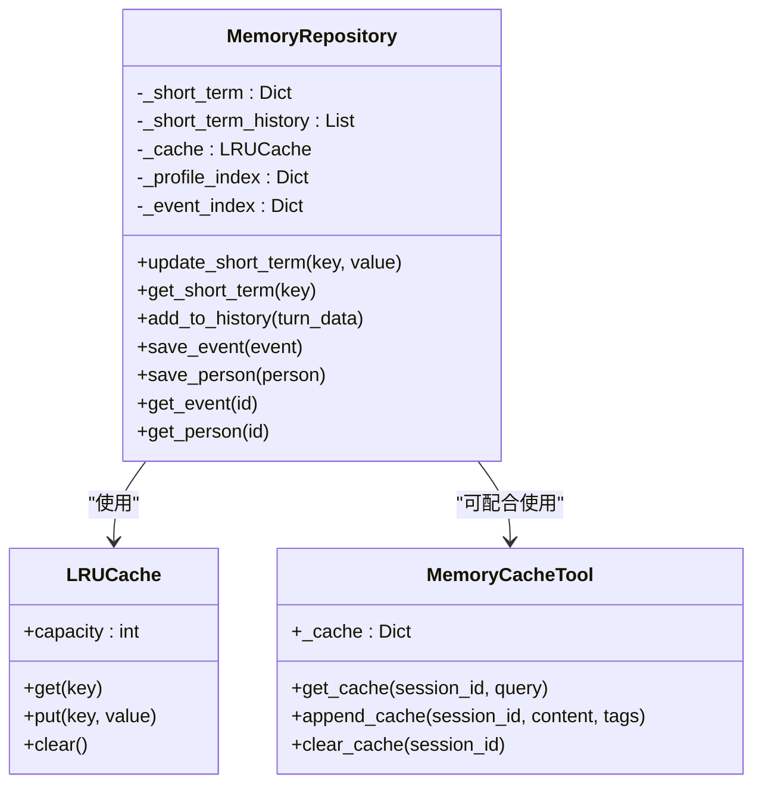
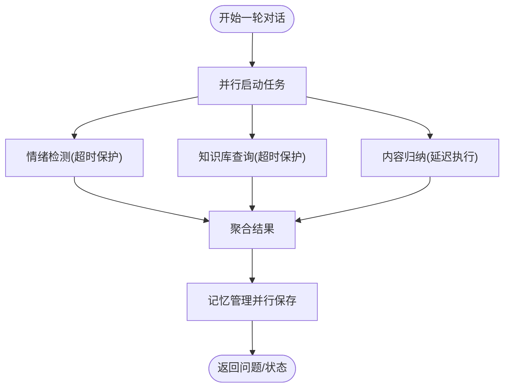
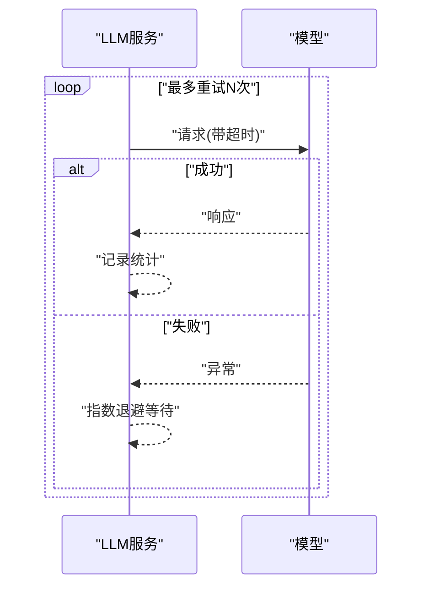
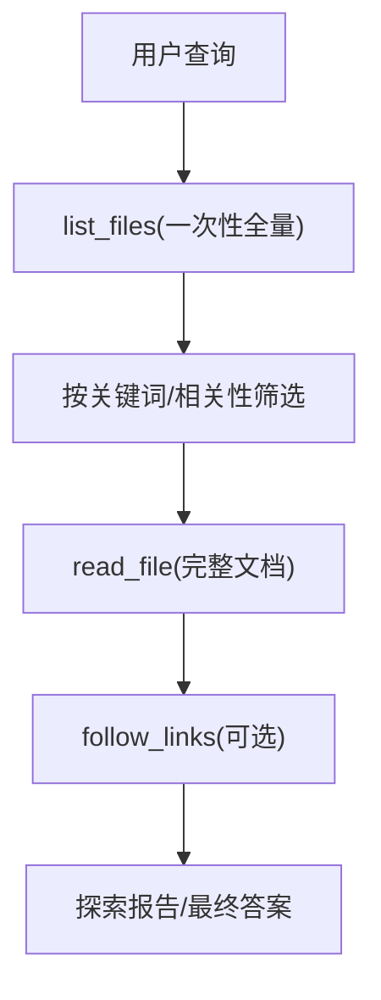
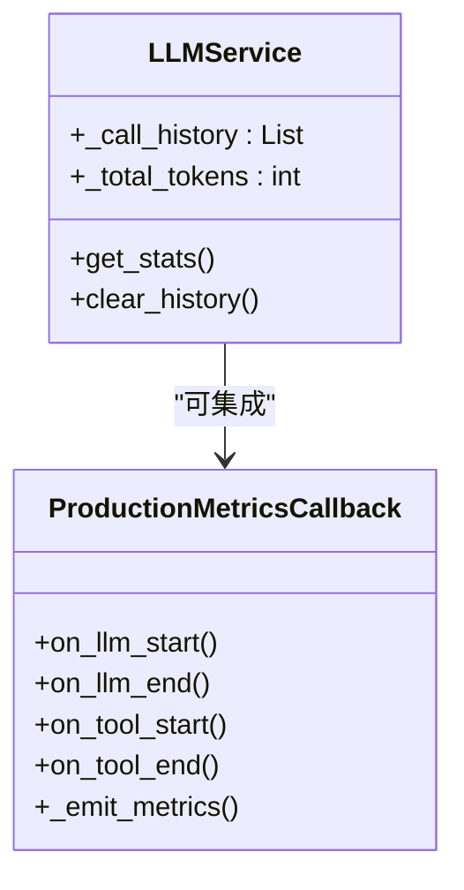
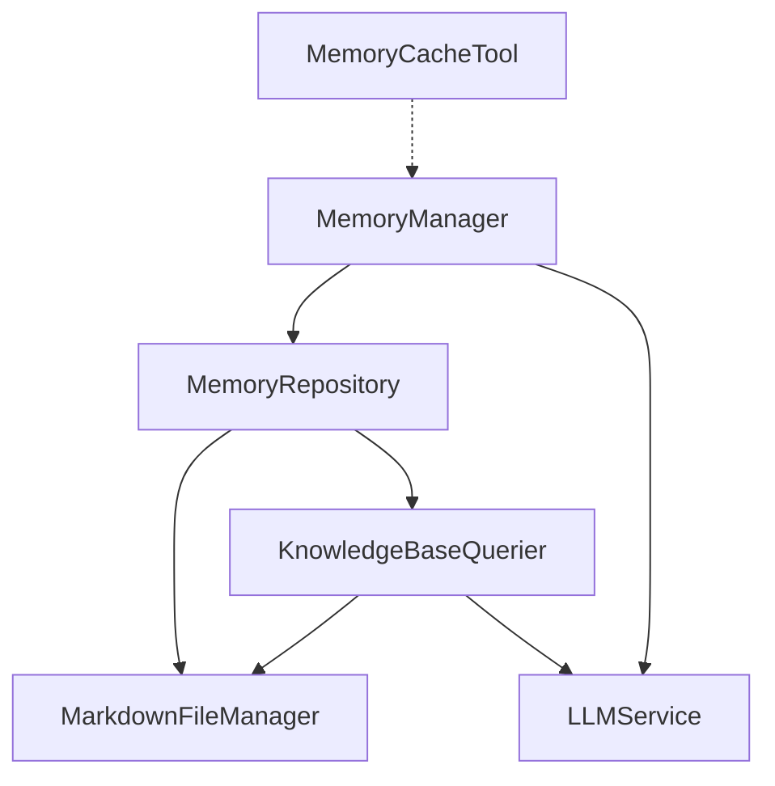

# 性能优化配置

<cite>
**本文档引用的文件**
- [llm_config.py](file://src/config/llm_config.py)
- [llm_service.py](file://src/services/llm_service.py)
- [memory_manager.py](file://src/services/memory_manager.py)
- [memory_repository.py](file://src/storage/memory_repository.py)
- [markdown_file_manager.py](file://src/storage/markdown_file_manager.py)
- [knowledge_base_querier.py](file://src/services/knowledge_base_querier.py)
- [memory_cache_tool.py](file://src/tools/memory_cache_tool.py)
- [event_bus.py](file://src/core/event_bus.py)
- [conversation_orchestrator.py](file://src/core/conversation_orchestrator.py)
- [production-checklist.md](file://langgraph-agent-dev/references/production-checklist.md)
- [Refactor-底层代码优化重构Spec.md](file://开发故事卡/Refactor-底层代码优化重构Spec.md)
- [Task-009-012-实现系统组装层.md](file://开发故事卡/Task-009-012-实现系统组装层.md)
- [test_memory_manager.py](file://tests/test_memory_manager.py)
- [test_core_services.py](file://test_core_services.py)
</cite>

## 目录
1. [简介](#简介)
2. [项目结构](#项目结构)
3. [核心组件](#核心组件)
4. [架构概览](#架构概览)
5. [详细组件分析](#详细组件分析)
6. [依赖分析](#依赖分析)
7. [性能考虑](#性能考虑)
8. [故障排除指南](#故障排除指南)
9. [结论](#结论)
10. [附录](#附录)

## 简介
本文件面向性能优化配置，围绕内存管理、并发处理、网络性能、数据库调优、监控指标与负载场景调整策略展开，结合代码库现有实现，提供可落地的配置建议与最佳实践，确保系统在高并发与大数据量场景下的稳定运行。

## 项目结构
该项目采用分层架构，核心分为配置层、服务层、存储层与工具层，并通过事件总线与对话主控器协调各组件异步协作。关键模块包括：
- 配置层：LLM配置管理（提供模型提供商、超时、重试等参数）
- 服务层：LLM服务、记忆管理、知识库查询、情绪检测、问题生成等
- 存储层：Markdown文件管理、LRU缓存、三层记忆（短期/长期/画像）
- 工具层：会话级缓存工具、查询工具、归档工具
- 控制层：事件总线、对话主控器（负责异步任务调度与超时控制）

**图表来源**
- [llm_config.py:10-120](file://src/config/llm_config.py#L10-L120)
- [llm_service.py:32-89](file://src/services/llm_service.py#L32-L89)
- [memory_manager.py:27-61](file://src/services/memory_manager.py#L27-L61)
- [memory_repository.py:40-87](file://src/storage/memory_repository.py#L40-L87)
- [markdown_file_manager.py:31-78](file://src/storage/markdown_file_manager.py#L31-L78)
- [knowledge_base_querier.py:202-236](file://src/services/knowledge_base_querier.py#L202-L236)
- [memory_cache_tool.py:8-33](file://src/tools/memory_cache_tool.py#L8-L33)
- [event_bus.py:125-170](file://src/core/event_bus.py#L125-L170)
- [conversation_orchestrator.py:430-483](file://src/core/conversation_orchestrator.py#L430-L483)

**章节来源**
- [llm_config.py:10-120](file://src/config/llm_config.py#L10-L120)
- [llm_service.py:32-89](file://src/services/llm_service.py#L32-L89)
- [memory_manager.py:27-61](file://src/services/memory_manager.py#L27-L61)
- [memory_repository.py:40-87](file://src/storage/memory_repository.py#L40-L87)
- [markdown_file_manager.py:31-78](file://src/storage/markdown_file_manager.py#L31-L78)
- [knowledge_base_querier.py:202-236](file://src/services/knowledge_base_querier.py#L202-L236)
- [memory_cache_tool.py:8-33](file://src/tools/memory_cache_tool.py#L8-L33)
- [event_bus.py:125-170](file://src/core/event_bus.py#L125-L170)
- [conversation_orchestrator.py:430-483](file://src/core/conversation_orchestrator.py#L430-L483)

## 核心组件
- LLM配置与调用：集中管理模型提供商、超时、重试、结构化输出与统计
- 记忆管理：短期/长期/画像三层记忆的统一编排与并行持久化
- 存储层：LRU缓存、索引与文件系统操作；支持异步读写
- 知识库查询：ReAct模式的动态探索与工具调用
- 会话缓存工具：会话级短期记忆缓存（建议迁移到记忆管理）
- 事件总线与主控器：异步任务调度、超时保护与状态流转

**章节来源**
- [llm_service.py:32-89](file://src/services/llm_service.py#L32-L89)
- [memory_manager.py:27-61](file://src/services/memory_manager.py#L27-L61)
- [memory_repository.py:16-38](file://src/storage/memory_repository.py#L16-L38)
- [knowledge_base_querier.py:202-236](file://src/services/knowledge_base_querier.py#L202-L236)
- [memory_cache_tool.py:8-33](file://src/tools/memory_cache_tool.py#L8-L33)
- [event_bus.py:125-170](file://src/core/event_bus.py#L125-L170)
- [conversation_orchestrator.py:430-483](file://src/core/conversation_orchestrator.py#L430-L483)

## 架构概览
系统通过对话主控器协调多个异步任务（情绪检测、知识库查询、内容归纳），并在超时保护下快速返回，同时将关键任务（如记忆整理）委派给记忆管理服务，后者通过LLM服务进行结构化输出，并并行持久化到存储层。

**图表来源**
- [conversation_orchestrator.py:506-592](file://src/core/conversation_orchestrator.py#L506-L592)
- [memory_manager.py:111-156](file://src/services/memory_manager.py#L111-L156)
- [llm_service.py:327-398](file://src/services/llm_service.py#L327-L398)
- [memory_repository.py:176-226](file://src/storage/memory_repository.py#L176-L226)
- [markdown_file_manager.py:134-169](file://src/storage/markdown_file_manager.py#L134-L169)

**章节来源**
- [conversation_orchestrator.py:506-592](file://src/core/conversation_orchestrator.py#L506-L592)
- [memory_manager.py:111-156](file://src/services/memory_manager.py#L111-L156)
- [llm_service.py:327-398](file://src/services/llm_service.py#L327-L398)
- [memory_repository.py:176-226](file://src/storage/memory_repository.py#L176-L226)
- [markdown_file_manager.py:134-169](file://src/storage/markdown_file_manager.py#L134-L169)

## 详细组件分析

### 内存管理配置
- 短期记忆容量：MemoryRepository构造参数short_term_capacity控制（默认20轮），超出容量按FIFO丢弃最早项，避免无限增长
- LRU缓存容量：MemoryRepository构造参数cache_capacity控制（默认100），基于OrderedDict实现LRU淘汰
- 画像记忆：以内存字典维护，便于快速查询与更新
- 事件/人物索引：维护事件与人物对象的内存索引，加速查询
- 会话缓存工具：MemoryCacheTool提供会话级短期缓存（内存字典），建议迁移至MemoryManager以统一管理

**图表来源**
- [memory_repository.py:16-87](file://src/storage/memory_repository.py#L16-L87)
- [memory_cache_tool.py:8-33](file://src/tools/memory_cache_tool.py#L8-L33)

**章节来源**
- [memory_repository.py:54-87](file://src/storage/memory_repository.py#L54-L87)
- [memory_cache_tool.py:29-89](file://src/tools/memory_cache_tool.py#L29-L89)

### 并发处理配置
- 异步任务调度：对话主控器在process_turn中并行启动情绪检测、知识库查询与内容归纳任务，并设置超时保护
- 并行持久化：记忆管理在应用结构化结果时，使用asyncio.gather并行保存事件与人物，提升吞吐
- 事件总线异步处理：事件总线对异步订阅者使用create_task与gather保证并发执行与等待
- LLM调用重试：LLMService内置指数退避重试，降低瞬时错误影响

**图表来源**
- [conversation_orchestrator.py:520-592](file://src/core/conversation_orchestrator.py#L520-L592)
- [memory_manager.py:170-193](file://src/services/memory_manager.py#L170-L193)
- [event_bus.py:130-170](file://src/core/event_bus.py#L130-L170)
- [llm_service.py:400-437](file://src/services/llm_service.py#L400-L437)

**章节来源**
- [conversation_orchestrator.py:520-592](file://src/core/conversation_orchestrator.py#L520-L592)
- [memory_manager.py:170-193](file://src/services/memory_manager.py#L170-L193)
- [event_bus.py:130-170](file://src/core/event_bus.py#L130-L170)
- [llm_service.py:400-437](file://src/services/llm_service.py#L400-L437)

### 网络性能优化
- LLM调用超时与重试：LLMConfig提供timeout与max_retries、retry_delay，LLMService在invoke_with_retry中实现指数退避
- LLM模型适配：支持OpenAI/DeepSeek/Anthropic，统一通过ChatOpenAI封装，便于切换与扩展
- 知识库查询工具：KnowledgeBaseQuerier通过LangChain Agent框架与工具集合实现ReAct模式，减少无效往返

**图表来源**
- [llm_config.py:35-41](file://src/config/llm_config.py#L35-L41)
- [llm_service.py:400-437](file://src/services/llm_service.py#L400-L437)

**章节来源**
- [llm_config.py:35-41](file://src/config/llm_config.py#L35-L41)
- [llm_service.py:90-124](file://src/services/llm_service.py#L90-L124)
- [knowledge_base_querier.py:237-255](file://src/services/knowledge_base_querier.py#L237-L255)

### 数据库性能调优
- 文件系统即数据库：本项目以Markdown文件作为“数据库”，通过MarkdownFileManager提供异步读写、全文搜索、链接追踪等能力
- 索引与缓存：MemoryRepository维护事件/人物索引与LRU缓存，显著降低重复读取成本
- 查询优化：KnowledgeBaseQuerier采用ReAct模式，先list_files一次性获取全量目录结构，再按相关性优先读取完整文档，减少碎片化IO

**图表来源**
- [knowledge_base_querier.py:54-195](file://src/services/knowledge_base_querier.py#L54-L195)
- [markdown_file_manager.py:475-528](file://src/storage/markdown_file_manager.py#L475-L528)

**章节来源**
- [memory_repository.py:262-284](file://src/storage/memory_repository.py#L262-L284)
- [knowledge_base_querier.py:54-195](file://src/services/knowledge_base_querier.py#L54-L195)
- [markdown_file_manager.py:285-354](file://src/storage/markdown_file_manager.py#L285-L354)

### 监控指标配置
- LLM调用统计：LLMService记录调用次数、总token用量、成功率与平均延迟，便于成本与性能分析
- 自定义回调：ProductionMetricsCallback可接入LangChain回调体系，采集LLM耗时、token用量、工具调用与错误信息
- 建议指标：请求QPS、P95/P99延迟、错误率、重试次数、缓存命中率、文件系统IO延迟

**图表来源**
- [llm_service.py:449-461](file://src/services/llm_service.py#L449-L461)
- [production-checklist.md:58-141](file://langgraph-agent-dev/references/production-checklist.md#L58-L141)

**章节来源**
- [llm_service.py:449-461](file://src/services/llm_service.py#L449-L461)
- [production-checklist.md:58-141](file://langgraph-agent-dev/references/production-checklist.md#L58-L141)

## 依赖分析
- 组件耦合：MemoryRepository与KnowledgeBaseQuerier存在循环依赖风险（重构Spec指出），建议通过接口抽象与依赖注入解决
- 全局状态：LLMService通过全局单例被多个组件隐式依赖，建议改为显式注入以提升可测试性
- 工具自管：MemoryCacheTool/MemoryArchiveTool各自创建依赖，建议合并到MemoryManager统一管理

**图表来源**
- [Refactor-底层代码优化重构Spec.md:34-61](file://开发故事卡/Refactor-底层代码优化重构Spec.md#L34-L61)
- [Task-009-012-实现系统组装层.md:402-477](file://开发故事卡/Task-009-012-实现系统组装层.md#L402-L477)

**章节来源**
- [Refactor-底层代码优化重构Spec.md:34-61](file://开发故事卡/Refactor-底层代码优化重构Spec.md#L34-L61)
- [Task-009-012-实现系统组装层.md:402-477](file://开发故事卡/Task-009-012-实现系统组装层.md#L402-L477)

## 性能考虑
- 内存管理
  - 短期记忆容量：根据会话轮次与上下文长度权衡，建议在对话主控器配置中设置合理上限
  - LRU缓存容量：根据事件/人物热点访问频率调整，避免缓存过大导致内存压力
  - 画像记忆：定期清理冗余字段，避免重复序列化开销
- 并发处理
  - 任务超时：对话主控器已设置超时保护，建议针对不同服务（情绪检测、知识库查询、内容归纳）分别配置
  - 并行度：根据CPU与IO能力调整asyncio.gather并发数量，避免资源争用
- 网络性能
  - 超时与重试：根据SLA设定timeout与max_retries，结合指数退避降低抖动
  - 模型切换：在高并发场景优先选择低延迟模型或启用本地推理
- 存储性能
  - 异步IO：确保所有文件操作使用异步接口，避免阻塞事件循环
  - 索引与缓存：合理设置LRU容量，结合热点数据预热
- 监控与容量规划
  - 基于LLMService统计与自定义回调指标，建立容量基线与预警阈值
  - 结合负载测试，评估不同场景下的QPS、延迟与错误率

[本节为通用性能指导，无需特定文件引用]

## 故障排除指南
- LLM调用失败
  - 检查超时与重试配置，确认指数退避是否生效
  - 查看LLMService调用历史与错误信息，定位失败原因
- 知识库查询无结果
  - 确认目标路径合法性与权限
  - 检查ReAct流程中list_files是否正常执行，关键词是否准确
- 记忆保存异常
  - 检查文件系统写入权限与磁盘空间
  - 关注LRU缓存与索引一致性
- 并发任务阻塞
  - 确认事件总线异步处理是否正确使用create_task与gather
  - 检查对话主控器超时设置是否过短

**章节来源**
- [llm_service.py:285-291](file://src/services/llm_service.py#L285-L291)
- [knowledge_base_querier.py:280-294](file://src/services/knowledge_base_querier.py#L280-L294)
- [memory_repository.py:176-200](file://src/storage/memory_repository.py#L176-L200)
- [event_bus.py:130-170](file://src/core/event_bus.py#L130-L170)
- [conversation_orchestrator.py:535-551](file://src/core/conversation_orchestrator.py#L535-L551)

## 结论
通过合理的内存管理（短期记忆容量、LRU缓存、画像索引）、并发处理（异步任务调度与超时保护）、网络优化（超时与重试策略）、存储优化（异步IO与索引）以及完善的监控指标，系统可在高并发与大数据量场景下保持稳定与高效。建议结合重构计划逐步消除循环依赖与全局状态，进一步提升可维护性与性能表现。

[本节为总结性内容，无需特定文件引用]

## 附录
- 负载场景与配置调整策略
  - 低负载：适度放宽超时，启用较短的短期记忆容量与较小LRU缓存
  - 中负载：平衡超时与重试，维持默认短期记忆与缓存容量
  - 高负载：缩短超时阈值，增加重试间隔，扩大LRU缓存，启用热点预热
- 测试与验证
  - 使用单元测试验证记忆管理与知识库查询的关键路径
  - 使用系统测试脚本验证核心服务端到端流程

**章节来源**
- [test_memory_manager.py:32-96](file://tests/test_memory_manager.py#L32-L96)
- [test_core_services.py:144-164](file://test_core_services.py#L144-L164)