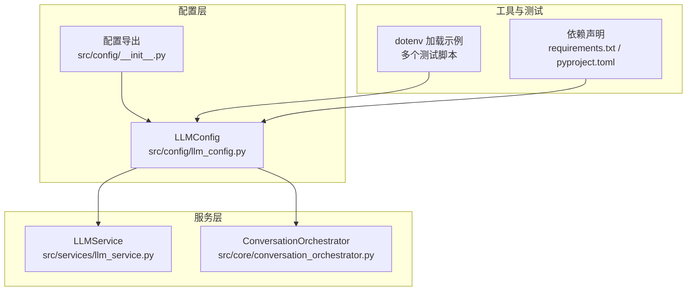
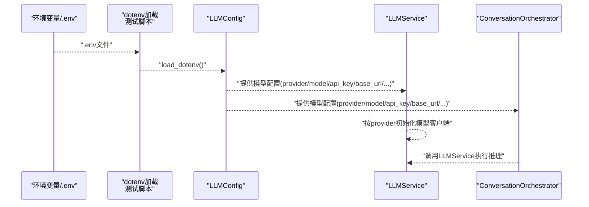
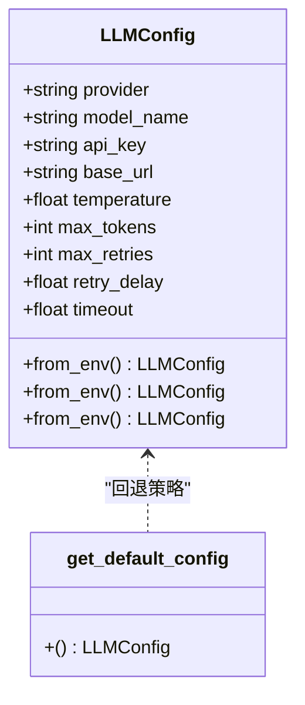
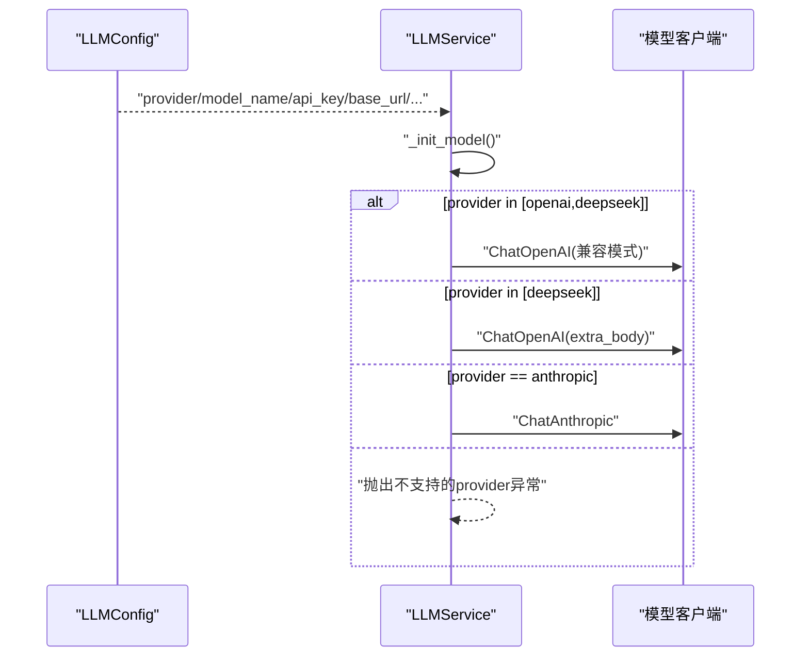
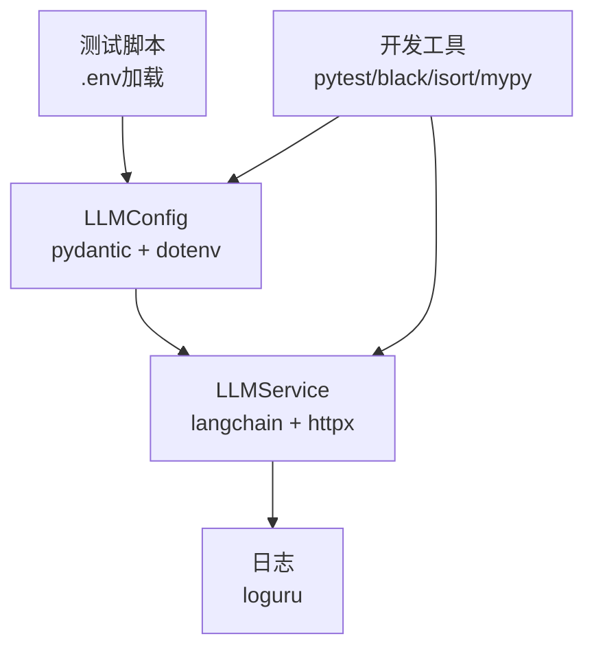

# 环境配置管理

<cite>
**本文引用的文件**
- [src/config/llm_config.py](file://src/config/llm_config.py)
- [src/config/__init__.py](file://src/config/__init__.py)
- [src/services/llm_service.py](file://src/services/llm_service.py)
- [src/core/conversation_orchestrator.py](file://src/core/conversation_orchestrator.py)
- [requirements.txt](file://requirements.txt)
- [pyproject.toml](file://pyproject.toml)
- [test_integration.py](file://test_integration.py)
- [test_system_assembly.py](file://test_system_assembly.py)
- [integration_test_new_user.py](file://integration_test_new_user.py)
- [verify_llm_service.py](file://verify_llm_service.py)
- [langgraph-agent-dev/references/production-checklist.md](file://langgraph-agent-dev/references/production-checklist.md)
</cite>

## 目录
1. [简介](#简介)
2. [项目结构](#项目结构)
3. [核心组件](#核心组件)
4. [架构总览](#架构总览)
5. [详细组件分析](#详细组件分析)
6. [依赖分析](#依赖分析)
7. [性能考虑](#性能考虑)
8. [故障排查指南](#故障排查指南)
9. [结论](#结论)
10. [附录](#附录)

## 简介
本文件围绕“环境配置管理”主题，系统梳理本项目在环境变量设置与管理方面的实现方式，重点覆盖以下方面：
- 必需配置项：API密钥、模型提供商与模型名、基础URL、温度与最大Token、重试与超时等
- 配置来源与优先级：.env文件、系统环境变量、以及当前实现中未直接使用的命令行参数
- 不同环境的配置差异：开发、测试、生产环境的配置模板与注意事项
- 敏感信息安全管理：密钥加密、配置文件权限、环境隔离建议
- 配置验证与错误处理：类型校验、必填项校验、异常传播与日志记录
- 配置热更新与动态配置：当前实现现状与最佳实践建议

## 项目结构
本项目采用按功能分层的组织方式，配置相关的关键位置如下：
- 配置定义与加载：src/config/llm_config.py
- 配置导出与聚合：src/config/__init__.py
- 配置消费与使用：src/services/llm_service.py、src/core/conversation_orchestrator.py
- 环境变量加载示例：多个测试脚本中使用python-dotenv加载.env
- 依赖声明：requirements.txt、pyproject.toml

图表来源
- [src/config/llm_config.py:1-120](file://src/config/llm_config.py#L1-L120)
- [src/config/__init__.py:1-3](file://src/config/__init__.py#L1-L3)
- [src/services/llm_service.py:1-200](file://src/services/llm_service.py#L1-L200)
- [src/core/conversation_orchestrator.py:1-200](file://src/core/conversation_orchestrator.py#L1-L200)
- [requirements.txt:1-24](file://requirements.txt#L1-L24)
- [pyproject.toml:1-26](file://pyproject.toml#L1-L26)

章节来源
- [src/config/llm_config.py:1-120](file://src/config/llm_config.py#L1-L120)
- [src/config/__init__.py:1-3](file://src/config/__init__.py#L1-L3)
- [src/services/llm_service.py:1-200](file://src/services/llm_service.py#L1-L200)
- [src/core/conversation_orchestrator.py:1-200](file://src/core/conversation_orchestrator.py#L1-L200)
- [requirements.txt:1-24](file://requirements.txt#L1-L24)
- [pyproject.toml:1-26](file://pyproject.toml#L1-L26)

## 核心组件
- LLMConfig：基于Pydantic的配置模型，负责从环境变量加载并进行类型与范围校验；支持DeepSeek专属配置优先策略，并提供默认配置回退逻辑。
- LLMService：消费LLMConfig，根据provider选择具体模型客户端，封装调用、重试与日志。
- ConversationOrchestrator：消费LLMConfig，作为上层编排器协调各子服务。

章节来源
- [src/config/llm_config.py:10-120](file://src/config/llm_config.py#L10-L120)
- [src/services/llm_service.py:32-125](file://src/services/llm_service.py#L32-L125)
- [src/core/conversation_orchestrator.py:138-197](file://src/core/conversation_orchestrator.py#L138-L197)

## 架构总览
下图展示了配置从环境变量到服务消费的整体流程：

图表来源
- [src/config/llm_config.py:6-7](file://src/config/llm_config.py#L6-L7)
- [test_integration.py:13-14](file://test_integration.py#L13-L14)
- [test_system_assembly.py:13-14](file://test_system_assembly.py#L13-L14)
- [src/services/llm_service.py:90-125](file://src/services/llm_service.py#L90-L125)
- [src/core/conversation_orchestrator.py:163-197](file://src/core/conversation_orchestrator.py#L163-L197)

## 详细组件分析

### LLMConfig：配置模型与加载策略
- 配置项与约束
  - 通用字段：provider、model_name、api_key、base_url、temperature、max_tokens
  - 重试与超时：max_retries、retry_delay、timeout
  - 字段均带有默认值与范围约束，确保运行时的健壮性
- 环境变量来源与优先级
  - 全局：项目启动时加载.env文件
  - 专属优先：优先检测DeepSeek专属配置（DEEPSEEK_URL、DEEPSEEK_APIKEY），若存在则使用DeepSeek配置并填充其他字段
  - DeepSeek专属：提供from_env方法，优先检测DEEPSEEK_URL、DEEPSEEK_APIKEY
  - 默认回退：当DeepSeek不可用时，回退到DeepSeek专属配置
- 错误处理
  - 若专属配置缺失，抛出异常以明确提示缺少必要凭据
- 配置导出
  - 通过__all__导出LLMConfig与get_default_config工厂函数

图表来源
- [src/config/llm_config.py:10-120](file://src/config/llm_config.py#L10-L120)

章节来源
- [src/config/llm_config.py:10-120](file://src/config/llm_config.py#L10-L120)
- [src/config/__init__.py:1-3](file://src/config/__init__.py#L1-L3)

### LLMService：配置消费与模型初始化
- 消费LLMConfig，依据provider选择模型客户端
- 支持OpenAI/DeepSeek（兼容OpenAI API）、DeepSeek、Anthropic等
- 统一封装调用、错误处理与日志记录

图表来源
- [src/services/llm_service.py:71-125](file://src/services/llm_service.py#L71-L125)
- [src/config/llm_config.py:28-40](file://src/config/llm_config.py#L28-L40)

章节来源
- [src/services/llm_service.py:32-125](file://src/services/llm_service.py#L32-L125)

### ConversationOrchestrator：配置消费与会话编排
- 接收LLMConfig并注入到LLMService等子组件
- 内置OrchestratorConfig用于会话时长、超时与状态控制等

章节来源
- [src/core/conversation_orchestrator.py:138-197](file://src/core/conversation_orchestrator.py#L138-L197)

### 环境变量加载与测试脚本
- 测试脚本中显式调用dotenv加载.env文件，确保本地开发时能读取到环境变量
- 依赖python-dotenv以支持.env文件

章节来源
- [test_integration.py:13-14](file://test_integration.py#L13-L14)
- [test_system_assembly.py:13-14](file://test_system_assembly.py#L13-L14)
- [requirements.txt:16](file://requirements.txt#L16)

## 依赖分析
- 配置模型依赖
  - Pydantic：类型校验与默认值
  - python-dotenv：.env文件加载
- 服务层依赖
  - LangChain生态：ChatOpenAI、ChatAnthropic等
  - httpx、aiofiles：异步与文件操作
  - loguru：日志记录
- 工具与测试
  - pytest、black、isort、mypy：开发工具链

图表来源
- [requirements.txt:1-24](file://requirements.txt#L1-L24)
- [pyproject.toml:1-26](file://pyproject.toml#L1-L26)
- [src/config/llm_config.py:1-7](file://src/config/llm_config.py#L1-L7)
- [src/services/llm_service.py:1-16](file://src/services/llm_service.py#L1-L16)

章节来源
- [requirements.txt:1-24](file://requirements.txt#L1-L24)
- [pyproject.toml:1-26](file://pyproject.toml#L1-L26)
- [src/config/llm_config.py:1-7](file://src/config/llm_config.py#L1-L7)
- [src/services/llm_service.py:1-16](file://src/services/llm_service.py#L1-L16)

## 性能考虑
- 配置加载时机：在模块导入时即加载.env，避免运行时重复I/O
- 模型初始化：按provider分支选择客户端，减少不必要的动态导入
- 超时与重试：通过timeout与max_retries控制请求耗时与失败重试，提升稳定性
- 日志粒度：使用loguru记录关键事件与错误，便于定位性能瓶颈

## 故障排查指南
- 缺少专属API密钥或URL
  - 现象：from_env/from_env抛出异常
  - 处理：补充DEEPSEEK_URL/DEEPSEEK_APIKEY或DEEPSEEK_URL/DEEPSEEK_APIKEY
- provider不受支持
  - 现象：LLMService初始化时报错
  - 处理：确认provider在支持列表内（openai/deepseek/anthropic）
- .env未生效
  - 现象：环境变量读取为空
  - 处理：确认测试脚本中已调用dotenv加载，且.env路径正确
- 类型与范围校验失败
  - 现象：Pydantic字段校验异常
  - 处理：检查LLM_TEMPERATURE范围、LLM_MAX_TOKENS正整数等

章节来源
- [src/config/llm_config.py:42-120](file://src/config/llm_config.py#L42-L120)
- [src/services/llm_service.py:90-125](file://src/services/llm_service.py#L90-L125)
- [test_integration.py:13-14](file://test_integration.py#L13-L14)
- [test_system_assembly.py:13-14](file://test_system_assembly.py#L13-L14)

## 结论
本项目通过Pydantic模型与dotenv加载实现了清晰的配置管理：以专属配置优先、通用配置兜底的方式，结合严格的类型校验与错误传播，保障了配置的正确性与系统的稳定性。建议在后续迭代中引入命令行参数支持、配置热更新与动态刷新能力，并完善敏感信息加密与环境隔离策略，以满足更复杂的生产需求。

## 附录

### 配置项清单与含义
- 通用配置
  - LLM_PROVIDER：模型提供商（openai/anthropic/deepseek）
  - LLM_MODEL_NAME：模型名称
  - LLM_API_KEY：API密钥
  - LLM_BASE_URL：API基础URL（可选）
  - LLM_TEMPERATURE：采样温度（0.0~2.0）
  - LLM_MAX_TOKENS：最大Token数（≥1）
- DeepSeek专属配置（优先使用）
  - DEEPSEEK_URL：DeepSeek API URL
  - DEEPSEEK_APIKEY：DeepSeek API密钥
- DeepSeek专属配置
  - DEEPSEEK_URL：DeepSeek API URL
  - DEEPSEEK_APIKEY：DeepSeek API密钥
  - DEEPSEEK_MODEL_NAME：DeepSeek模型名（可选）

章节来源
- [src/config/llm_config.py:14-26](file://src/config/llm_config.py#L14-L26)

### 配置来源与优先级
- .env文件：项目启动时加载
- 系统环境变量：os.getenv读取
- 优先级策略：专属配置优先，其次通用配置，最后默认值
- 命令行参数：当前实现未直接使用，建议在后续扩展

章节来源
- [src/config/llm_config.py:6-7](file://src/config/llm_config.py#L6-L7)
- [src/config/llm_config.py:42-120](file://src/config/llm_config.py#L42-L120)
- [test_integration.py:13-14](file://test_integration.py#L13-L14)
- [test_system_assembly.py:13-14](file://test_system_assembly.py#L13-L14)

### 不同环境的配置模板与差异
- 开发环境
  - 使用本地或测试服务端点（DEEPSEEK_URL/DEEPSEEK_URL）
  - 降低超时与重试次数，便于快速反馈
- 测试环境
  - 使用稳定的服务端点与较小的并发
  - 启用详细日志以便复现问题
- 生产环境
  - 使用官方或企业级服务端点
  - 启用合理的超时与重试策略，开启安全与审计日志
  - 确保敏感信息不落盘，最小化暴露面

[本节为概念性说明，无需列出章节来源]

### 敏感信息安全管理
- 密钥加密与存储
  - 建议参考生产检查清单中的加密存储方案，对API密钥等敏感信息进行加密存储
- 配置文件权限
  - .env文件应设置严格权限，仅允许运行账户访问
- 环境隔离
  - 不同环境使用独立的密钥与端点，避免交叉污染
- 审计与监控
  - 记录配置加载与变更事件，定期审计敏感信息访问

章节来源
- [langgraph-agent-dev/references/production-checklist.md:340-411](file://langgraph-agent-dev/references/production-checklist.md#L340-L411)

### 配置验证与错误处理机制
- 类型与范围校验：由Pydantic自动完成
- 必填项校验：api_key为必填字段
- 异常传播：专属配置缺失时抛出异常，便于快速定位
- 日志记录：服务层与主控器均使用loguru记录关键事件

章节来源
- [src/config/llm_config.py:30-40](file://src/config/llm_config.py#L30-L40)
- [src/services/llm_service.py:124-125](file://src/services/llm_service.py#L124-L125)
- [src/core/conversation_orchestrator.py:26](file://src/core/conversation_orchestrator.py#L26)

### 配置热更新与动态配置管理最佳实践
- 当前实现现状
  - 配置在模块导入时加载，运行期不支持热更新
- 建议实践
  - 引入配置中心或文件监控（如watchdog）实现变更检测
  - 提供配置刷新接口，在不重启进程的情况下更新部分配置
  - 对敏感配置采用缓存+轮换策略，避免明文泄露
  - 通过环境变量与配置文件双写策略，保证一致性与可恢复性

章节来源
- [requirements.txt:24](file://requirements.txt#L24)
- [verify_llm_service.py:15-17](file://verify_llm_service.py#L15-L17)
