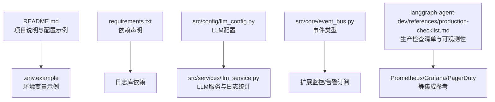
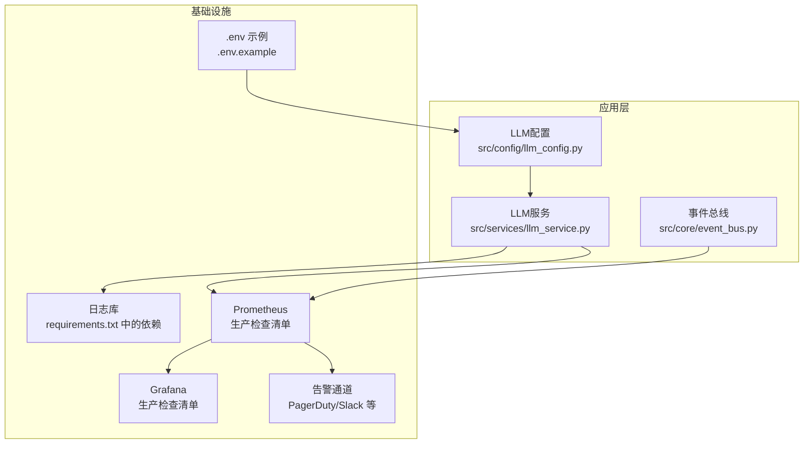
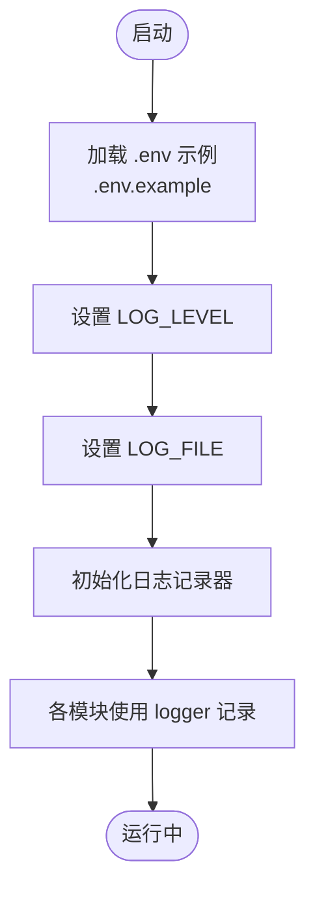
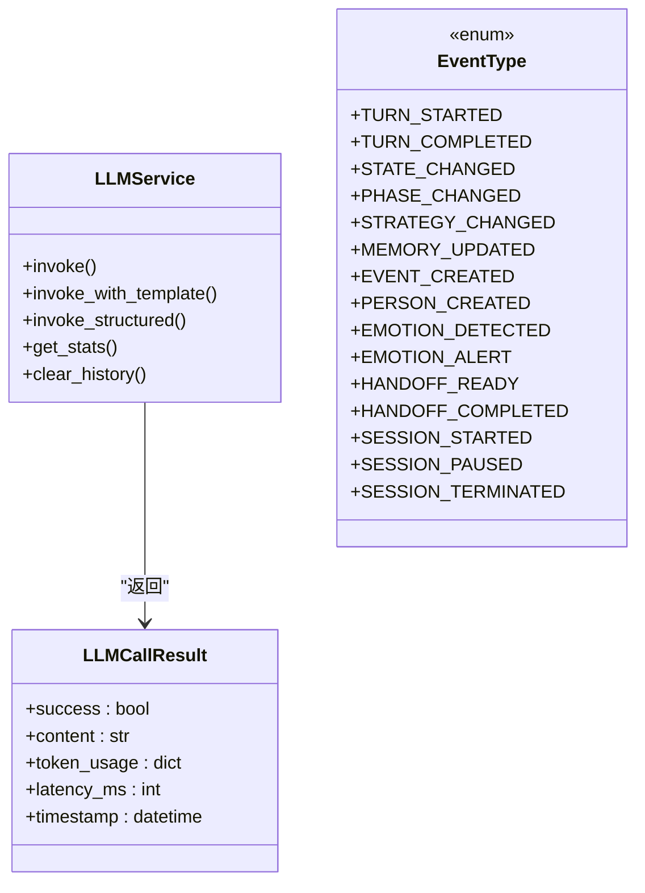
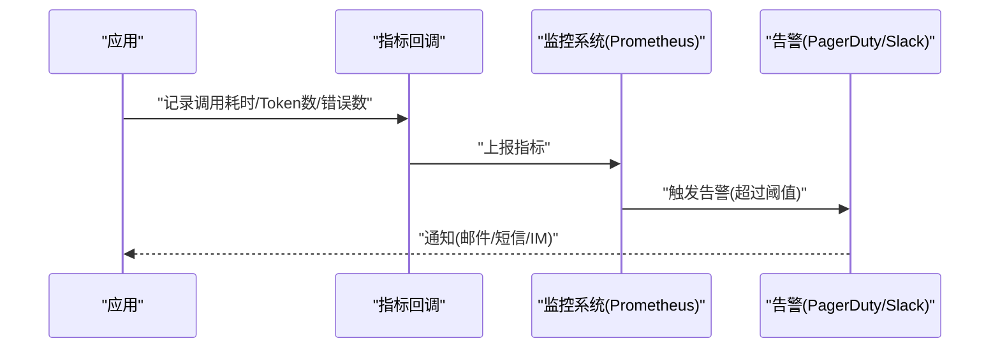
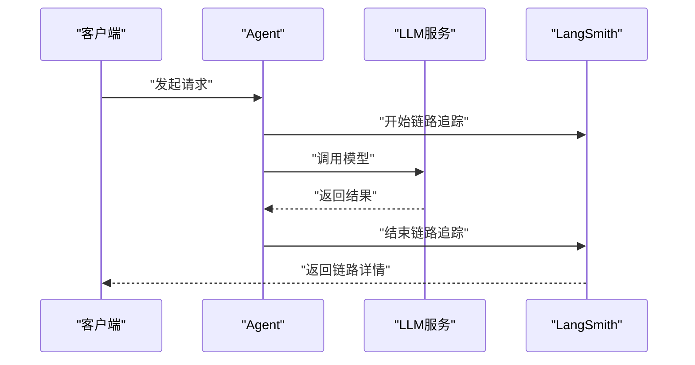
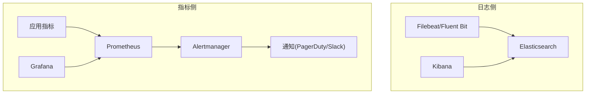
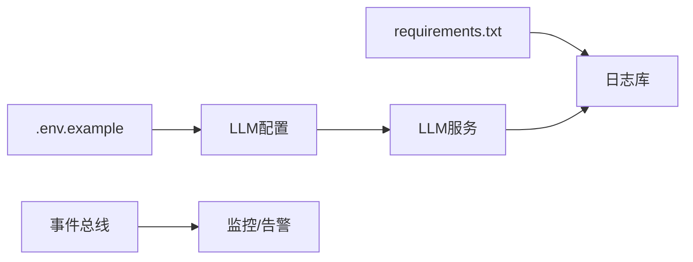
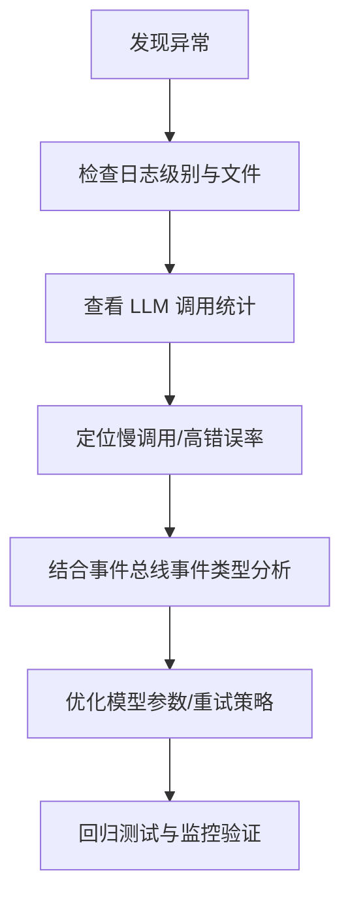

# 监控和日志配置

<cite>
**本文引用的文件**   
- [README.md](file://README.md)
- [.env.example](file://.env.example)
- [pyproject.toml](file://pyproject.toml)
- [requirements.txt](file://requirements.txt)
- [src/config/llm_config.py](file://src/config/llm_config.py)
- [src/services/llm_service.py](file://src/services/llm_service.py)
- [src/core/event_bus.py](file://src/core/event_bus.py)
- [langgraph-agent-dev/references/production-checklist.md](file://langgraph-agent-dev/references/production-checklist.md)
- [integration_test_new_user.py](file://integration_test_new_user.py)
- [test_integration.py](file://test_integration.py)
- [test_system_assembly.py](file://test_system_assembly.py)
</cite>

## 目录
1. [简介](#简介)
2. [项目结构](#项目结构)
3. [核心组件](#核心组件)
4. [架构总览](#架构总览)
5. [详细组件分析](#详细组件分析)
6. [依赖关系分析](#依赖关系分析)
7. [性能考量](#性能考量)
8. [故障排查指南](#故障排查指南)
9. [结论](#结论)
10. [附录](#附录)

## 简介
本运维文档聚焦于“监控与日志配置”，围绕以下目标展开：
- 日志系统：日志级别、输出格式、日志轮转策略
- 监控指标：系统资源、应用性能、业务指标
- 告警机制：阈值、规则与通知渠道
- 分布式追踪：链路追踪、性能分析与问题定位
- 日志分析与可视化：ELK Stack、Prometheus/Grafana 集成方案
- 故障排查：日志分析方法与性能调优策略

本项目已内置日志库与可观测性参考实现，文档将结合现有代码与参考材料给出可落地的运维实践。

## 项目结构
项目采用模块化分层组织，日志与监控相关的关键位置如下：
- 环境变量与示例：.env.example 提供日志与知识库路径等配置
- 日志库：requirements.txt 中声明了日志库依赖
- LLM 服务：src/services/llm_service.py 内置调用统计与日志记录
- LLM 配置：src/config/llm_config.py 提供模型与重试配置
- 事件总线：src/core/event_bus.py 定义事件类型，便于扩展监控与告警
- 生产检查清单：langgraph-agent-dev/references/production-checklist.md 提供可观测性、指标与告警参考

**图表来源**
- [README.md:252-266](file://README.md#L252-L266)
- [requirements.txt:20-21](file://requirements.txt#L20-L21)
- [src/config/llm_config.py:10-41](file://src/config/llm_config.py#L10-L41)
- [src/services/llm_service.py:32-89](file://src/services/llm_service.py#L32-L89)
- [src/core/event_bus.py:10-37](file://src/core/event_bus.py#L10-L37)
- [langgraph-agent-dev/references/production-checklist.md:29-527](file://langgraph-agent-dev/references/production-checklist.md#L29-L527)

**章节来源**
- [README.md:92-200](file://README.md#L92-L200)
- [.env.example:1-10](file://.env.example#L1-L10)
- [requirements.txt:1-24](file://requirements.txt#L1-L24)

## 核心组件
- LLM 配置与重试：提供模型提供商、模型名、温度、最大 Token 数、重试次数与超时等配置，并支持从环境变量加载
- LLM 服务：封装 LangChain 调用、Prompt 模板加载、结构化输出、调用统计与日志记录
- 事件总线：定义事件类型，便于订阅与扩展监控、告警与人工介入
- 生产检查清单：提供可观测性、指标与告警的参考实现与配置思路

**章节来源**
- [src/config/llm_config.py:10-120](file://src/config/llm_config.py#L10-L120)
- [src/services/llm_service.py:32-481](file://src/services/llm_service.py#L32-L481)
- [src/core/event_bus.py:10-37](file://src/core/event_bus.py#L10-L37)
- [langgraph-agent-dev/references/production-checklist.md:29-527](file://langgraph-agent-dev/references/production-checklist.md#L29-L527)

## 架构总览
下图展示日志与监控在系统中的位置与交互：

**图表来源**
- [requirements.txt:20-21](file://requirements.txt#L20-L21)
- [.env.example:5-7](file://.env.example#L5-L7)
- [src/config/llm_config.py:42-120](file://src/config/llm_config.py#L42-L120)
- [src/services/llm_service.py:90-481](file://src/services/llm_service.py#L90-L481)
- [src/core/event_bus.py:10-37](file://src/core/event_bus.py#L10-L37)
- [langgraph-agent-dev/references/production-checklist.md:29-527](file://langgraph-agent-dev/references/production-checklist.md#L29-L527)

## 详细组件分析

### 日志系统配置
- 日志级别与输出
  - 环境变量 LOG_LEVEL 控制日志级别；LOG_FILE 指定日志文件路径
  - README 提供了 .env 示例，包含日志配置项
- 日志格式
  - 当前代码使用标准库 logging；建议在生产中统一格式，便于 ELK 解析
- 日志轮转策略
  - 当前未见专用轮转配置；可在生产中引入 RotatingFileHandler 或外部工具（如 logrotate）

**图表来源**
- [.env.example:5-7](file://.env.example#L5-L7)
- [README.md:252-266](file://README.md#L252-L266)

**章节来源**
- [.env.example:5-7](file://.env.example#L5-L7)
- [README.md:252-266](file://README.md#L252-L266)

### 监控指标收集与配置
- 应用性能指标
  - LLM 服务内置调用统计：总调用次数、总 Token 数、成功率、平均延迟
  - 可通过回调或中间件扩展至 Prometheus 指标
- 业务指标
  - 事件总线 EventType 定义了会话、记忆、情绪等事件，可用于统计业务事件数量与分布
- 系统资源监控
  - 可结合操作系统监控工具与容器监控方案（如 cAdvisor、Node Exporter）

**图表来源**
- [src/services/llm_service.py:20-481](file://src/services/llm_service.py#L20-L481)
- [src/core/event_bus.py:10-37](file://src/core/event_bus.py#L10-L37)

**章节来源**
- [src/services/llm_service.py:449-462](file://src/services/llm_service.py#L449-L462)
- [src/core/event_bus.py:10-37](file://src/core/event_bus.py#L10-L37)

### 告警机制配置
- 阈值与规则
  - 参考生产检查清单中的关键指标与阈值建议
- 通知渠道
  - 可对接 PagerDuty、Slack 等告警通道
- 实施步骤
  - 在回调或中间件中收集指标，推送到监控系统
  - 配置告警规则与通知策略

**图表来源**
- [langgraph-agent-dev/references/production-checklist.md:486-527](file://langgraph-agent-dev/references/production-checklist.md#L486-L527)

**章节来源**
- [langgraph-agent-dev/references/production-checklist.md:486-527](file://langgraph-agent-dev/references/production-checklist.md#L486-L527)

### 分布式追踪配置
- 链路追踪
  - 可参考生产检查清单中的 LangSmith 追踪配置
- 性能分析与问题定位
  - 通过回调记录 LLM 调用开始/结束、Token 使用、工具调用等，辅助定位慢调用与失败点

**图表来源**
- [langgraph-agent-dev/references/production-checklist.md:31-45](file://langgraph-agent-dev/references/production-checklist.md#L31-L45)

**章节来源**
- [langgraph-agent-dev/references/production-checklist.md:31-45](file://langgraph-agent-dev/references/production-checklist.md#L31-L45)

### 日志分析与可视化集成方案
- ELK Stack
  - 使用统一日志格式，结合 Filebeat/Logstash 收集与解析，Kibana 可视化
- Prometheus + Grafana
  - 通过回调或中间件将指标暴露为 HTTP 接口，Prometheus 抓取，Grafana 做仪表盘
- 告警
  - Prometheus Alertmanager 配合 PagerDuty/Slack 实现告警

**图表来源**
- [langgraph-agent-dev/references/production-checklist.md:498-527](file://langgraph-agent-dev/references/production-checklist.md#L498-L527)

**章节来源**
- [langgraph-agent-dev/references/production-checklist.md:498-527](file://langgraph-agent-dev/references/production-checklist.md#L498-L527)

## 依赖关系分析
- 日志库依赖：requirements.txt 声明了日志库
- 环境变量：.env.example 提供日志级别与文件路径
- LLM 配置：从环境变量加载，支持多种提供商
- LLM 服务：封装调用、统计与日志记录
- 事件总线：事件类型定义，便于扩展监控与告警

**图表来源**
- [requirements.txt:20-21](file://requirements.txt#L20-L21)
- [.env.example:5-7](file://.env.example#L5-L7)
- [src/config/llm_config.py:42-120](file://src/config/llm_config.py#L42-L120)
- [src/services/llm_service.py:90-481](file://src/services/llm_service.py#L90-L481)
- [src/core/event_bus.py:10-37](file://src/core/event_bus.py#L10-L37)

**章节来源**
- [requirements.txt:20-21](file://requirements.txt#L20-L21)
- [.env.example:5-7](file://.env.example#L5-L7)
- [src/config/llm_config.py:42-120](file://src/config/llm_config.py#L42-L120)
- [src/services/llm_service.py:90-481](file://src/services/llm_service.py#L90-L481)
- [src/core/event_bus.py:10-37](file://src/core/event_bus.py#L10-L37)

## 性能考量
- LLM 调用统计：通过 LLM 服务统计调用次数、Token 使用与平均延迟，便于识别热点与异常
- 重试与超时：LLM 配置提供最大重试次数与超时，有助于缓解瞬时波动
- 上下文管理：长对话需注意上下文长度限制，必要时进行裁剪或摘要
- 并发与内存：压力测试与内存监控，确保长时间运行稳定

**章节来源**
- [src/services/llm_service.py:449-462](file://src/services/llm_service.py#L449-L462)
- [src/config/llm_config.py:35-41](file://src/config/llm_config.py#L35-L41)
- [langgraph-agent-dev/references/production-checklist.md:13-18](file://langgraph-agent-dev/references/production-checklist.md#L13-L18)

## 故障排查指南
- 日志分析
  - 使用 .env 中的 LOG_LEVEL 与 LOG_FILE 定位问题
  - 在 LLM 服务调用失败时查看错误日志与重试记录
- 性能调优
  - 依据 LLM 服务统计指标（成功率、平均延迟、Token 使用）进行优化
  - 结合事件总线事件类型，定位会话阶段与情绪事件的异常
- 回调与中间件
  - 参考生产检查清单中的指标回调实现，将关键指标暴露给监控系统

**图表来源**
- [.env.example:5-7](file://.env.example#L5-L7)
- [src/services/llm_service.py:285-292](file://src/services/llm_service.py#L285-L292)
- [src/services/llm_service.py:449-462](file://src/services/llm_service.py#L449-L462)
- [src/core/event_bus.py:10-37](file://src/core/event_bus.py#L10-L37)
- [langgraph-agent-dev/references/production-checklist.md:48-138](file://langgraph-agent-dev/references/production-checklist.md#L48-L138)

**章节来源**
- [.env.example:5-7](file://.env.example#L5-L7)
- [src/services/llm_service.py:285-292](file://src/services/llm_service.py#L285-L292)
- [src/services/llm_service.py:449-462](file://src/services/llm_service.py#L449-L462)
- [src/core/event_bus.py:10-37](file://src/core/event_bus.py#L10-L37)
- [langgraph-agent-dev/references/production-checklist.md:48-138](file://langgraph-agent-dev/references/production-checklist.md#L48-L138)

## 结论
本项目已具备日志与可观测性的基础能力，建议在生产环境中：
- 明确日志级别与输出格式，启用日志轮转
- 基于 LLM 服务统计与事件总线事件，建立关键指标与告警
- 引入分布式追踪与指标可视化，完善端到端问题定位
- 通过回调与中间件将指标暴露给 Prometheus/Grafana，实现自动化监控与告警

## 附录
- 环境变量示例与日志配置参考：.env.example
- 依赖声明与日志库：requirements.txt
- LLM 配置与重试策略：src/config/llm_config.py
- LLM 服务与调用统计：src/services/llm_service.py
- 事件类型定义：src/core/event_bus.py
- 生产检查清单与可观测性参考：langgraph-agent-dev/references/production-checklist.md
- 集成测试与系统测试脚本：integration_test_new_user.py、test_integration.py、test_system_assembly.py

**章节来源**
- [.env.example:1-10](file://.env.example#L1-L10)
- [requirements.txt:1-24](file://requirements.txt#L1-L24)
- [src/config/llm_config.py:10-120](file://src/config/llm_config.py#L10-L120)
- [src/services/llm_service.py:32-481](file://src/services/llm_service.py#L32-L481)
- [src/core/event_bus.py:10-37](file://src/core/event_bus.py#L10-L37)
- [langgraph-agent-dev/references/production-checklist.md:29-527](file://langgraph-agent-dev/references/production-checklist.md#L29-L527)
- [integration_test_new_user.py:75-141](file://integration_test_new_user.py#L75-L141)
- [test_integration.py:1-18](file://test_integration.py#L1-L18)
- [test_system_assembly.py:1-18](file://test_system_assembly.py#L1-L18)