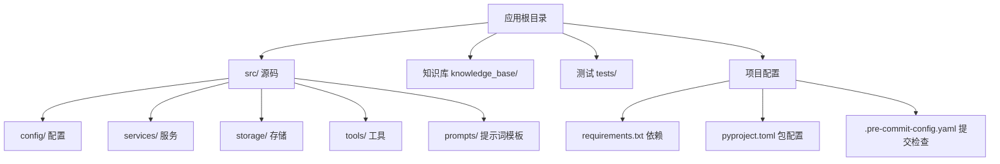
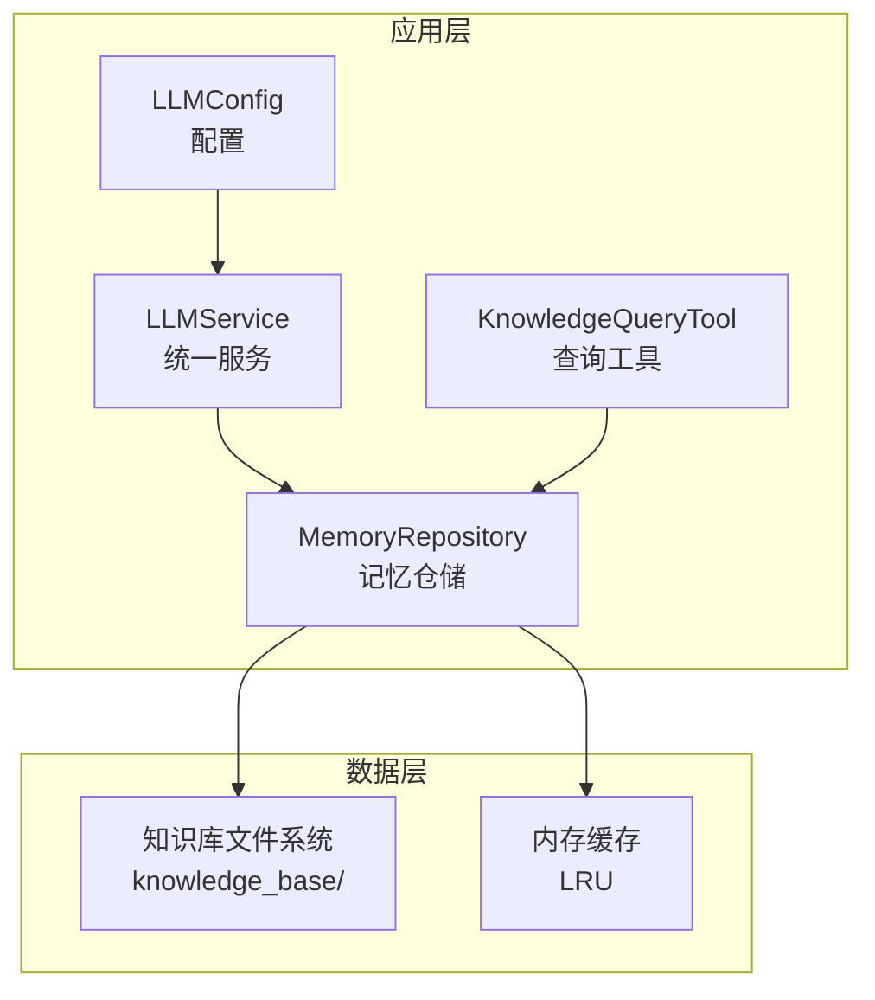
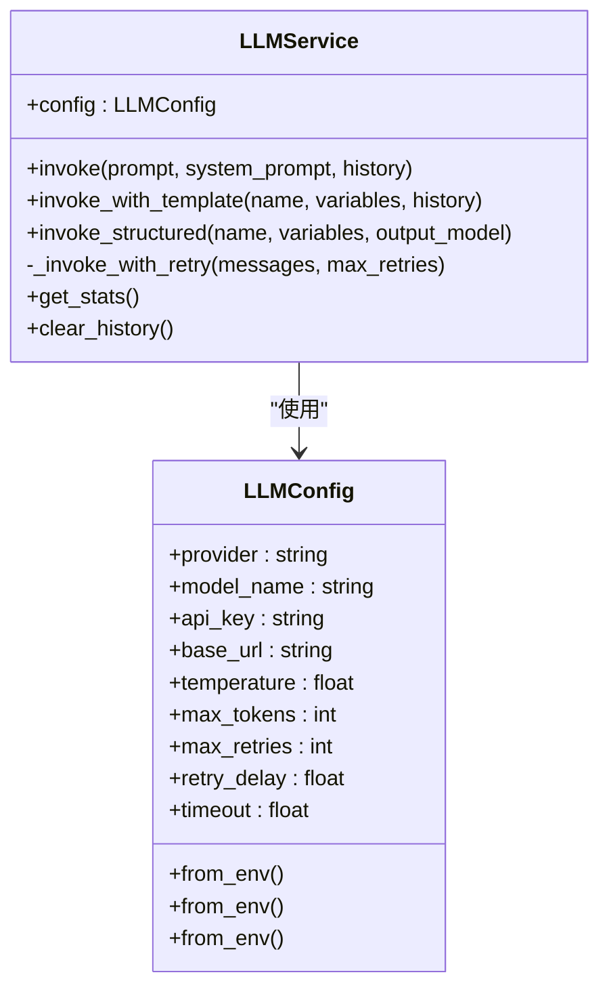
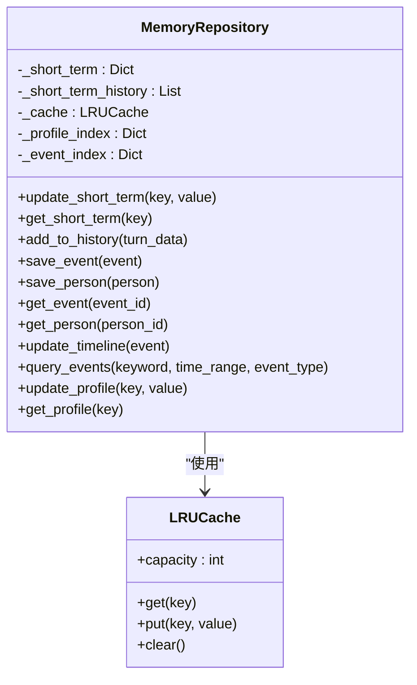
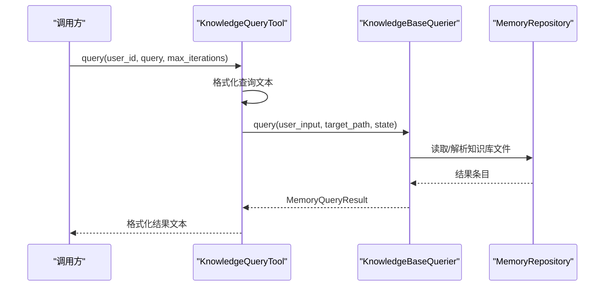
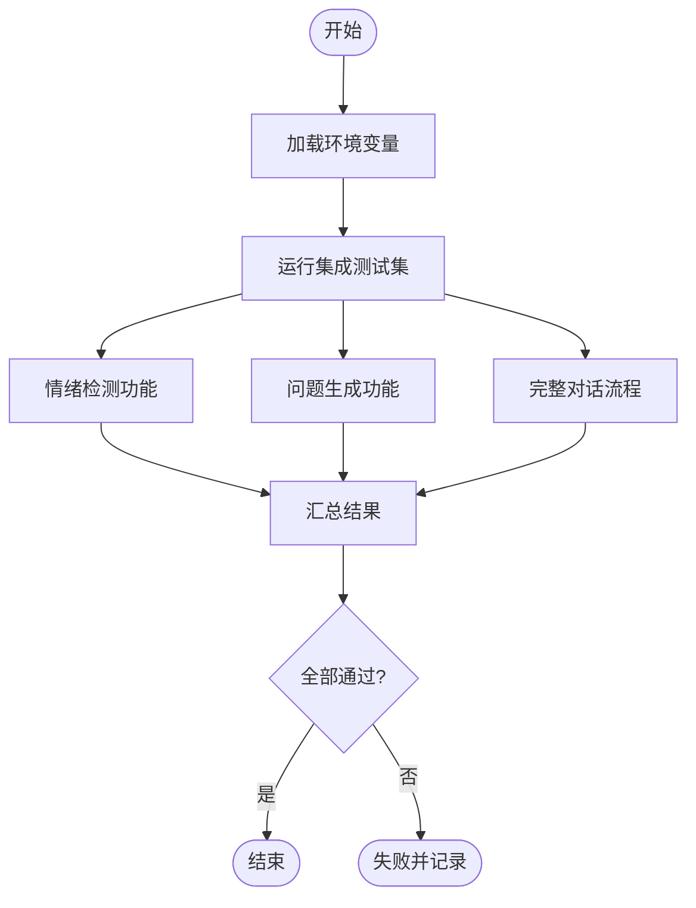
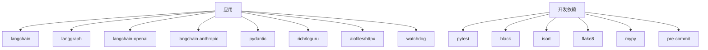

# 部署策略

<cite>
**本文引用的文件**
- [README.md](file://README.md)
- [pyproject.toml](file://pyproject.toml)
- [requirements.txt](file://requirements.txt)
- [requirements-dev.txt](file://requirements-dev.txt)
- [.pre-commit-config.yaml](file://.pre-commit-config.yaml)
- [production-checklist.md](file://langgraph-agent-dev/references/production-checklist.md)
- [llm_config.py](file://src/config/llm_config.py)
- [llm_service.py](file://src/services/llm_service.py)
- [memory_repository.py](file://src/storage/memory_repository.py)
- [knowledge_query_tool.py](file://src/tools/knowledge_query_tool.py)
- [test_integration.py](file://test_integration.py)
</cite>

## 目录
1. [简介](#简介)
2. [项目结构](#项目结构)
3. [核心组件](#核心组件)
4. [架构总览](#架构总览)
5. [详细组件分析](#详细组件分析)
6. [依赖关系分析](#依赖关系分析)
7. [性能考量](#性能考量)
8. [故障排查指南](#故障排查指南)
9. [结论](#结论)
10. [附录](#附录)

## 简介
本文件面向“老人自传 Agent 系统”的部署策略，覆盖传统服务器部署、容器化部署与云平台部署三类方式；深入阐述容器化最佳实践（镜像构建、编排与资源限制）、云平台集成方案（AWS/Azure/GCP）、微服务架构下的部署策略（服务发现、负载均衡、故障转移）、自动化部署流水线（CI/CD、版本管理与回滚）、以及部署前预检与部署后验证流程，确保系统在不同环境中的稳定交付与运行。

## 项目结构
该项目为纯 Python 应用，采用模块化分层组织，核心模块包括配置、服务、存储、工具与提示词模板。生产部署可直接以 Python 进程运行，也可容器化打包后在容器编排平台或云平台上部署。

图示来源
- [README.md: 92-200:92-200](file://README.md#L92-L200)
- [requirements.txt: 1-24:1-24](file://requirements.txt#L1-L24)
- [pyproject.toml: 1-26:1-26](file://pyproject.toml#L1-L26)
- [.pre-commit-config.yaml: 1-20:1-20](file://.pre-commit-config.yaml#L1-L20)

章节来源
- [README.md: 92-200:92-200](file://README.md#L92-L200)

## 核心组件
- 配置层：集中管理 LLM 提供商、模型参数、超时与重试等配置，支持从环境变量加载与回退策略。
- 服务层：统一的大模型调用入口，封装 LangChain 调用、Prompt 模板加载、结构化输出解析与重试机制。
- 存储层：三层记忆（短期/长期/画像）统一管理，结合文件系统与 LRU 缓存，支撑知识库的读写与查询。
- 工具层：对外暴露的知识库查询工具，封装查询执行与结果格式化。
- 测试与质量：集成测试脚本与开发依赖，保障系统端到端功能与质量门禁。

章节来源
- [llm_config.py: 10-120:10-120](file://src/config/llm_config.py#L10-L120)
- [llm_service.py: 32-481:32-481](file://src/services/llm_service.py#L32-L481)
- [memory_repository.py: 40-359:40-359](file://src/storage/memory_repository.py#L40-L359)
- [knowledge_query_tool.py: 11-81:11-81](file://src/tools/knowledge_query_tool.py#L11-L81)
- [test_integration.py: 1-264:1-264](file://test_integration.py#L1-L264)

## 架构总览
系统整体由“配置 → 服务 → 存储/工具 → 知识库”构成，部署时可将服务层作为应用核心，存储层依赖本地或共享文件系统，工具层用于对外查询。

图示来源
- [llm_config.py: 10-120:10-120](file://src/config/llm_config.py#L10-L120)
- [llm_service.py: 32-481:32-481](file://src/services/llm_service.py#L32-L481)
- [memory_repository.py: 40-359:40-359](file://src/storage/memory_repository.py#L40-L359)
- [knowledge_query_tool.py: 11-81:11-81](file://src/tools/knowledge_query_tool.py#L11-L81)

## 详细组件分析

### 组件A：LLM 配置与服务
- 配置加载：优先使用 DeepSeek 专属环境变量，若不可用则抛出错误；亦提供 DeepSeek 专属加载路径，体现多提供商适配。
- 服务封装：统一模型初始化、消息构造、重试与统计；支持模板渲染与结构化输出解析。
- 部署要点：通过环境变量注入 API Key 与基础 URL；建议在容器内设置超时与重试上限，避免阻塞。

图示来源
- [llm_config.py: 10-120:10-120](file://src/config/llm_config.py#L10-L120)
- [llm_service.py: 32-481:32-481](file://src/services/llm_service.py#L32-L481)

章节来源
- [llm_config.py: 10-120:10-120](file://src/config/llm_config.py#L10-L120)
- [llm_service.py: 32-481:32-481](file://src/services/llm_service.py#L32-L481)

### 组件B：记忆仓储与知识库
- 记忆分层：短期记忆（内存）、长期记忆（文件系统）、画像记忆（内存索引）。
- 缓存策略：LRU 缓存减少重复读取；容量可配置。
- 查询与索引：事件与人物索引，支持关键词与类型过滤；时间线文件增量更新。
- 部署要点：知识库路径需持久化挂载；注意文件名清洗与路径安全。

图示来源
- [memory_repository.py: 40-359:40-359](file://src/storage/memory_repository.py#L40-L359)

章节来源
- [memory_repository.py: 40-359:40-359](file://src/storage/memory_repository.py#L40-L359)

### 组件C：知识库查询工具
- 角色定位：封装 KnowledgeBaseQuerier 的调用，提供简洁查询接口与结果格式化。
- 部署要点：确保目标路径包含用户 ID，避免跨用户数据访问；与 LLM 服务协同使用。

图示来源
- [knowledge_query_tool.py: 11-81:11-81](file://src/tools/knowledge_query_tool.py#L11-L81)

章节来源
- [knowledge_query_tool.py: 11-81:11-81](file://src/tools/knowledge_query_tool.py#L11-L81)

### 组件D：集成测试与质量门禁
- 集成测试：覆盖情绪检测、问题生成、完整对话流程等关键链路。
- 质量门禁：pre-commit 配置与开发依赖，保证代码风格、静态检查与类型校验。

图示来源
- [test_integration.py: 227-264:227-264](file://test_integration.py#L227-L264)

章节来源
- [test_integration.py: 1-264:1-264](file://test_integration.py#L1-L264)
- [.pre-commit-config.yaml: 1-20:1-20](file://.pre-commit-config.yaml#L1-L20)
- [requirements-dev.txt: 1-13:1-13](file://requirements-dev.txt#L1-L13)

## 依赖关系分析
- 运行时依赖：LangChain/LangGraph、OpenAI/Anthropic、Pydantic、Rich/Loguru、aiofiles/httpx、watchdog 等。
- 开发依赖：pytest、black、isort、flake8、mypy、pre-commit。
- 包管理：pyproject.toml 定义项目元数据与开发依赖集合；requirements.txt 明确生产依赖范围。

图示来源
- [requirements.txt: 1-24:1-24](file://requirements.txt#L1-L24)
- [requirements-dev.txt: 1-13:1-13](file://requirements-dev.txt#L1-L13)
- [pyproject.toml: 8-26:8-26](file://pyproject.toml#L8-L26)

章节来源
- [requirements.txt: 1-24:1-24](file://requirements.txt#L1-L24)
- [requirements-dev.txt: 1-13:1-13](file://requirements-dev.txt#L1-L13)
- [pyproject.toml: 8-26:8-26](file://pyproject.toml#L8-L26)

## 性能考量
- LLM 调用：指数退避重试、超时控制、Token 使用统计；建议在容器中设置合理的 CPU/内存限额，避免突发流量导致 OOM。
- 存储与缓存：LRU 缓存容量与短期记忆容量需结合业务峰值调优；知识库文件读写建议使用 SSD 或网络高性能存储。
- 并发与异步：应用层广泛使用异步 IO，部署时建议使用异步 Web 服务器（如 Uvicorn）并合理设置 worker 数量。
- 监控与可观测性：建议接入 Prometheus/Grafana 与日志聚合系统，关注 P95 响应时间、错误率、Token 使用量与活跃会话数。

## 故障排查指南
- 部署前检查清单：功能测试、性能测试、安全测试（注入防护、权限隔离、速率限制）、可观测性配置（LangSmith/日志/指标）。
- 上线检查清单：测试通过、性能达标、安全审计、监控告警、日志收集、备份策略、回滚方案、文档更新、团队培训。
- 常见问题定位：
  - LLM 无法访问：检查 API Key、基础 URL 与网络连通性。
  - 知识库读写失败：确认挂载路径、权限与磁盘空间。
  - 响应缓慢：查看 Token 使用量、并发与缓存命中率。
  - 集成测试失败：逐项运行测试，定位具体模块。

章节来源
- [production-checklist.md: 1-539:1-539](file://langgraph-agent-dev/references/production-checklist.md#L1-L539)
- [test_integration.py: 227-264:227-264](file://test_integration.py#L227-L264)

## 结论
本系统具备良好的模块化与可配置性，适合在传统服务器、容器与云平台等多种环境中部署。通过严格的配置管理、可观测性与质量门禁，配合完善的预检与验证流程，可在不同规模与合规要求的场景中稳定交付。

## 附录

### 传统服务器部署
- 环境准备：安装 Python 3.10+，创建虚拟环境，安装生产依赖。
- 配置管理：复制示例环境文件，配置 LLM 提供商与 API Key、日志与知识库路径。
- 运行方式：直接运行应用入口（如 FastAPI/Uvicorn），或使用进程管理器（如 systemd/gunicorn）。
- 数据持久化：知识库目录需持久化挂载至可靠存储。

章节来源
- [README.md: 204-294:204-294](file://README.md#L204-L294)
- [requirements.txt: 1-24:1-24](file://requirements.txt#L1-L24)

### 容器化部署最佳实践
- 镜像构建：基于精简基础镜像，先复制依赖再复制源码，利用多阶段优化层；CMD/ENTRYPOINT 指向异步服务器入口。
- 编排与编排：使用 docker-compose 或 Kubernetes；为应用、数据库与缓存分别定义服务与健康检查。
- 资源限制：设置 CPU/内存 requests/limits，启用优雅终止与探针；为知识库目录配置持久卷。
- 安全：最小权限原则、只读根文件系统、Secrets 管理、镜像扫描与漏洞修复。

章节来源
- [production-checklist.md: 431-483:431-483](file://langgraph-agent-dev/references/production-checklist.md#L431-L483)

### 云平台部署方案
- AWS：ECS/EKS + S3/EFS；使用 IAM 角色与 Secrets Manager；CloudWatch 指标与告警。
- Azure：Container Apps/ACI + Azure Files；Key Vault；Monitor 指标与告警。
- GCP：Cloud Run/GKE + Cloud Storage/Filestore；Secret Manager；Cloud Monitoring。
- 通用建议：使用托管数据库与缓存服务；启用自动扩缩容与蓝绿发布；配置多可用区与备份。

章节来源
- [production-checklist.md: 412-429:412-429](file://langgraph-agent-dev/references/production-checklist.md#L412-L429)

### 微服务架构下的部署策略
- 服务发现：容器编排平台内置 DNS/服务网格；或使用 Consul/Nacos。
- 负载均衡：应用前置 Nginx/ALB，后端多副本；按权重/区域分发。
- 故障转移：多副本与多可用区部署；熔断与降级策略；幂等性设计与补偿机制。

章节来源
- [production-checklist.md: 412-429:412-429](file://langgraph-agent-dev/references/production-checklist.md#L412-L429)

### 自动化部署流水线设计
- CI/CD：GitHub Actions/Jenkins/Pipeline；触发条件（PR/MR/Tag）；分阶段（测试/构建/打包/部署）。
- 版本管理：语义化版本与 Tag；变更日志与发布说明。
- 回滚策略：蓝绿/金丝雀发布；快速回滚至上一个稳定版本；配置回滚与通知。

章节来源
- [pyproject.toml: 8-26:8-26](file://pyproject.toml#L8-L26)
- [requirements-dev.txt: 1-13:1-13](file://requirements-dev.txt#L1-L13)
- [production-checklist.md: 528-538:528-538](file://langgraph-agent-dev/references/production-checklist.md#L528-L538)

### 部署前预检清单与部署后验证
- 预检清单：功能、性能、安全、可观测性；LangSmith/日志/指标配置；备份策略。
- 验证步骤：端到端对话链路、知识库读写、LLM 调用与错误处理、缓存与索引一致性。

章节来源
- [production-checklist.md: 3-539:3-539](file://langgraph-agent-dev/references/production-checklist.md#L3-L539)