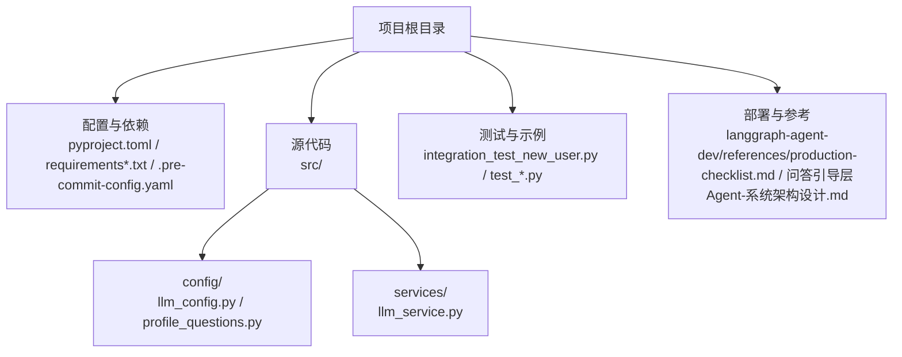
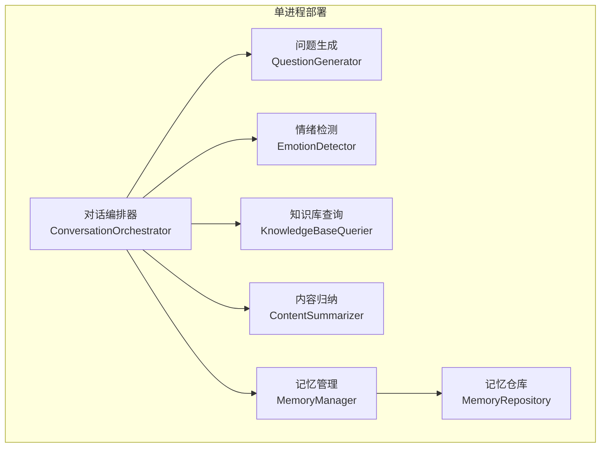
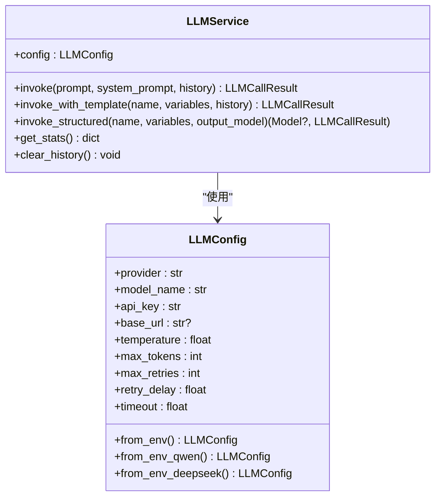
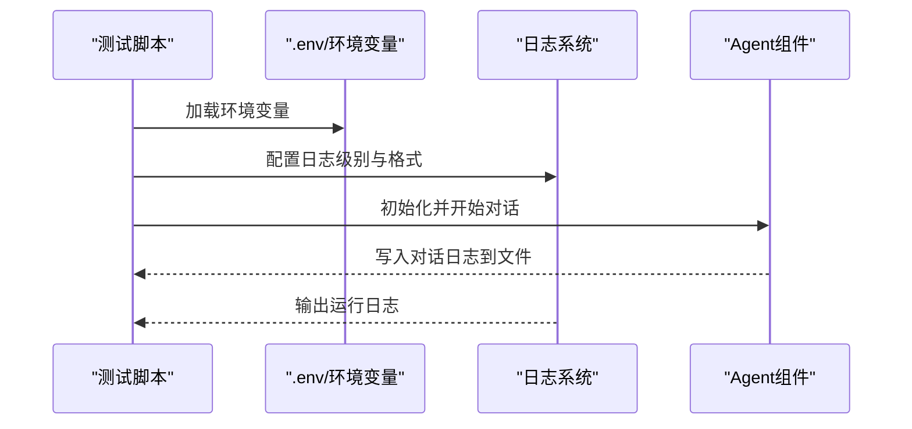
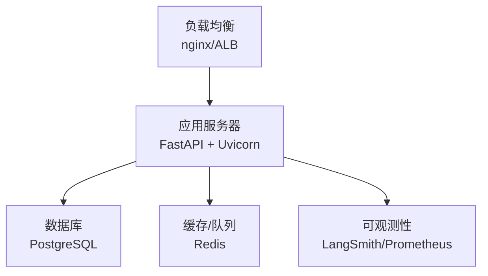
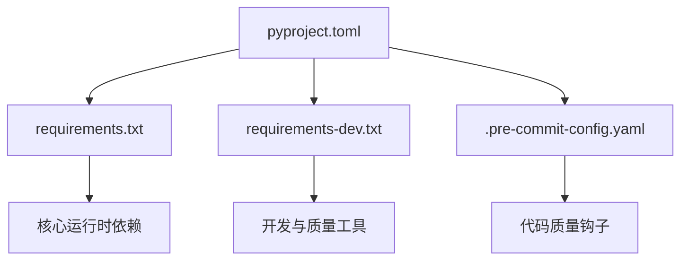

# 配置和部署

<cite>
**本文引用的文件**
- [README.md](file://README.md)
- [pyproject.toml](file://pyproject.toml)
- [requirements.txt](file://requirements.txt)
- [requirements-dev.txt](file://requirements-dev.txt)
- [.pre-commit-config.yaml](file://.pre-commit-config.yaml)
- [src/config/llm_config.py](file://src/config/llm_config.py)
- [src/services/llm_service.py](file://src/services/llm_service.py)
- [src/config/profile_questions.py](file://src/config/profile_questions.py)
- [integration_test_new_user.py](file://integration_test_new_user.py)
- [test_system_assembly.py](file://test_system_assembly.py)
- [test_integration.py](file://test_integration.py)
- [langgraph-agent-dev/references/production-checklist.md](file://langgraph-agent-dev/references/production-checklist.md)
- [问答引导层Agent-系统架构设计.md](file://问答引导层Agent-系统架构设计.md)
</cite>

## 目录
1. [简介](#简介)
2. [项目结构](#项目结构)
3. [核心组件](#核心组件)
4. [架构总览](#架构总览)
5. [详细组件分析](#详细组件分析)
6. [依赖分析](#依赖分析)
7. [性能考虑](#性能考虑)
8. [故障排查指南](#故障排查指南)
9. [结论](#结论)
10. [附录](#附录)

## 简介
本文件面向“配置与部署”主题，围绕环境变量与配置管理、部署最佳实践、性能优化、监控与日志、不同部署场景的差异化配置以及安全与合规等方面，结合代码库现状进行系统化说明。目标是帮助读者在本地开发、测试与生产环境中稳定地运行该系统。

## 项目结构
该项目采用分层组织方式，核心模块包括配置、服务、存储与工具等。与配置和部署密切相关的文件包括：
- 项目与测试配置：pyproject.toml、requirements*.txt、.pre-commit-config.yaml
- 环境变量与配置加载：src/config/llm_config.py
- 日志与测试：integration_test_new_user.py、test_system_assembly.py、test_integration.py
- 部署与监控参考：langgraph-agent-dev/references/production-checklist.md
- 架构与部署建议：问答引导层Agent-系统架构设计.md

图表来源
- [README.md:92-200](file://README.md#L92-L200)
- [pyproject.toml:1-26](file://pyproject.toml#L1-L26)
- [requirements.txt:1-24](file://requirements.txt#L1-L24)
- [requirements-dev.txt:1-13](file://requirements-dev.txt#L1-L13)
- [src/config/llm_config.py:1-120](file://src/config/llm_config.py#L1-L120)
- [src/services/llm_service.py:1-481](file://src/services/llm_service.py#L1-L481)
- [src/config/profile_questions.py:1-94](file://src/config/profile_questions.py#L1-L94)
- [integration_test_new_user.py:75-141](file://integration_test_new_user.py#L75-L141)
- [test_system_assembly.py:1-18](file://test_system_assembly.py#L1-L18)
- [test_integration.py:1-18](file://test_integration.py#L1-18)
- [langgraph-agent-dev/references/production-checklist.md:373-527](file://langgraph-agent-dev/references/production-checklist.md#L373-L527)
- [问答引导层Agent-系统架构设计.md:1234-1288](file://问答引导层Agent-系统架构设计.md#L1234-L1288)

章节来源
- [README.md:92-200](file://README.md#L92-L200)

## 核心组件
- 环境变量与配置加载：通过 dotenv 加载 .env，LLMConfig 从环境变量读取并支持 Qwen/DeepSeek/OpenAI/Anthropic 等提供商切换。
- LLM 服务封装：LLMService 统一封装模型调用、Prompt 模板加载、结构化输出、重试与统计。
- 日志与测试：测试脚本展示日志初始化与对话流程记录；README 提供 LOG_LEVEL、LOG_FILE 等日志配置示例。
- 依赖与质量工具：requirements*.txt 管理生产与开发依赖；pyproject.toml 与 .pre-commit-config.yaml 规范测试与静态检查。

章节来源
- [src/config/llm_config.py:1-120](file://src/config/llm_config.py#L1-L120)
- [src/services/llm_service.py:1-481](file://src/services/llm_service.py#L1-L481)
- [README.md:242-294](file://README.md#L242-L294)
- [pyproject.toml:1-26](file://pyproject.toml#L1-L26)
- [requirements.txt:1-24](file://requirements.txt#L1-L24)
- [requirements-dev.txt:1-13](file://requirements-dev.txt#L1-L13)
- [.pre-commit-config.yaml:1-20](file://.pre-commit-config.yaml#L1-L20)

## 架构总览
系统采用单进程部署模式，核心编排器协调多个子服务（问题生成、情绪检测、知识库查询、内容归纳、记忆管理）。部署建议可扩展至微服务与容器化方案，并配套监控与告警。

图表来源
- [问答引导层Agent-系统架构设计.md:1234-1288](file://问答引导层Agent-系统架构设计.md#L1234-L1288)

## 详细组件分析

### LLM 配置与环境变量管理
- 环境变量加载：启动时通过 dotenv 加载 .env；LLMConfig 支持 Qwen 专属配置优先，其次可扩展为通用配置。
- 提供商适配：支持 Qwen（兼容 OpenAI API）、DeepSeek、OpenAI、Anthropic；通过 provider 字段切换。
- 参数与重试：包含温度、最大 Token、重试次数与延迟、超时等；默认重试策略为指数退避。
- 默认配置：优先尝试 DeepSeek，失败则回退到 Qwen。

图表来源
- [src/config/llm_config.py:10-120](file://src/config/llm_config.py#L10-L120)
- [src/services/llm_service.py:32-481](file://src/services/llm_service.py#L32-L481)

章节来源
- [src/config/llm_config.py:1-120](file://src/config/llm_config.py#L1-L120)
- [src/services/llm_service.py:1-481](file://src/services/llm_service.py#L1-L481)

### 日志与测试流程
- 日志配置：README 提供 LOG_LEVEL、LOG_FILE 示例；测试脚本展示 logging.basicConfig 的使用。
- 对话日志：集成测试脚本将对话记录写入文件，便于问题复现与审计。
- 测试脚本：test_system_assembly.py、test_integration.py 展示加载 .env 与日志初始化。

图表来源
- [integration_test_new_user.py:75-141](file://integration_test_new_user.py#L75-L141)
- [test_system_assembly.py:1-18](file://test_system_assembly.py#L1-L18)
- [test_integration.py:1-18](file://test_integration.py#L1-L18)
- [README.md:242-294](file://README.md#L242-L294)

章节来源
- [integration_test_new_user.py:75-141](file://integration_test_new_user.py#L75-L141)
- [test_system_assembly.py:1-18](file://test_system_assembly.py#L1-L18)
- [test_integration.py:1-18](file://test_integration.py#L1-L18)
- [README.md:242-294](file://README.md#L242-L294)

### 部署与监控参考
- 部署架构：单进程与微服务两种形态；微服务可引入消息队列与外部存储（Redis、PostgreSQL）。
- Docker 与 compose：提供镜像构建与服务编排示例，便于容器化部署。
- 监控与告警：定义关键指标（P95 响应时间、错误率、Token 使用量、活跃会话数、工具调用失败率）与 Prometheus 告警规则示例。

图表来源
- [langgraph-agent-dev/references/production-checklist.md:412-527](file://langgraph-agent-dev/references/production-checklist.md#L412-L527)

章节来源
- [langgraph-agent-dev/references/production-checklist.md:373-527](file://langgraph-agent-dev/references/production-checklist.md#L373-L527)
- [问答引导层Agent-系统架构设计.md:1234-1288](file://问答引导层Agent-系统架构设计.md#L1234-L1288)

## 依赖分析
- 项目依赖：LangChain、LangGraph、Pydantic、OpenAI/LangChain-OpenAI、Anthropic、异步支持、dotenv、YAML、Loguru、Watchdog 等。
- 开发依赖：pytest、pytest-asyncio、pytest-cov、black、isort、flake8、mypy、pre-commit。
- 项目元数据与测试配置：pyproject.toml 指定 Python 版本、可选开发依赖、pytest 配置等。

图表来源
- [pyproject.toml:1-26](file://pyproject.toml#L1-L26)
- [requirements.txt:1-24](file://requirements.txt#L1-L24)
- [requirements-dev.txt:1-13](file://requirements-dev.txt#L1-L13)
- [.pre-commit-config.yaml:1-20](file://.pre-commit-config.yaml#L1-L20)

章节来源
- [pyproject.toml:1-26](file://pyproject.toml#L1-L26)
- [requirements.txt:1-24](file://requirements.txt#L1-L24)
- [requirements-dev.txt:1-13](file://requirements-dev.txt#L1-L13)
- [.pre-commit-config.yaml:1-20](file://.pre-commit-config.yaml#L1-L20)

## 性能考虑
- 并发与异步：LLMService 使用异步调用与指数退避重试，降低网络抖动对用户体验的影响。
- Token 用量与超时：通过 max_tokens 与 timeout 控制资源消耗与响应时延；LLMService 统计 token 使用量与成功率。
- 缓存与存储：记忆仓库采用文件系统持久化，适合中小规模知识库；大规模场景建议引入缓存与数据库。
- 资源限制：容器化部署时建议设置 CPU/内存限制与健康检查，避免资源争用。

章节来源
- [src/services/llm_service.py:225-438](file://src/services/llm_service.py#L225-L438)
- [src/config/llm_config.py:35-41](file://src/config/llm_config.py#L35-L41)
- [langgraph-agent-dev/references/production-checklist.md:486-527](file://langgraph-agent-dev/references/production-checklist.md#L486-L527)

## 故障排查指南
- 环境变量缺失：若未配置 Qwen 专属 API 密钥或 URL，LLMConfig.from_env/_qwen/_deepseek 将抛出异常。请检查 .env 并确保键名正确。
- 日志定位：通过 LOG_LEVEL 与 LOG_FILE 控制日志输出；测试脚本会将对话记录写入文件，便于复盘。
- 重试与超时：若出现调用失败，LLMService 会按指数退避重试；必要时调整 max_retries 与 timeout。
- 依赖问题：确保 Python 版本满足要求且依赖安装完整；使用 pre-commit 钩子保证代码风格与类型检查。

章节来源
- [src/config/llm_config.py:42-120](file://src/config/llm_config.py#L42-L120)
- [src/services/llm_service.py:400-438](file://src/services/llm_service.py#L400-L438)
- [README.md:242-294](file://README.md#L242-L294)
- [.pre-commit-config.yaml:1-20](file://.pre-commit-config.yaml#L1-L20)

## 结论
本项目提供了清晰的配置加载与服务封装机制，结合测试与日志实践，能够支撑从本地到生产的多种部署场景。建议在生产环境中引入容器化、微服务与可观测性体系，并完善安全与合规措施，以获得更高的稳定性与可维护性。

## 附录

### 不同部署场景的配置指南
- 本地开发
  - 使用 .env.example 创建 .env，配置 LLM 提供商与 API 密钥、日志级别与日志文件路径。
  - 安装生产与开发依赖，运行 pytest 进行功能与质量检查。
- 测试环境
  - 与开发类似，但建议开启更严格的日志级别与覆盖率报告。
- 生产环境
  - 使用容器镜像与 compose 编排，分离应用、数据库与缓存。
  - 配置健康检查、资源限制与监控告警，关注 P95 响应时间与错误率。

章节来源
- [README.md:204-294](file://README.md#L204-L294)
- [langgraph-agent-dev/references/production-checklist.md:412-527](file://langgraph-agent-dev/references/production-checklist.md#L412-L527)

### 安全与合规
- 敏感信息保护：API 密钥与数据库凭据置于 .env，禁止提交至版本控制；可参考加密存储示例进行二次加固。
- 隐私与真实性：遵循隐私保护原则，尊重用户与第三方隐私；内容需经用户确认，避免虚构与夸大。
- 心理关怀：在涉及敏感话题时允许跳过，必要时提醒家属协助。

章节来源
- [README.md:448-467](file://README.md#L448-L467)
- [langgraph-agent-dev/references/production-checklist.md:373-408](file://langgraph-agent-dev/references/production-checklist.md#L373-L408)