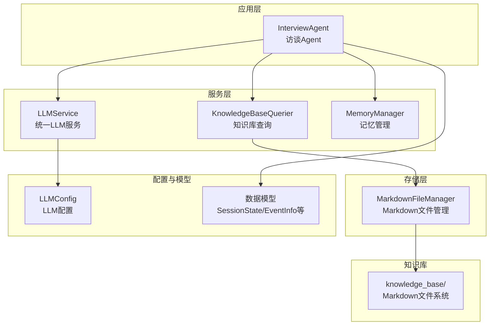
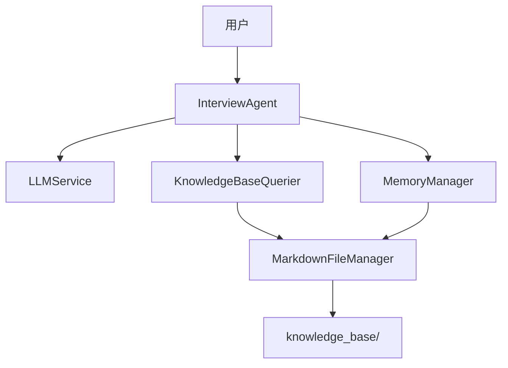
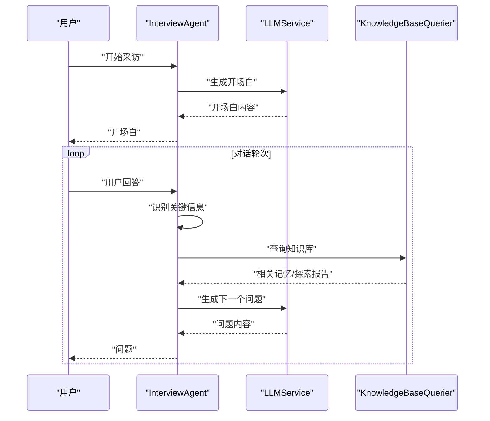
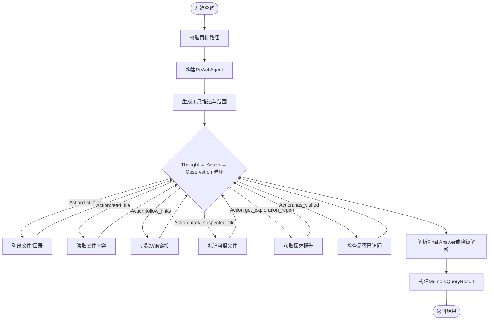
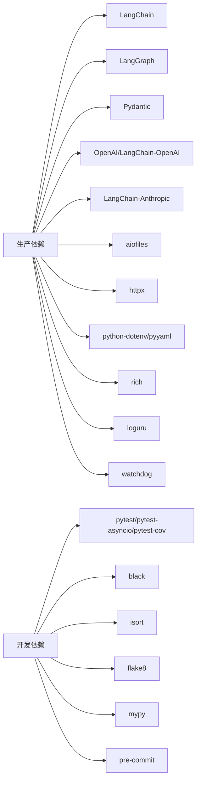

# 快速开始

<cite>
**本文引用的文件**
- [README.md](file://README.md)
- [requirements.txt](file://requirements.txt)
- [requirements-dev.txt](file://requirements-dev.txt)
- [pyproject.toml](file://pyproject.toml)
- [src/config/llm_config.py](file://src/config/llm_config.py)
- [src/services/llm_service.py](file://src/services/llm_service.py)
- [src/agents/interview_agent.py](file://src/agents/interview_agent.py)
- [src/services/knowledge_base_querier.py](file://src/services/knowledge_base_querier.py)
- [src/storage/markdown_file_manager.py](file://src/storage/markdown_file_manager.py)
- [tests/test_llm_service.py](file://tests/test_llm_service.py)
- [integration_test_new_user.py](file://integration_test_new_user.py)
</cite>

## 目录
1. [简介](#简介)
2. [项目结构](#项目结构)
3. [核心组件](#核心组件)
4. [架构总览](#架构总览)
5. [详细组件分析](#详细组件分析)
6. [依赖分析](#依赖分析)
7. [性能注意事项](#性能注意事项)
8. [故障排查指南](#故障排查指南)
9. [结论](#结论)
10. [附录](#附录)

## 简介
本指南面向首次使用“老人自传 Agent 系统”的用户，帮助你在最短时间内完成环境搭建、依赖安装、环境变量配置，并成功运行系统进行基本操作。你将学会：
- 如何安装 Python 3.10+ 并在 macOS/Linux/Windows 上创建虚拟环境
- 如何克隆项目、安装生产与开发依赖
- 如何配置 LLM 提供商、日志与知识库路径等关键环境变量
- 如何初始化 LLM 服务、创建访谈 Agent 并开始对话
- 如何进行知识库查询与结果解析
- 如何运行测试与代码质量检查（pytest、格式化、导入排序、类型检查、代码检查）

## 项目结构
系统采用模块化分层组织，核心目录与职责如下：
- src/：源代码
  - agents/：Agent 层（如 InterviewAgent）
  - services/：服务层（LLMService、KnowledgeBaseQuerier、MemoryManager 等）
  - storage/：存储层（MarkdownFileManager、MemoryRepository）
  - config/：配置（LLM 配置）
  - models/：数据模型
  - prompts/：Prompt 模板
- knowledge_base/：知识库（Markdown 文件系统）
- tests/：单元测试
- Prompts/：Prompt 文档

**图表来源**
- [src/agents/interview_agent.py:16-184](file://src/agents/interview_agent.py#L16-L184)
- [src/services/llm_service.py:32-89](file://src/services/llm_service.py#L32-L89)
- [src/services/knowledge_base_querier.py:202-236](file://src/services/knowledge_base_querier.py#L202-L236)
- [src/storage/markdown_file_manager.py:31-103](file://src/storage/markdown_file_manager.py#L31-L103)
- [src/config/llm_config.py:10-41](file://src/config/llm_config.py#L10-L41)

**章节来源**
- [README.md:92-200](file://README.md#L92-L200)

## 核心组件
- LLM 配置与服务
  - LLMConfig：从环境变量加载 LLM 提供商、模型名、API Key、基础 URL、温度、最大 Token 等参数；支持 DeepSeek/OpenAI/Antropic 等提供商。
  - LLMService：封装 LangChain 调用、Prompt 模板加载、结构化输出、重试与统计。
- 访谈 Agent
  - InterviewAgent：负责启动采访、处理用户输入、识别关键信息、查询知识库、生成下一个问题、时间控制与对话记录。
- 知识库查询
  - KnowledgeBaseQuerier：基于 ReAct 的 Agent 查询，结合工具（列目录、读文件、追踪链接、标记可疑文件等）进行路径探索与结果解析。
- 存储与文件管理
  - MarkdownFileManager：确保知识库目录结构、创建/读取/更新 Markdown 文件、全文搜索与链接追踪。

**章节来源**
- [src/config/llm_config.py:10-120](file://src/config/llm_config.py#L10-L120)
- [src/services/llm_service.py:32-481](file://src/services/llm_service.py#L32-L481)
- [src/agents/interview_agent.py:16-346](file://src/agents/interview_agent.py#L16-L346)
- [src/services/knowledge_base_querier.py:202-540](file://src/services/knowledge_base_querier.py#L202-L540)
- [src/storage/markdown_file_manager.py:31-200](file://src/storage/markdown_file_manager.py#L31-L200)

## 架构总览
系统采用“对话引导层-结构化整理层-记忆管理层-写作生成层”的分层架构，通过 LLMService 统一调度各模块，知识库以 Markdown 文件系统持久化。

**图表来源**
- [README.md:27-53](file://README.md#L27-L53)
- [src/agents/interview_agent.py:16-184](file://src/agents/interview_agent.py#L16-L184)
- [src/services/llm_service.py:32-89](file://src/services/llm_service.py#L32-L89)
- [src/services/knowledge_base_querier.py:202-236](file://src/services/knowledge_base_querier.py#L202-L236)
- [src/storage/markdown_file_manager.py:31-103](file://src/storage/markdown_file_manager.py#L31-L103)

## 详细组件分析

### 环境搭建与依赖安装
- 环境要求
  - Python 3.10 或更高版本
  - 支持的操作系统：macOS、Linux、Windows
- 克隆与虚拟环境
  - 克隆仓库后，使用 venv 创建虚拟环境并在对应平台激活
- 安装依赖
  - 安装生产依赖与可选开发依赖
- 代码质量工具
  - black、isort、mypy、flake8、pytest（含覆盖率）

**章节来源**
- [README.md:204-294](file://README.md#L204-L294)
- [requirements.txt:1-24](file://requirements.txt#L1-L24)
- [requirements-dev.txt:1-13](file://requirements-dev.txt#L1-L13)
- [pyproject.toml:1-26](file://pyproject.toml#L1-L26)

### 环境变量配置
- LLM 提供商配置
  - 优先使用 DeepSeek 专属配置（DEEPSEEK_URL、DEEPSEEK_APIKEY），若不可用则回退到通用配置
  - 支持 DeepSeek 专属配置（DEEPSEEK_URL、DEEPSEEK_APIKEY）
- 日志配置
  - LOG_LEVEL、LOG_FILE
- 知识库配置
  - KNOWLEDGE_BASE_PATH（相对或绝对路径）

配置示例与说明见项目 README 的“快速开始”与“配置说明”。

**章节来源**
- [src/config/llm_config.py:42-120](file://src/config/llm_config.py#L42-L120)
- [README.md:242-266](file://README.md#L242-L266)
- [README.md:362-393](file://README.md#L362-L393)

### 初始化 LLM 服务与创建访谈 Agent
- 初始化 LLM 服务
  - 通过 LLMConfig.from_env 或 from_env 加载配置
  - LLMService 构造时自动初始化模型（OpenAI/DeepSeek/Antropic）
- 创建 InterviewAgent
  - 传入 llm_service、user_id，可选 memory_manager、工具与会话参数
- 开始对话
  - 调用 start() 生成开场白
  - 调用 handle_input(user_input) 处理用户输入并生成下一个问题

**图表来源**
- [src/agents/interview_agent.py:80-184](file://src/agents/interview_agent.py#L80-L184)
- [src/services/llm_service.py:225-325](file://src/services/llm_service.py#L225-L325)
- [src/services/knowledge_base_querier.py:257-373](file://src/services/knowledge_base_querier.py#L257-L373)

**章节来源**
- [src/config/llm_config.py:113-120](file://src/config/llm_config.py#L113-L120)
- [src/services/llm_service.py:71-89](file://src/services/llm_service.py#L71-L89)
- [src/agents/interview_agent.py:37-184](file://src/agents/interview_agent.py#L37-L184)
- [README.md:298-331](file://README.md#L298-L331)

### 知识库查询与结果解析
- 查询流程
  - KnowledgeBaseQuerier 使用 ReAct Agent，结合工具进行路径探索与文件读取
  - 工具包括：list_files、read_file、follow_links、mark_suspected_file、get_exploration_report、has_visited
- 结果解析
  - 支持标准 JSON Final Answer 与自然语言降级解析
  - 返回 MemoryQueryResult，包含 related_memories、linked_context、total_count、has_results 等

**图表来源**
- [src/services/knowledge_base_querier.py:237-433](file://src/services/knowledge_base_querier.py#L237-L433)
- [src/services/knowledge_base_querier.py:435-540](file://src/services/knowledge_base_querier.py#L435-L540)

**章节来源**
- [src/services/knowledge_base_querier.py:17-200](file://src/services/knowledge_base_querier.py#L17-L200)
- [src/services/knowledge_base_querier.py:257-373](file://src/services/knowledge_base_querier.py#L257-L373)
- [src/storage/markdown_file_manager.py:134-200](file://src/storage/markdown_file_manager.py#L134-L200)

### 基本使用示例
- 初始化 LLM 服务与创建 InterviewAgent
- 开始对话与继续提问
- 知识库查询与结果解析

示例见 README 的“使用示例”，包含：
- 基本使用（初始化 LLM、创建 Agent、开始对话）
- 知识库查询（创建 Querier、执行查询、打印答案与相关事件）

**章节来源**
- [README.md:298-331](file://README.md#L298-L331)

## 依赖分析
- 生产依赖
  - LangChain、LangGraph、Pydantic
  - OpenAI、LangChain-OpenAI、LangChain-Anthropic
  - aiofiles、httpx（异步支持）
  - python-dotenv、pyyaml（配置与YAML）
  - rich（终端美化）、loguru（日志）
  - watchdog（文件监控）
- 开发依赖
  - pytest、pytest-asyncio、pytest-cov（测试与覆盖率）
  - black、isort、flake8、mypy（代码质量）
  - pre-commit（Git钩子）

**图表来源**
- [requirements.txt:1-24](file://requirements.txt#L1-L24)
- [requirements-dev.txt:1-13](file://requirements-dev.txt#L1-L13)
- [pyproject.toml:8-26](file://pyproject.toml#L8-L26)

**章节来源**
- [requirements.txt:1-24](file://requirements.txt#L1-L24)
- [requirements-dev.txt:1-13](file://requirements-dev.txt#L1-L13)
- [pyproject.toml:1-26](file://pyproject.toml#L1-L26)

## 性能注意事项
- LLM 调用重试与指数退避：在 LLMService 中内置重试机制，降低网络波动影响
- Token 使用统计：记录 prompt/completion/total tokens，便于成本与性能分析
- 异步 I/O：使用 aiofiles 与 httpx，提高文件与网络操作效率
- Prompt 模板缓存：LLMService 会加载并缓存模板，减少重复 IO

**章节来源**
- [src/services/llm_service.py:400-437](file://src/services/llm_service.py#L400-L437)
- [src/services/llm_service.py:449-461](file://src/services/llm_service.py#L449-L461)
- [src/storage/markdown_file_manager.py:1-200](file://src/storage/markdown_file_manager.py#L1-L200)

## 故障排查指南
- 环境变量未配置
  - 确认 .env 文件存在并包含 DEEPSEEK_URL/DEEPSEEK_APIKEY 或 DEEPSEEK_URL/DEEPSEEK_APIKEY
  - 若缺失，LLMConfig.from_env 将抛出异常
- LLM 调用失败
  - 查看 LLMService 的错误日志与重试记录
  - 检查 API Key、基础 URL、网络连通性
- 知识库路径错误
  - 确认 KNOWLEDGE_BASE_PATH 指向有效目录
  - KnowledgeBaseQuerier 会在路径不存在或非目录时返回空结果
- 测试与代码质量
  - 使用 pytest 运行测试，查看失败用例定位问题
  - 使用 black/isort/mypy/flake8 修复格式与类型问题

**章节来源**
- [src/config/llm_config.py:42-120](file://src/config/llm_config.py#L42-L120)
- [src/services/llm_service.py:285-291](file://src/services/llm_service.py#L285-L291)
- [src/services/knowledge_base_querier.py:280-294](file://src/services/knowledge_base_querier.py#L280-L294)
- [tests/test_llm_service.py:1-187](file://tests/test_llm_service.py#L1-L187)

## 结论
通过本快速开始指南，你已经完成了环境搭建、依赖安装、LLM 与知识库配置，并掌握了初始化 LLM 服务、创建 InterviewAgent、进行知识库查询与结果解析的基本流程。建议在本地先运行集成测试与单元测试，确保一切正常后再进行实际采访。

## 附录

### 快速命令清单
- 克隆与进入目录
  - git clone <repository-url> && cd elder-memoir-agent
- 创建并激活虚拟环境
  - python -m venv .venv
  - Linux/macOS: source .venv/bin/activate
  - Windows: .venv\Scripts\activate
- 安装依赖
  - pip install -r requirements.txt
  - pip install -r requirements-dev.txt
- 配置环境变量
  - cp .env.example .env
  - 编辑 .env，填入 DEEPSEEK_URL/DEEPSEEK_APIKEY 等
- 运行测试
  - pytest
  - pytest -v
  - pytest --cov=src --cov-report=html
- 代码质量检查
  - black src/
  - isort src/
  - mypy src/
  - flake8 src/

**章节来源**
- [README.md:211-294](file://README.md#L211-L294)