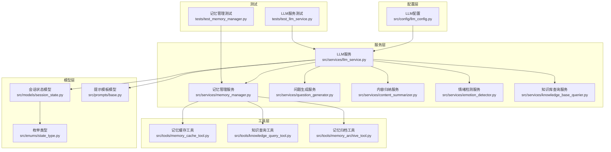
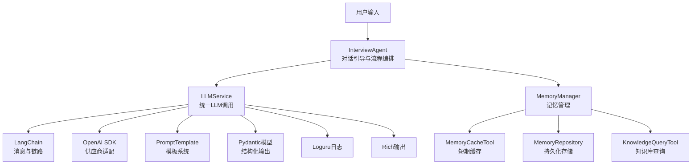
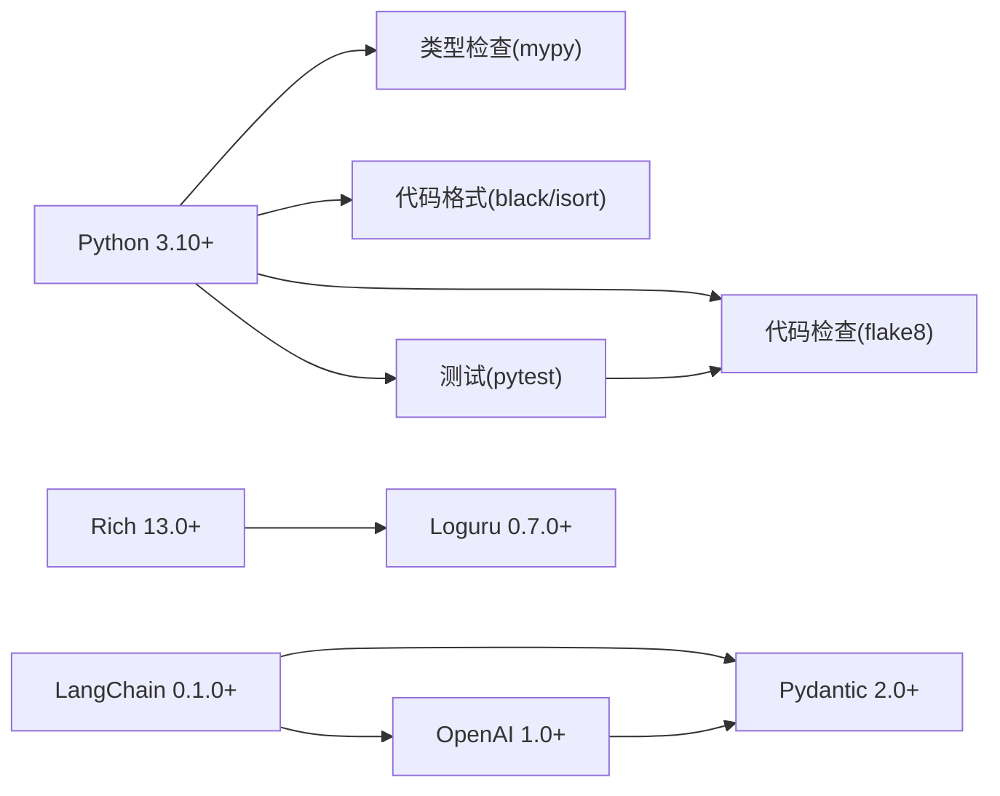

# 技术栈

<cite>
**本文引用的文件**
- [README.md](file://README.md)
- [pyproject.toml](file://pyproject.toml)
- [requirements.txt](file://requirements.txt)
- [requirements-dev.txt](file://requirements-dev.txt)
- [src/config/llm_config.py](file://src/config/llm_config.py)
- [src/services/llm_service.py](file://src/services/llm_service.py)
- [src/models/session_state.py](file://src/models/session_state.py)
- [src/prompts/base.py](file://src/prompts/base.py)
- [src/enums/state_type.py](file://src/enums/state_type.py)
- [src/tools/memory_cache_tool.py](file://src/tools/memory_cache_tool.py)
- [tests/test_llm_service.py](file://tests/test_llm_service.py)
- [tests/test_memory_manager.py](file://tests/test_memory_manager.py)
</cite>

## 目录
1. [引言](#引言)
2. [项目结构](#项目结构)
3. [核心组件](#核心组件)
4. [架构总览](#架构总览)
5. [详细组件分析](#详细组件分析)
6. [依赖关系分析](#依赖关系分析)
7. [性能考量](#性能考量)
8. [故障排查指南](#故障排查指南)
9. [结论](#结论)

## 引言
本技术栈文档面向“老人自传 Agent 系统”的开发者与维护者，系统性阐述项目采用的核心技术与框架选择、版本约束与兼容性考量、以及各技术在系统中的职责与协同方式。重点覆盖：
- Python 3.10+ 作为主要开发语言的原因与优势
- LangChain 0.1.0+ 与 LangGraph 0.0.20+ 在AI应用框架与Agent状态机中的关键作用
- Pydantic 2.0+ 在数据模型验证与结构化输出中的重要性
- OpenAI 1.0+ 在大语言模型接口集成中的应用
- Rich 13.0+ 在美化终端输出界面方面的贡献
- Loguru 0.7.0+ 在日志管理中的作用
- pytest 7.0+ 在单元测试中的应用

## 项目结构
项目采用分层清晰的组织方式：配置层、服务层、模型层、提示词层、工具层、控制器与核心编排层，配合测试与知识库资源。技术栈在各层中协同工作，形成端到端的智能对话与记忆管理闭环。

图表来源
- [src/config/llm_config.py:1-120](file://src/config/llm_config.py#L1-L120)
- [src/services/llm_service.py:1-481](file://src/services/llm_service.py#L1-L481)
- [src/models/session_state.py:1-139](file://src/models/session_state.py#L1-L139)
- [src/prompts/base.py:1-33](file://src/prompts/base.py#L1-L33)
- [src/enums/state_type.py:1-12](file://src/enums/state_type.py#L1-L12)
- [src/tools/memory_cache_tool.py:1-89](file://src/tools/memory_cache_tool.py#L1-L89)
- [tests/test_llm_service.py:1-187](file://tests/test_llm_service.py#L1-L187)
- [tests/test_memory_manager.py:1-249](file://tests/test_memory_manager.py#L1-L249)

章节来源
- [README.md:77-90](file://README.md#L77-L90)
- [README.md:92-200](file://README.md#L92-L200)

## 核心组件
- Python 3.10+：统一的开发语言，兼顾类型系统与异步生态；项目配置与类型检查严格对齐至3.10。
- LangChain 0.1.0+：提供统一的LLM调用、提示词模板管理、消息构建与链式调用能力。
- LangGraph 0.0.20+：支撑Agent的状态机编排与多轮对话流转。
- Pydantic 2.0+：强类型数据模型、结构化输出校验与运行时验证，保障跨模块数据一致性。
- OpenAI 1.0+：统一接入多种LLM供应商（含兼容OpenAI API的模型），提供稳定的消息接口与流式能力。
- Rich 13.0+：终端UI美化与日志输出增强，提升开发体验与可观测性。
- Loguru 0.7.0+：结构化日志记录与灵活配置，简化日志管理与问题定位。
- pytest 7.0+：异步友好、插件丰富，配合覆盖率与静态检查工具链，保证代码质量。

章节来源
- [README.md:77-90](file://README.md#L77-L90)
- [pyproject.toml:6](file://pyproject.toml#L6)
- [pyproject.toml:19-22](file://pyproject.toml#L19-L22)
- [requirements.txt:2-24](file://requirements.txt#L2-L24)
- [requirements-dev.txt:2-13](file://requirements-dev.txt#L2-L13)

## 架构总览
系统围绕“LLM服务”为中心，向上提供统一的提示词模板与结构化输出能力，向下对接记忆管理、知识库查询与工具链，形成“对话—抽取—记忆—生成”的闭环。

图表来源
- [src/services/llm_service.py:32-481](file://src/services/llm_service.py#L32-L481)
- [src/config/llm_config.py:10-120](file://src/config/llm_config.py#L10-L120)
- [src/prompts/base.py:6-33](file://src/prompts/base.py#L6-L33)
- [src/tools/memory_cache_tool.py:8-89](file://src/tools/memory_cache_tool.py#L8-L89)
- [requirements.txt:2-10](file://requirements.txt#L2-L10)

## 详细组件分析

### Python 3.10+：语言与生态
- 选择原因
  - 类型系统与类型注解成熟，配合mypy严格检查，降低运行期错误。
  - 异步生态完善，支持高并发与低延迟的对话与记忆处理。
  - 版本对齐：项目配置与类型检查均指向3.10，确保团队一致的开发与部署环境。
- 兼容性与优势
  - 与LangChain、Pydantic、OpenAI等主流库在3.10上具备良好兼容性。
  - 便于未来升级至更高版本Python时的平滑迁移。

章节来源
- [pyproject.toml:6](file://pyproject.toml#L6)
- [pyproject.toml:19-22](file://pyproject.toml#L19-L22)
- [README.md:208](file://README.md#L208)

### LangChain 0.1.0+：LLM应用框架
- 职责与能力
  - 统一封装LLM调用、消息构建与链式调用，屏蔽不同供应商差异。
  - 提供提示词模板加载与渲染能力，支持从文件与模块加载。
  - 支持结构化输出与JSON Schema校验，结合Pydantic实现强类型解析。
- 在系统中的应用
  - LLMService封装模型初始化、调用、重试、统计与模板管理。
  - 通过ChatOpenAI适配OpenAI与兼容OpenAI API的模型（如DeepSeek）。
- 版本与兼容
  - 与OpenAI SDK 1.0+协同，确保消息接口与流式能力稳定。

章节来源
- [src/services/llm_service.py:32-481](file://src/services/llm_service.py#L32-L481)
- [src/services/llm_service.py:90-125](file://src/services/llm_service.py#L90-L125)
- [src/services/llm_service.py:126-161](file://src/services/llm_service.py#L126-L161)
- [requirements.txt:2-10](file://requirements.txt#L2-L10)

### LangGraph 0.0.20+：Agent状态机
- 职责与能力
  - 通过状态图编排Agent的多轮对话与状态流转，支持条件判断、分支与暂停/恢复。
  - 与LangChain结合，将状态机与LLM链路无缝衔接。
- 在系统中的应用
  - 会话状态由SessionState模型承载，配合StateType枚举描述Agent所处阶段。
  - InterviewAgent负责状态推进与流程控制，结合记忆与知识库工具实现上下文感知。
- 版本与兼容
  - 与LangChain 0.1.0+协同，确保状态机与链路的稳定性。

章节来源
- [src/models/session_state.py:24-139](file://src/models/session_state.py#L24-L139)
- [src/enums/state_type.py:4-12](file://src/enums/state_type.py#L4-L12)
- [src/agents/interview_agent.py:16-346](file://src/agents/interview_agent.py#L16-L346)

### Pydantic 2.0+：数据模型与结构化输出
- 职责与能力
  - 提供强类型模型定义、运行时验证与JSON Schema生成。
  - 在LLMService中用于结构化输出解析，确保下游模块接收的数据格式一致。
- 在系统中的应用
  - LLMService.invoke_structured通过模板与Schema生成JSON约束，再用Pydantic模型校验与反序列化。
  - SessionState与PromptTemplate等模型确保状态与提示词的结构化与可追踪。
- 版本与兼容
  - 与Python 3.10+类型系统深度集成，配合mypy实现静态与运行时双重保障。

章节来源
- [src/services/llm_service.py:327-399](file://src/services/llm_service.py#L327-L399)
- [src/models/session_state.py:1-139](file://src/models/session_state.py#L1-L139)
- [src/prompts/base.py:6-33](file://src/prompts/base.py#L6-L33)
- [pyproject.toml:19-22](file://pyproject.toml#L19-L22)

### OpenAI 1.0+：大语言模型接口集成
- 职责与能力
  - 提供统一的Chat模型接口，兼容OpenAI与兼容OpenAI API的模型（如DeepSeek）。
  - 支持消息调用、流式响应与使用量统计。
- 在系统中的应用
  - LLMService通过ChatOpenAI初始化不同供应商模型，统一对外接口。
  - LLMConfig支持多供应商配置与回退策略。
- 版本与兼容
  - 与LangChain 0.1.0+协同，确保消息与链路的稳定性。

章节来源
- [src/services/llm_service.py:90-125](file://src/services/llm_service.py#L90-L125)
- [src/config/llm_config.py:10-120](file://src/config/llm_config.py#L10-L120)
- [requirements.txt:7-10](file://requirements.txt#L7-L10)

### Rich 13.0+：终端输出美化
- 职责与能力
  - 提供丰富的终端UI组件（表格、日志、进度条等），改善开发者与运维的可观测性体验。
- 在系统中的应用
  - LLMService在调用前后打印请求状态，提升调试可见性。
- 版本与兼容
  - 与Python 3.10+兼容，配合Loguru实现统一的日志与输出风格。

章节来源
- [src/services/llm_service.py:423-429](file://src/services/llm_service.py#L423-L429)
- [requirements.txt:18](file://requirements.txt#L18)

### Loguru 0.7.0+：日志管理
- 职责与能力
  - 提供简洁而强大的日志API，支持多级日志、文件输出、结构化日志与灵活配置。
- 在系统中的应用
  - LLMService与各服务模块广泛使用logger记录调用、错误与统计信息。
- 版本与兼容
  - 与Python 3.10+兼容，配合pytest与CI工具链实现自动化日志采集。

章节来源
- [src/services/llm_service.py:15](file://src/services/llm_service.py#L15)
- [src/services/llm_service.py:286](file://src/services/llm_service.py#L286)
- [src/services/llm_service.py:431-437](file://src/services/llm_service.py#L431-L437)

### pytest 7.0+：单元测试
- 职责与能力
  - 异步友好、插件生态丰富，支持覆盖率、类型检查与预提交钩子。
- 在系统中的应用
  - 测试覆盖LLMService调用、重试、模板加载与结构化输出解析。
  - 测试覆盖MemoryManager的组织、保存、查询与清理流程。
- 版本与兼容
  - 与asyncio模式、mypy、black、isort等工具链协同，保障代码质量。

章节来源
- [tests/test_llm_service.py:1-187](file://tests/test_llm_service.py#L1-L187)
- [tests/test_memory_manager.py:1-249](file://tests/test_memory_manager.py#L1-L249)
- [pyproject.toml:24-25](file://pyproject.toml#L24-L25)
- [requirements-dev.txt:2-13](file://requirements-dev.txt#L2-L13)

## 依赖关系分析
- 语言与工具链
  - Python 3.10+ 与mypy、black、isort、flake8、pytest构成开发与质量保障闭环。
- 核心依赖
  - LangChain 0.1.0+ 与 OpenAI 1.0+ 提供统一LLM调用与供应商适配。
  - Pydantic 2.0+ 保障结构化输出与数据模型一致性。
  - Rich 13.0+ 与 Loguru 0.7.0+ 提升可观测性与日志管理能力。
- 测试与开发
  - pytest 7.0+ 驱动单元测试与覆盖率，结合预提交钩子保证提交质量。

图表来源
- [pyproject.toml:11-22](file://pyproject.toml#L11-L22)
- [requirements.txt:2-24](file://requirements.txt#L2-L24)
- [requirements-dev.txt:2-13](file://requirements-dev.txt#L2-L13)

章节来源
- [pyproject.toml:11-22](file://pyproject.toml#L11-L22)
- [requirements.txt:2-24](file://requirements.txt#L2-L24)
- [requirements-dev.txt:2-13](file://requirements-dev.txt#L2-L13)

## 性能考量
- 异步调用与重试
  - LLMService采用异步调用与指数退避重试，提升网络波动下的稳定性与吞吐。
- 缓存与知识库
  - MemoryCacheTool提供会话级短期缓存，减少重复查询与LLM调用成本。
  - KnowledgeQueryTool与MemoryRepository配合，实现高效检索与持久化。
- 日志与统计
  - LLMService内置调用统计（成功率、平均耗时、Token用量），便于性能监控与优化。
- 终端可观测性
  - Rich输出与Loguru日志结合，快速定位问题与瓶颈。

章节来源
- [src/services/llm_service.py:400-438](file://src/services/llm_service.py#L400-L438)
- [src/tools/memory_cache_tool.py:34-89](file://src/tools/memory_cache_tool.py#L34-L89)
- [src/services/llm_service.py:449-462](file://src/services/llm_service.py#L449-L462)

## 故障排查指南
- LLM调用失败
  - 现象：调用返回失败或抛出异常。
  - 排查：查看Loguru日志中的错误信息；确认OpenAI/LangChain版本与配置；检查网络与API Key。
  - 参考：LLMService的重试逻辑与错误返回。
- 结构化输出解析失败
  - 现象：invoke_structured返回None且raw.result.error包含“Parse error”。
  - 排查：检查模板生成的JSON是否符合Schema；确认模型输出包裹在代码块时的提取逻辑。
  - 参考：结构化输出解析与JSON提取逻辑。
- 缓存命中异常
  - 现象：get_cache未命中或命中关键词不匹配。
  - 排查：确认tags设置与查询tags的交集；检查append_cache是否正确写入。
  - 参考：MemoryCacheTool的缓存结构与查询逻辑。
- 测试失败
  - 现象：单元测试断言失败或覆盖率不足。
  - 排查：使用pytest -v查看详细输出；结合black、isort、mypy修复格式与类型问题；补充缺失的测试用例。

章节来源
- [src/services/llm_service.py:285-291](file://src/services/llm_service.py#L285-L291)
- [src/services/llm_service.py:394-398](file://src/services/llm_service.py#L394-L398)
- [src/tools/memory_cache_tool.py:49-61](file://src/tools/memory_cache_tool.py#L49-L61)
- [tests/test_llm_service.py:104-120](file://tests/test_llm_service.py#L104-L120)
- [tests/test_memory_manager.py:152-166](file://tests/test_memory_manager.py#L152-L166)

## 结论
本项目以Python 3.10+为基础，结合LangChain 0.1.0+、LangGraph 0.0.20+、Pydantic 2.0+、OpenAI 1.0+、Rich 13.0+、Loguru 0.7.0+与pytest 7.0+，构建了从对话引导、记忆管理到知识库查询与结构化输出的完整AI应用体系。该技术栈在类型安全、可观测性、测试覆盖与供应商适配上实现了良好平衡，既满足当前业务需求，也为后续扩展与演进提供了坚实基础。