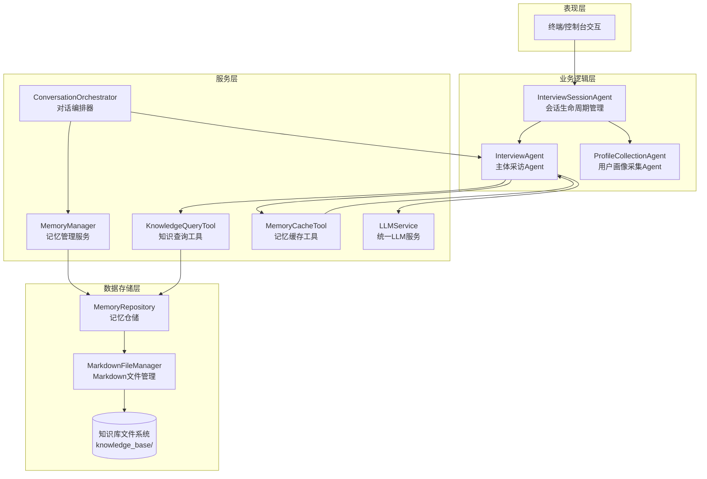
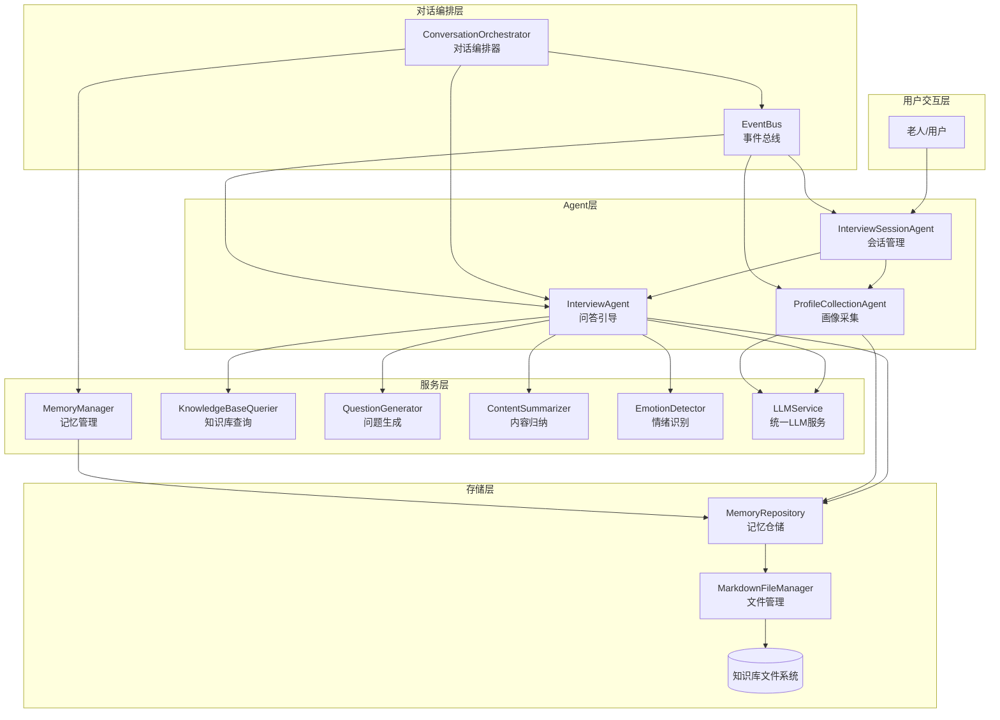
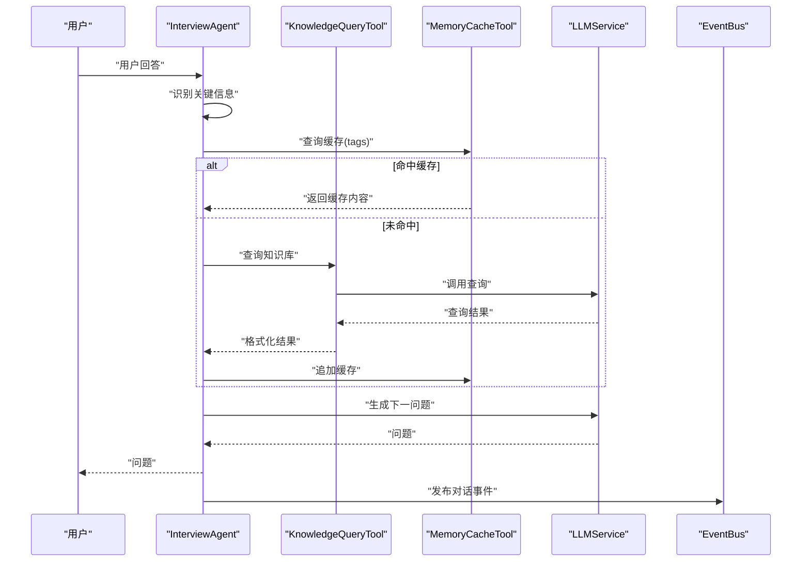
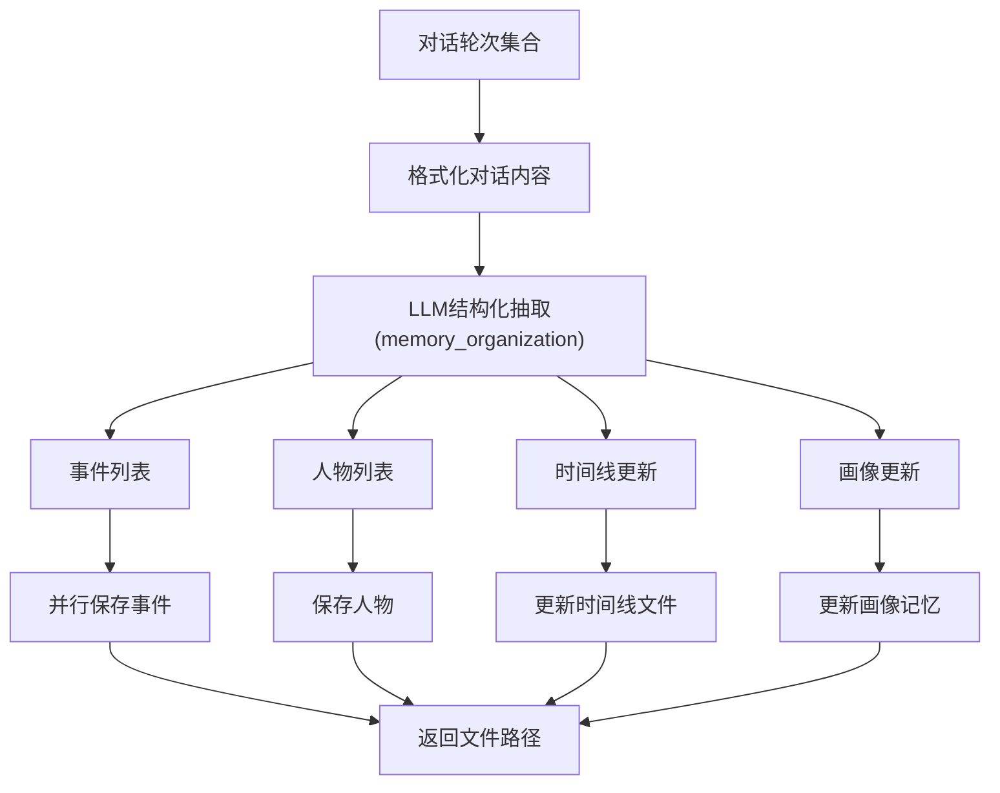
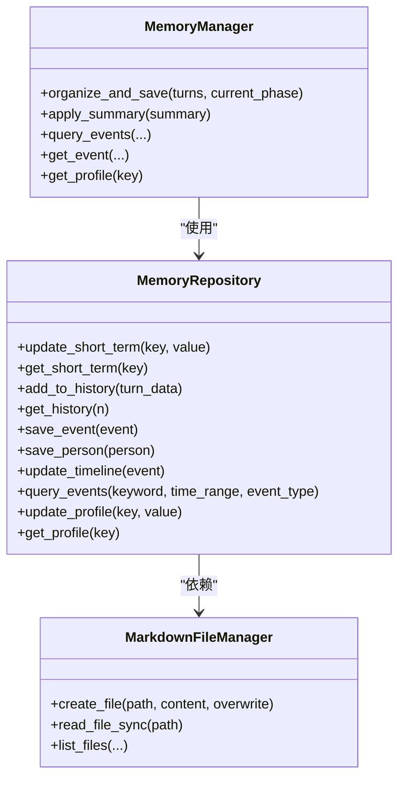
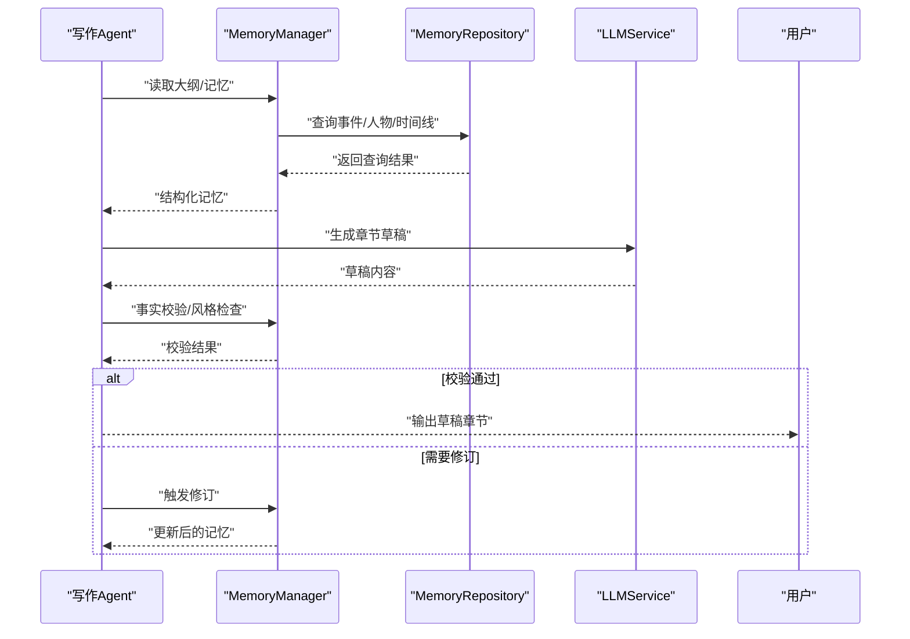
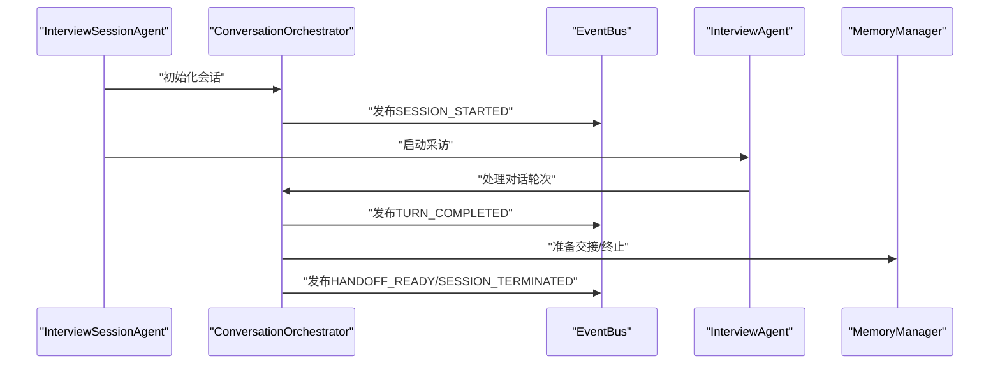
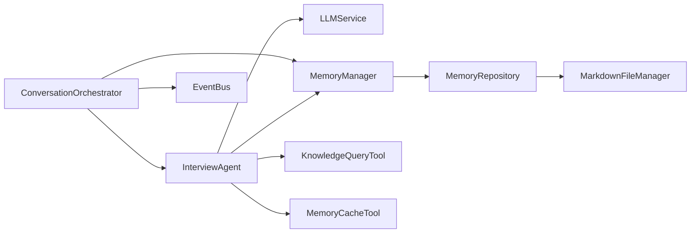

# 架构概览

<cite>
**本文引用的文件**
- [README.md](file://README.md)
- [老人自传 Agent 协作架构.md](file://老人自传 Agent 协作架构.md)
- [老人自传写作指南.md](file://老人自传写作指南.md)
- [MEMORY_INTERACTION_GUIDE.md](file://MEMORY_INTERACTION_GUIDE.md)
- [src/core/event_bus.py](file://src/core/event_bus.py)
- [src/core/conversation_orchestrator.py](file://src/core/conversation_orchestrator.py)
- [src/agents/interview_agent.py](file://src/agents/interview_agent.py)
- [src/agents/interview_session_agent.py](file://src/agents/interview_session_agent.py)
- [src/agents/profile_collection_agent.py](file://src/agents/profile_collection_agent.py)
- [src/services/memory_manager.py](file://src/services/memory_manager.py)
- [src/storage/memory_repository.py](file://src/storage/memory_repository.py)
- [src/models/session_state.py](file://src/models/session_state.py)
- [src/enums/state_type.py](file://src/enums/state_type.py)
- [src/enums/phase_type.py](file://src/enums/phase_type.py)
- [src/tools/memory_cache_tool.py](file://src/tools/memory_cache_tool.py)
- [src/tools/knowledge_query_tool.py](file://src/tools/knowledge_query_tool.py)
- [Prompts/QuestionGenerator-Prompt.md](file://Prompts/QuestionGenerator-Prompt.md)
- [Prompts/MemoryOrganizer-Prompt.md](file://Prompts/MemoryOrganizer-Prompt.md)
</cite>

## 目录
1. [简介](#简介)
2. [项目结构](#项目结构)
3. [核心组件](#核心组件)
4. [架构总览](#架构总览)
5. [详细组件分析](#详细组件分析)
6. [依赖分析](#依赖分析)
7. [性能考量](#性能考量)
8. [故障排查指南](#故障排查指南)
9. [结论](#结论)
10. [附录](#附录)

## 简介
本系统围绕“老人自传”这一核心目标，构建了一个以多Agent协作为核心的智能对话与内容生成体系。系统通过“问答引导层”采集信息，“结构化整理层”抽取与组织，“记忆管理层”多层存储与交叉印证，“写作生成层”产出草稿，形成闭环的数据与任务流转。系统采用事件驱动架构，通过事件总线实现组件解耦；采用分层设计，将表现层、业务逻辑层、服务层与数据存储层职责清晰分离；并通过Prompt模板化与工具化，实现可扩展、可定制的Agent能力。

## 项目结构
项目采用模块化分层组织，核心目录与职责如下：
- src/agents：多Agent实现（问答引导、会话管理、画像采集）
- src/services：服务层（LLM服务、记忆管理、知识库查询、问题生成、内容归纳、情绪识别）
- src/storage：存储层（Markdown文件管理、记忆仓储）
- src/tools：工具层（缓存、知识查询、归档）
- src/core：核心基础设施（事件总线、对话编排器）
- src/models/enums：数据模型与枚举
- Prompts：Prompt模板
- knowledge_base：知识库（Markdown文件系统）

图表来源
- [src/agents/interview_session_agent.py:33-111](file://src/agents/interview_session_agent.py#L33-L111)
- [src/agents/interview_agent.py:16-79](file://src/agents/interview_agent.py#L16-L79)
- [src/agents/profile_collection_agent.py:14-62](file://src/agents/profile_collection_agent.py#L14-L62)
- [src/core/conversation_orchestrator.py:138-197](file://src/core/conversation_orchestrator.py#L138-L197)
- [src/services/memory_manager.py:27-61](file://src/services/memory_manager.py#L27-L61)
- [src/storage/memory_repository.py:40-87](file://src/storage/memory_repository.py#L40-L87)
- [src/tools/knowledge_query_tool.py:11-31](file://src/tools/knowledge_query_tool.py#L11-L31)
- [src/tools/memory_cache_tool.py:8-32](file://src/tools/memory_cache_tool.py#L8-L32)

章节来源
- [README.md:92-200](file://README.md#L92-L200)

## 核心组件
- 问答引导层 Agent-A：负责与用户进行多轮友好对话，生成下一问题，维护对话状态，触发内容归纳与交接。
- 结构化整理层 Agent-B：从对话中抽取事件、人物、时间线、心态等信息，生成结构化数据并更新多层记忆库。
- 记忆管理层：三层记忆（短期/长期/画像）统一管理，支持LRU缓存、索引与文件系统存储。
- 写作生成层 Agent-D：基于记忆库生成自传章节草稿，进行事实与风格校验，支持后台持续写作。

章节来源
- [README.md:27-53](file://README.md#L27-L53)
- [老人自传 Agent 协作架构.md:152-440](file://老人自传 Agent 协作架构.md#L152-L440)

## 架构总览
系统采用“分层解耦 + 事件驱动 + 多Agent协作”的整体架构。对话编排器统一调度各Agent，事件总线实现跨组件解耦通信；记忆管理层作为数据中枢，贯穿采集、整理、校验与生成全过程；服务层封装LLM与工具能力，工具层提供缓存与查询能力，存储层以Markdown文件系统承载知识库。

图表来源
- [src/core/conversation_orchestrator.py:138-197](file://src/core/conversation_orchestrator.py#L138-L197)
- [src/core/event_bus.py:40-58](file://src/core/event_bus.py#L40-L58)
- [src/agents/interview_agent.py:16-79](file://src/agents/interview_agent.py#L16-L79)
- [src/agents/profile_collection_agent.py:14-62](file://src/agents/profile_collection_agent.py#L14-L62)
- [src/agents/interview_session_agent.py:33-111](file://src/agents/interview_session_agent.py#L33-L111)
- [src/services/memory_manager.py:27-61](file://src/services/memory_manager.py#L27-L61)
- [src/storage/memory_repository.py:40-87](file://src/storage/memory_repository.py#L40-L87)

章节来源
- [老人自传 Agent 协作架构.md:9-101](file://老人自传 Agent 协作架构.md#L9-L101)
- [README.md:27-53](file://README.md#L27-L53)

## 详细组件分析

### 问答引导层（Agent-A）
- 职责：维护对话状态、生成下一问题、识别情绪、触发知识库查询与缓存、控制会话时长与交接。
- 关键流程：识别关键信息 → 缓存命中/查询知识库 → 生成问题 → 更新短期记忆 → 触发事件。
- 会话控制：支持初始化画像收集、时间预警与超时处理、阶段推进与过渡。

图表来源
- [src/agents/interview_agent.py:115-184](file://src/agents/interview_agent.py#L115-L184)
- [src/tools/knowledge_query_tool.py:33-66](file://src/tools/knowledge_query_tool.py#L33-L66)
- [src/tools/memory_cache_tool.py:34-84](file://src/tools/memory_cache_tool.py#L34-L84)
- [src/core/event_bus.py:108-134](file://src/core/event_bus.py#L108-L134)

章节来源
- [src/agents/interview_agent.py:16-346](file://src/agents/interview_agent.py#L16-L346)
- [src/agents/interview_session_agent.py:24-111](file://src/agents/interview_session_agent.py#L24-L111)

### 结构化整理层（Agent-B）
- 职责：将对话内容整理为结构化记忆（事件/人物/时间线/画像），并更新多层记忆库。
- 关键流程：格式化对话 → LLM结构化抽取 → 并行保存事件/人物 → 更新时间线 → 应用画像更新。
- 输出：OrganizedMemory结构，包含事件、人物、时间线更新、画像更新与处理摘要。

图表来源
- [src/services/memory_manager.py:111-156](file://src/services/memory_manager.py#L111-L156)
- [src/storage/memory_repository.py:176-226](file://src/storage/memory_repository.py#L176-L226)
- [Prompts/MemoryOrganizer-Prompt.md:12-192](file://Prompts/MemoryOrganizer-Prompt.md#L12-L192)

章节来源
- [src/services/memory_manager.py:27-470](file://src/services/memory_manager.py#L27-L470)
- [src/storage/memory_repository.py:40-359](file://src/storage/memory_repository.py#L40-L359)
- [Prompts/MemoryOrganizer-Prompt.md:1-773](file://Prompts/MemoryOrganizer-Prompt.md#L1-L773)

### 记忆管理层
- 职责：统一管理短期记忆（内存）、长期记忆（文件系统）、画像记忆（结构化），提供查询与索引能力。
- 特性：LRU缓存、历史轮次管理、事件/人物索引、时间线增量更新、画像增量更新。
- 与存储：MarkdownFileManager负责文件读写，MemoryRepository负责索引与缓存。

图表来源
- [src/storage/memory_repository.py:40-359](file://src/storage/memory_repository.py#L40-L359)
- [src/services/memory_manager.py:27-106](file://src/services/memory_manager.py#L27-L106)

章节来源
- [src/storage/memory_repository.py:40-359](file://src/storage/memory_repository.py#L40-L359)
- [src/services/memory_manager.py:27-470](file://src/services/memory_manager.py#L27-L470)

### 写作生成层（Agent-D）
- 职责：基于记忆库生成章节草稿，进行事实与风格校验，支持后台持续写作与用户反馈修订。
- 关键流程：接收大纲 → 读取记忆 → 生成草稿 → 校验与修订 → 存入草稿库 → 输出进度。
- 与记忆库：事件/人物/时间线/画像多库联动，交叉印证确保一致性。

图表来源
- [老人自传 Agent 协作架构.md:441-497](file://老人自传 Agent 协作架构.md#L441-L497)
- [src/services/memory_manager.py:324-431](file://src/services/memory_manager.py#L324-L431)

章节来源
- [老人自传 Agent 协作架构.md:441-500](file://老人自传 Agent 协作架构.md#L441-L500)
- [老人自传写作指南.md:1-253](file://老人自传写作指南.md#L1-L253)

### 会话管理与事件驱动
- 会话管理：InterviewSessionAgent负责会话生命周期（初始化/采访/结束），控制总时长与阶段推进。
- 事件驱动：EventBus提供发布/订阅机制，支持同步与异步处理器，实现组件解耦与可观测性。
- 编排器：ConversationOrchestrator协调情绪识别、知识库查询、内容归纳与交接，统一对外接口。

图表来源
- [src/agents/interview_session_agent.py:112-130](file://src/agents/interview_session_agent.py#L112-L130)
- [src/core/conversation_orchestrator.py:198-234](file://src/core/conversation_orchestrator.py#L198-L234)
- [src/core/event_bus.py:108-170](file://src/core/event_bus.py#L108-L170)

章节来源
- [src/agents/interview_session_agent.py:33-111](file://src/agents/interview_session_agent.py#L33-L111)
- [src/core/conversation_orchestrator.py:138-234](file://src/core/conversation_orchestrator.py#L138-L234)
- [src/core/event_bus.py:40-182](file://src/core/event_bus.py#L40-L182)

## 依赖分析
- 组件耦合：Agent层依赖服务层；服务层依赖存储层；事件总线作为横切关注点，降低耦合。
- 直接依赖：InterviewAgent依赖LLMService、MemoryManager、KnowledgeQueryTool、MemoryCacheTool；MemoryManager依赖MemoryRepository与LLMService；MemoryRepository依赖MarkdownFileManager。
- 外部依赖：LangChain/LangGraph（系统说明）、OpenAI/DeepSeek（LLM提供商）、Rich/Loguru（终端与日志）。

图表来源
- [src/agents/interview_agent.py:37-79](file://src/agents/interview_agent.py#L37-L79)
- [src/services/memory_manager.py:47-61](file://src/services/memory_manager.py#L47-L61)
- [src/storage/memory_repository.py:54-67](file://src/storage/memory_repository.py#L54-L67)
- [src/core/conversation_orchestrator.py:163-197](file://src/core/conversation_orchestrator.py#L163-L197)
- [src/core/event_bus.py:40-58](file://src/core/event_bus.py#L40-L58)

章节来源
- [README.md:77-89](file://README.md#L77-L89)
- [老人自传 Agent 协作架构.md:536-566](file://老人自传 Agent 协作架构.md#L536-L566)

## 性能考量
- 异步与并发：对话轮次中的情绪识别、知识库查询、内容归纳均采用异步任务并行执行，减少等待时间。
- 缓存策略：短期记忆与LRU缓存降低重复查询与LLM调用开销；会话内缓存命中优先。
- 存储优化：事件/人物并行保存，时间线增量更新，避免全量写入。
- 超时与节流：会话时长控制、超时预警、交接阈值，保障用户体验与资源占用可控。

章节来源
- [src/core/conversation_orchestrator.py:269-343](file://src/core/conversation_orchestrator.py#L269-L343)
- [src/storage/memory_repository.py:176-226](file://src/storage/memory_repository.py#L176-L226)
- [src/tools/memory_cache_tool.py:29-84](file://src/tools/memory_cache_tool.py#L29-L84)

## 故障排查指南
- LLM调用失败：检查.env中的API密钥与端点配置；确认网络连通；查看日志错误堆栈。
- 知识库查询异常：确认目标路径包含用户ID；检查Markdown文件是否存在；查看查询结果格式化逻辑。
- 事件/人物未更新：确认OrganizedMemory结构化输出是否成功；检查文件创建路径与权限；查看时间线更新逻辑。
- 会话超时/中断：检查会话计时器与阈值配置；确认事件总线是否正确发布/等待异步事件。
- 缓存未命中：确认tags匹配逻辑；检查缓存清理时机；验证会话ID隔离。

章节来源
- [MEMORY_INTERACTION_GUIDE.md:147-172](file://MEMORY_INTERACTION_GUIDE.md#L147-L172)
- [src/tools/knowledge_query_tool.py:56-66](file://src/tools/knowledge_query_tool.py#L56-L66)
- [src/services/memory_manager.py:140-156](file://src/services/memory_manager.py#L140-L156)

## 结论
本系统以“多Agent协作 + 事件驱动 + 记忆驱动”为核心设计，通过分层架构实现高内聚、低耦合；通过Prompt模板与工具化能力实现可扩展与可定制；通过三层记忆与交叉印证机制确保信息准确性与一致性；通过后台持续写作与用户反馈循环，提升完稿效率与质量。该架构既适合快速迭代开发，也便于在生产环境中进行横向扩展与插件化演进。

## 附录
- Prompt模板：问题生成（QuestionGenerator-Prompt.md）、记忆整理（MemoryOrganizer-Prompt.md）
- 交互式测试：MemoryManager交互式测试脚本（MEMORY_INTERACTION_GUIDE.md）
- 会话状态与阶段：SessionState、StateType、PhaseType

章节来源
- [Prompts/QuestionGenerator-Prompt.md:1-352](file://Prompts/QuestionGenerator-Prompt.md#L1-L352)
- [Prompts/MemoryOrganizer-Prompt.md:1-773](file://Prompts/MemoryOrganizer-Prompt.md#L1-L773)
- [MEMORY_INTERACTION_GUIDE.md:1-172](file://MEMORY_INTERACTION_GUIDE.md#L1-L172)
- [src/models/session_state.py:24-139](file://src/models/session_state.py#L24-L139)
- [src/enums/state_type.py:4-12](file://src/enums/state_type.py#L4-L12)
- [src/enums/phase_type.py:4-10](file://src/enums/phase_type.py#L4-L10)