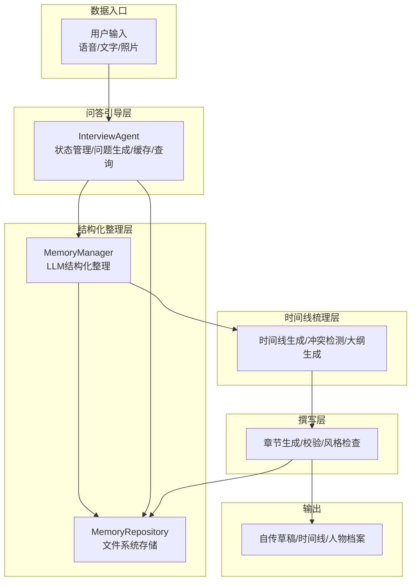
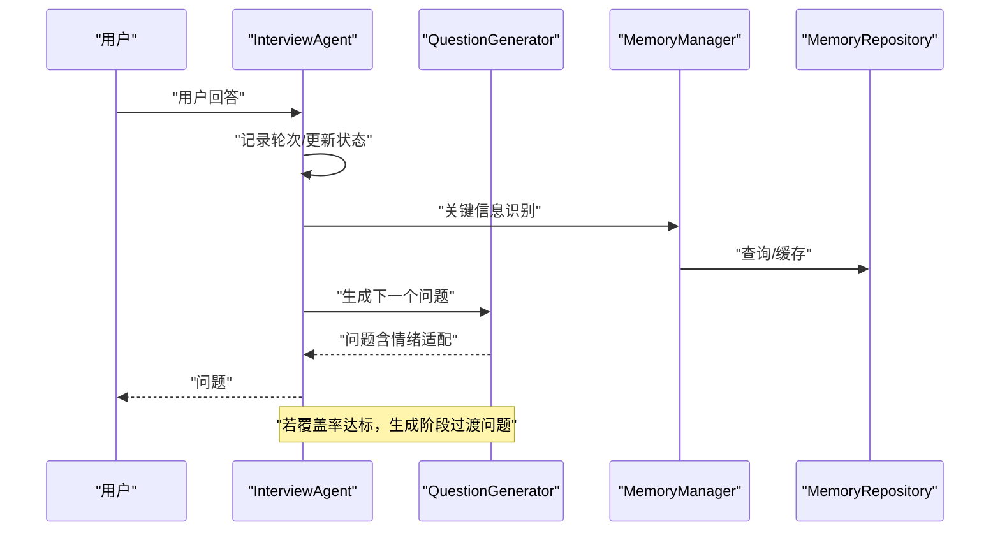
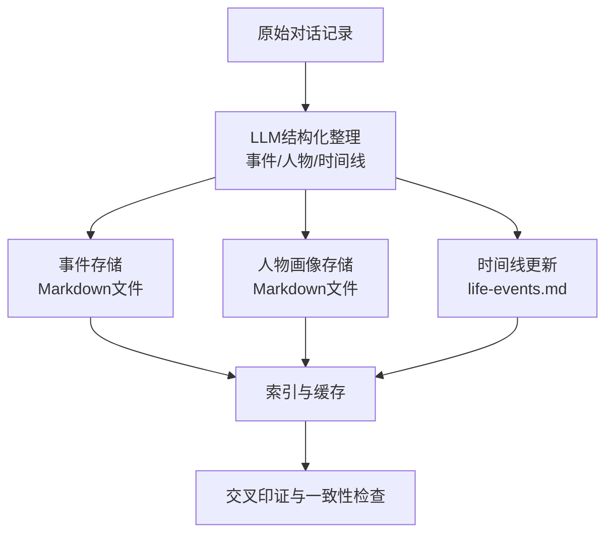
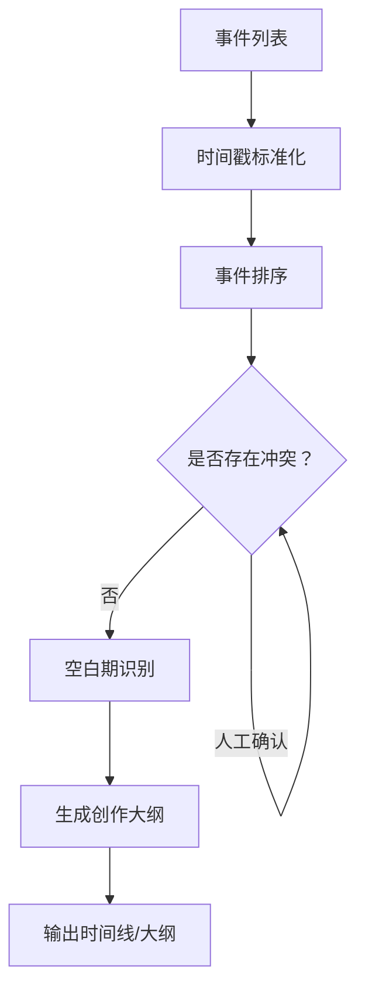
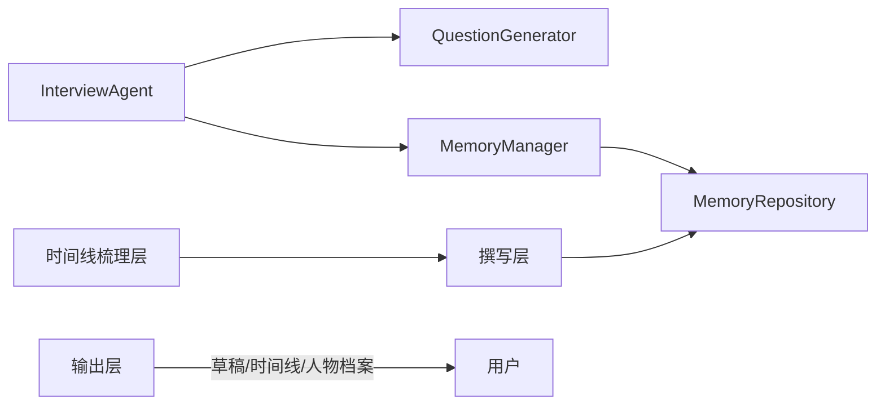

# 核心价值

<cite>
**本文引用的文件**   
- [README.md](file://README.md)
- [老人自传 Agent 协作架构.md](file://老人自传 Agent 协作架构.md)
- [老人自传写作指南.md](file://老人自传写作指南.md)
- [MEMORY_INTERACTION_GUIDE.md](file://MEMORY_INTERACTION_GUIDE.md)
- [Prompts/MemoryOrganizer-Prompt.md](file://Prompts/MemoryOrganizer-Prompt.md)
- [src/agents/interview_agent.py](file://src/agents/interview_agent.py)
- [src/services/memory_manager.py](file://src/services/memory_manager.py)
- [src/storage/memory_repository.py](file://src/storage/memory_repository.py)
- [src/services/question_generator.py](file://src/services/question_generator.py)
- [src/models/session_state.py](file://src/models/session_state.py)
- [src/enums/phase_type.py](file://src/enums/phase_type.py)
- [integration_test_new_user.py](file://integration_test_new_user.py)
- [knowledge_base/test_user001/index.md](file://knowledge_base/test_user001/index.md)
- [knowledge_base/test_user001/timeline/life-events.md](file://knowledge_base/test_user001/timeline/life-events.md)
- [knowledge_base/test_user001/people/family/母亲.md](file://knowledge_base/test_user001/people/family/母亲.md)
</cite>

## 目录
1. [引言](#引言)
2. [项目结构](#项目结构)
3. [核心组件](#核心组件)
4. [架构总览](#架构总览)
5. [详细组件分析](#详细组件分析)
6. [依赖分析](#依赖分析)
7. [性能考虑](#性能考虑)
8. [故障排查指南](#故障排查指南)
9. [结论](#结论)
10. [附录](#附录)

## 引言
本系统以“老人自传”为主题，围绕“传承家族历史、心理疗愈、自我实现、家庭和谐”四大价值维度，通过智能对话采访、结构化记忆整理与多层记忆库沉淀，帮助老人系统化记录人生故事，并在过程中获得被倾听、被理解的温暖体验。系统强调：写回忆录的价值不仅来自最终文稿，更来自撰写过程中的耐心倾听与陪伴。

## 项目结构
系统采用分层协作架构，围绕“问答引导层-结构化整理层-时间线梳理层-多层记忆库-撰写层”的闭环流程，实现从“口述采集”到“结构化沉淀”再到“自传产出”的全链路自动化与半自动化协同。

```mermaid
graph TB
subgraph "用户交互层"
U["👴 老人/用户"]
end
subgraph "问答引导层 Agent-A"
A1["对话管理器"]
A2["问题生成器"]
A3["状态追踪器"]
A4["知识库查询"]
A1 --> A2
A1 --> A3
A2 --> A4
A3 --> A1
end
subgraph "结构化内容整理层 Agent-B"
B1["信息抽取器"]
B2["人物画像构建"]
B3["事件结构化"]
B4["心态思考提取"]
B1 --> B2
B1 --> B3
B1 --> B4
end
subgraph "时间线梳理层 Agent-C"
C1["时间戳对齐"]
C2["事件排序"]
C3["冲突检测"]
C4["大纲生成器"]
C1 --> C2
C2 --> C3
C3 --> C4
end
subgraph "多层记忆库 Memory"
M1["事件记忆库"]
M2["人物画像库"]
M3["时间流程库"]
M4["状态变化库"]
M1 < --> M2
M2 < --> M3
M3 < --> M4
M4 < --> M1
end
subgraph "撰写层 Agent-D"
D1["大纲解析器"]
D2["章节生成器"]
D3["记忆库校验"]
D4["风格一致性检查"]
D5["后台写作引擎"]
D1 --> D2
D2 --> D3
D3 --> D4
D4 --> D5
end
subgraph "输出层"
O1["📖 自传草稿"]
O2["📋 时间线图"]
O3["👤 人物档案"]
end
U < --> |语音/文字输入| A1
A1 < --> |原始对话记录| B1
B1 < --> |结构化信息| M1
B2 < --> |人物画像| M2
C1 < --> |时间线数据| M3
A3 < --> |状态更新| M4
M1 < --> |事件数据| C1
M2 < --> |人物信息| C1
M3 < --> |时间流程| C4
C4 < --> |创作大纲| D1
M1 < --> |事实校验| D3
M2 < --> |人物一致性| D3
M3 < --> |时间线校验| D3
D5 --> |章节内容| O1
C4 --> O2
B2 --> O3
```

图表来源
- [老人自传 Agent 协作架构.md](file://老人自传 Agent 协作架构.md)

章节来源
- [README.md](file://README.md)
- [老人自传 Agent 协作架构.md](file://老人自传 Agent 协作架构.md)

## 核心组件
- 问答引导层（InterviewAgent）：维护对话状态、生成问题、查询知识库、管理缓存、控制时间节奏，确保采访流程顺畅、覆盖全面。
- 结构化整理层（MemoryManager + MemoryRepository）：将原始对话转化为事件、人物、时间线等结构化记忆，沉淀到多层记忆库。
- 时间线梳理层（Agent-C）：对事件进行时间戳对齐、排序与冲突检测，生成创作大纲。
- 撰写层（Agent-D）：依据大纲与记忆库进行章节生成、事实与风格校验，持续产出草稿。
- 输出层：生成自传草稿、时间线图、人物档案，支撑后续修订与出版。

章节来源
- [src/agents/interview_agent.py](file://src/agents/interview_agent.py)
- [src/services/memory_manager.py](file://src/services/memory_manager.py)
- [src/storage/memory_repository.py](file://src/storage/memory_repository.py)
- [老人自传 Agent 协作架构.md](file://老人自传 Agent 协作架构.md)

## 架构总览
系统以“记忆驱动”为核心，通过三层记忆（事件、人物、时间线）与状态变化库的交叉印证，保证信息一致性与可追溯性；同时，后台持续写作机制支持离线生成与迭代修订，满足不同用户的学习曲线与使用习惯。



图表来源
- [老人自传 Agent 协作架构.md](file://老人自传 Agent 协作架构.md)
- [src/agents/interview_agent.py](file://src/agents/interview_agent.py)
- [src/services/memory_manager.py](file://src/services/memory_manager.py)
- [src/storage/memory_repository.py](file://src/storage/memory_repository.py)

## 详细组件分析

### 价值维度与系统实现映射
- 传承价值：通过“事件记忆库 + 时间流程库 + 人物画像库”的多层沉淀，形成至少两代人的家族记忆载体，确保家族历史得以系统化留存与传播。
- 心理疗愈：问答引导层内置“情绪识别与安抚”，在用户情绪波动时提供适配的回应与过渡问题，配合“耐心倾听”的过程体验，缓解孤独与焦虑，提升自我效能感。
- 自我实现：通过“人生回顾法”式的结构化梳理，帮助老人重新审视过往，赋予生命新的意义与价值，增强对人生的掌控感与成就感。
- 家庭和谐：撰写层输出“人物档案”与“时间线图”，促进家庭成员对彼此生命历程的理解与对话，减少误解，增进亲情联结。

章节来源
- [README.md](file://README.md)
- [老人自传写作指南.md](file://老人自传写作指南.md)

### 问答引导层（InterviewAgent）与“耐心倾听”的实现
- 对话状态管理：记录轮次、覆盖率、当前话题、待追问问题、情绪状态，确保采访节奏可控、覆盖面广。
- 问题生成策略：基于上下文与记忆上下文生成自然连贯的问题，避免重复与机械，提升对话流畅度。
- 情绪响应优先：当检测到用户情绪波动时，优先生成安抚性问题与过渡语句，保障心理舒适度。
- 时间控制：在接近时长阈值时加入温和提醒，避免疲劳与压力。



图表来源
- [src/agents/interview_agent.py](file://src/agents/interview_agent.py)
- [src/services/question_generator.py](file://src/services/question_generator.py)
- [src/services/memory_manager.py](file://src/services/memory_manager.py)
- [src/storage/memory_repository.py](file://src/storage/memory_repository.py)

章节来源
- [src/agents/interview_agent.py](file://src/agents/interview_agent.py)
- [src/services/question_generator.py](file://src/services/question_generator.py)
- [src/models/session_state.py](file://src/models/session_state.py)
- [src/enums/phase_type.py](file://src/enums/phase_type.py)

### 结构化整理层（MemoryManager + MemoryRepository）与“家族历史载体”
- 三层记忆组织：事件（含时间、地点、人物、情感）、人物（关系、特征、影响）、时间线（节点、阶段、关联），形成可检索、可交叉印证的知识体系。
- LLM结构化整理：通过Prompt模板将口述转化为结构化JSON，再落盘为Markdown文件，确保可读性与可维护性。
- 增量更新与去重：对已有时间线与人物索引进行对比，避免重复创建，提升数据质量。



图表来源
- [src/services/memory_manager.py](file://src/services/memory_manager.py)
- [src/storage/memory_repository.py](file://src/storage/memory_repository.py)
- [Prompts/MemoryOrganizer-Prompt.md](file://Prompts/MemoryOrganizer-Prompt.md)

章节来源
- [src/services/memory_manager.py](file://src/services/memory_manager.py)
- [src/storage/memory_repository.py](file://src/storage/memory_repository.py)
- [Prompts/MemoryOrganizer-Prompt.md](file://Prompts/MemoryOrganizer-Prompt.md)

### 时间线梳理层与“人生回顾法”的落地
- 时间戳对齐与排序：将事件按时间线排列，识别空白期与冲突，生成创作大纲。
- 冲突检测规则：针对时间、逻辑、人物、地点冲突给出标记与处理建议，确保叙事连贯。
- 大纲生成模板：以“根—成长—闯荡—收获—传承”等章节结构引导，契合“人生回顾法”的心理机制。



图表来源
- [老人自传 Agent 协作架构.md](file://老人自传 Agent 协作架构.md)

章节来源
- [老人自传 Agent 协作架构.md](file://老人自传 Agent 协作架构.md)

### 撰写层与“自我实现”的支撑
- 大纲解析与章节生成：依据时间线与人物画像，生成章节草稿，逐步积累成果感。
- 校验与风格检查：事实一致性、人物一致性、时间线连贯性、情感基调、避免流水账等规则，确保内容质量。
- 后台持续写作：支持离线生成与迭代修订，适应不同用户的节奏。

章节来源
- [老人自传 Agent 协作架构.md](file://老人自传 Agent 协作架构.md)

### 实际应用与价值场景
- 家族历史传承：通过事件与人物档案，形成可阅读、可分享的家族记忆，至少承载两代人的故事。
- 心理疗愈实践：在情绪波动时提供过渡问题与温和提醒，营造安全、被理解的氛围，缓解孤独与焦虑。
- 自我实现路径：借助“人生回顾法”，帮助老人重新审视过往，赋予生命新的意义与价值。
- 家庭沟通桥梁：输出人物档案与时间线图，促进家庭成员对彼此生命历程的理解与对话。

章节来源
- [README.md](file://README.md)
- [老人自传写作指南.md](file://老人自传写作指南.md)

## 依赖分析
系统内部模块耦合度低、职责清晰，通过MemoryRepository统一承接存储与查询，MemoryManager作为结构化整理的协调者，InterviewAgent与QuestionGenerator负责对话引导与情绪适配，形成高内聚、低耦合的协作关系。



图表来源
- [src/agents/interview_agent.py](file://src/agents/interview_agent.py)
- [src/services/memory_manager.py](file://src/services/memory_manager.py)
- [src/storage/memory_repository.py](file://src/storage/memory_repository.py)
- [老人自传 Agent 协作架构.md](file://老人自传 Agent 协作架构.md)

章节来源
- [src/agents/interview_agent.py](file://src/agents/interview_agent.py)
- [src/services/memory_manager.py](file://src/services/memory_manager.py)
- [src/storage/memory_repository.py](file://src/storage/memory_repository.py)
- [老人自传 Agent 协作架构.md](file://老人自传 Agent 协作架构.md)

## 性能考虑
- 并行存储与缓存：结构化整理阶段对事件与人物采取并行保存，结合LRU缓存与索引，提升查询与更新效率。
- 降级策略：当LLM调用失败时，采用预设问题与默认响应，保障流程连续性。
- 后台持续写作：支持离线生成与增量修订，降低实时响应压力，提升用户体验。

## 故障排查指南
- LLM调用失败：检查环境变量与API密钥配置，确认网络连通性。
- 输出乱码：检查终端编码（建议UTF-8）。
- 处理速度慢：适当缩短单次输入长度，避免一次性提交过长内容。
- 记忆库未更新：确认MemoryManager的结构化整理流程是否执行，检查Markdown文件是否成功创建。

章节来源
- [MEMORY_INTERACTION_GUIDE.md](file://MEMORY_INTERACTION_GUIDE.md)
- [src/services/memory_manager.py](file://src/services/memory_manager.py)
- [src/storage/memory_repository.py](file://src/storage/memory_repository.py)

## 结论
系统以“耐心倾听”为核心理念，通过智能对话与结构化整理，将老人的人生故事转化为可传承、可疗愈、可实现、可沟通的家族记忆。四大价值维度在系统架构与流程设计中得到有机融合：家族历史载体承载记忆、人生回顾法促进心理疗愈、重新赋予生命价值推动自我实现、自传产出促进家庭理解与沟通。系统既关注技术实现，也重视人文关怀，为不同背景的用户提供清晰的价值认知与使用动机。

## 附录
- 示例输出文件（知识库）：事件、人物、时间线的Markdown文件组织结构，便于阅读与二次编辑。
- 集成测试脚本：演示新用户首次与Agent对话的完整流程，便于快速上手与验证。

章节来源
- [integration_test_new_user.py](file://integration_test_new_user.py)
- [knowledge_base/test_user001/index.md](file://knowledge_base/test_user001/index.md)
- [knowledge_base/test_user001/timeline/life-events.md](file://knowledge_base/test_user001/timeline/life-events.md)
- [knowledge_base/test_user001/people/family/母亲.md](file://knowledge_base/test_user001/people/family/母亲.md)