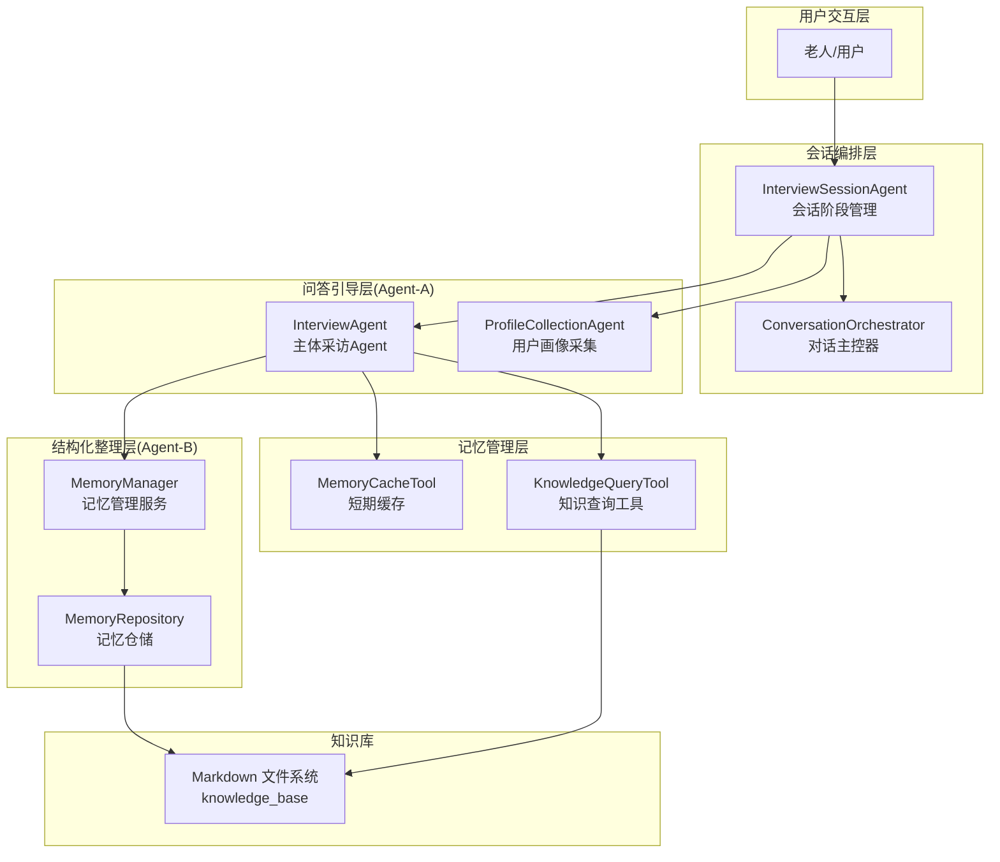
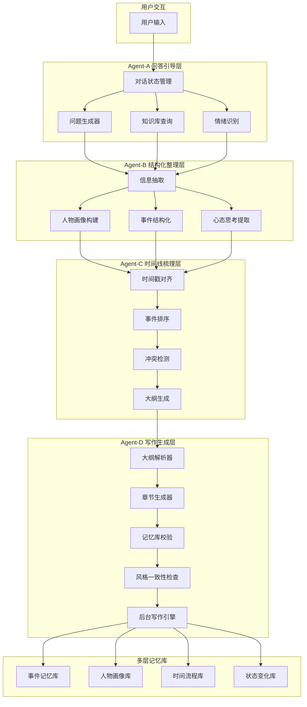
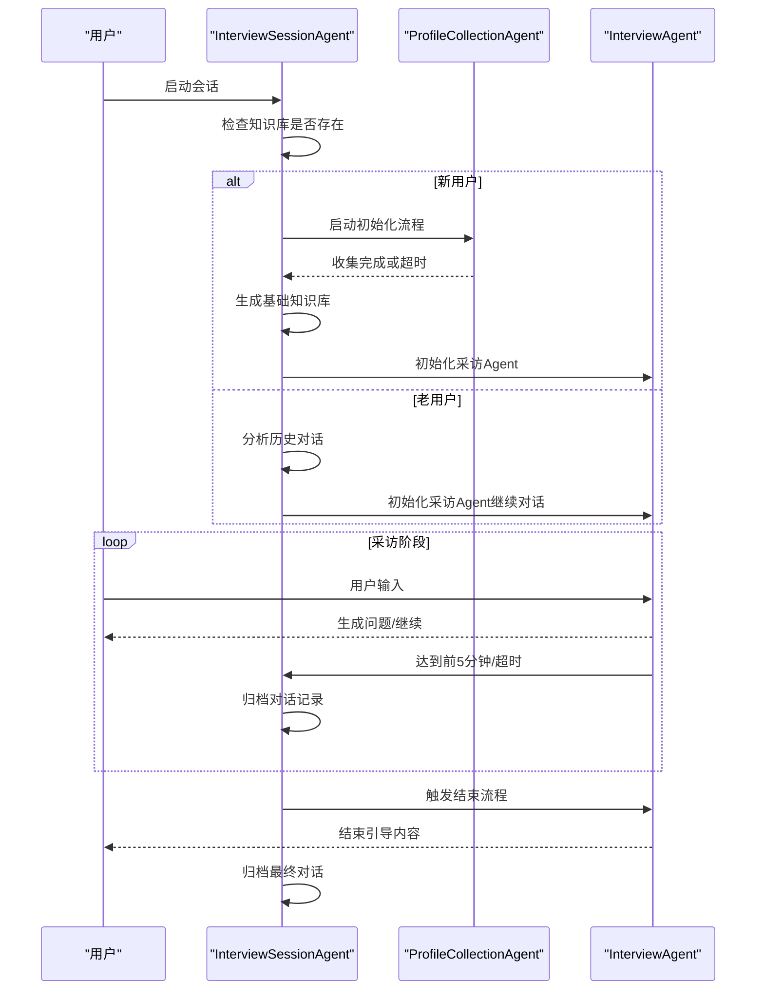
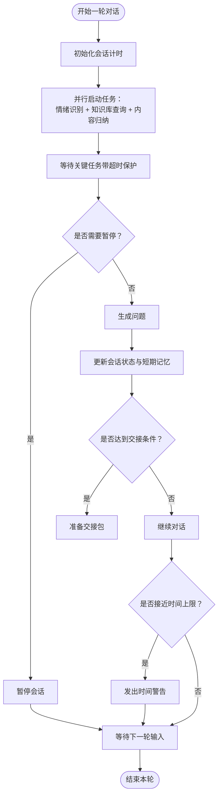
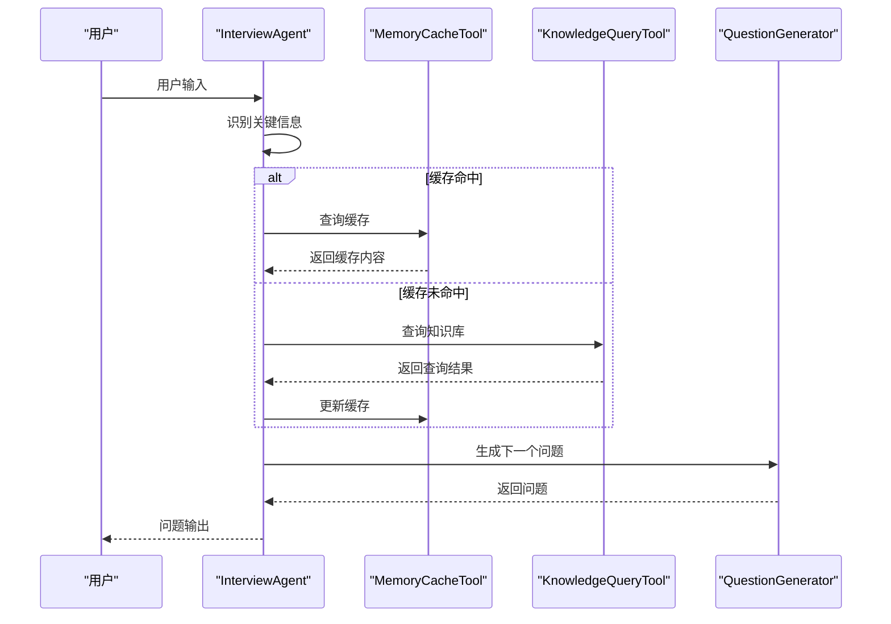
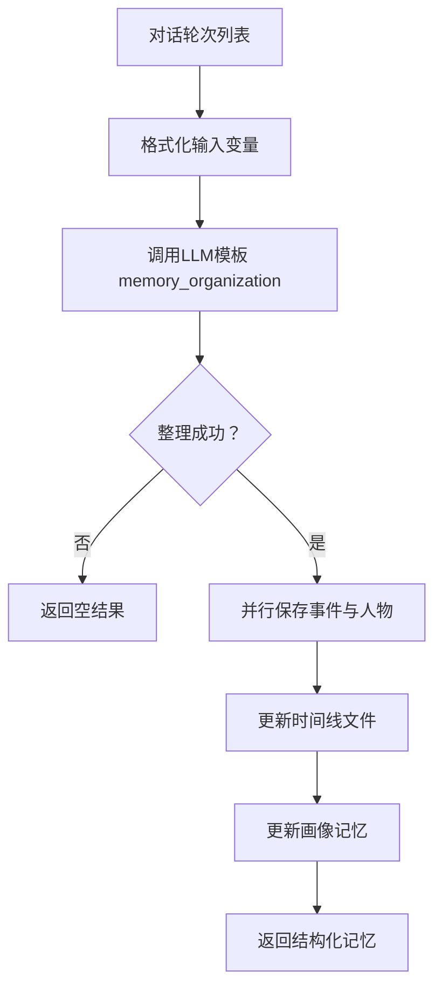
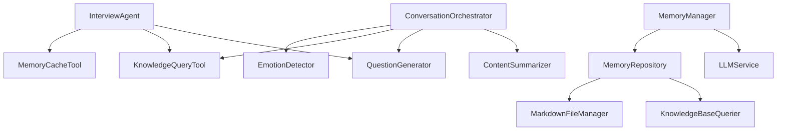

# 系统介绍

<cite>
**本文引用的文件**
- [README.md](file://README.md)
- [老人自传 Agent 协作架构.md](file://老人自传 Agent 协作架构.md)
- [问答引导层Agent-系统架构设计.md](file://问答引导层Agent-系统架构设计.md)
- [QuestionGenerator-Prompt.md](file://Prompts/QuestionGenerator-Prompt.md)
- [MemoryOrganizer-Prompt.md](file://Prompts/MemoryOrganizer-Prompt.md)
- [ProfileCollection-Prompt.md](file://Prompts/ProfileCollection-Prompt.md)
- [interview_agent.py](file://src/agents/interview_agent.py)
- [interview_session_agent.py](file://src/agents/interview_session_agent.py)
- [profile_collection_agent.py](file://src/agents/profile_collection_agent.py)
- [conversation_orchestrator.py](file://src/core/conversation_orchestrator.py)
- [memory_manager.py](file://src/services/memory_manager.py)
- [memory_repository.py](file://src/storage/memory_repository.py)
- [memory_cache_tool.py](file://src/tools/memory_cache_tool.py)
- [knowledge_query_tool.py](file://src/tools/knowledge_query_tool.py)
- [state_type.py](file://src/enums/state_type.py)
</cite>

## 目录
1. [引言](#引言)
2. [项目结构](#项目结构)
3. [核心组件](#核心组件)
4. [架构总览](#架构总览)
5. [详细组件分析](#详细组件分析)
6. [依赖关系分析](#依赖关系分析)
7. [性能考量](#性能考量)
8. [故障排查指南](#故障排查指南)
9. [结论](#结论)
10. [附录](#附录)

## 引言
老人自传 Agent 系统是一个面向老年人的智能对话与记忆整理系统，旨在通过多轮友好访谈，帮助老人记录与传承人生故事。系统以“传承价值、心理疗愈、自我实现、家庭和谐”为核心价值，围绕“问答引导层、结构化整理层、记忆管理层、写作生成层”四大Agent协作，形成从“采集—整理—记忆—写作”的完整闭环。

系统具备以下能力：
- 智能问答引导：基于已采集内容自动生成下一问题，支持追问与确认
- 情绪识别与安抚：实时识别用户情绪状态，智能调整对话策略
- 知识库管理：自动整理对话内容，存储为结构化 Markdown 文件
- 语义检索：支持基于自然语言的记忆检索与交叉验证
- 内容归纳：自动归纳对话要点，提取关键人物与事件

## 项目结构
系统采用模块化分层设计，主要目录与职责如下：
- src/agents：Agent 层，负责对话流程与阶段管理
- src/core：核心编排层，负责会话状态与事件总线
- src/services：服务层，封装 LLM、记忆、查询、情绪识别等能力
- src/storage：存储层，提供 Markdown 文件与三层记忆仓储
- src/tools：工具层，封装缓存、查询、归档等工具
- src/models、src/enums：数据模型与枚举定义
- Prompts：各类 Prompt 模板，指导 LLM 的结构化输出
- knowledge_base：用户知识库（Markdown 文件系统）

图表来源
- [interview_session_agent.py:33-130](file://src/agents/interview_session_agent.py#L33-L130)
- [conversation_orchestrator.py:138-234](file://src/core/conversation_orchestrator.py#L138-L234)
- [interview_agent.py:16-114](file://src/agents/interview_agent.py#L16-L114)
- [memory_manager.py:27-61](file://src/services/memory_manager.py#L27-L61)
- [memory_repository.py:40-87](file://src/storage/memory_repository.py#L40-L87)

章节来源
- [README.md:92-200](file://README.md#L92-L200)

## 核心组件
- 会话阶段管理（InterviewSessionAgent）：负责新老用户识别、初始化流程、采访流程、结束流程与归档
- 对话主控器（ConversationOrchestrator）：统一协调情绪识别、知识库查询、问题生成与内容归纳
- 主体采访Agent（InterviewAgent）：处理用户输入、识别关键信息、查询知识库、生成问题、时间控制
- 用户画像采集Agent（ProfileCollectionAgent）：渐进式收集基础信息，自然过渡到主对话
- 记忆管理服务（MemoryManager）：将对话内容结构化整理，更新三层记忆
- 记忆仓储（MemoryRepository）：提供短期/长期/画像记忆的统一读写接口
- 工具层：MemoryCacheTool（短期缓存）、KnowledgeQueryTool（知识查询）

章节来源
- [interview_session_agent.py:33-130](file://src/agents/interview_session_agent.py#L33-L130)
- [conversation_orchestrator.py:138-234](file://src/core/conversation_orchestrator.py#L138-L234)
- [interview_agent.py:16-114](file://src/agents/interview_agent.py#L16-L114)
- [profile_collection_agent.py:14-62](file://src/agents/profile_collection_agent.py#L14-L62)
- [memory_manager.py:27-61](file://src/services/memory_manager.py#L27-L61)
- [memory_repository.py:40-87](file://src/storage/memory_repository.py#L40-L87)
- [memory_cache_tool.py:8-33](file://src/tools/memory_cache_tool.py#L8-L33)
- [knowledge_query_tool.py:11-32](file://src/tools/knowledge_query_tool.py#L11-L32)

## 架构总览
系统采用“四层 Agent + 多层记忆库”的协作架构：
- 问答引导层（Agent-A）：维护对话状态、生成问题、情绪识别、知识库查询
- 结构化整理层（Agent-B）：抽取人物/事件/时间/心态，构建结构化数据
- 记忆管理层：三层记忆（短期/长期/画像）统一存储与查询
- 写作生成层（Agent-D）：基于大纲与记忆校验生成章节草稿

图表来源
- [老人自传 Agent 协作架构.md:9-101](file://老人自传 Agent 协作架构.md#L9-L101)
- [老人自传 Agent 协作架构.md:105-148](file://老人自传 Agent 协作架构.md#L105-L148)

章节来源
- [老人自传 Agent 协作架构.md:1-644](file://老人自传 Agent 协作架构.md#L1-L644)

## 详细组件分析

### 会话阶段管理（InterviewSessionAgent）
- 职责：新老用户识别、初始化流程、采访流程、结束流程与归档
- 关键流程：
  - 新用户：ProfileCollectionAgent 收集基础信息，生成基础知识库，转入采访流程
  - 老用户：ResumeSession 分析历史对话，结合知识库继续对话
  - 采访阶段：时间控制（总时长15分钟，初始化5分钟），前5分钟归档一次
  - 结束阶段：生成结束引导内容，归档对话记录

图表来源
- [interview_session_agent.py:112-130](file://src/agents/interview_session_agent.py#L112-L130)
- [interview_session_agent.py:178-242](file://src/agents/interview_session_agent.py#L178-L242)
- [interview_session_agent.py:243-269](file://src/agents/interview_session_agent.py#L243-L269)
- [interview_session_agent.py:341-367](file://src/agents/interview_session_agent.py#L341-L367)
- [interview_session_agent.py:369-392](file://src/agents/interview_session_agent.py#L369-L392)

章节来源
- [interview_session_agent.py:33-482](file://src/agents/interview_session_agent.py#L33-L482)

### 对话主控器（ConversationOrchestrator）
- 职责：协调情绪识别、知识库查询、问题生成、内容归纳；管理会话计时与状态流转
- 关键机制：
  - 并行异步任务：情绪识别、知识库查询、内容归纳
  - 会话计时：总时长15分钟，提前20%发出时间警告
  - 画像收集：首次会话自动进入画像收集流程
  - 交接触发：达到轮次阈值或阶段覆盖率达标时触发交接

图表来源
- [conversation_orchestrator.py:236-344](file://src/core/conversation_orchestrator.py#L236-L344)
- [conversation_orchestrator.py:345-390](file://src/core/conversation_orchestrator.py#L345-L390)
- [conversation_orchestrator.py:570-592](file://src/core/conversation_orchestrator.py#L570-L592)

章节来源
- [conversation_orchestrator.py:138-658](file://src/core/conversation_orchestrator.py#L138-L658)

### 主体采访Agent（InterviewAgent）
- 职责：处理用户输入、识别关键信息、查询知识库、生成问题、时间控制
- 关键流程：
  - 识别关键信息（事件/人物/时间点/地点）
  - 缓存命中优先，未命中则查询知识库并更新缓存
  - 生成下一个问题，接近超时自动加入时间提示
  - 会话结束生成总结与下次话题预告

图表来源
- [interview_agent.py:115-184](file://src/agents/interview_agent.py#L115-L184)
- [interview_agent.py:186-243](file://src/agents/interview_agent.py#L186-L243)
- [memory_cache_tool.py:34-61](file://src/tools/memory_cache_tool.py#L34-L61)
- [knowledge_query_tool.py:33-66](file://src/tools/knowledge_query_tool.py#L33-L66)

章节来源
- [interview_agent.py:16-346](file://src/agents/interview_agent.py#L16-L346)

### 用户画像采集Agent（ProfileCollectionAgent）
- 职责：渐进式收集用户基础信息（14个字段），自然过渡到主对话
- 关键机制：
  - 逐步提取字段，避免一次性提问
  - 基于对话历史生成下一个问题
  - 5分钟超时或必填字段收集完成即结束

章节来源
- [profile_collection_agent.py:14-275](file://src/agents/profile_collection_agent.py#L14-L275)

### 记忆管理服务（MemoryManager）与记忆仓储（MemoryRepository）
- 职责：将对话内容结构化整理，更新三层记忆（短期/长期/画像）
- 关键流程：
  - 组织与保存：调用 LLM 模板“memory_organization”，按时间线/事件/人物三维度结构化
  - 并行保存：事件与人物并行写入，时间线同步更新
  - 画像更新：从整理结果更新主人公信息与关系网络

图表来源
- [memory_manager.py:111-156](file://src/services/memory_manager.py#L111-L156)
- [memory_manager.py:158-193](file://src/services/memory_manager.py#L158-L193)
- [memory_repository.py:176-200](file://src/storage/memory_repository.py#L176-L200)
- [memory_repository.py:202-226](file://src/storage/memory_repository.py#L202-L226)
- [memory_repository.py:248-261](file://src/storage/memory_repository.py#L248-L261)

章节来源
- [memory_manager.py:27-470](file://src/services/memory_manager.py#L27-L470)
- [memory_repository.py:40-359](file://src/storage/memory_repository.py#L40-L359)

### Prompt 模板与输出规范
- 问题生成模板（QuestionGenerator-Prompt.md）：指导生成下一个问题，包含情绪处理、追问技巧、阶段推进与措辞风格
- 记忆整理模板（MemoryOrganizer-Prompt.md）：指导从对话中提取事件、人物、时间线与画像信息，输出结构化 JSON
- 画像采集模板（ProfileCollection-Prompt.md）：指导首次问候、信息提取与问题生成

章节来源
- [QuestionGenerator-Prompt.md:1-352](file://Prompts/QuestionGenerator-Prompt.md#L1-L352)
- [MemoryOrganizer-Prompt.md:1-773](file://Prompts/MemoryOrganizer-Prompt.md#L1-L773)
- [ProfileCollection-Prompt.md:1-405](file://Prompts/ProfileCollection-Prompt.md#L1-L405)

## 依赖关系分析
- 组件耦合与内聚：
  - InterviewSessionAgent 与 ProfileCollectionAgent/InterviewAgent 高内聚，负责会话生命周期
  - ConversationOrchestrator 低耦合地协调多个服务，职责清晰
  - MemoryManager 与 MemoryRepository 通过统一接口解耦存储细节
- 直接与间接依赖：
  - InterviewAgent 依赖 MemoryCacheTool、KnowledgeQueryTool、QuestionGenerator
  - MemoryManager 依赖 LLMService 与 MemoryRepository
  - MemoryRepository 依赖 MarkdownFileManager 与 KnowledgeBaseQuerier
- 外部依赖与集成点：
  - LLMService：统一调用大模型，支持多种提供商
  - 知识库：Markdown 文件系统，支持 ReAct 查询模式
  - 事件总线：用于跨组件通信与状态通知

图表来源
- [interview_agent.py:58-80](file://src/agents/interview_agent.py#L58-L80)
- [memory_manager.py:47-61](file://src/services/memory_manager.py#L47-L61)
- [memory_repository.py:54-87](file://src/storage/memory_repository.py#L54-L87)
- [conversation_orchestrator.py:178-187](file://src/core/conversation_orchestrator.py#L178-L187)

章节来源
- [interview_agent.py:1-346](file://src/agents/interview_agent.py#L1-L346)
- [memory_manager.py:1-470](file://src/services/memory_manager.py#L1-L470)
- [memory_repository.py:1-359](file://src/storage/memory_repository.py#L1-L359)
- [conversation_orchestrator.py:1-658](file://src/core/conversation_orchestrator.py#L1-L658)

## 性能考量
- 异步并行：情绪识别、知识库查询、内容归纳并行执行，减少等待时间
- 缓存策略：短期缓存命中优先，降低重复查询成本
- 并行保存：事件与人物并行写入，缩短整理耗时
- 会话计时：提前预警与时间到处理，避免无效对话延长
- 存储优化：LRU 缓存与索引，加速查询与读取

## 故障排查指南
- 会话超时：检查会话计时配置与事件总线通知，确认是否正确触发结束流程
- 知识库查询失败：确认 target_path 是否包含用户ID，检查 MarkdownFileManager 路径
- 缓存未命中：检查 MemoryCacheTool 的标签匹配逻辑与时间戳
- 结构化整理失败：检查 LLM 模板 memory_organization 的输出格式与字段映射
- 对话历史缺失：确认 MemoryRepository 的历史记录读取逻辑与文件命名格式

章节来源
- [conversation_orchestrator.py:570-592](file://src/core/conversation_orchestrator.py#L570-L592)
- [knowledge_query_tool.py:56-66](file://src/tools/knowledge_query_tool.py#L56-L66)
- [memory_cache_tool.py:34-61](file://src/tools/memory_cache_tool.py#L34-L61)
- [memory_manager.py:140-156](file://src/services/memory_manager.py#L140-L156)
- [memory_repository.py:111-161](file://src/storage/memory_repository.py#L111-L161)

## 结论
老人自传 Agent 系统通过“四层 Agent + 多层记忆库”的协作机制，实现了从“采集—整理—记忆—写作”的完整闭环。系统在用户体验上强调“耐心倾听”，在技术实现上强调“模块解耦、异步并行、结构化输出”。对于初学者，系统提供了清晰的 Prompt 模板与流程指引；对于有经验的开发者，系统提供了可扩展的架构与完善的工具链，便于二次开发与定制。

## 附录
- 系统状态类型：INIT/WARMUP/COLLECT/DEEPEN/REDIRECT/PAUSE/HANDOFF
- 会话计时：总时长15分钟，时间警告阈值80%
- 知识库结构：events/people/timeline/themes 等目录按用户隔离

章节来源
- [state_type.py:4-12](file://src/enums/state_type.py#L4-L12)
- [conversation_orchestrator.py:54-94](file://src/core/conversation_orchestrator.py#L54-L94)
- [README.md:334-358](file://README.md#L334-L358)