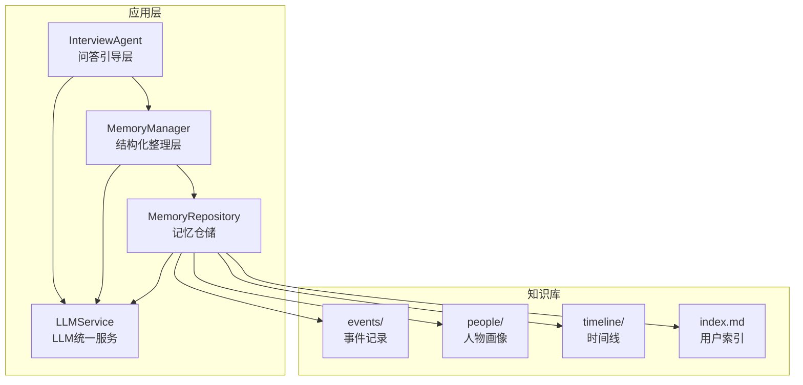
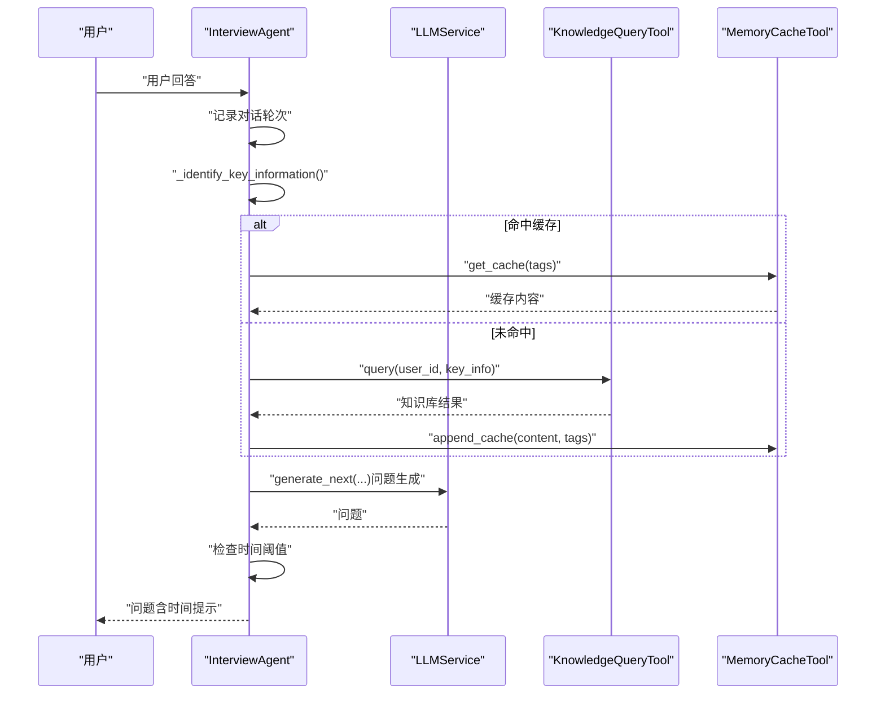
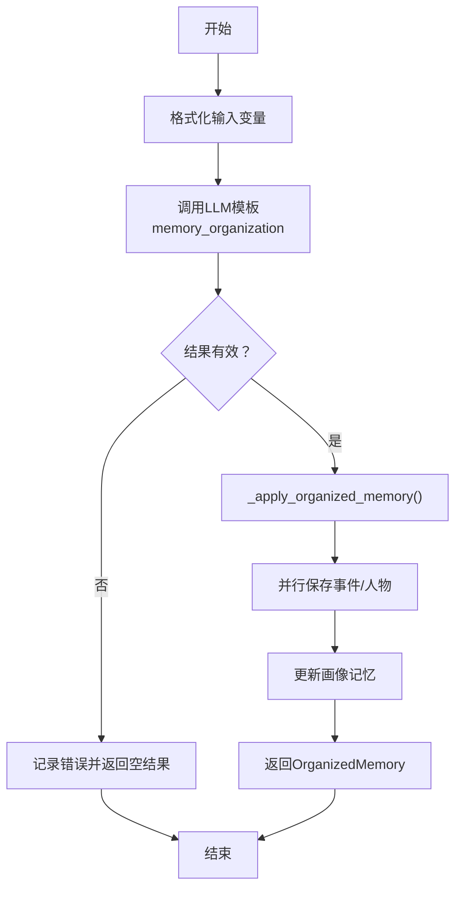
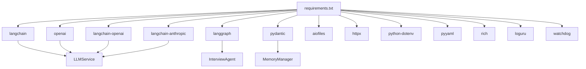

# 项目概述

<cite>
**本文引用的文件**
- [README.md](file://README.md)
- [老人自传 Agent 协作架构.md](file://老人自传 Agent 协作架构.md)
- [老人自传写作指南.md](file://老人自传写作指南.md)
- [MEMORY_INTERACTION_GUIDE.md](file://MEMORY_INTERACTION_GUIDE.md)
- [requirements.txt](file://requirements.txt)
- [src/agents/interview_agent.py](file://src/agents/interview_agent.py)
- [src/services/memory_manager.py](file://src/services/memory_manager.py)
- [src/models/session_state.py](file://src/models/session_state.py)
- [src/enums/state_type.py](file://src/enums/state_type.py)
- [src/config/llm_config.py](file://src/config/llm_config.py)
- [src/storage/memory_repository.py](file://src/storage/memory_repository.py)
- [src/tools/knowledge_query_tool.py](file://src/tools/knowledge_query_tool.py)
- [src/prompts/base.py](file://src/prompts/base.py)
- [Prompts/MemoryOrganizer-Prompt.md](file://Prompts/MemoryOrganizer-Prompt.md)
- [Prompts/QuestionGenerator-Prompt.md](file://Prompts/QuestionGenerator-Prompt.md)
- [src/services/llm_service.py](file://src/services/llm_service.py)
</cite>

## 目录
1. [简介](#简介)
2. [项目结构](#项目结构)
3. [核心组件](#核心组件)
4. [架构总览](#架构总览)
5. [详细组件分析](#详细组件分析)
6. [依赖分析](#依赖分析)
7. [性能考量](#性能考量)
8. [故障排查指南](#故障排查指南)
9. [结论](#结论)
10. [附录](#附录)

## 简介
老人自传 Agent 系统是一个面向老年人口述自传的智能对话与知识管理平台。系统通过“智能问答引导—结构化整理—记忆管理—写作生成”的分层协作机制，帮助老人系统性地回忆与记录人生故事，同时为家庭传承、心理疗愈与自我实现提供可持续的数字化载体。

- 核心价值
  - 传承价值：家族历史的载体，承载至少两代人的记忆
  - 心理疗愈：通过“人生回顾法”提升自我效能感
  - 自我实现：重新赋予生命价值与意义
  - 家庭和谐：促进代际理解与沟通

- 目标用户
  - 主要：70-80 岁的老人（退休干部、小老板等）
  - 购买者：子女（尽孝心的方式）
  - 核心需求：留下家族印记，传承精神财富

- 使用场景
  - 家庭采访：子女陪伴老人回忆往事
  - 社区公益：社区组织的回忆录课程
  - 机构服务：养老机构/心理咨询机构的辅助工具

- 实际价值
  - 降低采访门槛：语音输入、渐进式问题、照片触发
  - 提升完成率：情绪识别与安抚、阶段推进策略
  - 保障质量：结构化输出、交叉印证、事实校验
  - 保护隐私：本地存储、脱敏与授权机制

**章节来源**
- [README.md:14-22](file://README.md#L14-L22)
- [老人自传写作指南.md:8-19](file://老人自传写作指南.md#L8-L19)
- [老人自传写作指南.md:213-218](file://老人自传写作指南.md#L213-L218)

## 项目结构
系统采用“模块化+分层”的组织方式，围绕“对话—记忆—写作”主轴展开：

- 源代码目录（src）
  - agents：对话与采访Agent（InterviewAgent等）
  - services：业务服务（LLMService、MemoryManager、KnowledgeBaseQuerier等）
  - storage：存储抽象（MemoryRepository、MarkdownFileManager）
  - tools：工具类（知识查询、记忆归档、缓存）
  - models/enums/config：数据模型、枚举与配置
  - prompts：Prompt模板（QuestionGenerator、MemoryOrganizer等）

- 知识库（knowledge_base）
  - 以Markdown文件系统组织：events/、people/、timeline/、index.md
  - 每个用户独立目录，支持结构化检索与交叉印证

- 文档与测试
  - 架构与设计文档、Prompt文档、交互式测试脚本、单元测试



**图表来源**
- [src/agents/interview_agent.py:16-35](file://src/agents/interview_agent.py#L16-L35)
- [src/services/memory_manager.py:27-46](file://src/services/memory_manager.py#L27-L46)
- [src/storage/memory_repository.py:40-53](file://src/storage/memory_repository.py#L40-L53)
- [src/services/llm_service.py:32-69](file://src/services/llm_service.py#L32-L69)

**章节来源**
- [README.md:92-200](file://README.md#L92-L200)
- [README.md:334-359](file://README.md#L334-L359)

## 核心组件
- 问答引导层（InterviewAgent）
  - 职责：维护会话状态、生成问题、识别关键信息、查询知识库、更新缓存
  - 关键流程：提问→回答→关键信息识别→知识库查询→生成下一问题→时间控制
  - 依赖：LLMService、MemoryManager、QuestionGenerator、KnowledgeQueryTool、MemoryCacheTool

- 结构化整理层（MemoryManager）
  - 职责：将对话内容整理为结构化记忆（事件、人物、时间线、画像）
  - 关键流程：格式化对话→调用LLM模板→并行保存→更新画像→返回结果
  - 依赖：MemoryRepository、LLMService、OrganizedMemory模型

- 记忆仓储层（MemoryRepository）
  - 职责：短期/长期记忆管理、LRU缓存、文件系统操作、画像索引
  - 关键流程：事件/人物/时间线文件写入→索引更新→缓存命中/失效
  - 依赖：MarkdownFileManager、KnowledgeBaseQuerier

- LLM统一服务（LLMService）
  - 职责：模型初始化、Prompt模板加载、结构化输出、重试与统计
  - 支持：OpenAI/Qwen/DeepSeek/Anthropic，统一调用接口

- 工具与模型
  - KnowledgeQueryTool：封装知识库查询
  - SessionState/StateType：会话状态与对话状态枚举
  - PromptTemplate：Prompt模板基类

**章节来源**
- [src/agents/interview_agent.py:16-184](file://src/agents/interview_agent.py#L16-L184)
- [src/services/memory_manager.py:27-157](file://src/services/memory_manager.py#L27-L157)
- [src/storage/memory_repository.py:40-88](file://src/storage/memory_repository.py#L40-L88)
- [src/services/llm_service.py:32-89](file://src/services/llm_service.py#L32-L89)
- [src/models/session_state.py:24-83](file://src/models/session_state.py#L24-L83)
- [src/enums/state_type.py:4-12](file://src/enums/state_type.py#L4-L12)
- [src/prompts/base.py:6-33](file://src/prompts/base.py#L6-L33)

## 架构总览
系统采用“分层解耦、记忆驱动、交叉印证、迭代优化”的协作架构。四层Agent分别承担不同职责，通过多层记忆库实现数据共享与一致性校验。

```mermaid
flowchart TB
subgraph "用户交互层"
U["老人/用户"]
end
subgraph "问答引导层 Agent-A"
A1["对话管理器"]
A2["问题生成器"]
A3["状态追踪器"]
A4["知识库查询"]
end
subgraph "结构化整理层 Agent-B"
B1["信息抽取器"]
B2["人物画像构建"]
B3["事件结构化"]
B4["心态思考提取"]
end
subgraph "时间线梳理层 Agent-C"
C1["时间戳对齐"]
C2["事件排序"]
C3["冲突检测"]
C4["大纲生成器"]
end
subgraph "多层记忆库 Memory"
M1["事件记忆库"]
M2["人物画像库"]
M3["时间流程库"]
M4["状态变化库"]
end
subgraph "撰写层 Agent-D"
D1["大纲解析器"]
D2["章节生成器"]
D3["记忆库校验"]
D4["风格一致性检查"]
D5["后台写作引擎"]
end
subgraph "输出层"
O1["自传草稿"]
O2["时间线图"]
O3["人物档案"]
end
U < --> A1
A1 < --> A2
A1 < --> A3
A1 < --> A4
A2 --> B1
A3 --> B1
A4 --> B1
B1 --> B2
B1 --> B3
B1 --> B4
B2 --> M2
B3 --> M1
B4 --> M4
M1 --> C1
M2 --> C1
M3 --> C2
M4 --> C3
C1 --> C2
C2 --> C3
C3 --> C4
C4 --> D1
D1 --> D2
D2 --> D3
D3 --> D4
D4 --> D5
D5 --> O1
C4 --> O2
B2 --> O3
```

**图表来源**
- [老人自传 Agent 协作架构.md:11-101](file://老人自传 Agent 协作架构.md#L11-L101)
- [老人自传 Agent 协作架构.md:154-190](file://老人自传 Agent 协作架构.md#L154-L190)
- [老人自传 Agent 协作架构.md:215-257](file://老人自传 Agent 协作架构.md#L215-L257)
- [老人自传 Agent 协作架构.md:305-342](file://老人自传 Agent 协作架构.md#L305-L342)
- [老人自传 Agent 协作架构.md:441-479](file://老人自传 Agent 协作架构.md#L441-L479)

**章节来源**
- [老人自传 Agent 协作架构.md:9-101](file://老人自传 Agent 协作架构.md#L9-L101)

## 详细组件分析

### 问答引导层（InterviewAgent）
- 职责
  - 维护会话状态（轮次、覆盖率、当前话题、情绪状态）
  - 识别关键信息（事件/人物/时间点/地点）
  - 查询知识库并更新缓存
  - 生成下一问题（开放/追问/确认/情感/照片触发）
  - 时间控制与接近超时提示

- 关键流程（异步）
  - 接收用户输入→记录对话→识别关键信息→缓存命中/查询知识库→生成问题→记录助手回复→检查时间阈值



**图表来源**
- [src/agents/interview_agent.py:115-184](file://src/agents/interview_agent.py#L115-L184)
- [src/tools/knowledge_query_tool.py:33-66](file://src/tools/knowledge_query_tool.py#L33-L66)

**章节来源**
- [src/agents/interview_agent.py:16-184](file://src/agents/interview_agent.py#L16-L184)
- [src/tools/knowledge_query_tool.py:11-81](file://src/tools/knowledge_query_tool.py#L11-L81)

### 结构化整理层（MemoryManager）
- 职责
  - 将多轮对话格式化为结构化记忆（事件、人物、时间线、画像）
  - 并行保存事件与人物，更新时间线
  - 应用画像更新（主人公信息、关系网络）

- 关键流程
  - 组装变量（对话内容、现有时间线、现有人物、当前阶段）→调用LLM模板→并行保存→更新画像→返回结果



**图表来源**
- [src/services/memory_manager.py:111-157](file://src/services/memory_manager.py#L111-L157)
- [src/services/memory_manager.py:158-194](file://src/services/memory_manager.py#L158-L194)

**章节来源**
- [src/services/memory_manager.py:27-157](file://src/services/memory_manager.py#L27-L157)

### 记忆仓储层（MemoryRepository）
- 职责
  - 短期记忆（内存缓存+对话历史）
  - 长期记忆（Markdown文件系统）
  - 画像记忆（结构化索引）
  - 缓存（LRU）

- 关键流程
  - 事件/人物保存→更新索引→写入文件→更新时间线→缓存命中/失效

**章节来源**
- [src/storage/memory_repository.py:40-88](file://src/storage/memory_repository.py#L40-L88)
- [src/storage/memory_repository.py:176-261](file://src/storage/memory_repository.py#L176-L261)

### LLM统一服务（LLMService）
- 职责
  - 模型初始化（OpenAI/Qwen/DeepSeek/Anthropic）
  - Prompt模板加载（Python模块+外部Markdown）
  - 结构化输出（JSON Schema约束）
  - 重试与统计

- 关键流程
  - 构建消息→调用模型→记录结果→解析结构化输出→返回Pydantic模型

**章节来源**
- [src/services/llm_service.py:32-89](file://src/services/llm_service.py#L32-L89)
- [src/services/llm_service.py:225-398](file://src/services/llm_service.py#L225-L398)

### Prompt 模板与数据模型
- Prompt 模板
  - QuestionGenerator-Prompt.md：问题生成模板
  - MemoryOrganizer-Prompt.md：记忆整理模板
  - PromptTemplate：模板基类

- 数据模型
  - SessionState：会话状态
  - StateType：对话状态枚举
  - LLMConfig：模型配置

**章节来源**
- [Prompts/QuestionGenerator-Prompt.md:1-352](file://Prompts/QuestionGenerator-Prompt.md#L1-L352)
- [Prompts/MemoryOrganizer-Prompt.md:1-773](file://Prompts/MemoryOrganizer-Prompt.md#L1-L773)
- [src/prompts/base.py:6-33](file://src/prompts/base.py#L6-L33)
- [src/models/session_state.py:24-83](file://src/models/session_state.py#L24-L83)
- [src/enums/state_type.py:4-12](file://src/enums/state_type.py#L4-L12)
- [src/config/llm_config.py:10-120](file://src/config/llm_config.py#L10-L120)

## 依赖分析
- 技术栈选择
  - LangChain/LangGraph：构建Agent与状态机，支持多Agent协作与状态流转
  - Pydantic：数据模型验证与结构化输出
  - OpenAI/Qwen/DeepSeek：统一LLM接口，适配国内与国际生态
  - Rich/Loguru：终端输出美化与日志管理
  - pytest/watchdog：测试与文件监控

- 依赖关系图



**图表来源**
- [requirements.txt:1-24](file://requirements.txt#L1-L24)
- [src/services/llm_service.py:71-124](file://src/services/llm_service.py#L71-L124)
- [src/agents/interview_agent.py:48-79](file://src/agents/interview_agent.py#L48-L79)
- [src/services/memory_manager.py:47-61](file://src/services/memory_manager.py#L47-L61)

**章节来源**
- [requirements.txt:1-24](file://requirements.txt#L1-L24)

## 性能考量
- 异步与并发
  - MemoryManager并行保存事件与人物，减少I/O等待
  - LLMService统一调用与重试，指数退避降低抖动

- 缓存与索引
  - MemoryRepository内置LRU缓存，降低重复查询成本
  - 事件/人物索引加速检索与交叉印证

- Token与稳定性
  - LLMService统计Token使用与成功率，便于成本控制与优化
  - Prompt模板结构化输出，减少解析开销

[本节为通用指导，无需特定文件引用]

## 故障排查指南
- 大模型连接失败
  - 检查 .env 中的 API Key 与端点配置
  - 确认网络连通性与超时设置

- 输出乱码或解析失败
  - 检查终端编码（建议UTF-8）
  - 确认结构化输出JSON格式，必要时启用降级策略

- 记忆交互测试异常
  - 使用交互式测试脚本（test_memory_interaction.py）复现问题
  - 查看生成的临时目录与文件结构，定位存储路径

**章节来源**
- [MEMORY_INTERACTION_GUIDE.md:147-172](file://MEMORY_INTERACTION_GUIDE.md#L147-L172)

## 结论
老人自传 Agent 系统通过“问答引导—结构化整理—记忆管理—写作生成”的分层协作，将复杂的口述整理工作转化为可执行、可迭代、可验证的工程流程。系统以LangChain/LangGraph为框架，结合多层记忆库与结构化Prompt，既满足初学者的易用性，也为有经验的开发者提供了清晰的扩展点与优化空间。项目在传承家族历史、心理疗愈、自我实现与家庭和谐方面具有显著的社会价值与应用前景。

[本节为总结性内容，无需特定文件引用]

## 附录
- 快速开始
  - 环境准备：Python 3.10+，安装依赖
  - 配置环境变量（.env），设置LLM Provider与API Key
  - 运行测试与代码质量检查

- 开发指南
  - 新增服务：在 src/services/ 下创建服务文件，继承基础接口
  - 新增Prompt：在 src/prompts/ 或 Prompts/ 下创建Markdown文件，使用Jinja2模板语法
  - 开发流程：分支开发→pytest→black/isort/mypy/flake8→提交PR

**章节来源**
- [README.md:204-295](file://README.md#L204-L295)
- [README.md:396-434](file://README.md#L396-L434)