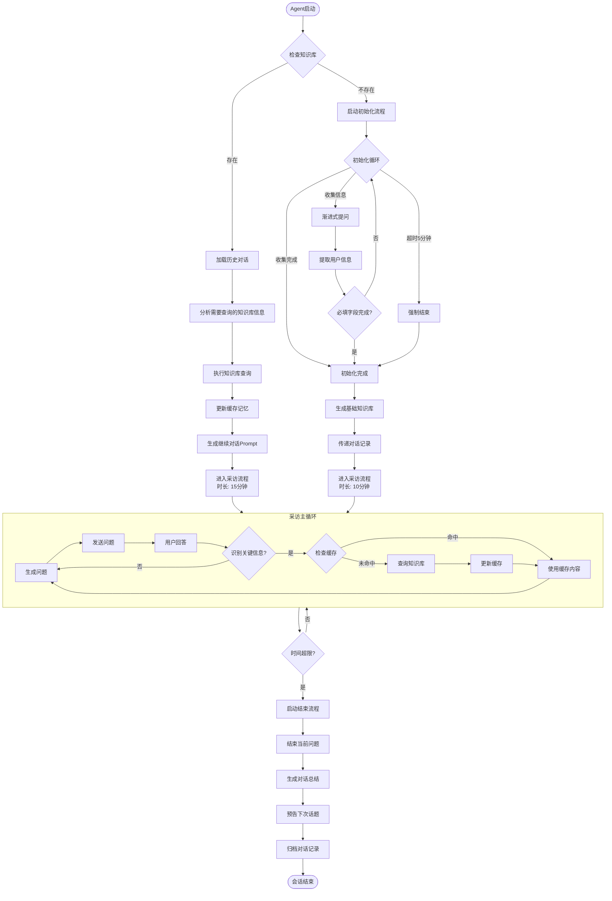
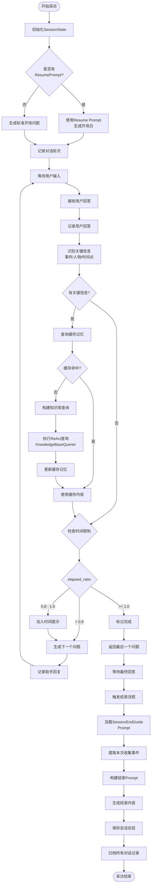

# 开发故事卡 - Task 013: 实现 Agent 服务主体

> 任务编号：Task-013  
> 优先级：P0  
> 依赖：Task-001 至 Task-012  
> 预计工时：3天

---

## 一、任务概述

实现 Agent 服务主体（InterviewSessionAgent），串联所有已开发的子部件，提供完整的对话服务流程。

### 1.1 核心职责

- **会话启动**：根据用户ID判断是老用户还是新用户
- **流程调度**：在初始化流程、采访流程、结束流程之间切换
- **时间控制**：管理整体对话时长（15分钟限制）
- **知识协调**：协调知识库查询、缓存管理、记忆归档

### 1.2 架构定位

```
InterviewSessionAgent
├── ProfileCollectionAgent（用户用户初始化）
├── InterviewAgent（主体采访）
├── SessionEndAgent（结束引导）
└── 工具集
    ├── MemoryCacheTool（缓存记忆）
    ├── KnowledgeQueryTool（知识库查询）
    └── MemoryArchiveTool（记忆归档）
```

---

## 二、核心对象定义

### 2.1 InterviewSessionAgent（主控Agent）

```python
# src/agents/interview_session_agent.py
from typing import Optional, Dict, Any
from datetime import datetime, timedelta
from enum import Enum
import logging

from agents.profile_collection_agent import ProfileCollectionAgent
from agents.interview_agent import InterviewAgent
from services.llm_service import LLMService, get_llm_service
from services.memory_manager import MemoryManager
from services.knowledge_base_querier import KnowledgeBaseQuerier
from models import SessionState, HandoffPackage
from tools import (
    MemoryCacheTool,
    KnowledgeQueryTool,
    MemoryArchiveTool
)

logger = logging.getLogger(__name__)


class SessionPhase(Enum):
    """会话阶段"""
    INIT = "init"                    # 启动检查
    PROFILE_COLLECTION = "profile"   # 用户初始化
    INTERVIEW = "interview"          # 主体采访
    ENDING = "ending"                # 结束引导
    CLOSED = "closed"                # 会话关闭


class InterviewSessionAgent:
    """
    Agent服务主体
    
    职责：
    - 会话生命周期管理
    - 流程调度（初始化→采访→结束）
    - 时间控制（15分钟总时长，初始化5分钟）
    - 知识库协调
    
    启动逻辑：
    1. 根据user_id检查知识库是否存在
    2. 存在 → 加载历史对话，进入采访流程
    3. 不存在 → 启动用户初始化流程
    
    时间规则：
    - 总时长：15分钟
    - 含初始化：采访流程缩减至10分钟
    - 初始化独立限制：5分钟
    """
    
    def __init__(
        self,
        user_id: str,
        llm_service: LLMService = None,
        memory_manager: MemoryManager = None,
    ):
        self.user_id = user_id
        self.llm_service = llm_service or get_llm_service()
        self.memory_manager = memory_manager or MemoryManager()
        
        # 会话状态
        self.phase = SessionPhase.INIT
        self.session_start_time: Optional[datetime] = None
        self.total_duration_minutes = 15
        self.profile_duration_minutes = 5
        self.has_profile = False  # 是否完成了初始化
        
        # 子Agent
        self.profile_agent: Optional[ProfileCollectionAgent] = None
        self.interview_agent: Optional[InterviewAgent] = None
        
        # 工具集
        self.cache_tool = MemoryCacheTool()
        self.query_tool = KnowledgeQueryTool(
            querier=KnowledgeBaseQuerier(llm_service)
        )
        self.archive_tool = MemoryArchiveTool(memory_manager)
        
        # 会话状态
        self.session_state: Optional[SessionState] = None
        self.conversation_history: list = []
        
    async def start(self) -> str:
        """
        启动会话
        
        Returns:
            开场白或欢迎语
        """
        self.session_start_time = datetime.now()
        
        # 检查知识库是否存在
        knowledge_base_exists = await self._check_knowledge_base()
        
        if knowledge_base_exists:
            # 老用户：加载历史，直接进入采访
            return await self._resume_session()
        else:
            # 新用户：启动初始化流程
            return await self._start_profile_collection()
    
    async def _check_knowledge_base(self) -> bool:
        """检查用户知识库是否存在"""
        # 通过MemoryManager检查
        profile = await self.memory_manager.get_user_profile(self.user_id)
        return profile is not None
    
    async def _resume_session(self) -> str:
        """
        恢复会话（老用户）
        
        流程：
        1. 加载历史对话记录
        2. 分析需要的知识库信息
        3. 执行知识库查询
        4. 生成继续对话的Prompt
        5. 进入采访流程
        """
        self.has_profile = True
        
        # 1. 加载历史对话记录
        history = await self.memory_manager.get_recent_conversations(
            self.user_id, limit=5
        )
        self.conversation_history = history
        
        # 2. 分析需要的知识库信息
        query_prompt = self._build_resume_analysis_prompt(history)
        analysis_result = await self.llm_service.call_async(
            prompt=query_prompt,
            model="gpt-4o",
            temperature=0.3
        )
        
        # 3. 执行知识库查询
        knowledge_context = await self.query_tool.query(
            user_id=self.user_id,
            query=analysis_result,
            max_iterations=5
        )
        
        # 4. 缓存知识库查询结果
        await self.cache_tool.append_cache(
            session_id=self.session_state.session_id,
            content=knowledge_context
        )
        
        # 5. 生成继续对话的Prompt
        resume_prompt = self._build_resume_dialogue_prompt(
            history=history,
            knowledge_context=knowledge_context
        )
        
        # 6. 初始化InterviewAgent并启动
        self.interview_agent = InterviewAgent(
            user_id=self.user_id,
            llm_service=self.llm_service,
            memory_manager=self.memory_manager,
            cache_tool=self.cache_tool,
            query_tool=self.query_tool,
            archive_tool=self.archive_tool,
            duration_minutes=15,  # 老用户完整15分钟
            resume_prompt=resume_prompt
        )
        
        self.phase = SessionPhase.INTERVIEW
        return await self.interview_agent.start()
    
    async def _start_profile_collection(self) -> str:
        """
        启动用户初始化流程
        
        流程：
        1. 创建ProfileCollectionAgent
        2. 执行信息收集（最长5分钟）
        3. 收集完成或超时后，生成基础知识库
        4. 将对话记录传递给采访流程
        """
        self.phase = SessionPhase.PROFILE_COLLECTION
        
        # 创建初始化Agent
        self.profile_agent = ProfileCollectionAgent(
            user_id=self.user_id,
            llm_service=self.llm_service,
            memory_manager=self.memory_manager,
            max_duration_minutes=self.profile_duration_minutes
        )
        
        # 执行初始化流程
        welcome_message = await self.profile_agent.start()
        
        # 注意：初始化Agent会持续运行，直到收集完成或超时
        # 超时后会触发 _on_profile_complete
        
        return welcome_message
    
    async def handle_user_input(self, user_input: str) -> str:
        """
        处理用户输入
        
        根据当前阶段分发给对应的子Agent
        """
        if self.phase == SessionPhase.PROFILE_COLLECTION:
            return await self._handle_profile_input(user_input)
        elif self.phase == SessionPhase.INTERVIEW:
            return await self._handle_interview_input(user_input)
        elif self.phase == SessionPhase.ENDING:
            return await self._handle_ending_input(user_input)
        else:
            return "会话已结束，期待下次再聊。"
    
    async def _handle_profile_input(self, user_input: str) -> str:
        """处理初始化阶段的用户输入"""
        response = await self.profile_agent.handle_input(user_input)
        
        # 检查是否完成初始化
        if self.profile_agent.is_completed:
            await self._on_profile_complete()
        
        return response
    
    async def _on_profile_complete(self):
        """
        初始化完成后的处理
        
        流程：
        1. 获取所有对话记录
        2. 调用MemoryOrganizer生成基础知识库
        3. 将对话记录传递给采访流程
        4. 切换到采访阶段
        """
        # 1. 获取对话记录
        profile_history = self.profile_agent.get_conversation_history()
        self.conversation_history.extend(profile_history)
        
        # 2. 生成基础知识库
        await self.archive_tool.create_user_knowledge_base(
            user_id=self.user_id,
            conversation_history=profile_history,
            profile_info=self.profile_agent.collected_info
        )
        
        # 3. 标记已初始化
        self.has_profile = True
        
        # 4. 启动采访流程（缩减至10分钟）
        self.interview_agent = InterviewAgent(
            user_id=self.user_id,
            llm_service=self.llm_service,
            memory_manager=self.memory_manager,
            cache_tool=self.cache_tool,
            query_tool=self.query_tool,
            archive_tool=self.archive_tool,
            duration_minutes=10,  # 新用户只有10分钟采访时间
            initial_history=profile_history
        )
        
        self.phase = SessionPhase.INTERVIEW
        
    async def _handle_interview_input(self, user_input: str) -> str:
        """处理采访阶段的用户输入"""
        # 检查时间限制
        elapsed = self._get_elapsed_minutes()
        
        if elapsed >= self.total_duration_minutes:
            # 超时，进入结束流程
            return await self._start_ending()
        
        # 未超时，继续采访
        response = await self.interview_agent.handle_input(user_input)
        
        # 检查InterviewAgent是否主动结束
        if self.interview_agent.is_completed:
            return await self._start_ending()
        
        return response
    
    async def _start_ending(self) -> str:
        """
        启动结束流程
        
        流程：
        1. 结束当前问题
        2. 生成总结和结束语
        3. 明确下次话题
        4. 归档对话记录
        """
        self.phase = SessionPhase.ENDING
        
        # 使用InterviewAgent的结束流程
        ending_message = await self.interview_agent.generate_ending()
        
        # 归档对话记录
        await self.archive_tool.archive_conversation(
            user_id=self.user_id,
            conversation_history=self.conversation_history,
            session_summary=self.interview_agent.session_summary
        )
        
        self.phase = SessionPhase.CLOSED
        return ending_message
    
    def _get_elapsed_minutes(self) -> float:
        """获取已用时长（分钟）"""
        if not self.session_start_time:
            return 0
        elapsed = datetime.now() - self.session_start_time
        return elapsed.total_seconds() / 60
    
    def _build_resume_analysis_prompt(self, history: list) -> str:
        """
        构建历史对话分析Prompt
        
        目标：让大模型分析之前的对话记录，判断需要获取哪些知识库信息
        """
        history_text = self._format_history(history)
        
        prompt = f"""## 任务说明

你是一位采访助手，正在分析老人的历史对话记录。
你的任务是根据之前的对话内容，判断需要从知识库中查询哪些信息来继续本次对话。

## 历史对话记录

{history_text}

## 分析要求

请分析以下内容：
1. 上次对话停在了什么话题？
2. 有哪些未展开的重要事件或人物？
3. 用户提到过但未详细讨论的内容？
4. 需要补充哪些背景信息？

## 输出格式

请直接输出一个知识库查询语句，用于检索相关信息。例如：
- "童年时期的家庭生活和学校经历"
- "在工厂工作期间的重要事件和同事关系"
- "子女成长过程中的重要时刻"

注意：只输出一个查询语句，不要其他解释。
"""
        return prompt
    
    def _build_resume_dialogue_prompt(
        self,
        history: list,
        knowledge_context: str
    ) -> str:
        """
        构建继续对话的Prompt
        
        目标：总结上次对话，结合知识库内容，生成开场白
        """
        history_text = self._format_history(history)
        
        prompt = f"""## 任务说明

你是一位温暖、专业的采访记者，正在采访一位老人撰写自传。
用户之前已经有过对话，现在需要你根据历史记录和知识库内容，继续上次的对话。

## 上次对话记录

{history_text}

## 知识库查询结果

{knowledge_context}

## 输出要求

请生成一段开场白，要求：
1. 简要回顾上次对话的亮点（1-2句话）
2. 根据知识库内容，提出一个自然延续的问题
3. 语气温暖、亲切，像老朋友聊天一样
4. 不要让用户感到压力，引导他继续分享

## 示例

"上次我们聊到您在工厂工作的那段经历，听起来特别有意思。我记得您提到过张师傅对您帮助很大，能再跟我多说说当时的情况吗？"

请生成开场白：
"""
        return prompt
    
    def _format_history(self, history: list) -> str:
        """格式化历史对话记录"""
        lines = []
        for turn in history[-10:]:  # 只取最近10轮
            lines.append(f"用户: {turn.get('user', '')}")
            lines.append(f"助手: {turn.get('assistant', '')}")
        return "\n".join(lines)
```

---

## 三、ProfileCollectionAgent（用户初始化Agent）

```python
# src/agents/profile_collection_agent.py
from typing import Optional, Dict, Any, List
from datetime import datetime
import logging

from services.llm_service import LLMService, get_llm_service
from services.memory_manager import MemoryManager
from models import UserProfile

logger = logging.getLogger(__name__)


class ProfileCollectionAgent:
    """
    用户初始化Agent
    
    职责：
    - 收集用户基础信息（14个字段）
    - 渐进式提问，自然对话
    - 从用户回答中提取信息
    
    使用Prompt：ProfileCollection-Prompt.md
    
    结束条件：
    1. 收集到足够信息（必填字段完成）
    2. 对话超过5分钟
    
    输出：
    - 将对话记录传给MemoryOrganizer
    - 生成用户基础知识库
    """
    
    def __init__(
        self,
        user_id: str,
        llm_service: LLMService = None,
        memory_manager: MemoryManager = None,
        max_duration_minutes: int = 5
    ):
        self.user_id = user_id
        self.llm_service = llm_service or get_llm_service()
        self.memory_manager = memory_manager or MemoryManager()
        self.max_duration_minutes = max_duration_minutes
        
        # 会话状态
        self.start_time = datetime.now()
        self.conversation_history: List[Dict] = []
        self.collected_info: Dict[str, Any] = {}
        self.is_completed = False
        
        # 必填字段
        self.required_fields = ['name', 'age', 'occupation', 'family_status', 
                                'living_arrangement', 'story_expectation']
    
    async def start(self) -> str:
        """启动初始化流程"""
        # 加载profile_welcome prompt
        welcome_prompt = await self._load_prompt("profile_welcome")
        
        welcome_message = await self.llm_service.call_async(
            prompt=welcome_prompt,
            model="gpt-4o",
            temperature=0.7
        )
        
        # 记录对话
        self.conversation_history.append({
            "role": "assistant",
            "content": welcome_message,
            "timestamp": datetime.now().isoformat()
        })
        
        return welcome_message
    
    async def handle_input(self, user_input: str) -> str:
        """
        处理用户输入
        
        流程：
        1. 记录用户输入
        2. 从输入中提取信息
        3. 检查是否完成收集
        4. 生成下一个问题
        """
        # 记录用户输入
        self.conversation_history.append({
            "role": "user",
            "content": user_input,
            "timestamp": datetime.now().isoformat()
        })
        
        # 提取信息
        extracted = await self._extract_info(user_input)
        self.collected_info.update(extracted)
        
        # 检查结束条件
        if self._should_complete():
            self.is_completed = True
            return await self._generate_completion_message()
        
        # 生成下一个问题
        next_question = await self._generate_next_question()
        
        # 记录助手回复
        self.conversation_history.append({
            "role": "assistant",
            "content": next_question,
            "timestamp": datetime.now().isoformat()
        })
        
        return next_question
    
    async def _extract_info(self, user_input: str) -> Dict[str, Any]:
        """
        从用户输入中提取信息
        
        使用profile_extraction prompt
        """
        extraction_prompt = await self._load_prompt("profile_extraction")
        
        # 注入变量
        prompt = extraction_prompt.replace("{{user_input}}", user_input)
        prompt = prompt.replace("{{collected_info}}", str(self.collected_info))
        
        result = await self.llm_service.call_async(
            prompt=prompt,
            model="gpt-4o",
            temperature=0.3,
            response_format={"type": "json_object"}
        )
        
        return result
    
    def _should_complete(self) -> bool:
        """判断是否应该结束初始化"""
        # 检查必填字段
        required_complete = all(
            field in self.collected_info and self.collected_info[field]
            for field in self.required_fields
        )
        
        # 检查时间限制
        elapsed = self._get_elapsed_minutes()
        time_exceeded = elapsed >= self.max_duration_minutes
        
        return required_complete or time_exceeded
    
    async def _generate_next_question(self) -> str:
        """
        生成下一个收集问题
        
        根据已收集信息，选择下一个合适的字段询问
        """
        # 加载profile_collection prompt
        collection_prompt = await self._load_prompt("profile_collection")
        
        # 注入上下文
        prompt = collection_prompt.replace("{{collected_info}}", str(self.collected_info))
        prompt = prompt.replace("{{conversation_history}}", self._format_history())
        
        question = await self.llm_service.call_async(
            prompt=prompt,
            model="gpt-4o",
            temperature=0.7
        )
        
        return question
    
    async def _generate_completion_message(self) -> str:
        """生成初始化完成的消息"""
        return f"好的，我已经了解了您的基本情况。接下来我们可以开始聊聊您的人生故事了，您准备好了吗？"
    
    def _get_elapsed_minutes(self) -> float:
        """获取已用时长"""
        elapsed = datetime.now() - self.start_time
        return elapsed.total_seconds() / 60
    
    def get_conversation_history(self) -> List[Dict]:
        """获取对话记录"""
        return self.conversation_history
    
    async def _load_prompt(self, template_name: str) -> str:
        """加载Prompt模板"""
        # 从文件或数据库加载
        # 这里简化为直接返回预设内容
        templates = {
            "profile_welcome": """你是一位温暖、友好的采访助手，正在帮助一位老人开始记录人生故事。
请用亲切自然的语气打招呼，并询问老人的姓名。像晚辈聊天一样，不要太正式。""",
            "profile_collection": """## 已收集信息
{{collected_info}}

## 对话历史
{{conversation_history}}

## 任务
根据已收集的信息，选择一个合适的字段继续询问。
使用自然的对话语气，不要像填表一样提问。""",
            "profile_extraction": """## 用户输入
{{user_input}}

## 已收集信息
{{collected_info}}

## 任务
从用户输入中提取结构化信息，以JSON格式输出。
只提取明确提到的信息，不要推断。"""
        }
        return templates.get(template_name, "")
    
    def _format_history(self) -> str:
        """格式化对话历史"""
        lines = []
        for turn in self.conversation_history[-6:]:  # 只取最近6轮
            role = "用户" if turn["role"] == "user" else "助手"
            lines.append(f"{role}: {turn['content']}")
        return "\n".join(lines)
```

---

## 四、InterviewAgent（主体采访Agent）

```python
# src/agents/interview_agent.py
from typing import Optional, Dict, Any, List
from datetime import datetime
import logging

from services.llm_service import LLMService, get_llm_service
from services.memory_manager import MemoryManager
from services.question_generator import QuestionGenerator
from tools import MemoryCacheTool, KnowledgeQueryTool, MemoryArchiveTool
from models import SessionState, ConversationTurn

logger = logging.getLogger(__name__)


class InterviewAgent:
    """
    主体采访Agent
    
    职责：
    - 时间驱动的采访流程
    - 问题生成与对话引导
    - 知识库查询与缓存管理
    - 关键信息识别与追踪
    
    使用Prompt：QuestionGenerator-Prompt.md
    
    时间规则：
    - 标准时长：15分钟
    - 含初始化：10分钟
    - 12分钟时触发时间警告
    
    核心流程：
    提问 → 回答 → 识别关键信息 → 查询知识库 → 更新缓存 → 继续
    """
    
    def __init__(
        self,
        user_id: str,
        llm_service: LLMService = None,
        memory_manager: MemoryManager = None,
        cache_tool: MemoryCacheTool = None,
        query_tool: KnowledgeQueryTool = None,
        archive_tool: MemoryArchiveTool = None,
        duration_minutes: int = 15,
        resume_prompt: str = None,
        initial_history: List[Dict] = None
    ):
        self.user_id = user_id
        self.llm_service = llm_service or get_llm_service()
        self.memory_manager = memory_manager or MemoryManager()
        
        # 工具
        self.cache_tool = cache_tool or MemoryCacheTool()
        self.query_tool = query_tool or KnowledgeQueryTool()
        self.archive_tool = archive_tool or MemoryArchiveTool()
        
        # 时间控制
        self.duration_minutes = duration_minutes
        self.warning_threshold = 0.8  # 80%时触发警告
        self.start_time = datetime.now()
        
        # 会话状态
        self.session_state: Optional[SessionState] = None
        self.conversation_history = initial_history or []
        self.session_summary = ""
        self.is_completed = False
        
        # 继续对话Prompt
        self.resume_prompt = resume_prompt
        
        # 问题生成器
        self.question_generator = QuestionGenerator(llm_service)
    
    async def start(self) -> str:
        """
        启动采访流程
        
        如果有resume_prompt，使用它生成开场白
        否则，生成新的开场问题
        """
        if self.resume_prompt:
            # 老用户：使用resume prompt
            opening = await self.llm_service.call_async(
                prompt=self.resume_prompt,
                model="gpt-4o",
                temperature=0.7
            )
        else:
            # 新用户：生成标准开场
            opening = await self.question_generator.generate_opening()
        
        # 记录对话
        self._record_turn("assistant", opening)
        
        return opening
    
    async def handle_input(self, user_input: str) -> str:
        """
        处理用户输入
        
        核心流程：
        1. 记录用户回答
        2. 识别关键信息（事件/人物/时间点）
        3. 检查缓存记忆
        4. 查询知识库（如需要）
        5. 更新缓存
        6. 生成下一个问题
        7. 检查时间限制
        """
        # 1. 记录用户回答
        self._record_turn("user", user_input)
        
        # 2. 识别关键信息
        key_info = await self._identify_key_information(user_input)
        
        # 3-4. 知识库查询流程
        if key_info:
            # 检查缓存
            cached_content = await self.cache_tool.get_cache(
                session_id=self.session_state.session_id,
                query=key_info
            )
            
            if cached_content:
                # 缓存命中
                memory_context = cached_content
            else:
                # 缓存未命中，查询知识库
                knowledge_result = await self.query_tool.query(
                    user_id=self.user_id,
                    query=key_info,
                    max_iterations=3
                )
                
                # 5. 更新缓存
                await self.cache_tool.append_cache(
                    session_id=self.session_state.session_id,
                    content=knowledge_result,
                    tags=key_info.get("tags", [])
                )
                
                memory_context = knowledge_result
        else:
            memory_context = None
        
        # 6. 生成下一个问题
        next_question = await self.question_generator.generate_next(
            user_input=user_input,
            memory_context=memory_context,
            conversation_history=self.conversation_history
        )
        
        # 7. 检查时间限制
        elapsed_ratio = self._get_elapsed_ratio()
        
        if elapsed_ratio >= 1.0:
            # 超时，标记完成
            self.is_completed = True
            return next_question  # 返回最后一个问题，等待回答后再结束
        elif elapsed_ratio >= self.warning_threshold:
            # 接近超时，在问题中加入时间提示
            next_question = self._add_time_warning(next_question)
        
        # 记录助手回复
        self._record_turn("assistant", next_question)
        
        return next_question
    
    async def _identify_key_information(self, user_input: str) -> Optional[Dict]:
        """
        识别用户回答中的关键信息
        
        关键信息类型：
        - 事件：具体的事件描述
        - 人物：提到的人物姓名
        - 时间点：具体的时间节点
        - 地点：地点名称
        
        Returns:
            如果识别到关键信息，返回结构化数据
            否则返回None
        """
        identification_prompt = f"""## 任务

分析用户回答，识别其中的关键信息。

## 用户回答

{user_input}

## 输出要求

以JSON格式输出，包含以下字段：
- has_key_info: boolean，是否包含关键信息
- events: 事件列表
- persons: 人物列表
- time_points: 时间点列表
- locations: 地点列表
- query_text: 用于知识库查询的关键词组合

如果没有关键信息，返回 {{"has_key_info": false}}

只输出JSON，不要其他内容。"""
        
        result = await self.llm_service.call_async(
            prompt=identification_prompt,
            model="gpt-4o",
            temperature=0.3,
            response_format={"type": "json_object"}
        )
        
        if result.get("has_key_info"):
            return result
        return None
    
    async def generate_ending(self) -> str:
        """
        生成结束引导内容
        
        使用SessionEndGuide-Prompt.md
        """
        # 加载结束引导prompt
        ending_prompt = await self._load_session_end_prompt()
        
        # 注入变量
        prompt = ending_prompt.replace("{{session_duration}}", str(self.duration_minutes))
        prompt = prompt.replace("{{total_turns}}", str(len(self.conversation_history)))
        prompt = prompt.replace("{{conversation_history}}", self._format_history())
        
        # 收集本次事件
        collected_events = await self._extract_collected_events()
        prompt = prompt.replace("{{collected_events}}", collected_events)
        
        ending_message = await self.llm_service.call_async(
            prompt=prompt,
            model="gpt-4o",
            temperature=0.7
        )
        
        # 保存会话总结
        self.session_summary = ending_message
        
        return ending_message
    
    def _get_elapsed_ratio(self) -> float:
        """获取已用时长比例"""
        elapsed = self._get_elapsed_minutes()
        return elapsed / self.duration_minutes
    
    def _get_elapsed_minutes(self) -> float:
        """获取已用时长"""
        elapsed = datetime.now() - self.start_time
        return elapsed.total_seconds() / 60
    
    def _add_time_warning(self, question: str) -> str:
        """在问题中加入时间提示"""
        return f"{question}\n\n（不知不觉聊了挺久的，我们再聊最后一个话题吧）"
    
    def _record_turn(self, role: str, content: str):
        """记录对话轮次"""
        self.conversation_history.append({
            "role": role,
            "content": content,
            "timestamp": datetime.now().isoformat()
        })
    
    def _format_history(self) -> str:
        """格式化对话历史"""
        lines = []
        for turn in self.conversation_history[-10:]:
            role = "用户" if turn["role"] == "user" else "助手"
            lines.append(f"{role}: {turn['content']}")
        return "\n".join(lines)
    
    async def _extract_collected_events(self) -> str:
        """提取本次收集的事件"""
        # 简化实现：从对话历史中提取关键事件
        events = []
        for turn in self.conversation_history:
            if turn["role"] == "user":
                # 简单的关键词匹配
                if any(kw in turn["content"] for kw in ["那年", "那时候", "记得", "有一次"]):
                    events.append(turn["content"][:50] + "...")
        return "\n".join(events[:5])  # 最多5个
    
    async def _load_session_end_prompt(self) -> str:
        """加载结束引导Prompt"""
        # 实际实现中从文件加载
        return """## 角色定义

你是一位温暖、体贴的采访记者。

## 输入信息

【会话时长】{{session_duration}} 分钟
【总对话轮次】{{total_turns}} 轮
【对话历史】{{conversation_history}}
【本次收集的事件】{{collected_events}}

## 输出要求

生成结束引导内容，包含：
1. 温和的结束提示
2. 本次对话亮点总结
3. 下次话题预告
4. 温暖的结束语"""
```

---

## 五、工具对象定义

### 5.1 MemoryCacheTool（缓存记忆工具）

```python
# src/tools/memory_cache_tool.py
from typing import Optional, Dict, Any, List
import logging

logger = logging.getLogger(__name__)


class MemoryCacheTool:
    """
    缓存记忆工具
    
    职责：
    - 管理会话级别的短期记忆缓存
    - 支持关键词检索
    - 支持追加更新
    
    存储结构：
    {
        "session_id": {
            "content": "缓存内容",
            "tags": ["关键词1", "关键词2"],
            "timestamp": "时间戳"
        }
    }
    """
    
    def __init__(self):
        # 简化实现：使用内存存储
        # 生产环境应使用Redis等缓存服务
        self._cache: Dict[str, List[Dict]] = {}
    
    async def get_cache(
        self,
        session_id: str,
        query: Dict
    ) -> Optional[str]:
        """
        获取缓存内容
        
        Args:
            session_id: 会话ID
            query: 查询条件，包含tags等字段
            
        Returns:
            缓存内容，如果不存在返回None
        """
        if session_id not in self._cache:
            return None
        
        cache_entries = self._cache[session_id]
        query_tags = set(query.get("tags", []))
        
        # 查找匹配的缓存条目
        for entry in cache_entries:
            entry_tags = set(entry.get("tags", []))
            if query_tags & entry_tags:  # 有交集
                return entry.get("content")
        
        return None
    
    async def append_cache(
        self,
        session_id: str,
        content: str,
        tags: List[str] = None
    ):
        """
        追加缓存内容
        
        Args:
            session_id: 会话ID
            content: 缓存内容
            tags: 关键词标签
        """
        if session_id not in self._cache:
            self._cache[session_id] = []
        
        self._cache[session_id].append({
            "content": content,
            "tags": tags or [],
            "timestamp": datetime.now().isoformat()
        })
    
    async def clear_cache(self, session_id: str):
        """清空指定会话的缓存"""
        if session_id in self._cache:
            del self._cache[session_id]
```

### 5.2 KnowledgeQueryTool（知识库查询工具）

```python
# src/tools/knowledge_query_tool.py
from typing import Optional, Dict, Any
import logging

from services.knowledge_base_querier import KnowledgeBaseQuerier

logger = logging.getLogger(__name__)


class KnowledgeQueryTool:
    """
    知识库查询工具
    
    职责：
    - 封装KnowledgeBaseQuerier的调用
    - 提供简洁的查询接口
    - 处理查询结果格式化
    
    使用场景：
    - InterviewAgent识别到关键信息时调用
    - ResumeSession分析历史对话后调用
    """
    
    def __init__(self, querier: KnowledgeBaseQuerier = None):
        self.querier = querier or KnowledgeBaseQuerier()
    
    async def query(
        self,
        user_id: str,
        query: Any,
        max_iterations: int = 5
    ) -> str:
        """
        执行知识库查询
        
        Args:
            user_id: 用户ID
            query: 查询内容（可以是字符串或结构化数据）
            max_iterations: 最大迭代次数
            
        Returns:
            查询结果文本
        """
        # 提取查询文本
        if isinstance(query, dict):
            query_text = query.get("query_text", str(query))
        else:
            query_text = str(query)
        
        # 执行查询
        result = await self.querier.query_with_react(
            query=query_text,
            user_id=user_id,
            max_iterations=max_iterations
        )
        
        # 格式化结果
        return self._format_result(result)
    
    def _format_result(self, result: Any) -> str:
        """格式化查询结果"""
        if isinstance(result, str):
            return result
        elif isinstance(result, dict):
            return result.get("content", str(result))
        else:
            return str(result)
```

### 5.3 MemoryArchiveTool（记忆归档工具）

```python
# src/tools/memory_archive_tool.py
from typing import List, Dict, Any
import logging

from services.memory_manager import MemoryManager

logger = logging.getLogger(__name__)


class MemoryArchiveTool:
    """
    记忆归档工具
    
    职责：
    - 封装MemoryManager的归档操作
    - 提供会话结束后的归档接口
    - 处理初始化阶段的知识库生成
    
    使用场景：
    - ProfileCollectionAgent完成初始化后生成基础知识库
    - InterviewAgent结束对话后归档对话记录
    """
    
    def __init__(self, memory_manager: MemoryManager = None):
        self.memory_manager = memory_manager or MemoryManager()
    
    async def create_user_knowledge_base(
        self,
        user_id: str,
        conversation_history: List[Dict],
        profile_info: Dict[str, Any]
    ):
        """
        创建用户基础知识库
        
        Args:
            user_id: 用户ID
            conversation_history: 初始化阶段的对话记录
            profile_info: 收集到的用户画像信息
        """
        # 保存用户画像
        await self.memory_manager.save_user_profile(
            user_id=user_id,
            profile=profile_info
        )
        
        # 将对话记录转化为结构化记忆
        await self.memory_manager.organize_conversation(
            user_id=user_id,
            conversation_history=conversation_history,
            memory_type="profile"  # 标记为画像类型记忆
        )
        
        logger.info(f"Created knowledge base for user {user_id}")
    
    async def archive_conversation(
        self,
        user_id: str,
        conversation_history: List[Dict],
        session_summary: str
    ):
        """
        归档对话记录
        
        Args:
            user_id: 用户ID
            conversation_history: 完整的对话记录
            session_summary: 会话总结
        """
        # 保存对话记录
        await self.memory_manager.save_conversation(
            user_id=user_id,
            conversation=conversation_history,
            summary=session_summary
        )
        
        # 更新长期记忆
        await self.memory_manager.organize_conversation(
            user_id=user_id,
            conversation_history=conversation_history,
            memory_type="long_term"
        )
        
        logger.info(f"Archived conversation for user {user_id}")
```

---

## 六、核心流程图

### 6.1 Agent服务主体流程



### 6.2 InterviewAgent内部流程详解



---

## 七、Prompt模板补充

### 7.1 历史对话分析Prompt（ResumeAnalysis-Prompt）

```markdown
# Resume Analysis Prompt

> 模板名称：resume_analysis  
> 用途：分析历史对话记录，判断需要查询的知识库信息

---

## Prompt模板

```markdown
## 系统角色

你是一位采访助手，正在分析老人的历史对话记录。

## 任务说明

根据之前的对话内容，判断需要从知识库中查询哪些信息来继续本次对话。

## 历史对话记录

{{conversation_history}}

## 分析要求

请分析以下内容：
1. 上次对话停在了什么话题？
2. 有哪些未展开的重要事件或人物？
3. 用户提到过但未详细讨论的内容？
4. 需要补充哪些背景信息？

## 输出格式

请直接输出一个知识库查询语句，用于检索相关信息。

示例：
- "童年时期的家庭生活和学校经历"
- "在工厂工作期间的重要事件和同事关系"
- "子女成长过程中的重要时刻"

注意：只输出一个查询语句，不要其他解释。
```

---

## 八、测试用例

### 8.1 老用户恢复会话测试

```python
# tests/test_interview_session_agent.py
import pytest
from agents.interview_session_agent import InterviewSessionAgent

@pytest.mark.asyncio
async def test_resume_session_for_existing_user():
    """测试老用户恢复会话流程"""
    # 准备：创建一个已有知识库的用户
    user_id = "test_user_001"
    agent = InterviewSessionAgent(user_id=user_id)
    
    # 执行：启动会话
    opening = await agent.start()
    
    # 验证：
    # 1. 应该进入INTERVIEW阶段
    assert agent.phase == SessionPhase.INTERVIEW
    # 2. 开场白应该包含历史回顾
    assert "上次" in opening or "继续" in opening
    # 3. 时长应该是15分钟
    assert agent.interview_agent.duration_minutes == 15

@pytest.mark.asyncio
async def test_new_user_profile_collection():
    """测试新用户初始化流程"""
    # 准备：创建一个新用户
    user_id = "new_user_001"
    agent = InterviewSessionAgent(user_id=user_id)
    
    # 执行：启动会话
    opening = await agent.start()
    
    # 验证：
    # 1. 应该进入PROFILE_COLLECTION阶段
    assert agent.phase == SessionPhase.PROFILE_COLLECTION
    # 2. 开场白应该是问候语
    assert "您好" in opening or "你好" in opening

@pytest.mark.asyncio
async def test_profile_timeout():
    """测试初始化超时"""
    user_id = "slow_user_001"
    agent = InterviewSessionAgent(user_id=user_id)
    
    # 模拟5分钟超时
    agent.profile_agent.max_duration_minutes = 0.01  # 0.01分钟
    
    opening = await agent.start()
    response = await agent.handle_user_input("我姓王")
    
    # 验证：超时后应该进入采访阶段
    assert agent.phase == SessionPhase.INTERVIEW

@pytest.mark.asyncio
async def test_interview_time_limit():
    """测试采访时间限制"""
    user_id = "test_user_002"
    agent = InterviewSessionAgent(user_id=user_id)
    
    # 启动会话
    await agent.start()
    
    # 模拟15分钟超时
    agent.interview_agent.duration_minutes = 0.01  # 0.01分钟
    
    # 发送消息
    response = await agent.handle_user_input("我记得小时候...")
    
    # 验证：超时后应该触发结束流程
    assert agent.is_completed or "下次" in response
```

---

## 九、集成测试

### 9.1 完整会话流程测试

```python
@pytest.mark.asyncio
async def test_complete_session_flow():
    """测试完整的会话流程（新用户）"""
    user_id = "complete_user_001"
    agent = InterviewSessionAgent(user_id=user_id)
    
    # 1. 启动会话（初始化阶段）
    opening = await agent.start()
    assert agent.phase == SessionPhase.PROFILE_COLLECTION
    
    # 2. 模拟初始化对话
    responses = [
        "我叫张三，今年75岁",
        "我以前是老师，教了40年书",
        "我和老伴儿住，有两个孩子",
        "我想说说我在农村教书的那段经历"
    ]
    
    for user_input in responses:
        response = await agent.handle_user_input(user_input)
    
    # 3. 验证进入采访阶段
    assert agent.phase == SessionPhase.INTERVIEW
    
    # 4. 模拟采访对话
    interview_responses = [
        "那时候条件很艰苦，但我很充实",
        "有个学生叫小李，现在都当校长了"
    ]
    
    for user_input in interview_responses:
        response = await agent.handle_user_input(user_input)
    
    # 5. 模拟超时结束
    agent.interview_agent.duration_minutes = 0
    final_response = await agent.handle_user_input("今天就聊到这儿吧")
    
    # 6. 验证会话结束
    assert agent.phase == SessionPhase.CLOSED
    assert "下次" in final_response or "再见" in final_response
```

---

## 十、开发任务清单

### 10.1 实现优先级

| 优先级 | 任务 | 预计工时 | 依赖 |
|--------|------|----------|------|
| P0 | 实现InterviewSessionAgent主框架 | 0.5天 | Task-001至012 |
| P0 | 实现ProfileCollectionAgent | 0.5天 | Task-001至012 |
| P0 | 实现InterviewAgent | 1天 | Task-001至012 |
| P0 | 实现三个工具对象 | 0.5天 | Task-004/007 |
| P1 | 编写单元测试 | 0.3天 | - |
| P1 | 编写集成测试 | 0.2天 | - |

### 10.2 开发顺序建议

1. **第一阶段：工具对象**（0.5天）
   - 实现MemoryCacheTool
   - 实现KnowledgeQueryTool
   - 实现MemoryArchiveTool
   - 编写工具单元测试

2. **第二阶段：子Agent**（1.5天）
   - 实现ProfileCollectionAgent
   - 实现InterviewAgent
   - 测试子Agent独立运行

3. **第三阶段：主控Agent**（0.5天）
   - 实现InterviewSessionAgent主框架
   - 集成所有子Agent和工具
   - 完整流程测试

4. **第四阶段：优化与测试**（0.5天）
   - 性能优化
   - 异常处理完善
   - 集成测试补充

---

## 十一、注意事项

### 11.1 时间控制

- **初始化超时**：必须强制结束，不能无限等待
- **采访超时**：12分钟时加入提示，15分钟强制结束
- **总时长计算**：从Agent启动时开始计算

### 11.2 知识库查询

- **ReAct模式**：最多迭代5次，避免无限循环
- **缓存优先**：先查缓存，再查知识库
- **结果格式**：统一返回文本格式，便于插入Prompt

### 11.3 对话记录传递

- **初始化阶段**：对话记录传递给采访流程
- **采访阶段**：对话记录归档到MemoryManager
- **格式统一**：使用标准dict格式记录

### 11.4 错误处理

- **知识库查询失败**：降级为无知识库上下文继续对话
- **缓存失败**：跳过缓存，直接查询知识库
- **LLM调用失败**：返回友好提示，引导用户继续

---

## 十二、文件清单

### 12.1 新增文件

| 文件路径 | 说明 |
|----------|------|
| `src/agents/interview_session_agent.py` | Agent服务主体 |
| `src/agents/profile_collection_agent.py` | 用户初始化Agent |
| `src/agents/interview_agent.py` | 主体采访Agent |
| `src/tools/memory_cache_tool.py` | 缓存记忆工具 |
| `src/tools/knowledge_query_tool.py` | 知识库查询工具 |
| `src/tools/memory_archive_tool.py` | 记忆归档工具 |
| `老人自传/Prompts/ResumeAnalysis-Prompt.md` | 历史对话分析Prompt |
| `老人自传/Prompts/ResumeDialogue-Prompt.md` | 继续对话Prompt |
| `tests/test_interview_session_agent.py` | 集成测试 |

### 12.2 依赖文件（已有）

- `老人自传/Prompts/ProfileCollection-Prompt.md`
- `老人自传/Prompts/QuestionGenerator-Prompt.md`
- `老人自传/Prompts/SessionEndGuide-Prompt.md`
- `老人自传/Prompts/KnowledgeBaseQuerier-Prompt.md`
- `src/services/question_generator.py`
- `src/services/knowledge_base_querier.py`
- `src/services/memory_manager.py`
- `src/models/session_state.py`

---

**文档版本**：v1.0  
**创建日期**：2026-04-25  
**最后更新**：2026-04-25
