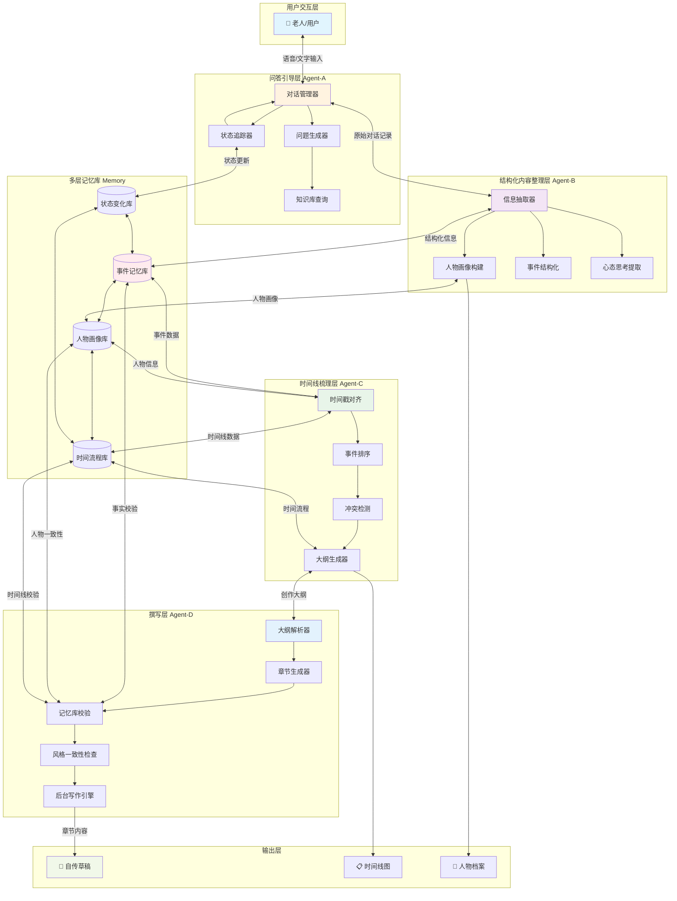
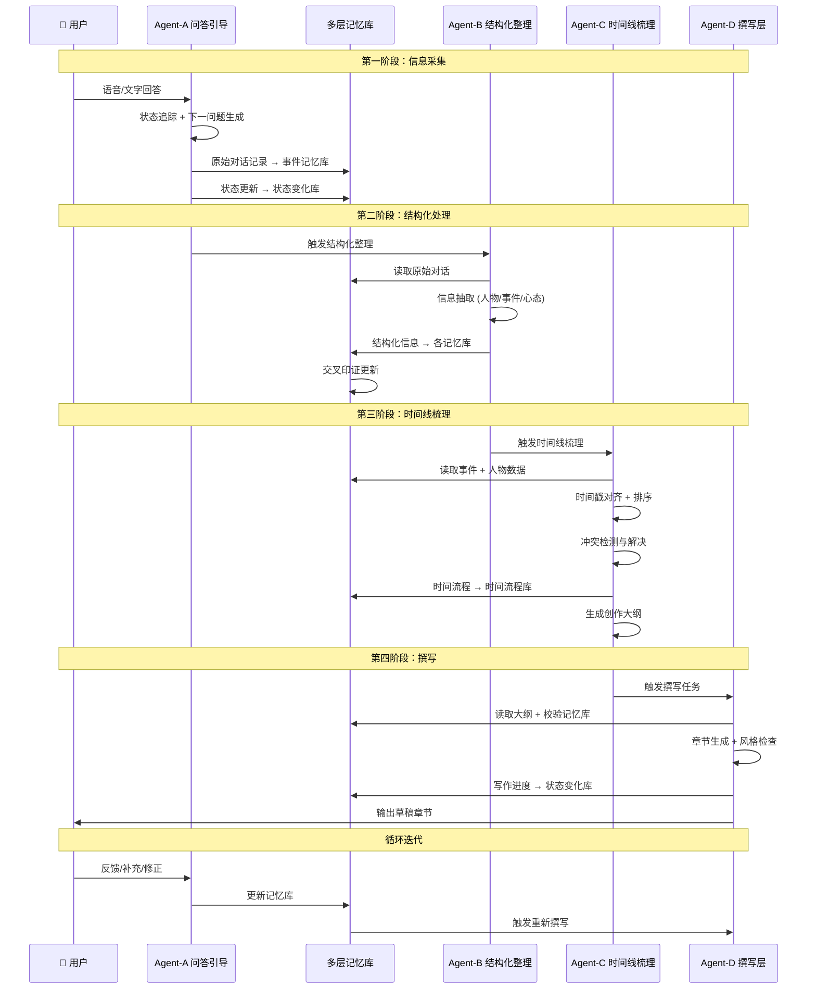
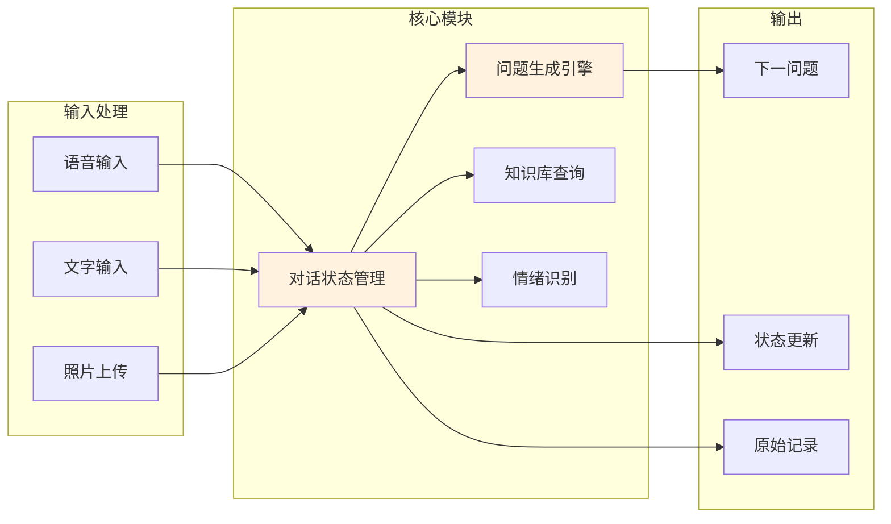
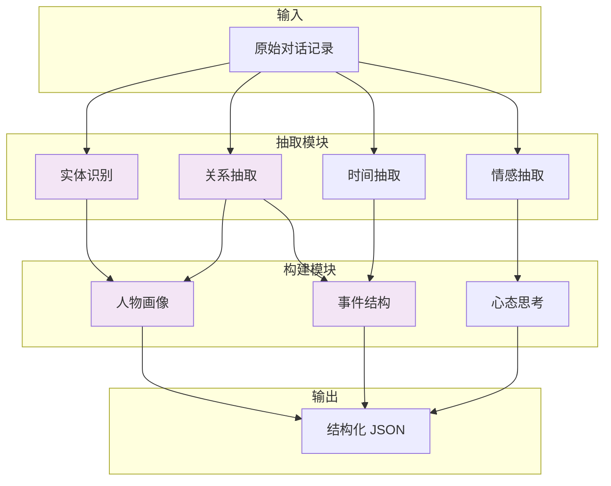
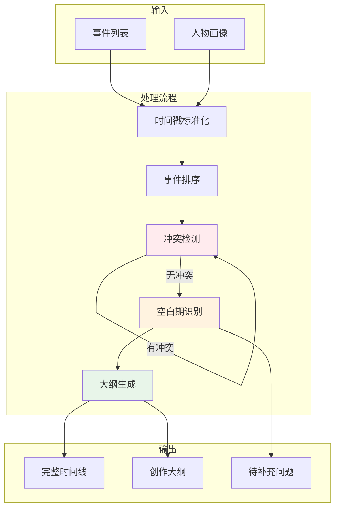
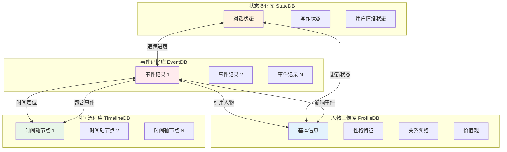
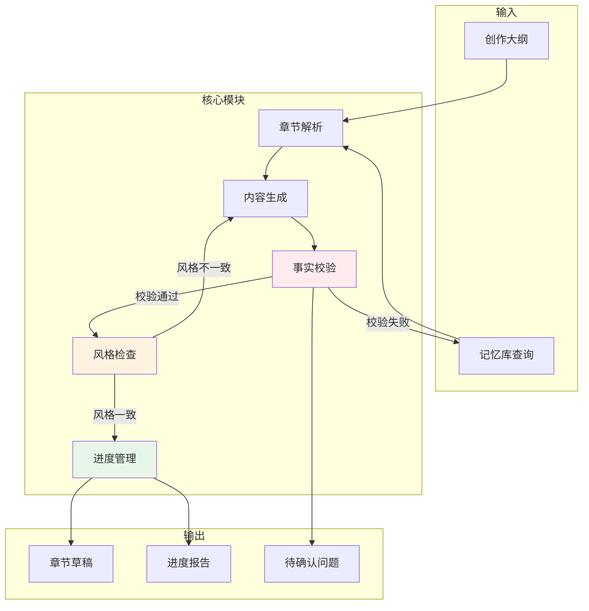
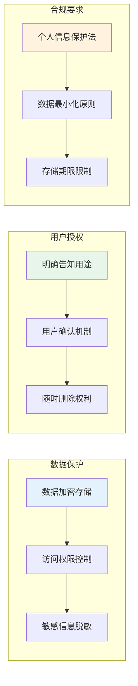

# 🤖 老人自传 Agent 协作架构

> 系统架构设计文档  
> 版本：v1.0  
> 日期：2026-04-15

---

## 📊 整体架构图



---

## 🔄 数据流转图



---

## 📦 各层详细设计

### 一、问答引导层 (Agent-A)



**核心职责**：
- 维护对话状态（当前主题、已覆盖内容、待追问点）
- 根据知识库生成下一问题
- 识别用户情绪状态（激动、悲伤、回避等）
- 支持多模态输入（语音、文字、照片）

**状态机设计**：
```
[初始] → [童年采集] → [青年采集] → [中年采集] → [老年采集] → [补充采集] → [完成]
              ↓              ↓              ↓              ↓
         [深度追问]    [深度追问]    [深度追问]    [深度追问]
```

**问题生成策略**：
| 类型 | 说明 | 示例 |
|------|------|------|
| 开放性问题 | 引导用户自由叙述 | "能讲讲您小时候的家是什么样的吗？" |
| 追问性问题 | 基于已回答深入挖掘 | "您提到父亲很严厉，具体体现在哪些方面？" |
| 确认性问题 | 核实关键信息 | "所以您是 1965 年出生在山东青岛，对吗？" |
| 情感性问题 | 引导情感表达 | "那时候您是什么感受？" |
| 照片触发 | 基于上传照片提问 | "这张照片是在哪里拍的？当时发生了什么？" |

---

### 二、结构化内容整理层 (Agent-B)



**输出数据结构示例**：

```json
{
  "人物画像": {
    "基本信息": {
      "姓名": "张三",
      "出生": "1965-03-15",
      "出生地": "山东青岛",
      "性别": "男"
    },
    "性格特征": ["坚韧", "乐观", "重视家庭"],
    "价值观": ["诚信为本", "勤劳致富"],
    "重要关系": [
      {"关系": "父亲", "姓名": "张父", "影响": "严厉但关爱"},
      {"关系": "配偶", "姓名": "李四", "结婚年份": 1990}
    ]
  },
  "事件列表": [
    {
      "事件 ID": "E001",
      "时间": "1978-09",
      "时间精度": "年月",
      "类型": "求学",
      "标题": "考入县重点中学",
      "描述": "...",
      "地点": "青岛县",
      "参与人物": ["张三", "张父"],
      "情感标签": "自豪",
      "心态变化": "开始意识到知识改变命运",
      "来源对话": ["session_001_turn_15"]
    }
  ],
  "心态思考": [
    {
      "主题": "对教育的看法",
      "内容": "知识是改变命运的唯一途径",
      "形成时间": "1978-1985",
      "相关事件": ["E001", "E003"]
    }
  ]
}
```

---

### 三、时间线梳理层 (Agent-C)



**冲突检测规则**：
| 冲突类型 | 检测逻辑 | 解决策略 |
|----------|----------|----------|
| 时间冲突 | 同一时间两个事件 | 追问用户确认 |
| 逻辑冲突 | 事件因果不合理 | 标记待核实 |
| 人物冲突 | 人物关系矛盾 | 交叉印证其他记录 |
| 地点冲突 | 同一时间不同地点 | 优先级：精确日期 > 模糊日期 |

**创作大纲生成模板**：
```
第一章：根（童年 0-12 岁）
  1.1 出生的地方和家庭
  1.2 最早的记忆
  1.3 性格的形成
  ...

第二章：成长（少年 13-18 岁）
  2.1 求学经历
  2.2 青春期的转折
  ...

第三章：闯荡（青年 19-35 岁）
  3.1 第一份工作
  3.2 遇见伴侣
  ...
```

---

### 四、多层记忆库设计



**记忆库交叉印证机制**：

```
事件记忆库 ←→ 人物画像库
  "这个事件中的表现是否符合人物性格？"
  
事件记忆库 ←→ 时间流程库
  "这个事件的时间点是否与前后事件冲突？"
  
人物画像库 ←→ 时间流程库
  "这个时期的心态变化是否有事件支撑？"
  
状态变化库 ←→ 所有库
  "当前写作进度如何？哪些内容需要补充？"
```

**存储格式建议**：
| 记忆库 | 推荐存储 | 理由 |
|--------|----------|------|
| 事件记忆库 | 向量数据库 + 关系型 | 支持语义检索 + 结构化查询 |
| 人物画像库 | 关系型/文档型 | 结构化数据，频繁更新 |
| 时间流程库 | 时序数据库 | 时间序列查询优化 |
| 状态变化库 | Redis/内存缓存 | 高频读写，临时状态 |

---

### 五、撰写层 (Agent-D)



**写作规则检查清单**：

| 检查项 | 说明 | 检查方式 |
|--------|------|----------|
| 事实一致性 | 事件时间、地点、人物是否准确 | 查询记忆库比对 |
| 人物一致性 | 性格、语言风格是否符合画像 | 人物画像库比对 |
| 时间线连贯 | 章节间时间是否连贯 | 时间流程库比对 |
| 情感基调 | 是否符合该时期心态 | 心态思考记录比对 |
| 避免流水账 | 是否有细节描写和情感表达 | NLP 风格分析 |
| 隐私保护 | 是否涉及他人隐私需脱敏 | 敏感词检测 |

**后台持续写作机制**：
```
[待写章节队列] → [优先级排序] → [获取记忆数据] → [生成草稿] → [校验] → [存入草稿库]
       ↑                                                              ↓
       └─────────────────── 用户反馈/补充 ────────────────────────────┘
```

---

## 🔁 完整工作流程

```mermaid
gantt
    title 老人自传 Agent 完整工作流程
    dateFormat  X
    axisFormat %s
    
    section 信息采集
    问答引导 (Agent-A)     :a1, 0, 30
    多轮对话迭代           :a2, after a1, 60
    
    section 结构化处理
    内容整理 (Agent-B)     :b1, after a2, 10
    记忆库更新             :b2, after b1, 5
    
    section 时间线梳理
    时间线生成 (Agent-C)   :c1, after b2, 10
    大纲生成               :c2, after c1, 5
    待补充问题识别         :c3, after c2, 5
    
    section 撰写
    章节写作 (Agent-D)     :d1, after c3, 30
    校验与修订             :d2, after d1, 10
    
    section 用户反馈
    用户审阅               :u1, after d2, 15
    反馈处理               :u2, after u1, 5
    
    section 迭代
    补充采集/修订          :i1, after u2, 20
```



---

## 🎯 Agent 间通信协议

### 消息格式标准

```json
{
  "message_id": "uuid",
  "timestamp": "2026-04-15T12:00:00Z",
  "from_agent": "Agent-A",
  "to_agent": "Agent-B",
  "message_type": "trigger_structurize",
  "payload": {
    "session_id": "session_001",
    "dialogue_records": [...],
    "current_state": "childhood_complete"
  },
  "priority": "normal",
  "requires_ack": true
}
```

### 触发事件定义

| 事件名 | 触发条件 | 目标 Agent |
|--------|----------|------------|
| `trigger_structurize` | 完成一个人生阶段采集 | Agent-B |
| `trigger_timeline` | 结构化信息达到阈值 | Agent-C |
| `trigger_writing` | 大纲生成完成 | Agent-D |
| `trigger_supplement` | 发现信息空白/冲突 | Agent-A |
| `trigger_revision` | 用户反馈需要修改 | Agent-D |

---

## 📈 监控与评估指标

| 层级 | 指标 | 目标值 |
|------|------|--------|
| Agent-A | 问题质量评分 | >4.5/5 |
| Agent-A | 用户完成率 | >80% |
| Agent-B | 信息抽取准确率 | >90% |
| Agent-C | 时间线冲突率 | <5% |
| Agent-D | 事实校验通过率 | >95% |
| Agent-D | 用户满意度 | >4.5/5 |
| 整体 | 完稿周期 | <30 天 |

---

## 🔐 安全与隐私



---

## 📝 总结

### 架构核心特点

1. **分层解耦**：各 Agent 职责清晰，独立可扩展
2. **记忆驱动**：多层记忆库作为核心数据枢纽
3. **交叉印证**：多库联动确保信息准确性
4. **迭代优化**：支持用户反馈循环修订
5. **后台持续**：写作引擎可离线持续工作

### 技术选型建议

| 组件 | 推荐技术 |
|------|----------|
| Agent 框架 | LangChain / AutoGen |
| 向量数据库 | Pinecone / Milvus |
| 关系数据库 | PostgreSQL |
| 缓存 | Redis |
| 消息队列 | RabbitMQ / Kafka |
| LLM | GPT-4 / 通义千问 |
| 语音识别 |  Whisper / 讯飞 |

---

*本架构文档供开发团队参考，可根据实际需求调整*
